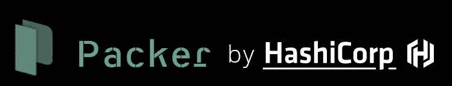
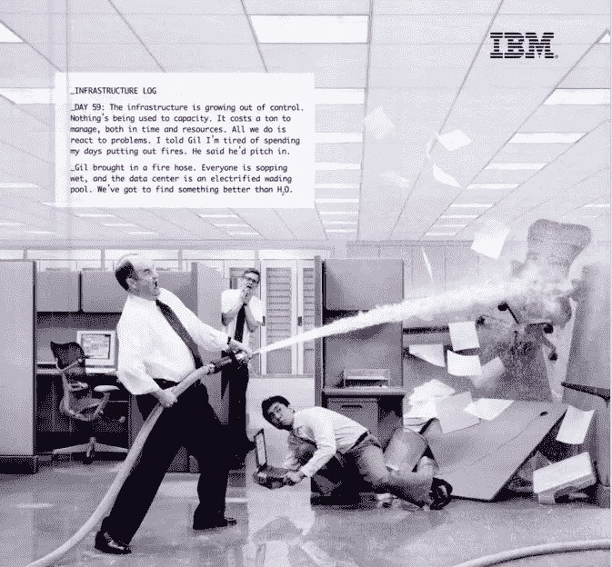
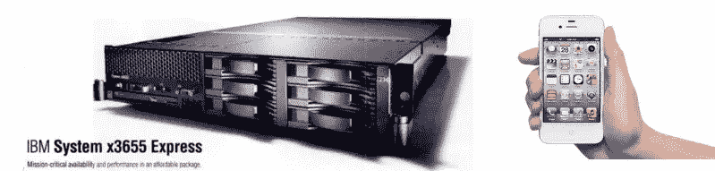
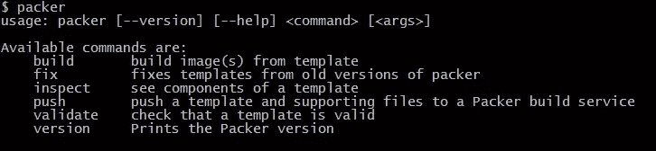
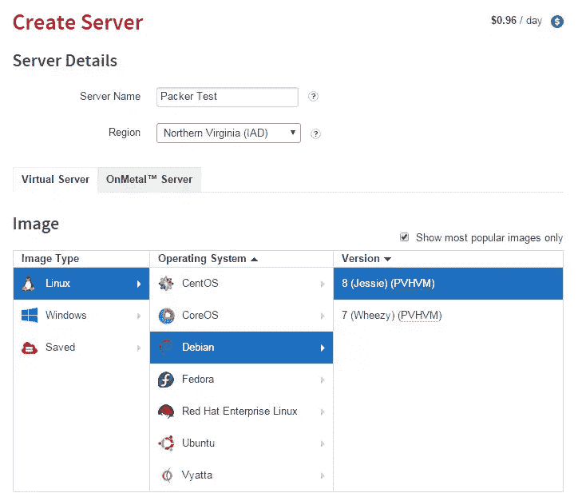
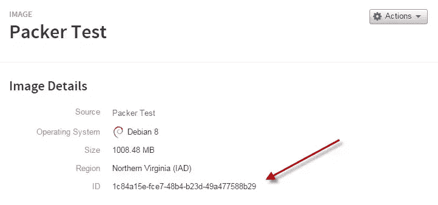
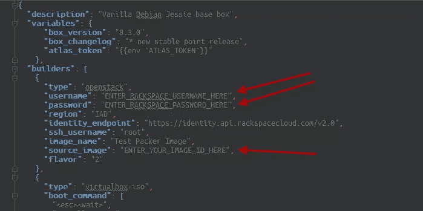
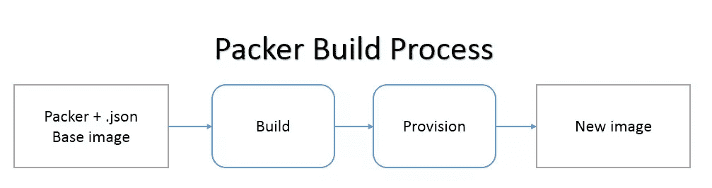
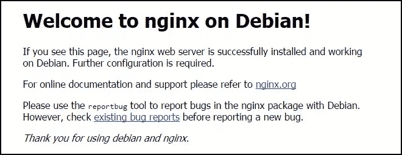
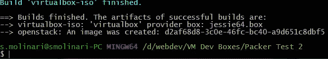

# Hashicorp 的 Packer——是为 PHP 开发人员准备的吗？

> 原文：<https://www.sitepoint.com/hashicorps-packer-is-it-something-for-php-developers/>



**TL；dr；作为一名 PHP 开发人员，Packer 是你工具箱中需要的工具吗？看情况。**

如果你除了开发工作之外，还为你的客户做大量的服务器工作，那么是的。Packer 可以帮你很多。

如果你只是一个开发者，并没有真正直接在服务器上做很多工作，那么 no. Packer 不会有太大帮助。

也就是说，对于任何 PHP 开发人员来说，学习创建服务器环境的基础知识都是明智的。你会在职业生涯中以这样或那样的方式遇到这些技术(你创造的一切都运行在它们上面！).这些专业知识肯定会对你未来的职业生涯有所帮助！至少，你会更好地理解你的开发运营同事和他们的工作。

如果你的兴趣被激起了，或者你做了很多手工服务器的工作，请继续读下去。


## 时光倒流

**TL；dr；# 2**——如果你有流浪的命令，并且明白它作为工具的用途，[请跳转到文章的这一节](#jumptopacker)。

仅在 10 年前，开发 PHP 应用程序基本上是这样工作的:开发人员通过 FTP 将一些代码上传到 web 服务器上，然后看看它是否工作。如果没有，他们将对其进行故障诊断，在一些文本编辑器中编辑更改，再次通过 FTP 重新加载受影响的文件，并查看更改是否修复了问题。在这种情况下，他们会去下一个专题或问题，清洗，冲洗，重复(并希望他们刚刚工作的东西没有坏掉)。他们可能也与 FTP 进行了一些同步。

这是普通 PHP 开发人员将东西推送到开发服务器或直接推送到生产服务器的工作流程(实际上，对于今天的一些开发人员来说，这仍然是相同的过程)。当时构建 web 服务器本身通常是其他人的工作。

此外，在不久前，为了让开发团队一起工作，可能会有某种形式的并发版本控制系统，团队甚至可能会设置自动部署。当变更被提交到存储库时，它会自动部署到一个临时或生产系统中。这种场景实际上是当时 web 应用程序开发的最佳技术。

在过去的好时光里，持续集成、虚拟机、云计算、基础设施协调、数据中心自动化甚至“开发运维”这个术语都是鲜为人知的。他们刚刚苏醒过来。亚马逊刚刚开始他们的网络服务业务。记住，这只是 10 年前的事！

啊，那时候生活多简单啊，对吧？

嗯，不是。那时候，开发更慢、更乏味，也更容易出错。服务器也总是不得不被“安装”起来进行测试，这通常意味着开发人员不得不等到“网络人员”准备好一台可以使用的服务器，比如说，最新版本的 PHP。在很多情况下，这常常是一场战斗，对于“网络人”来说，保持服务器“良好状态”常常就像救火一样。



## 当今计算和虚拟化

今天，随着计算机技术的普及，开发人员可以在自己的笔记本电脑上携带更加复杂的开发基础设施。今天，笔记本电脑或个人电脑的计算能力远远超过了 10 年前网络服务器的计算能力。

事实上，我们今天拥有的许多智能手机比 10 年前的服务器更强大。



科技很神奇，不是吗？

由于可用的计算能力不断增长，越来越多的人开始意识到这种计算能力可以被分割成独立的“机器”。这使得完全不同的事情同时发生在他们身上。更重要的是，计算能力可以得到更好的利用，节省资源。这些是计算能力虚拟化的主要驱动力。

换句话说，今天，有了制造虚拟机的能力，开发人员可以随身携带他们自己的开发环境，不再受另一方人员的限制，他们必须“给”他们一个适当的工作环境。更重要的是，他们可以在本地构建一个完整的开发环境，模拟一个完整的 web 服务器。

这不仅使开发人员更加自主，这种本地开发环境还有另一个很大的优势:它被称为“[开发-生产对等](http://12factor.net/dev-prod-parity)”——我们在新手友好的[“快速启动 PHP 环境”](https://www.sitepoint.com/premium/books/jump-start-php-environment)一书中详细讨论了这个概念。Dev-prod parity 基本上意味着开发人员可以在一个与实际部署的应用程序完全相同的系统上进行开发。


> 生产奇偶优势——它允许开发人员生产更高质量的代码，因为他们可以在第一时间以正确的方式做正确的事情。

今天，开发人员可以在自己的背包中拥有在高度复杂的环境中开发高度复杂的应用程序所需的一切。

这种能力显然带来了复杂性。必须构建虚拟服务器，并安装和配置软件。所有这些都非常耗时，正如你所知，时间就是金钱。这也意味着开发人员可能需要学习很多东西来运行这样的环境。这也很耗时。

## 流浪汉进来了

为了帮助开发者“构建”开发环境，[哈希公司](https://www.hashicorp.com/)推出了一个名为[流浪者](https://www.vagrantup.com/)的程序。有了 vagger，开发环境配置就是代码，可以轻松地共享、回滚和前滚。开发人员可以自由地尝试新事物，比如最新版本的 PHP，而不用担心服务器可能需要几个小时来安装，或者故障需要几个小时来解决。开发人员不必等待任何人来创建这个环境，也不会去打扰任何人，即使它完全被搞砸了。

> 更多关于流浪者的信息-[重新介绍流浪者:从 PHP 开始的正确方法](https://www.sitepoint.com/re-introducing-vagrant-right-way-start-php/)

但是还有一个问题需要解决。虽然对于构建开发环境来说，它真的很好，但是运行起来需要相当长的时间，尤其是在有很多供应的时候(下面将详细介绍供应)。根据所涉及的软件，构建机器和配置软件可能需要 2 到 20 分钟的时间。

这种时间消耗由于以下事实而变得更加复杂，即，vagger 一次只能为一个虚拟化系统(称为“提供者”)构建一个单独的盒子。例如，如果您想在本地构建您的环境，也想在 AWS 上构建一个，那么您必须创建两个不同的流浪者文件并分别运行它们。这不太实际。简单地说，vagger 非常好地构建了单一开发环境，仅此而已。

## 张风进来了

为了继续跟进，你现在必须更多地了解处于 [DevOps 角色](https://en.wikipedia.org/wiki/DevOps)的人的情况。Packer 将创建虚拟机映像的工作放在一个相对简单的中央配置中，因此您可以获得与 vagger 在自动化开发环境中相同的优势，现在还可以用于开发基础映像。

虚拟机映像也称为[虚拟设备](https://en.wikipedia.org/wiki/Virtual_appliance)。它是虚拟机的预构建副本，可用于创建新的虚拟机。这些图像在流浪儿的术语中被称为“盒子”。

如果你知道创建你自己的图像的过程，你知道这是一个手工做的皮塔饼。如果您没有，那么您是幸运的，因为您可以跳过手动构建它们的麻烦，现在就可以开始使用 Packer 了。但是，您仍然需要学习一些映像/服务器构建的基础知识。同样，这是作为开发人员的宝贵知识，任何开发人员都应该[花时间了解基础知识](https://www.google.de/webhp?q=interactive+tutorials+for+linux+server)。

一旦你开始使用 Packer，并且你已经在使用 vacant，你会想到的第一个问题是，“Packer 和 vacant 到底有什么区别？”我们开始讨论以上的不同之处。最后，Packer 创建了一些图像，这些图像可以用来构建开发环境。如果你以前用过 Hashicorp 的流浪者盒子，很可能它也是用 Packer 制造的。

作为一名拥有 Packer 的 DevOps 人员，您可以向开发团队提供生产环境的映像，他们可以使用这些映像轻松地进行开发。这又一次支持了开发-生产对等，并简化了开发过程。

我们之前提到过节省时间。Packer 还可以构建这些映像并并行部署它们。因此，您可以为不同的主机、您的私有云以及流浪者构建映像，几乎可以同时进行。此外，这些“预烤”的图像启动速度比在流浪者提供的盒子快得多。快多了！如果您的团队一直在“升级”和销毁箱子，Packer 使用您的预烤软件和配置制作的图像将为您的团队节省大量时间。

打包过程也使创建基础映像变得可重复。这意味着生产系统的质量更高，因为可以预先测试并自动将映像重建为虚拟机。换句话说，打包程序有助于减少人为错误的机会。

在构建映像时，您还可以控制几个子流程。我们会再深入一点。您还可以在 [Packer 文档](https://www.packer.io/docs/)中了解更多关于 Packer 的概念和特性。请注意，您可以为[构建大量不同的平台](https://www.packer.io/intro/platforms.html)。您还可以使用一系列供应器(如 Chef、Puppet、Ansible)或 Shell 脚本来供应软件。并且，您可以进行后期处理，比如创建一个 travel box 或者将一个图像推送到 Docker 注册表(以及更多)。

唷…那是许多理论，不是吗？

让我们做一些实际的事情，来帮助澄清 Packer 的概念以及如何使用它。

## 一些包装工作流程

这是对我们将要完成的事情的一个设想。


虽然 Packer 不需要流浪者来制作它的图像，但在上面的图形中添加了流浪者，以便让您更好地了解它在“管道”中的位置。

为了让您了解 Packer 的基础知识，下面的练习的目标是创建一个能够在 Rackspace 上运行的映像和一个 Virtualbox“盒子”文件。目标是向您展示您可以生成相同的映像和资源调配，以便在您的(理论上的)生产服务器上进行开发。

我们使用 Rackspace 是因为他们有一个非常简单的后端来管理计算基础架构，还因为他们使用 Openstack，这是一个基础架构管理的标准系统。

我们也在使用 Virtualbox，因为它是一个免费的、广泛使用的本地虚拟化系统。如果您愿意，可以使用 AWS 和 VMWare 等其他系统，但是，您需要修改本教程中提供的材料，因为它们是专门为这两个系统制作的。

**请注意:**我们在本文中构建的虚拟服务器绝不是“生产就绪”的。它们仅用于演示目的。

我们将用 Packer 构建的初始映像将是一个 Debian Jessie(64 位)映像，预装了 Nginx 和 PHP7。

**需求:**在我们开始之前，你需要在你的电脑上安装[流浪者](https://www.vagrantup.com/)和虚拟化软件 [Virtualbox](https://www.virtualbox.org/) (版本 5.0 以上)。你还需要一台 64 位的电脑。如果你使用的是 Windows 系统，你还应该安装用于 Windows 的 Git，这样我们就可以使用它的 bash 控制台。

正如我上面提到的，我们在本教程中使用 Rackspace，所以你需要一个帐户。设置一个相对来说很快也很容易。

你还需要一个相对快速的互联网连接，因为 Virtualbox 版本的图像下载相当大(大约 250MB)。最后，你需要在你的电脑上有大约 12GB 的空闲磁盘空间。

本文将假设你也知道使用 SSH 和 Shell 命令使用[流浪者](https://www.vagrantup.com/)、[的一些基础知识，并且对 Linux](http://ryanstutorials.net/linuxtutorial/commandline.php) 和[虚拟机](http://www.howtogeek.com/196060/beginner-geek-how-to-create-and-use-virtual-machines/)有一些[的基础知识。](https://www.linux.com/learn/tutorials/784060-the-complete-beginners-guide-to-linux)

### 设置您的计算机运行 Packer

请按照说明在您的计算机上安装 Packer。

在撰写本文时，Packer 0.11.0 刚刚发布。

安装完成后，在您的(git bash)控制台中输入`packer`。您应该会看到类似这样的内容。



现在，我们将转到 Rackspace，启动一台服务器，然后创建一个基础映像。首先，[登录 Rackspace 控制面板](https://mycloud.rackspace.com/)创建服务器。注意:如果你有 AWS 或其他云计算主机，Packer 支持它作为一个构建平台，你需要采取的步骤将是相似的。我们将在本教程中介绍 Rackspace。另外请注意，创建服务器会对你的主机账户产生一些费用。不过，数量会很少。按照这个教程应该不会花费超过一美元。

继续构建一个 Jessie 8 服务器，并将其称为“打包测试”。Rackspace 是相当不言自明的。启动 1GB 服务器来创建映像。



服务器激活后，创建新服务器的映像(右上角的 Actions 按钮)。一旦构建并保存了映像，您就可以删除服务器了。

进入“服务器->图像”，你应该会看到你的新图像。点击它进入图像的详细页面。我们需要图像 ID。



好的。现在您已经有了一个可以在 Rackspace 上使用的基础映像，我们将开始构建我们自己的映像。这个过程实际上相当复杂，尤其是对于那些对服务器环境和打包程序了解有限的人来说。因此，为了有所帮助，我们创建了一个演示打包回购供您下载。请从您的(Git bash)控制台克隆这个 repo。

```
git clone https://github.com/smolinari/PHP-Packer-Demo 
```

向下移动到新创建的“PHP-Packer-Demo”目录。

```
cd PHP-Packer-Demo 
```

使用您最喜欢的编辑器打开`jessie64.json`文件，然后输入您的 Rackspace 用户凭证和图像 ID。



快速补充说明:您也可以添加 Rackspace API 密钥来代替您的密码。如果您真的喜欢使用 Packer，您也可以将访问凭证移到一个单独的文件中，Git 忽略它们。但是这样做超出了本文的范围。

`jessie64.json`文件是 Packer 的心脏。这是控制打包程序采取的操作的配置文件。它在本质上类似于《流浪者》中使用的流浪者文件(我们也在下载中给过你)。

现在用下面的命令运行 Packer。

```
packer build jessie64.json 
```

这个构建过程需要几分钟。因为我们正在学习教程，所以让我们先来看看 Packer 内部发生了什么，然后等待它结束。此过程不应超过 30 分钟，或者控制台中的输出不应停止超过 10 分钟。如果是的话，一定是出了什么问题。



### 建筑工人

首先，Packer 从我们定义的基础映像开始构建过程。映像本身作为服务器启动，这也是我们在`jessie64.json`文件中定义的。您可以在我们的`jessie64.json`文件的顶部找到“builders”的特定 JSON 值。

```
 "builders": [
    {
      "type": "openstack",
      "username": "ENTER_RACKSPACE_USERNAME_HERE",
      "password": "ENTER_RACKSPACE_PASSWORD_HERE",
      "region": "IAD",
      "identity_endpoint": "https://identity.api.rackspacecloud.com/v2.0",
      "ssh_username": "root",
      "image_name": "Test Packer Image",
      "source_image": "ENTER_YOUR_IMAGE_ID_HERE",
      "flavor": "2"
    },
    {
      "type": "virtualbox-iso",
      "boot_command": [
        "<esc><wait>",
        "install <wait>",
        "preseed/url=http://{{ .HTTPIP }}:{{ .HTTPPort }}/vanilla-debian-8-jessie-preseed.cfg <wait>",
        "debian-installer=en_US <wait>",
        "auto <wait>",
        "locale=en_US <wait>",
        "kbd-chooser/method=us <wait>",
        "netcfg/get_hostname={{ .Name }} <wait>",
        "netcfg/get_domain=vagrantup.com <wait>",
        "fb=false <wait>",
        "debconf/frontend=noninteractive <wait>",
        "console-setup/ask_detect=false <wait>",
        "console-keymaps-at/keymap=us <wait>",
        "keyboard-configuration/xkb-keymap=us <wait>",
        "<enter><wait>"
      ],
      "disk_size": "10140",
      "guest_additions_mode": "disable",
      "guest_os_type": "Debian_64",
      "hard_drive_interface": "sata",
      "headless": true,
      "http_directory": "http",
      "iso_checksum": "dd25bcdde3c6ea5703cc0f313cde621b13d42ff7d252e2538a11663c93bf8654",
      "iso_checksum_type": "sha256",
      "iso_url": "http://cdimage.debian.org/cdimage/release/8.3.0/amd64/iso-cd/debian-8.3.0-amd64-netinst.iso",
      "shutdown_command": "sudo /sbin/halt -p",
      "ssh_password": "vagrant",
      "ssh_username": "vagrant",
      "ssh_port": "22",
      "ssh_wait_timeout": "10000s",
      "vm_name": "debian-jessie",
      "vboxmanage": [
        ["modifyvm", "{{.Name}}", "--memory", "1024"],
        ["modifyvm", "{{.Name}}", "--cpus", "1"]
      ]
    }
  ], 
```

构建者负责使您想要的映像与您的目标环境兼容。例如，使用 AWS AMI，您实际上可以构建您的 Virtualbox 映像，以便与 vagger 和 AWS 一起使用。

在我们的练习中，我们将“openstack”和“virtualbox-iso”映像放在一起。遗憾的是，Packer 无法使用 openstack 映像来构建 virtualbox 映像，因此我们另外创建了 Virtualbox 映像。

您会注意到上面 JSON 代码中的“boot_command”部分。这就是我们实际上自动输入必要命令的地方，以便在 Virtualbox 虚拟机中安装 Debian Jessie 8 作为操作系统。如果你愿意，你甚至可以在 Virtualbox 中观看安装过程，就像 Packer 做它的构建一样。

当然，这是一个很“神奇”的事情，你必须真正了解 Linux 安装的内部和 Packer 的内部，才能手动组装这样一个 Virtualbox 映像。谢天谢地，有很多很酷的 DevOps 人[把这样的 Packer `.json`文件放到一般用途](https://wiki.debian.org/Teams/Cloud/RebuildVagrantBaseBoxes)上。

### 食品供应商

一旦构建者在 Rackspace 和 Virtualbox 中的虚拟机上建立并运行映像，Packer 将开始提供软件，这在 shell 脚本中定义。使用 Packer，您还可以使用 Puppet、Chef 或 Ansible 等系统来协调供应。我们只使用了[外壳脚本](https://www.packer.io/docs/provisioners/shell.html)，你可以在`/scripts`目录中找到。

这是我们的配置文件中的供应部分。

```
 "provisioners": [
    {
      "type": "file",
      "source": "transfer_files/",
      "destination": "/tmp"
    },
    {
      "type": "shell",
      "pause_before": "5s",
      "execute_command": "echo 'vagrant'|sudo -S sh '{{.Path}}'",
      "override": {
        "virtualbox-iso": {
          "scripts": [
            "scripts/base.sh",
            "scripts/vagrant.sh",
            "scripts/virtualbox.sh",
            "scripts/setup.sh",
            "scripts/cleanup.sh",
            "scripts/minimize.sh"
          ]
        },
        "openstack": {
          "scripts": [
            "scripts/setup.sh"
          ]
        }
      }
    }
  ], 
```

“文件”供应器是我们将配置加载到虚拟机上的方式。它将配置文件从我们的机器加载到虚拟机上的`/tmp`目录。shell 脚本中有一些命令，可以在稍后的配置过程中将配置文件复制到虚拟机上的适当位置。我们有类似 Nginx 的“默认”配置文件或 PHP 的修改过的`php.ini`文件。你可以在`/transfer_files`文件夹中找到我们正在使用的文件。

您还会注意到上面的“覆盖”部分。这是告诉 Packer 只为每个映像构建运行某些脚本。在我们的练习中，我们需要对“openstack”映像做更少的工作，以使它与 Virtualbox 映像“对等”,因此只处理了`setup.sh`脚本。

最后是调配后处理器部分。

```
 "post-processors": [
    {
      "type": "vagrant",
      "only": ["virtualbox-iso"],
      "output": "jessie64.box"
    }
  ] 
```

这实际上负责构建流浪者盒子。

重要的是要记住，我们现在提供的一切都是“预先制作”到映像中的。Packer 通过这一点自动化为我们(或我们的开发团队)节省了大量时间！

### 构建的图像

在 Packer 提供了我们在`jessie64.json`文件中配置的所有软件后，它将关闭虚拟机并存储这些虚拟机的新映像。对于 Rackspace 映像，您可以在 Rackspace 管理控制面板的“保存的映像”部分找到新映像。对于 Virtualbox 映像，您将在当前目录中找到一个“jessie64.box”文件。

就是这样。打包机已经完成了它的任务！

## 现在怎么办？

现在，您可以使用 Rackspace 映像创建新的服务器。试试看。转到“服务器”部分，选择“创建服务器”，然后转到“保存的图像”。您应该在“已删除的服务器”下看到新保存的图像。选择它并启动服务器。一旦它被激活，你就可以把给你的 IP 地址输入到你的浏览器中。您应该会看到 Nginx 欢迎屏幕。



对于 Virtualbox 映像，我们还需要做一些关于流浪者的工作。现在小心地跟着走。这将变得非常困难！

### 创建 Virtualbox 虚拟机

在包含流浪者文件的目录中，输入以下命令。

```
vagrant box add jessie64 jessie64.box
vagrant up 
```

就是这样！好吧，没错，我们确实帮了你一点忙，为你创建了流浪者档案。你需要[学习更多关于流浪者](https://www.sitepoint.com/vagrantfile-explained-setting-provisioning-shell/)的知识，以便自己创建一个工作文件。如前所述，如果你是一个认真的开发者，这应该是你应该学习的东西。

现在，您应该会在 Virtualbox 的 UI 中看到作为虚拟机的新映像。

上面的第一个命令将新的盒子添加到了 vagger 中，因此它知道从哪里使用它。我们将该盒子命名为“jessie64 ”,并使用我们刚刚创建的盒子。第二个命令告诉 vagger 在 Virtualbox 中创建虚拟机并运行它。

您还会注意到，盒子的初始启动只需要一两分钟。如果我们是以 travel 的形式提供所有资源，可能需要 10-20 分钟。这又节省了时间。

一旦“向上漫游”命令完成，在浏览器中输入 URL `http://192.168.33.10`,您应该会看到相同的 Nginx 欢迎页面。这是您的本地 web 服务器，Rackspace 上 web 服务器的完美副本。

在这两个系统中，您还可以使用 SSH，用户名为“vagger ”,密码为“vagger”。这些服务器不安全！

## 我们还没完呢！

让我们做一些更有趣的事情。

当你做下一步的时候，想象一下你已经做了多少次这样或类似的事情。我们现在正在实现软件安装和配置过程的自动化！

假设我们做了很多 Symfony 开发工作。让我们继续设置我们的图像，以自动安装一个版本的 Symfony 并为我们准备好。

在我们开始之前，删除 Rackspace 上的服务器。(我们不想花任何不必要的钱。)

同样，在你的控制台中，让我们杀死并移除刚刚加载的流浪者盒子。输入以下命令:

```
vagrant destroy
vagrant box remove jessie64 
```

## 安装 Symfony(和演示)只是为了好玩——(或者是？)

同样，让我们想象我们有一个开发团队，他们经常与 Symfony 合作。让我们自动设置一个 Symfony 就绪的服务器。我们将只加载 Symfony 演示应用程序，但这些额外的工作应该会让您很好地了解 Packer 可以在何处以及如何通过自动化来支持开发和基础设施协调工作。

进入`/scripts`目录，用您最喜欢的编辑器打开`setup.sh`脚本，并将这个 Shell 脚本代码添加到底部。

```
# Restart PHP-FPM (only needed so the Symfony demo install works properly)
service php7.0-fpm restart

#Install SQLite Database
apt-get install -y sqlite3

#Install Symfony Installer
echo "Installing Symfony"
echo "Downloading Symfony installer"
curl -LsS https://symfony.com/installer -o /usr/local/bin/symfony

echo "Changing permissions on symfony installer for execution"
chmod a+x /usr/local/bin/symfony

#Install Symfony Demo
echo "Installing Symfony Demo"
echo "Changing to www directory"
cd /var/www/html
echo "Creating the demo"
symfony demo

#Change ownership of the project to the www-data user
echo "Changing ownership of symfony_demo"
chown -R www-data:www-data /var/www/html/symfony_demo

#Change configuration files to preconfigured ones
#To get Nginx to work with Symfony and move the doc root to Symfony's /web directory
echo "Copying new Nginx config file"
cp /tmp/config/default-symfony /etc/nginx/sites-available/default 
```

上面的代码基本上是我们正确设置 Symfony、PHP 和 Nginx 所需要做的。

添加了注释来解释在这些配置步骤中将会发生什么。

一旦你添加了上面的代码并保存了它，让 Packer 再做一次繁重的工作。

在文件系统中返回到我们拥有的`jessie64.json`文件的位置，输入我们之前输入的命令。

```
packer build jessie64.json 
```

你现在可以去处理其他事情，或者再去喝杯咖啡(或者在跑步机上走一走)。构建新的 Symfony 演示图像需要一段时间。

完成后，您应该会看到一个类似这样的屏幕。



现在映像已经构建好了，我们可以在 Rackspace 上再次启动 openstack 映像作为新的服务器。

对于您的 Virtualbox 虚拟机，再次输入上面“创建 Virtualbox 虚拟机”中提到的两个命令。

使用 Rackspace 服务器，您将获得一个新的 IP 地址。进入

```
http://new.server.ip 
```

您应该会看到 Symfony 演示应用程序正在运行。

在本地虚拟机上，您可以输入以下内容:

```
http://192.168.33.10 
```

你会看到同样的事情。

很酷吧。

## 结论

我们走过了记忆的小路，然后回到了现在。希望我们让你理解了计算机虚拟化的原因，以及创建像流浪者和打包者这样的软件的原因，以及这两者之间的联系。

如果您成功地创建了这两个服务器，那么您也可以想象 Packer 作为 DevOps 的成员和开发人员能够为您提供的优势。它们包括但不限于:

*   **生产对等**–与生产环境非常相似的开发环境。

*   **节省时间**–映像通过软件和配置进行“预烤”，您不再需要手动添加。

*   **环境测试**–完成的图像可以被认为是“完整的”并经过测试，避免人为错误。

*   **环境版本化**–当您更改环境时，使用 Git，您可以对不同的打包器版本进行版本化。

*   **支持“不可变体系结构”**–在这种情况下，不是构建或修改现有虚拟机(这可能是错误的来源)，而是简单地“销毁”虚拟机实例并创建新实例。

希望您喜欢这篇文章和用 Packer 构建图像的练习。请在下面的评论中告诉我们你对 Packer 的看法。

## 分享这篇文章