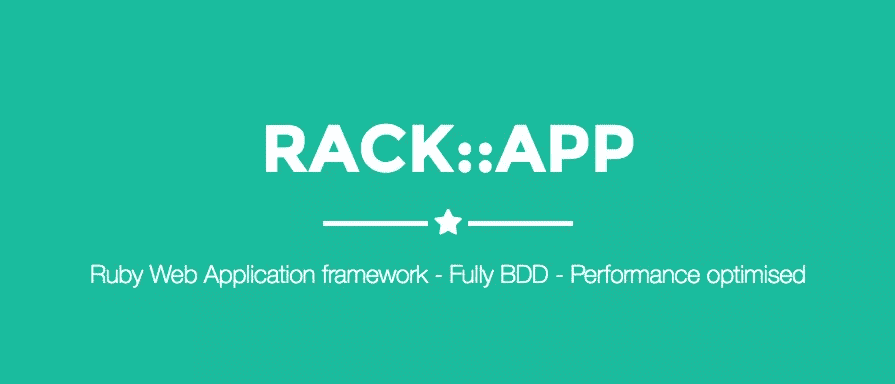

# Rack-App:一个高效实用的 Web 微框架

> 原文：<https://www.sitepoint.com/rack-app-a-performant-and-pragmatic-web-microframework/>



这是一个 web 开发人员使用 Ruby 的绝佳时机。Ruby on Rails 为现代 Web 开发铺平了道路，但这样做也暴露了某些缺点。它的“厨房水槽”方法有时可能有些矫枉过正，特别是对于小项目，这导致了 Ruby 微框架的激增和黄金时代。T2 辛纳特拉 T3 的成功表明对它和它的同类产品有真正的需求，而且它们的数量每隔几个月就在增加。

为什么有这么多框架？部分原因是奇妙的[框架](https://rack.github.io)使得任何对 TCP/IP 有基本了解的人都可以非常容易地推出自己的框架，部分原因是根据定义，微框架是固执己见的。结果是，这些观点导致了不可避免的痒感，当与低进入壁垒相结合时，导致了市场上过多的微框架。为什么我们需要另一个？我们不知道。在这一点上，几乎每个现代 web 开发用例都是由现有的东西来满足的。那么为什么会有人对 [Rack-App](http://www.rack-app.com) 感兴趣呢？这个很简单。这是在 [Heroku](https://www.heroku.com) 为微服务提供动力的框架。

## 核心原则

机架固执己见。以下是亮点:

*   没有元编程——这不是一个会牵着你的手的框架，但它也不会给你任何意外的惊喜。
*   performant——我们一会儿会谈到这个，但是这个框架是可伸缩的。
*   简单性——代码膨胀？依赖？不在这里。
*   强调测试——Rack 支持行为驱动开发(BDD ),并以易于集成而自豪。
*   模块化–Rack-App 为您提供了入门的最低要求。有[插件可用](https://rubygems.org/search?query=rack-app)，但不包含。

听起来很吸引人？让我们看看它与现在其他产品的真正区别:性能。

## 表演

这是一个非常关注性能的框架，它有一个[单独的存储库](https://github.com/rack-app/rack-app-benchmark)将自己与所有其他存储库进行基准测试。这用于捕捉版本之间的回归，包括 Rails、Sinatra 和许多其他鲜为人知的框架。同时，这也是[项目主页](http://www.rack-app.com)的显著特征；这种开放性令人耳目一新(但当你一直在排行榜上名列前茅时，这可能也很容易！)在这个时代，我们经常试图从大规模工具中获取最后一点性能。

不过，这并不是一个致命的特性。一个杀手锏是 Rack-App 将轻松地为超过 10，000 个端点(只要你能放入内存)提供恒定的时间查找。让我们转移一下话题，看看它是如何实现这种性能的。

## 常数时间查找

假设我们有超过 10，000 个端点。查找时间怎么可能不变？好吧，我们来看看出处。我们知道这很可能与路由有关，所以快速浏览一下路由器[这里的](https://github.com/rack-app/rack-app/blob/master/lib/rack/app/router/static.rb)。你可以看到它使用了我们的老朋友[hash](https://www.sitepoint.com/diving-into-how-hashes-work-in-ruby/)，众所周知，它有一个固定的查找时间。不完全是所谓的“空查找时间”，但尽管如此，当服务这么多端点时，还是令人印象深刻。

有趣的是，您可以命名端点。这意味着你必须非常努力地工作来拥有太多的端点，但是你的代码自然会是[干的](https://en.wikipedia.org/wiki/Don%27t_repeat_yourself)(除非你反对这样做)，并且仍然受益于快速的查找时间。

## 简单

这么多 Ruby 框架的一个好处是，我们已经看到了什么可行，什么不可行。你上一次在 Ruby 框架中使用晦涩难懂的语法或混乱的 API 是什么时候？Rack-App 也不例外。DSL 大量借鉴了(优秀的) [Sinatra](http://www.sinatrarb.com/) (还有 [Grape](http://www.ruby-grape.org) )，这意味着新用户应该对熟悉而简洁的语法有宾至如归的感觉。最重要的是，通过以这种方式降低入门门槛，真的没有理由不花几个小时来学习这个框架，以添加到您的编程武库中。

Rack 体现了[最小惊讶原则](https://en.wikipedia.org/wiki/Principle_of_least_astonishment)，这是一把双刃剑。一方面，很高兴不必费力地通过堆栈上的十几层来找出为什么某个东西不像它应该的那样运行，因为有人在某个地方聪明地重载了一个不知名的类。另一方面，如果你犯了一个错误，没有什么可以抓住你。就我个人而言，我觉得这令人耳目一新。我喜欢我的框架把我当成一个成年人，当我犯了一个错误时就爆发。然而，这并不适合所有人，如果这种安全网的缺乏给生产中的运行带来了问题，那么还有其他的选择。

## 测试

为了防止出现异常，Rack-App(像 Rails 一样)推崇测试。[行为驱动开发](https://en.wikipedia.org/wiki/Behavior-driven_development) (BDD)是首选的武器，一个`test`模块与 Rack 捆绑在一起。该框架已经过全面测试，因此理论上可以直接将集成测试添加到您的应用程序中——只需在您的规范中添加模块即可。

## 在活动

这就足够说明它的优点了；让我们尝试一些代码！

你知道规矩:

`gem install rack-app`

以下是输出结果:

```
Fetching: rack-2.0.1.gem (100%)
Successfully installed rack-2.0.1
Fetching: rack-app-5.5.1.gem (100%)
Successfully installed rack-app-5.5.1
Parsing documentation for rack-2.0.1
Installing ri documentation for rack-2.0.1
Parsing documentation for rack-app-5.5.1
Installing ri documentation for rack-app-5.5.1
Done installing documentation for rack, rack-app after 4 seconds
2 gems installed 
```

一个依赖:[机架](https://rack.github.io/)。当他们说他们很少依赖时，他们真的不是在开玩笑。

让我们快速创建一个“Hello World”:

```
# config.ru
require 'rack/app'

class Racko < Rack::App
  get '/' do
    "Hello World!"
  end
end

run Racko 
```

用一个服务器运行 [config.ru](https://gist.github.com/adamluzsi/badf3ac5d40db335b45972aca4b30cd8#file-config-ru) (我更喜欢优秀的[散弹枪](https://rubygems.org/gems/shotgun)，因为它有实时重装功能，但`rackup config.ru`也能正常工作)并浏览到 [localhost:9393](http://localhost:9393) 或 [localhost:9292](http://localhost:9292) ，这取决于你的选择。您应该看到您的问候语:

`Hello World!`

目前为止没什么特别的。类继承，大量借用 Sinatra 的 DSL 语法和对 Rack 的`run`钩子的调用。让我们再深入一点。

## 示例应用程序

让我们加快步伐。从[项目的主页](https://www.rack-app.com)可以得出一个更实质性的例子。对于那些在家玩的人，创建以下文件: [config.ru](https://gist.github.com/adamluzsi/badf3ac5d40db335b45972aca4b30cd8#file-config-ru) 、[media*file*server . Rb](https://gist.github.com/adamluzsi/badf3ac5d40db335b45972aca4b30cd8#file-media_file_server-rb)和 [file_uploader.rb](https://gist.github.com/adamluzsi/badf3ac5d40db335b45972aca4b30cd8#file-uploader-rb) 。对于懒人:

```
wget {https://gist.githubusercontent.com/adamluzsi/badf3ac5d40db335b45972aca4b30cd8/raw/cad2e1b137f94cc1217348283b0058524fc71bbc/config.ru,https://gist.githubusercontent.com/adamluzsi/badf3ac5d40db335b45972aca4b30cd8/raw/cad2e1b137f94cc1217348283b0058524fc71bbc/media_file_server.rb,https://gist.githubusercontent.com/adamluzsi/badf3ac5d40db335b45972aca4b30cd8/raw/cad2e1b137f94cc1217348283b0058524fc71bbc/uploader.rb} 
```

以下是内嵌文件:

```
# config.ru
require 'json'
require 'rack/app'
class MyApp < Rack::App

  headers 'Access-Control-Allow-Origin' => '*',
          'Access-Control-Expose-Headers' => 'X-My-Custom-Header, X-Another-Custom-Header'

  serializer do |obj|
    if obj.is_a?(String)
      obj
    else
      JSON.dump(obj)
    end
  end

  error StandardError, NoMethodError do |ex|
    { error: ex.message }
  end

  get '/bad/endpoint' do
    no_method_error_here
  end

  desc 'hello world endpoint'
  validate_params do
    required 'words', class: Array, of: String,
                      desc: 'words that will be joined with space',
                      example: %w(dog cat)
    required 'to', class: String,
                   desc: 'the subject of the conversation'
  end
  get '/validated' do
    return "Hello #{validated_params['to']}: #{validated_params['words'].join(' ')}"
  end

  get '/' do
    { hello: 'world' }
  end

  mount MediaFileServer, to: "/assets"
  mount Uploader, to: '/upload'

end

# for more check out how-to
run MyApp

# media_file_server.rb
class MediaFileServer < Rack::App

  serve_files_from '/folder/from/project/root', to: '/files'

  get '/' do
    serve_file 'custom_file_path_to_stream_back'
  end
end

# uploader.rb
require 'fileutils'
class Uploader < Rack::App

  post '/to_stream' do
    payload_stream do |string_chunk|
      # do some work
    end
  end

  post '/upload_file' do
    file_path = Rack::App::Utils.pwd('/upliads', params['user_id'], params['file_name'])
    FileUtils.mkdir_p(file_path)
    payload_to_file(file_path)
  end

  post '/memory_buffered_payload' do
    payload #> request payload string
  end

end 
```

这是留给读者去玩的一个练习，但是让我们快速看一下 [config.ru](https://gist.github.com/adamluzsi/badf3ac5d40db335b45972aca4b30cd8#file-config-ru) ，在那里可以找到有趣部分的内容:
——作为散列设置的头——这显然是一个面向 API 使用的框架。
–串行器–这漂亮地捕捉了 Rack-App:如果你需要什么，你最好准备好滚动你自己的。
–错误–Rack-App 引以为豪的是统一的错误处理界面；没什么特别的，但是你也没有处理太多的抽象。

## 结论

Rack-App 还处于早期阶段。它已经遇到了一点小的争议并且变化一直在进行。一个有争议的缺点是谷歌几乎不可能搜索到这个名字。幸运的是，文档非常棒，主页上有一个`HOW-TO`菜单，链接到大量常见用例的例子。就我个人而言，我欣赏简洁的风格，尤其是来自于 [Python 的冗长对等物](http://cryto.net/~joepie91/blog/2013/02/19/the-python-documentation-is-bad-and-you-should-feel-bad/)，因为它很容易快速获得生产力。

最后，值得注意的是，微框架通过避免依赖性，允许在做事的方式上有更大的差异。如果您习惯于 Rails 在配置和厨房水槽方法上的惯例，那么您需要注意的是，在长期可维护性方面有一个折衷。也就是说，微框架的好处数不胜数，而且需求不会很快消失。在我看来，如果你需要一个高性能的、久经沙场的后端来服务于 API 端点，同时快速达到合理的生产力水平，Rack-App 是唯一真正的选择。

## 分享这篇文章