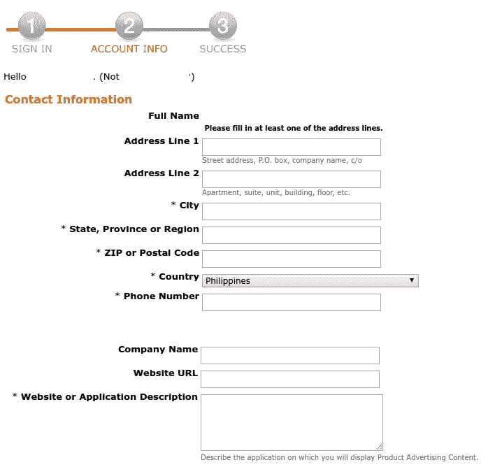
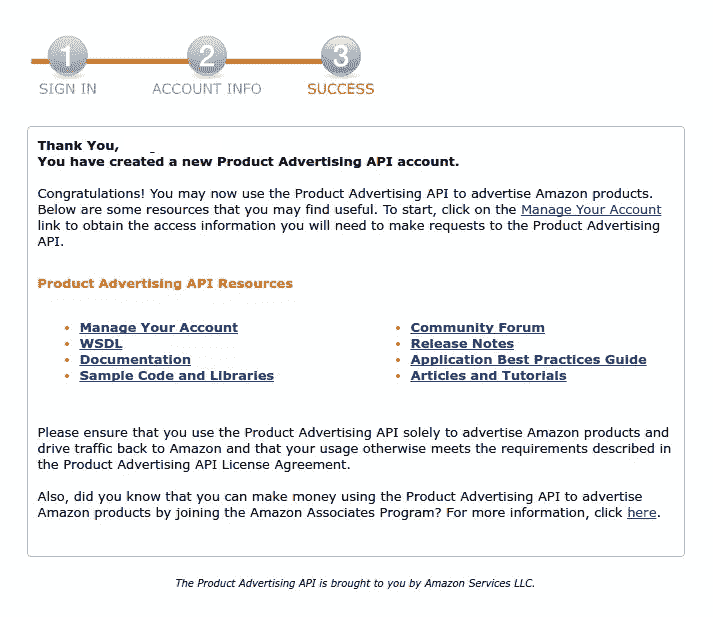
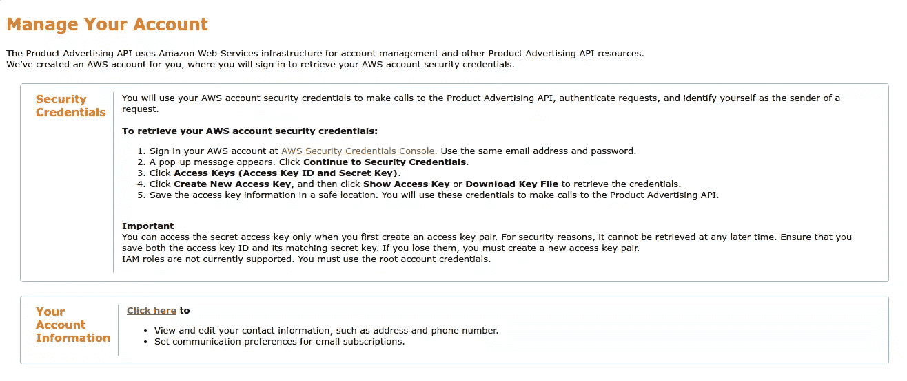
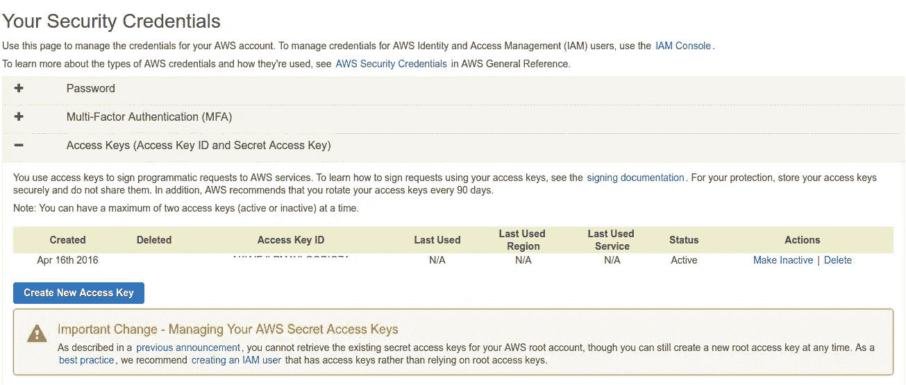
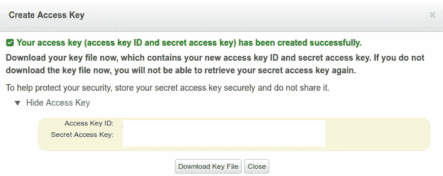
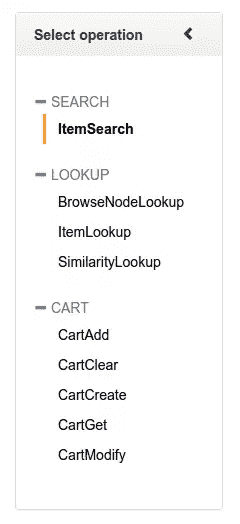
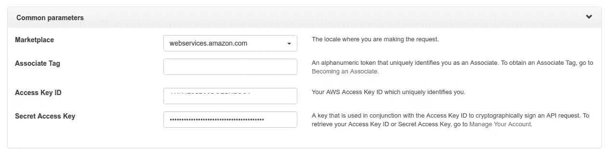
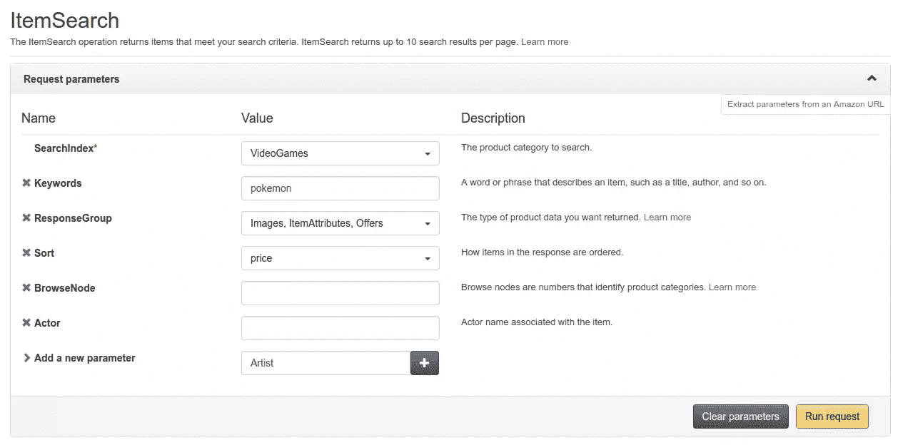
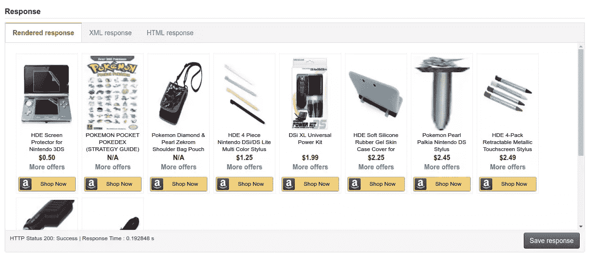
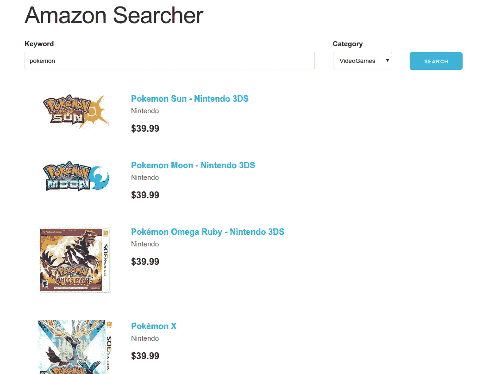

# 亚马逊产品 API 探索:让我们构建一个产品搜索器

> 原文：<https://www.sitepoint.com/amazon-product-api-exploration-lets-build-a-product-search/>


在本教程中，你将会看到亚马逊的[产品广告 API](https://affiliate-program.amazon.com/gp/advertising/api/detail/main.html) 。这是一个 API，允许开发者访问全球所有亚马逊市场上的销售项目、卖家评论、客户评论和产品促销的数据。

## 基本 API 概念

当使用 API 时，您需要知道的第一件事是您希望以哪个 Amazon 网站为目标。并非所有的亚马逊网站都出售相同种类的产品。如果你是一个卖家，你真的必须瞄准你自己的地区，而不仅仅是美国网站(亚马逊网站)。您可以在这个页面上找到关于哪些地区可用的信息:[REST 请求的剖析](http://docs.aws.amazon.com/AWSECommerceService/latest/DG/AnatomyOfaRESTRequest.html)。一旦进入该页面，查找*产品广告 API 端点*，您将看到一个地区及其相应端点的列表。请注意，您只能向您注册的端点发出请求。例如，如果您在美国网站上注册为会员，您将只能向`http://webservices.amazon.com/onca/xml`端点发出请求。

### 操作

[操作](http://docs.aws.amazon.com/AWSECommerceService/latest/DG/CHAP_OperationListAlphabetical.html)是你可以用 API 做的事情。这里有几个例子:

*   [items search](http://docs.aws.amazon.com/AWSECommerceService/latest/DG/ItemSearch.html)–根据特定参数(如类别、标题、制造商和最低价格)搜索商品。这将返回一个或多个项目。
*   [item lookup](http://docs.aws.amazon.com/AWSECommerceService/latest/DG/ItemLookup.html)–根据标识符搜索项目，例如 ASIN 或 ISBN(用于图书)。这仅返回一项。
*   [SimilarityLookup](http://docs.aws.amazon.com/AWSECommerceService/latest/DG/SimilarityLookup.html)–搜索与您在请求中指定的商品相似的商品。
*   在亚马逊的服务器上创建一个远程购物车。
*   [CartAdd](http://docs.aws.amazon.com/AWSECommerceService/latest/DG/CartAdd.html)–将商品添加到远程购物车。

### 响应组

响应组允许您指定要包含在响应中的产品信息。请注意，响应组取决于您正在使用的操作。这意味着并非所有响应组都适用于所有操作。以下是一些您可以使用的响应组示例:

*   [Small](http://docs.aws.amazon.com/AWSECommerceService/latest/DG/RG_Small.html)–返回物品的基本信息。返回的示例数据包括 ASIN、Title、ProductGroup。
*   [评论](http://docs.aws.amazon.com/AWSECommerceService/latest/DG/RG_Reviews.html)–返回包含项目评论的 iframe 的 URL。
*   [offer summary](http://docs.aws.amazon.com/AWSECommerceService/latest/DG/RG_OfferSummary.html)–返回每种条件类型(新物品、二手物品、可收藏物品、翻新物品)的最低价格。
*   [item attributes](http://docs.aws.amazon.com/AWSECommerceService/latest/DG/RG_ItemAttributes.html)–返回一个项目拥有的所有属性。项目属性取决于项目的类型。例如，一本书将具有与计算机硬件不同的属性集。然而，像[标题](http://docs.aws.amazon.com/AWSECommerceService/latest/DG/CHAP_response_elements.html#Title)或[标价](http://docs.aws.amazon.com/AWSECommerceService/latest/DG/CHAP_response_elements.html#ListPrice)这样的属性是所有产品共有的。

### 浏览节点

浏览节点是亚马逊对商品进行分类的方法。它们被称为浏览节点，因为每个节点可以有子节点，每个子节点也可以有自己的子节点。浏览节点的示例包括:

*   书
*   电子学
*   移动应用
*   软件
*   办公事务产品
*   汽车的

上面给出的例子都是根节点。在 API 中，如果您不希望您的请求过于具体，可以使用根节点作为搜索索引的值。但是，如果您想要更具体，您总是可以更深入地研究根节点的子节点或孙节点。例如，你不希望只搜索“书籍”。你特别想要关于非洲历史的书。在这种情况下，您的浏览节点遍历将如下所示:

```
Books -> History -> African 
```

“书籍”是根节点，“历史”是子节点，“非洲”是孙节点。您想要的是最远节点(孙子)的 ID。在您的请求中将它指定为参数`BrowseNode`的值，这样 API 将只查找关于非洲历史的书籍。您可以在[findbrowsenodes.com](http://www.findbrowsenodes.com/)上找到浏览节点及其相应 id 的列表。

### 现场

如前所述，在全球范围内有一些 Amazon 地区或市场，您将发出的每个 API 请求都需要针对一个特定的地区。但是对于搜索索引、浏览节点 id、排序值和 ItemSearch 参数，每个地区都有不同的有效值。例如，[巴西市场](http://docs.aws.amazon.com/AWSECommerceService/latest/DG/LocaleBR.html)只有几个可用的搜索索引。但是如果你看一下[加拿大市场](http://docs.aws.amazon.com/AWSECommerceService/latest/DG/LocaleCA.html)，可以得到的搜索指数与[美国市场](http://docs.aws.amazon.com/AWSECommerceService/latest/DG/LocaleUS.html)的搜索指数非常接近。您可以在[语言环境参考页面](http://docs.aws.amazon.com/AWSECommerceService/latest/DG/localevalues.html)查看具体的语言环境信息。

## 获取访问密钥

为了向产品广告 API 发出请求，您需要有一个访问密钥、秘密密钥和会员 ID。以下是让您开始的步骤:

1.  [注册一个亚马逊账户](https://www.amazon.com/ap/register?_encoding=UTF8&openid.assoc_handle=usflex&openid.claimed_id=http%3A%2F%2Fspecs.openid.net%2Fauth%2F2.0%2Fidentifier_select&openid.identity=http%3A%2F%2Fspecs.openid.net%2Fauth%2F2.0%2Fidentifier_select&openid.mode=checkid_setup&openid.ns=http%3A%2F%2Fspecs.openid.net%2Fauth%2F2.0&openid.ns.pape=http%3A%2F%2Fspecs.openid.net%2Fextensions%2Fpape%2F1.0&openid.pape.max_auth_age=0&openid.return_to=https%3A%2F%2Fwww.amazon.com%2Fgp%2Fyourstore%2Fhome%3Fie%3DUTF8%26ref_%3Dnav_newcust)

2.  根据您所在的地区，注册成为产品广告 API 开发人员。转到[该页面](http://docs.aws.amazon.com/AWSECommerceService/latest/DG/becomingDev.html)并向下滚动到底部，找到您所在地区的 URL。这需要您输入以下信息:

    

3.  完成后，应该会显示以下屏幕:

    

4.  单击管理您的帐户的链接，应该会返回以下页面:

    

5.  点击显示 *AWS 安全凭证控制台*的链接，你将被重定向到亚马逊网络服务控制台。如果这是您第一次访问它，它应该显示一个模式框，要求您继续安全凭证。

6.  点击*访问键*选项卡，显示您已经拥有的访问键列表。默认情况下，应该会列出一个，但是您实际上无法使用它，因为您看不到相应的密钥。如果这是一个新帐户，您可以删除它。

    

7.  点击*创建新的访问密钥*按钮，生成新的访问密钥和秘密密钥组合。生成后，复制密钥组合或下载密钥文件。这是因为您将无法在网站上再次看到密钥。

    

8.  根据你所在的地区注册一个亚马逊协会账户[。在这里，他们会询问你的网站和你销售的产品的细节。它还会要求您验证您的电话号码。一旦你完成了所有这些，你会得到一个唯一的关联 ID。](http://docs.aws.amazon.com/AWSECommerceService/latest/DG/becomingDev.html)

## Scratchpad

您可以使用[便笺本](http://webservices.amazon.com/scratchpad/index.html)来摆弄 API，而不必编写代码。要使用草稿栏，首先选择要执行的操作:



提供公共参数。这包括您希望执行请求的 Amazon 网站、您的员工 ID、访问密钥和密钥。



接下来是请求参数。在这里，您可以选择要搜索的类别(搜索索引)、查询(关键字)、要返回的特定产品数据(响应组)、排序、浏览节点以及希望添加到请求中的任何附加参数。



点击*运行请求*按钮发送请求。

一旦收到响应，它应该会显示以下内容:



注意，XML 响应是从 API 中得到的。呈现的响应是 HTML response 选项卡中代码的输出，但它基本上使用的是 XML 响应中的相同数据。

## 向 API 发出请求

在这一节中，您将了解如何向 API 发出请求。你将使用 Guzzle 做到这一点。用[作曲](https://www.sitepoint.com/php-dependency-management-with-composer/)来装吧。

```
composer require guzzlehttp/guzzle:~6.0 
```

创建一个`amazon-tester.php`文件并添加以下代码。现在只需硬编码这些键，这样您就可以快速测试了。

```
<?php
require 'vendor/autoload.php';

$client = new GuzzleHttp\Client();

$access_key = 'YOUR-ACCESS-KEY';
$secret_key = 'YOUR-SECRET-KEY';
$associate_tag = 'YOUR-ASSOCIATE-ID';

$timestamp = date('c');

$query = [
  'Service' => 'AWSECommerceService',
  'Operation' => 'ItemLookup',
  'ResponseGroup' => 'Medium',
  'IdType' => 'ASIN',
  'ItemId' => 'B00BGO0Q9O',
  'AssociateTag' => $associate_tag,
  'AWSAccessKeyId' => $access_key,
  'Timestamp' => $timestamp
];

ksort($query);

$sign = http_build_query($query);

$request_method = 'GET';
$base_url = 'webservices.amazon.com';
$endpoint = '/onca/xml';

$string_to_sign = "{$request_method}\n{$base_url}\n{$endpoint}\n{$sign}";
$signature = base64_encode(
  hash_hmac("sha256", $string_to_sign, $secret_key, true)
);

$query['Signature'] = $signature;

try {
  $response = $client->request(
    'GET', 'http://webservices.amazon.com/onca/xml', 
    ['query' => $query]
  );

  $contents = new SimpleXMLElement($response->getBody()->getContents());
  echo "<pre>";
  print_r($contents);
  echo "</pre>";
} catch(Exception $e) {
  echo "something went wrong: <br>";
  echo $e->getMessage();
} 
```

分解上面的代码，首先包含自动加载文件，这样您就可以使用 Guzzle，然后创建一个新的 Guzzle 客户端:

```
require 'vendor/autoload.php';

$client = new GuzzleHttp\Client(); 
```

声明您的访问密钥、秘密密钥、关联 ID 以及当前时间戳。注意，API 要求时间戳采用 [ISO 8601 日期格式](https://en.wikipedia.org/wiki/ISO_8601)。

```
$access_key = 'YOUR-ACCESS-KEY';
$secret_key = 'YOUR-SECRET-KEY';
$associate_tag = 'YOUR-ASSOCIATE-ID';

$timestamp = date('c'); 
```

声明要提供给 API 的查询参数。这里唯一不变的是`Service`、`AssociateTag`、`AWSAccessKeyId`和`Timestamp`。所有其他参数可能会根据您希望执行的操作而变化。在这种情况下，您正在执行一个`ItemLookup`操作。如前所述，该操作允许您根据惟一的标识符获取单个产品的信息。亚马逊产品中最常用的产品标识符是 ASIN(亚马逊标准识别号)。这个数字对于每个亚马逊市场来说都是唯一的，这意味着同一种商品在不同的市场中可以有不同的 ASIN。提供参数`IdType`并给它一个值`ASIN`来指定您想要使用 ASIN 作为产品标识符。然后添加`IdType`来指定产品标识符本身的值。

```
$query = [
  'Service' => 'AWSECommerceService',
  'Operation' => 'ItemLookup',
  'ResponseGroup' => 'Small',
  'IdType' => 'ASIN',
  'ItemId' => 'B00BGO0Q9O',
  'AssociateTag' => $associate_tag,
  'AWSAccessKeyId' => $access_key,
  'Timestamp' => $timestamp
]; 
```

只需查看 URL 或页面本身，就可以获得项目的 ASIN。例如，[该项目](http://www.amazon.com/Pokemon-Sun-Nintendo-3DS/dp/B01C93CWU6?ie=UTF8&keywords=pokemon&qid=1461061906&ref_=sr_1_9&sr=8-9)具有以下 URL:

```
http://www.amazon.com/Pokemon-Sun-Nintendo-3DS/dp/B01C93CWU6?ie=UTF8&keywords=pokemon&qid=1461061906&ref_=sr_1_9&sr=8-9 
```

ASIN 是跟在`dp/` : `B01C93CWU6`后面的字符串。如果您向下滚动到产品的详细信息，也可以看到 ASIN。

继续，使用`ksort`按字母顺序排列数组键。这也是 API 要求的一部分。

```
ksort($query); 
```

基于查询参数数组生成 URL 编码的查询字符串:

```
$sign = http_build_query($query); 
```

接下来，您需要为将要发出的请求构造签名。签名由请求方法、发出请求的基本 URL、端点和查询参数组成。每一项都应该用新的一行隔开。

```
$request_method = 'GET';
$base_url = 'webservices.amazon.com';
$endpoint = '/onca/xml';

$string_to_sign = "{$request_method}\n{$base_url}\n{$endpoint}\n{$sign}"; 
```

通过调用`hash_hmac`方法，基于刚刚构建的字符串生成一个带键的哈希值。它接受哈希算法作为第一个参数，要签名的字符串作为第二个参数，一个密钥作为第三个参数。第四个参数是一个布尔值，用于设置是输出原始二进制数据(`true`)还是小写十六进制(`false`)。然后使用`base64_encode`使签名可移植。

```
$signature = base64_encode(
  hash_hmac("sha256", $string_to_sign, $secret_key, true)
); 
```

将签名添加到原始查询参数中:

```
$query['Signature'] = $signature; 
```

提出请求:

```
try {
  $response = $client->request(
    'GET', 'http://webservices.amazon.com/onca/xml', 
    ['query' => $query]
  );

  $contents = new SimpleXMLElement($response->getBody()->getContents());
  echo "<pre>";
  print_r($contents);
  echo "</pre>";
} catch (Exception $e) {
  echo "something went wrong: <br>";
  echo $e->getMessage();
} 
```

注意，Guzzle 处理将查询参数数组转换成查询字符串。它还将`urlencode`这些值，这样您就可以像上面那样提供数组了。还要注意，API 返回一个 XML 文档，因此为了使用它，您需要使用`SimpleXMLElement`类。这将 XML 文档转换为您可以处理的 simpleXML 对象。

```
$contents = new SimpleXMLElement($response->getBody()->getContents()); 
```

这里有一个从 API 得到的[示例响应](https://gist.github.com/anchetaWern/777d33e0e0be4482d5474b4947c98455)。

## 构建亚马逊产品搜索器

现在是时候测试你的新技能了。你可以通过构建一个简单的应用程序让用户搜索亚马逊产品来做到这一点。这是它看起来的样子:



您可以在这个 [Github repo](https://github.com/sitepoint-editors/amazon-searcher) 中访问该项目的源代码。

从安装依赖项开始。在工作目录的根目录下创建一个`composer.json`文件，并添加以下内容:

```
{
  "require": {
    "guzzlehttp/guzzle": "~6.0",
    "twig/twig": "^1.24",
    "vlucas/phpdotenv": "^2.2",
    "respect/validation": "^1.0"
  },
  "autoload": {
    "psr-4": {
      "Lib\\": "lib"
    }
  }
} 
```

这将安装用于向 API 发出请求的 [Guzzle](https://github.com/guzzle/guzzle) ，用于模板化的 [Twig](https://github.com/twigphp/Twig) ，用于加载环境变量的 [phpdotenv](https://github.com/vlucas/phpdotenv) ，以及用于验证用户输入的[尊重](https://github.com/Respect/Validation/)。

您还将使用一个定制类来轻松地向 Amazon API 发出请求，因此您需要在`autoload`对象中添加该类的路径:

```
"autoload": {
  "psr-4": {
    "Lib\\": "lib"
  }
} 
```

创建一个`lib/Amazon.php`文件并添加以下内容:

```
<?php
namespace Lib;

use GuzzleHttp;

class Amazon 
{
  public $common_params;

  private $access_key;
  private $secret_key;
  private $associate_tag;
  private $client;

  public function __construct($access_key, $secret_key, $associate_tag)
  {
    $this->access_key = $access_key;
    $this->secret_key = $secret_key;
    $this->associate_tag = $associate_tag;
    $this->common_params = [
      'Service' => 'AWSECommerceService',
      'Operation' => 'ItemSearch',
      'ResponseGroup' => 'Medium',
      'AssociateTag' => $associate_tag,
      'AWSAccessKeyId' => $access_key,
    ];
    $this->client = new GuzzleHttp\Client();
  }

  private function generateSignature($query)
  {
    ksort($query);

    $sign = http_build_query($query);

    $request_method = 'GET';
    $base_url = 'webservices.amazon.com';
    $endpoint = '/onca/xml';

    $string_to_sign = "{$request_method}\n{$base_url}\n{$endpoint}\n{$sign}";
    $signature = base64_encode(
        hash_hmac("sha256", $string_to_sign, $this->secret_key, true)
    );
    return $signature;
  }

  private function doRequest($query)
  {
    $timestamp = date('c');
    $query['Timestamp'] = $timestamp;
    $query = array_merge($this->common_params, $query);
    $query['Signature'] = $this->generateSignature($query);

    try {
      $response = $this->client->request(
        'GET', 'http://webservices.amazon.com/onca/xml', 
        ['query' => $query]
      );
      $contents = new \SimpleXMLElement($response->getBody()->getContents());
      return $contents;
    } catch (Exception $e) {
      return [
        'error' => $e->getMessage()
      ];
    }
  }

  public function getSearchIndices()
  {
    return [
      'All',
      'UnboxVideo',
      'Appliances',
      'MobileApps',
      'ArtsAndCrafts',
      'Automotive',
      'Books',
      'Music',
      'Wireless',
      'Collectibles',
      'PCHardware',
      'Electronics',
      'KindleStore',
      'Movies',
      'OfficeProducts',
      'Software',
      'Tools',
      'VideoGames'
    ];
  }

  public function itemSearch($keywords, $search_index)
  {
    $query = [
      'Keywords' => $keywords,
      'SearchIndex' => $search_index
    ];

    $response = $this->doRequest($query);
    return $response;
  }

} 
```

分解上面的代码:通过使用传递给它的访问密钥、秘密密钥和关联标记，在构造函数中创建一个新的 Guzzle 客户端。

```
public function __construct($access_key, $secret_key, $associate_tag)
{
  $this->access_key = $access_key;
  $this->secret_key = $secret_key;
  $this->associate_tag = $associate_tag;
  $this->common_params = [
    'Service' => 'AWSECommerceService',
    'Operation' => 'ItemSearch',
    'ResponseGroup' => 'Medium',
    'AssociateTag' => $associate_tag,
    'AWSAccessKeyId' => $access_key,
  ];
  $this->client = new GuzzleHttp\Client();
} 
```

当有人发出请求时，就会调用`itemSearch`方法。API 所需的参数作为参数传入。

```
public function itemSearch($keywords, $search_index)
{
  $query = [
    'Keywords' => $keywords,
    'SearchIndex' => $search_index
  ];

  $response = $this->doRequest($query);
  return $response;
} 
```

然后参数被传递给负责向 API 发出实际请求的`doRequest`方法。这将公共参数数组与传递给它的实参合并。然后它调用`generateSignature`方法为请求生成签名。最后，添加结果作为查询参数之一。

```
private function doRequest($query)
{
  $timestamp = date('c');
  $query['Timestamp'] = $timestamp;
  $query = array_merge($this->common_params, $query);
  $query['Signature'] = $this->generateSignature($query);

  try {
    $response = $this->client->request(
      'GET', 'http://webservices.amazon.com/onca/xml', 
      ['query' => $query]
    );
    $contents = new \SimpleXMLElement($response->getBody()->getContents());
    return $contents;
  } catch (Exception $e) {
    return [
      'error' => $e->getMessage()
    ];
  }
} 
```

`generateSignature`方法负责生成 API 所需的签名。

```
private function generateSignature($query)
{
  ksort($query);

  $sign = http_build_query($query);

  $request_method = 'GET';
  $base_url = 'webservices.amazon.com';
  $endpoint = '/onca/xml';

  $string_to_sign = "{$request_method}\n{$base_url}\n{$endpoint}\n{$sign}";
  $signature = base64_encode(
      hash_hmac("sha256", $string_to_sign, $this->secret_key, true)
  );
  return $signature;
} 
```

还有一个`getSearchIndices`方法，它只返回硬编码的搜索索引值。

```
public function getSearchIndices()
{
  return [
    'All',
    'UnboxVideo',
    'Appliances',
    'MobileApps',
    'ArtsAndCrafts',
    'Automotive',
    'Books',
    'Music',
    'Wireless',
    'Collectibles',
    'PCHardware',
    'Electronics',
    'KindleStore',
    'Movies',
    'OfficeProducts',
    'Software',
    'Tools',
    'VideoGames'
  ];
} 
```

在工作目录的根目录下创建一个`.env`文件，并添加您的 Amazon associate ID、访问密钥和密钥。

```
APP_TITLE="Amazon Searcher"
ASSOCIATE_TAG=YOUR-ASSOCIATE-ID
ACCESS_KEY=YOUR-AMAZON-ACCESS-KEY
SECRET_KEY=YOUR-AMAZON-SECRET-KEY 
```

在工作目录的根目录下创建一个`index.php`文件，并添加以下内容:

```
<?php
require 'vendor/autoload.php';

use Respect\Validation\Validator as v;

$dotenv = new Dotenv\Dotenv(__DIR__);
$dotenv->load();

$access_key = getenv('ACCESS_KEY');
$secret_key = getenv('SECRET_KEY');
$associate_tag = getenv('ASSOCIATE_TAG');

$amazon = new Lib\Amazon($access_key, $secret_key, $associate_tag);
$search_indices = $amazon->getSearchIndices();

$items = [];
$keyword = '';
$search_index = '';
$has_searched = false;

if (!empty($_GET['keyword'])) {
  $keyword = $_GET['keyword'];
  $search_index = $_GET['search_index'];
  $has_searched = true;

  $keyword_validator = v::alnum()
    ->noWhitespace()
    ->length(3, 80);
  if ($keyword_validator->validate($_GET['keyword']) && in_array($search_index, $search_indices)) {
    $response = $amazon->itemSearch($keyword, $search_index);
    $items = $response->Items->Item;
  } 
}

$loader = new Twig_Loader_Filesystem('templates');
$twig = new Twig_Environment($loader, [
  'cache' => 'cache',
  'auto_reload' => true
]);

$selected_filter = new Twig_SimpleFilter('selected', function ($string) {
  $exploded_string =  explode(',', $string);
  $selected_value = $exploded_string[0];
  $current_value = $exploded_string[1];
  return ($selected_value == $current_value) ? 'selected' : '';
});

$twig->addFilter($selected_filter);

$template = $twig->loadTemplate('index.html');
echo $template->render([
  'app_title' => getenv('APP_TITLE'),
  'search_indices' => $search_indices,
  'keyword' => $keyword,
  'search_index' => $search_index,
  'items' => $items,
  'has_searched' => $has_searched
]);
?> 
```

打破它

首先，从`.env`文件中获取访问密钥、秘密密钥和关联标签:

```
$dotenv = new Dotenv\Dotenv(__DIR__);
$dotenv->load();

$access_key = getenv('ACCESS_KEY');
$secret_key = getenv('SECRET_KEY');
$associate_tag = getenv('ASSOCIATE_TAG'); 
```

创建 Amazon 类的新实例，并从中检索搜索索引。

```
$amazon = new Lib\Amazon($access_key, $secret_key, $associate_tag);
$search_indices = $amazon->getSearchIndices(); 
```

为将在模板上使用的变量分配默认值。`$items`表示搜索结果中的项目数组，`$keyword`表示用户输入的值，`$search_index`是用户选择的搜索索引，`$has_searched`是表示用户是否搜索过任何内容的布尔值。

```
$items = [];
$keyword = '';
$search_index = '';
$has_searched = false; 
```

检查用户是否已经搜索过。如果是`true`，更新您之前分配的默认值，验证用户输入，并搜索与用户查询相匹配的产品。

```
if (!empty($_GET['keyword'])) {
  $keyword = $_GET['keyword'];
  $search_index = $_GET['search_index'];
  $has_searched = true;

  $keyword_validator = v::alnum()
    ->noWhitespace()
    ->length(3, 80);
  if ($keyword_validator->validate($_GET['keyword']) && in_array($search_index, $search_indices)) {
    $response = $amazon->itemSearch($keyword, $search_index);
    $items = $response->Items->Item;
  } 
} 
```

初始化 Twig。在这里，您可以指定存储模板的目录。在这种情况下，它是`templates`目录。

```
$loader = new Twig_Loader_Filesystem('templates'); 
```

通过指定存储缓存的目录来配置 Twig 环境，当您对为模板提供数据的文件或模板本身进行更改时，`auto_reload`会自动清除缓存。

```
$twig = new Twig_Environment($loader, [
  'cache' => 'cache',
  'auto_reload' => true
]); 
```

添加自定义筛选器以设置搜索索引选择框的选定值:

```
$selected_filter = new Twig_SimpleFilter('selected', function ($string) {
  $exploded_string =  explode(',', $string);
  $selected_value = $exploded_string[0];
  $current_value = $exploded_string[1];
  return ($selected_value == $current_value) ? 'selected' : '';
});

$twig->addFilter($selected_filter); 
```

提供数据并呈现页面:

```
$template = $twig->loadTemplate('index.html');
echo $template->render([
  'app_title' => getenv('APP_TITLE'),
  'search_indices' => $search_indices,
  'keyword' => $keyword,
  'search_index' => $search_index,
  'items' => $items,
  'has_searched' => $has_searched
]); 
```

下面是模板的代码(`templates/index.html`):

```
<!DOCTYPE html>
<html lang="en">
<head>
  <meta charset="UTF-8">
  <title>{{ app_title }}</title>
  <link rel="stylesheet" href="assets/skeleton/css/skeleton.css">
  <link rel="stylesheet" href="assets/css/style.css">
</head>
<body>
  <div id="wrapper" class="container">
    <header>
      <h1>{{ app_title }}</h1>
    </header>
    <main>
      <div id="filter-container">
        <form> 
          <div class="row">
            <div class="eight columns">
              <label for="keyword">Keyword</label>
              <input type="text" name="keyword" id="keyword" class="u-full-width" value="{{ keyword }}" placeholder="Keyword">
            </div>
            <div class="two columns">
              <label for="search_index">Category</label>
              <select name="search_index" id="search_index" class="u-full-width">
              
                
                <option value="{{ index }}" {{ data | selected }}>{{ index }}</option>
              
              </select>
            </div>
            <div class="two columns">
              <button class="button-primary" id="search-button">search</button>
            </div>
          </div>
        </form>
      </div>
      
      <div id="results-container">
        
        <div class="item">
          <div class="item-image-container">
            
          </div>
          <div class="item-details-container">
            <a href="{{ item.DetailPageURL }}" class="item-title">
              <strong>{{ item.ItemAttributes.Title }}</strong>
            </a>
            <div class="item-brand">{{ item.ItemAttributes.Brand }}</div>
            <div class="item-price">{{ item.ItemAttributes.ListPrice.FormattedPrice }}</div>
          </div>
        </div>
        
      </div>
      
        No results found
      
    </main>
  </div>
</body>
</html> 
```

分解它，链接到存储在`assets`目录中的样式表:

```
<link rel="stylesheet" href="assets/skeleton-css/css/skeleton.css">
<link rel="stylesheet" href="assets/css/style.css"> 
```

稍后您将创建`style.css`,但是对于`skeleton.css`,您可以在工作目录的根目录下创建一个`.bowerrc`文件，并添加以下内容:

```
{
  "directory": "assets"
} 
```

然后，通过在终端中执行以下命令来安装 Skeleton:

```
bower install skeleton-css --save 
```

注意，这需要安装 bower。如果你不想为此烦恼，你可以直接链接到他们在 [cdnjs](https://cdnjs.cloudflare.com/ajax/libs/skeleton/2.0.4/skeleton.min.css) 上的内容，或者使用 [BowerPHP](https://www.sitepoint.com/bower-vs-bowerphp/) 完全避免所有 NodeJS 的内容。

对于主要内容，有两个部分:一个用于搜索产品的表单，一个用于搜索结果:

```
<div id="filter-container">
  ...
</div>
<div id="results-container">
  ...
</div> 
```

该表单只有两个字段:一个用于输入查询，另一个用于选择搜索索引。

```
<div class="eight columns">
  <label for="keyword">Keyword</label>
  <input type="text" name="keyword" id="keyword" class="u-full-width" value="{{ keyword }}" placeholder="Keyword">
</div>
<div class="two columns">
  <label for="search_index">Category</label>
  <select name="search_index" id="search_index" class="u-full-width">
  
    
    <option value="{{ index }}" {{ data | selected }}>{{ index }}</option>
  
  </select>
</div> 
```

在遍历所有搜索索引的循环中，使用您之前定义的`selected`过滤器。在这里，您将当前选择的搜索索引与当前选项的搜索索引值连接起来。逗号用作分隔符，以便过滤器可以将其分开。

```

  
  <option value="{{ index }}" {{ data | selected }}>{{ index }}</option>
 
```

点击*搜索*按钮将触发表单提交。

```
<div class="two columns">
  <button class="button-primary" id="search-button">search</button>
</div> 
```

一旦从 API 得到响应，它应该用一个项目数组填充`items`变量，然后循环遍历该数组:

```

<div id="results-container">
  
  <div class="item">
    <div class="item-image-container">
      
    </div>
    <div class="item-details-container">
      <a href="{{ item.DetailPageURL }}" class="item-title">
        <strong>{{ item.ItemAttributes.Title }}</strong>
      </a>
      <div class="item-brand">{{ item.ItemAttributes.Brand }}</div>
      <div class="item-price">{{ item.ItemAttributes.ListPrice.FormattedPrice }}</div>
    </div>
  </div>
  
</div>

  No results found
 
```

最后，这里是页面的样式表(`css/style.css`):

```
#search-button {
  margin-top: 30px;
}

.item {
  overflow: hidden;
  padding: 10px;
  margin-bottom: 30px;
}

.item-image-container {
  width: 200px;
  margin-right: 20px;
  text-align: center;
  float: left;
}

.item-details-container {
  width: 700px;
  float: left;
}

.item-title {
  font-size: 18px;
  text-decoration: none;
}

.item-brand {
  color: #626262;
}

.item-price {
  font-size: 20px;
  font-weight: bold;
  margin-top: 10px;
  color: #2F2F2F;
} 
```

## 结论

在本教程中，您已经了解了亚马逊的产品广告 API，以及如何使用它来获取亚马逊上销售的产品信息。我们已经学习了 API 的基础知识，并最终构建了一个简单的、构造良好的应用程序来搜索 Amazon 商品。

如果您想了解更多，请查看官方文档中的[编程指南，其中对上述主题进行了更深入的探讨。我建议你也查看一下](http://docs.aws.amazon.com/AWSECommerceService/latest/DG/ProgrammingGuide.html)[最佳编程实践](http://docs.aws.amazon.com/AWSECommerceService/latest/DG/CHAP_BestProgrammingPractices.html)页面，这样你就可以最大限度地利用 API。

既然我们已经探索了 API，这里有一些家庭作业给你:尝试在尽可能少的时间内获得单个产品的平均评级。最佳解决方案变成了付费教程！

## 分享这篇文章