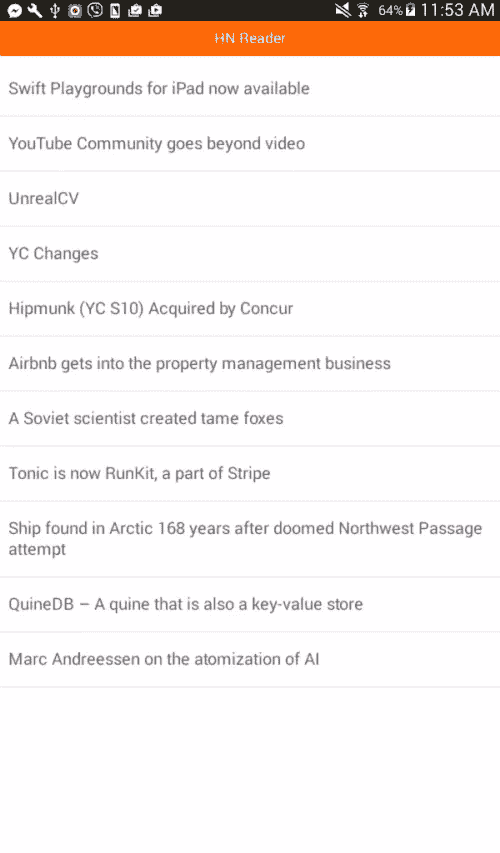
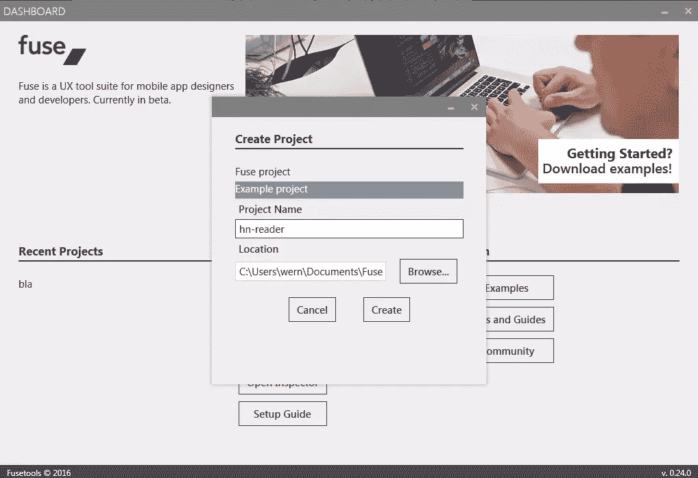
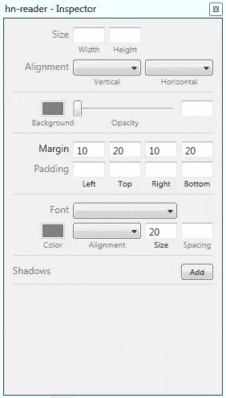
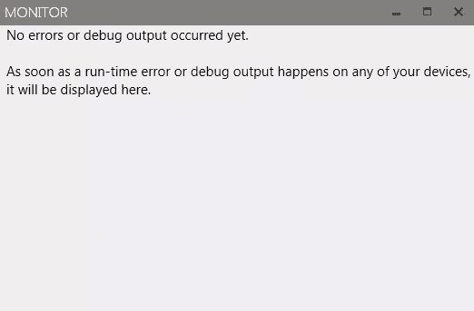

# Fuse 入门

> 原文：<https://www.sitepoint.com/getting-started-with-fuse/>

在本教程中，我们将使用 Fuse 创建一个黑客新闻阅读器应用程序，Fuse 是一个用于开发可以在 Android 和 iOS 设备上运行的跨平台应用程序的工具。你可以在 [Github](https://github.com/sitepoint-editors/fuse-hnreader) 上找到该项目的源代码。下面是最终输出的样子:



## 什么是导火索？

简而言之，Fuse 是一个使用 JavaScript 构建跨平台应用的工具。如果你熟悉 React Native 和 NativeScript，Fuse 背后的思想也非常相似。它使用 JavaScript VM 来运行 JavaScript，UI 组件被转换为本地 UI，并且它允许访问不同的平台 API。其背后的动机是创建一个对开发者和设计者都友好的工具。就我目前所见，我可以说他们真的走上了正轨。Fuse 的一些亮点包括原生 UI 性能、强大而富有表现力的动画以及跨多个设备的即时实时重新加载。

## 安装保险丝

要开始使用 Fuse，首先必须安装 Android 开发的 Android SDK 和 iOS 的 XCode。这里有两个链接可以帮你解决这个问题:

*   [快速提示:安装 Android SDK](https://www.sitepoint.com/quick-tip-installing-the-android-sdk/)
*   [下载 XCode](https://itunes.apple.com/us/app/xcode/id497799835?ls=1&mt=12)

如果您的机器之前已经设置了 Android 或 iOS 开发，您可以跳过这一步。

一旦你安装了 Android SDK 或 XCode，从[下载页面](https://www.fusetools.com/downloads)下载 Fuse 安装程序。只需输入您的电子邮件地址，接受许可协议，然后点击“让我们融合”按钮。一旦你完成了，它应该会向你显示为每个开发平台下载安装程序的按钮。下载适合你的。但是对于本教程，我们将使用 Windows 版本。

下载完 Fuse 安装程序后，单击它开始安装。安装程序还应该处理依赖项的安装，因此可能需要一段时间，这取决于您的互联网连接。

## 创建新项目

您可以通过启动 Fuse 仪表板并单击“new project”按钮来创建一个新项目。这将询问项目名称和保存项目的路径。



一旦项目被创建，它应该在仪表板中的“最近的项目”下列出。点击它，然后点击“在崇高文本 3 中打开”。Fuse 与 Sublime Text 有一些很好的集成，所以在使用 Fuse 项目时，我推荐使用它作为文本编辑器。但是为了让这些集成工作，你首先必须使用[包控制](https://packagecontrol.io/)安装[熔丝插件](https://github.com/fusetools/Fuse.SublimePlugin)。一旦安装，它应该添加像代码完成和显示构建结果这样的功能，这样你就能确切地知道你的代码出了什么问题。如果你是崇高文本的新手，你可以在这里下载。程序包控制安装说明可在[这里](https://packagecontrol.io/installation)找到。完成后，您可以通过按下键盘上的 **ctrl + shift + P** 并选择**包控制:安装包**来安装 Fuse 包。在那里，您可以搜索“Fuse”并选择显示的第一个结果。

## 开发工具

在我们创建应用程序之前。让我们先来看看 Fuse 附带的开发工具。知道如何使用这些工具将会帮你省去一路上的麻烦。

首先打开 *MainView.ux* 文件。它应该包含一些默认代码，您可以运行和摆弄。你可以通过进入 Fuse 仪表板，选择你的项目，点击“预览”按钮并选择“本地”。这将打开一个新的命令行窗口，启动预览工具。

预览工具允许您查看应用程序的外观。当您对代码进行更改时，预览也会随之更新。而且速度非常快，这使得 Fuse 成为一种乐趣，因为您可以在保存文件后立即看到您的更改。

启动预览后，您应该会看到默认的应用程序。你可以通过点击**熔丝- >设计模式**然后**熔丝- >打开检查器**对其进行修改。这将打开一个新窗口，允许您对在预览中选择的元素的样式进行更改。例如，您可以更改宽度、高度、背景颜色和字体大小。

请注意，在设计模式下，您不能与应用程序进行交互，因为它允许您更改在预览中选择的任何元素的样式。这就是为什么在设计模式下交互被锁定，以防止用户界面改变。



您可以使用的另一个工具是 Monitor 工具。点击**保险丝- >打开监视器**将其打开。这应该会显示一个新的窗口，记录所有发生在应用程序中的错误。您也可以通过从代码中调用`debug_log()`函数来记录您自己的日志。这个函数很像你习惯的浏览器中的`console.log()`。虽然你只能用它输出字符串。所以如果你想检查一个物体的内容，你必须使用`JSON.stringify()`。



您应该熟悉的另一个工具是构建结果。这与 Sublime 文本集成在一起，你可以通过点击屏幕左下方的方框图标找到它。它应该打开一个上下文菜单，选择“输出:FuseBuildResults ”,它将打开日志控制台，显示每次保存文件时的构建结果。如果你的代码有错误，应该会显示出来。这样你就知道你的代码出了什么问题，哪一行出了问题，这样你就可以修复它。测试您执行的最后一次更改是否导致了错误的一个好方法是，即使在添加新元素之后，UI 是否没有更新。


常见的错误包括组件的属性名错误，试图包含一个不可用的包，以及 JavaScript 代码中的语法错误。

## 构建应用程序

既然您已经熟悉了 Fuse 提供的工具，现在是时候构建应用程序了。如前所述，我们将建立一个黑客新闻阅读器应用程序。它将列出黑客新闻 API 的十大新闻，并允许用户查看每个新闻链接到的网页。

在 *MainView.ux* 仍然打开的情况下，清除所有默认代码。从添加`<app>`元素开始。Fuse 中的每一页都以这个元素开始。

```
</app><app>
</app>
```

创建应用程序范围内 JavaScript 文件的链接:

```
<javascript File="js/App.js"></javascript>
```

该文件位于项目根目录下的`js/`目录中，包含以下代码:

```
const app_title = 'HN Reader';
const Observable = require("FuseJS/Observable");
var current_page = Observable("news_items");
var current_url = Observable("");
var title = Observable(app_title);

function navigatePage(context) {
    if(context.data.url){
        current_url.value = context.data.url;
        title.value = context.data.title.substring(0, 20) + '...';
        current_page.value = 'web_page';
    }else{
        title.value = app_title;
        current_page.value = 'news_items';
    }
}

module.exports = {
    title: title,
    navigatePage: navigatePage,
    current_page: current_page,
    current_url: current_url
};
```

分解上面的代码，首先我们定义一些应用程序将使用的默认值。这包括将显示在页眉上的标题、用户当前正在查看的页面以及 WebView 使用的网页的 URL。这些值都使用`FuseJS/Observable`设置为可观察值，这是 Fuse 中的一个内置库，允许您使用双向数据绑定。这意味着当你改变代码中每个可观察变量的值时，它也会反映在用户界面上，反之亦然。

```
// js/App.js
const app_title = 'HN Reader';
const Observable = require("FuseJS/Observable");
var current_page = Observable("news_items");
var current_url = Observable("");
var title = Observable(app_title);
```

定义在新闻项目页面和实际新闻页面(WebView)之间导航的功能。这里，如果函数中传递的参数中存在`context.data.url`，我们将更新`current_url`的值。我们还从新闻标题中提取前 20 个字符，然后将`current_page`设置为`web_page`。这允许我们导航到显示 WebView 的页面。否则，将`current_page`设置为`news_items`页面，并将标题设置回应用程序的标题。

```
// js/App.js
function navigatePage(context) {
    if(context.data.url){
        current_url.value = context.data.url;
        title.value = context.data.title.substring(0, 20) + '...';
        current_page.value = 'web_page';
    }else{
        title.value = app_title;
        current_page.value = 'news_items';
    }
}
```

为了能够在 UI 中引用这些变量，您需要使用`module.exports`来使它们可用:

```
// js/App.js
module.exports = {
    title: title,
    navigatePage: navigatePage,
    current_page: current_page,
    current_url: current_url
};
```

回到`MainView.ux`文件，在`js/App.js`文件链接的正下方添加以下内容。该组件在页面间导航时自动处理过渡效果。

```
<pagecontrol Active="{current_page}">
</pagecontrol>
```

在里面，定义应用程序中使用的所有页面。这里我们只有两个:`news_items`和`web_page`。在前面的`<pagecontrol>`组件中，我们添加了一个`Active`属性，它的值是`current_page`变量的当前值。在`js/App.js`文件中，我们将它设置为`news_items`，这意味着它将使用新闻条目页面作为默认页面。如果您想导航到`web_page`页面，您可以简单地将`current_page`的值更新为`web_page`。Fuse 将自动为您处理过渡效果。默认情况下，它将使用滑动动画。

```
<page Name="news_items">
</page>

<page Name="web_page">
</page>
```

### 新闻项目页面

让我们先来看看新闻条目页面的内容。在这里，我们将所有内容都包装在`<dockpanel>`中。这允许我们将元素停靠在特定的位置。默认设置为`Fill`，占据整个屏幕。

```
</dockpanel><dockpanel>
</dockpanel>
```

接下来，链接到`js/NewsItems.js`文件。这是仅由新闻条目页面使用的 JavaScript。

```
<javascript File="js/NewsItems.js"></javascript> 
```

以下是该文件的内容:

```
const Observable = require("FuseJS/Observable");
var loader_opacity = Observable('1');

var news_items = Observable();  

const TOP_STORIES_URL = 'https://hacker-news.firebaseio.com/v0/topstories.json';          

var story_promises = [];

fetch(TOP_STORIES_URL)
.then(function(response) { return response.json(); })
.then(function(top_stories) {

    for(var x = 0; x < = 10; x++){
        const story_url = "https://hacker-news.firebaseio.com/v0/item/" + top_stories[x] + ".json";

        const p = fetch(story_url)
        .then(function(response) { return response.json(); })
        .then(function(news) { 
            news_items.add({
                title: news.title, 
                url: news.url,
                time: news.time
            }); 
        });  

        story_promises.push(p); 
    }

    Promise.all(story_promises).then(function(){
        loader_opacity.value = 0;
    });

})
.catch(function(error) {
    console.log('There has been a problem with your fetch operation: ' + error.message);
});

module.exports = {
    news_items: news_items,
    loader_opacity: loader_opacity
};
```

分解上面的代码，我们再次使用可观察库。请注意，Fuse 中的每个`<JavaScript>`组件实例都有自己的上下文，这意味着即使我们之前使用了`Observable`，它在这里也不可用。这同样适用于我们定义的任何可观察变量。

```
// js/NewsItems.js
const Observable = require("FuseJS/Observable");
```

设置加载器不透明度的值。这是当用户打开应用程序时，我们将向用户显示的加载动画的不透明度。我们需要将它默认设置为`1`,因为新闻条目需要首先从 API 加载。因此，当应用程序加载数据时，我们向用户显示动画。稍后，我们将把它的值更新为`0`,以隐藏它，不让用户看到。

```
// js/NewsItems.js
var loader_opacity = Observable('1');
```

初始化可观察列表:

```
// js/NewsItems.js
var news_items = Observable(); 
```

添加 Hacker News API 的 top stories 端点的 URL 和一个数组，用于存储每个`fetch()`调用将返回的承诺。

```
// js/NewsItems.js
const TOP_STORIES_URL = 'https://hacker-news.firebaseio.com/v0/topstories.json';          
var story_promises = [];
```

使用[获取 API](https://developer.mozilla.org/en/docs/Web/API/Fetch_API) 向 top stories 端点发出请求:

```
// js/NewsItems.js
fetch(TOP_STORIES_URL)
.then(function(response) { return response.json(); })
.then(function(top_stories) {

})
.catch(function(error) {
    console.log('There has been a problem with your fetch operation: ' + error.message);
});
```

这将返回一个数组，包含黑客新闻头条的 ID。我们只需要前十项，所以我们使用一个`for`循环来遍历前十项。在每次迭代中，为返回每个单独新闻条目的详细信息的端点构造 URL。一旦构建了 URL，就为每一个条目发出一个单独的请求，然后将其添加到我们之前创建的可观察列表中。每个承诺也被推送到`story_promises`数组。

```
// js/NewsItems.js
for(var x = 0; x < = 10; x++){
    const story_url = "https://hacker-news.firebaseio.com/v0/item/" + top_stories[x] + ".json";

    const p = fetch(story_url)
    .then(function(response) { return response.json(); })
    .then(function(news) { 
        news_items.add({
            title: news.title, 
            url: news.url
        }); 
    })
    .catch(function(error) {
        console.log('There has been a problem with your fetch operation: ' + error.message);
    });  

    story_promises.push(p); 
}
```

这使我们能够确定何时隐藏加载动画。`Promise.all`接受一个承诺数组，如果所有的承诺都被解析，那么传递给`then()`的函数就会被执行。这是我们隐藏加载器的地方，设置它的不透明度为`0`。

```
// js/NewsItems.js
Promise.all(story_promises).then(function(){
    loader_opacity.value = 0;
});
```

不要忘记在 UI 中导出您需要的值:

```
// js/NewsItems.js
module.exports = {
    news_items: news_items,
    loader_opacity: loader_opacity
};
```

回到`MainView.ux`文件，添加状态栏的占位符。这是因为 Fuse 自动占据了整个屏幕。如果不添加此项，状态栏将不可见。

```
<StatusBarBackground Dock="Top" />
```

使用`<stackpanel>`添加标题。在 Fuse 中，如果你想将一个`</stackpanel><stackpanel>`的子容器堆叠在另一个之上(垂直方向),可以使用这个容器。将它的`Dock`属性设置为`Top`，这样它就会被放置在状态栏的正下方。

```
</stackpanel><stackpanel Dock="Top" Color="#FF6600">
    <text FontSize="18" Margin="0,10,0,10" Alignment="VerticalCenter" TextAlignment="Center" TextColor="#FFF" Value="{title}"></text>
</stackpanel>
```

使用`<scrollview>`按钮，这样当新闻超过可用空间时，会自动生成一个垂直滚动条。在 Fuse 中，您使用`<each>`组件来生成一个列表。对于每个列表项，我们创建一个`<panel>`，当点击它时，执行我们之前定义的`navigatePage`函数。我们实际上不需要传递任何东西给这个函数，因为调用它的上下文是作为第一个参数自动传入的。这就是为什么我们在前面的`js/App.js`文件中检查了`context.data.url`的值。

```
<scrollview>
    <stackpanel Alignment="Top">
        <each Items="{news_items}">            
            <panel Clicked="{navigatePage}" Alignment="VerticalCenter">
                <text Margin="10,20,10,20" TextWrapping="Wrap" FontSize="20" Value="{title}"></text>
            </panel>
            <rectangle Height="1" Fill="#dcdee3"></rectangle>
        </each>
    </stackpanel>
</scrollview>
```

### 网页

我们现在转到网页的内容。就像新闻条目页面一样，我们将所有内容包装在一个`<dockpanel>`中，并添加了`<statusbarbackground>`。标题有点不同，因为这一次我们有一个`<text>`元素，当`Clicked`被按下时执行`navigatePage`按钮。因为这是从 UI 执行的，所以它也将传入`context.data`作为参数。唯一的区别是没有`url`，所以将执行`navigatePage`函数的`else`条件。这意味着它实际上会返回到新闻项目页面。

```
<dockpanel>
    <statusbarbackground Dock="Top"></statusbarbackground>
    <wrappanel Dock="Top" Color="#FF6600">
        <text FontSize="18" Margin="10,10,0,10" Alignment="Left" TextAlignment="Left" TextColor="#FFF" Value="Back" Width="100" Clicked="{navigatePage}"></text>

        <text FontSize="18" Alignment="VerticalCenter" TextAlignment="Center" TextColor="#FFF" Value="{title}"></text>
    </wrappanel>
</dockpanel>
```

通过提供一个`ux:Class`属性来定义一个可重用的组件。您赋予它的值将是从此组件继承的组件的名称。

```
<panel ux:Class="LoadingBar" Width="5%" Height="10" Color="#fc0" Alignment="Left"></panel>
```

使用您刚刚创建的组件。您定义的所有样式都会被该组件继承。这将作为网页的进度加载器。提供一个`ux:Name`,以便您稍后可以更改`Width`。

```
<loadingbar Dock="Top" ux:Name="_loadingBar"></loadingbar>
```

最后，使用`WebView`组件显示用户选择的新闻条目。注意，这个组件需要包装在一个`<nativeviewhost>`中，因为它使用设备中的本地 WebView。这也意味着你不能使用预览工具来测试它。还要注意`<progressanimation>`组件的使用。这允许我们在页面加载过程中将加载栏的值更改为`100%`。这让用户知道还要等多久页面才能完全加载。

```
<panel>             
    <nativeviewhost>
        <webview Dock="Fill" Url="{current_url}" ux:Name="webpage">
            <progressanimation>
                <change _loadingBar.Width="100%"></change>
            </progressanimation>
        </webview>
    </nativeviewhost>
</panel>
```

### 同步动画

正如你在上面看到的，Fuse 在动画方面确实很出色。作为奖励，让我们看看如何一口气实现两种动画。此部分是可选的。如果您愿意，可以跳到**运行应用程序**。

首先使用一个`<rectangle>`组件创建一个加载器盒。不要被它的命名所迷惑，你实际上可以通过将它的`Width`和`Height`设置为相同的值来创建一个正方形。在它里面定义了默认的缩放和旋转。缩放比例`Factor`设置为`1`，这意味着默认比例是您定义的`Width`和`Height`。旋转`Degrees`被设置为`0`，这意味着它不旋转。我们给每一个都添加了一个`ux:Name`属性，这样我们就可以使用动画时间轴来控制这些值。

```
</rectangle><rectangle Width="50" Height="50" Fill="#FA983C" Opacity="{loader_opacity}">
    <scaling ux:Name="loaderScale" Factor="1"></scaling>
    <rotation ux:Name="loaderRotate" Degrees="0"></rotation>
</rectangle>
```

接下来，我们为加载器框定义动画时间轴。`PlayMode="Wrap"`表示动画将无限执行。默认设置为`Once`，这意味着动画一旦结束就不会重新开始。要更改缩放和旋转的值，使用`Change`操作符。然后使用您之前添加到加载器框的动画属性中的`ux:Name`。在这里，我们将比例因子设置为 1.5，以将盒子的大小增加到其原始大小的一半。然后旋转 360 度。这两个动画在 1 秒钟内同时执行。您也可以指定`Easing`，但是我将把探索`QuadraticInOut`的功能留给您。

```
<timeline PlayMode="Wrap">
    <change loaderScale.Factor="1.5" Duration="1" Easing="QuadraticInOut"></change>
    <change loaderRotate.Degrees="360" Duration="1" Easing="QuadraticInOut"></change>
</timeline>
```

## 运行应用程序

您可以通过编译调试版本在设备上运行该应用程序:

```
fuse build --target=Android
```

一旦编译完成，您就可以找到*。 *build/Android/Debug* 目录下的 apk* 文件。将其复制到您的设备中，安装然后运行。

## 结论

就是这样！在本教程中，您了解了 Fuse，这是原生移动应用程序开发领域中一个激动人心的新工具。正如你所看到的，Fuse 确实让开发移动应用成为一种乐趣。这是由于以下特征:

*   超快速自动重装功能。这有助于提高设计人员和开发人员的工作效率。
*   使得构建可以在 iOS 和 Android 设备上运行的应用成为可能。
*   设计模式，使得通过 GUI 改变设计变得容易。
*   帮助开发人员调试应用程序的监控工具。
*   动画是使用声明性标记完成的。这使得设计师很容易实现动画。

目前，Fuse 仍处于测试阶段，因此它可能还不能用于复杂的项目。不过，如果你只需要构建像我们刚刚构建的简单应用程序，使用 Fuse 应该没有问题。

## 分享这篇文章