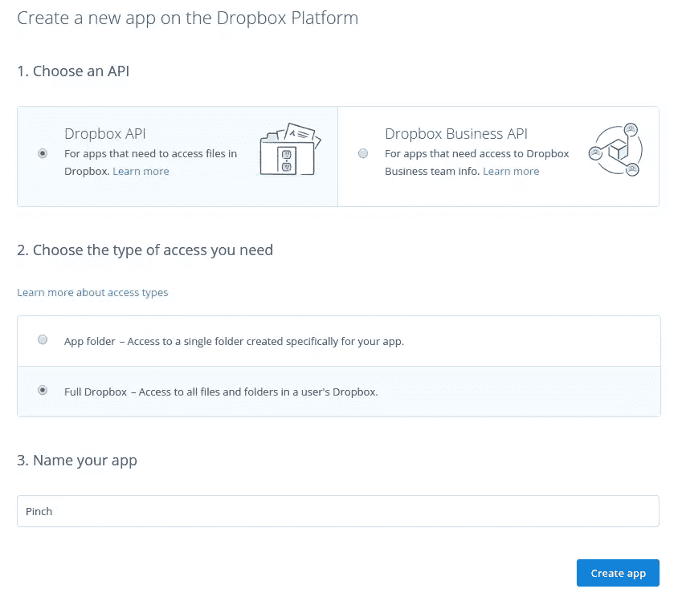
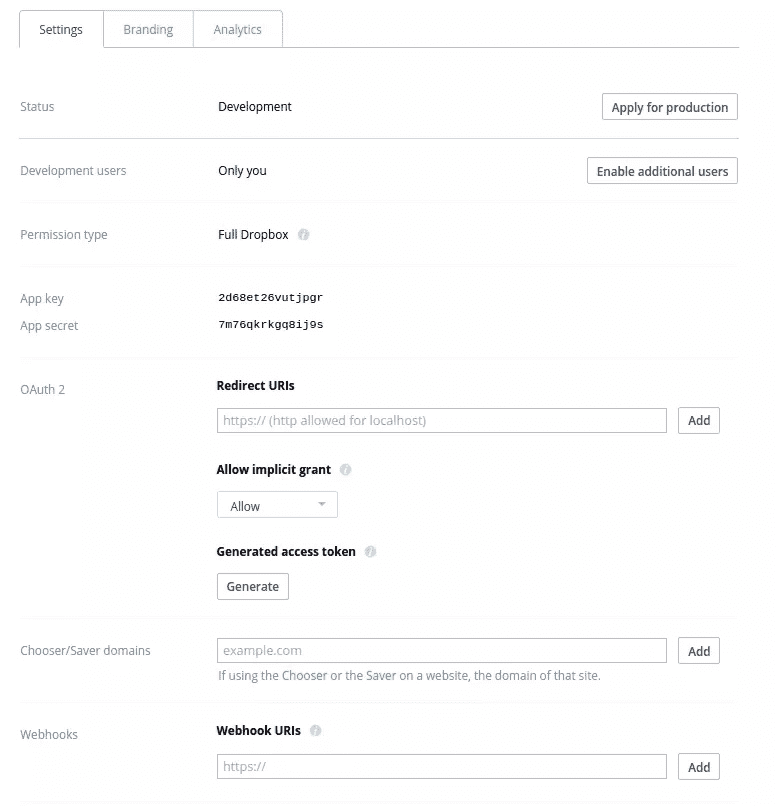

# 用 Dropbox API 构建自己的 Dropbox 客户端

> 原文：<https://www.sitepoint.com/build-your-own-dropbox-client-with-the-dropbox-api/>

有很多文件托管解决方案，但很少有东西能与 [Dropbox](http://dropbox.com) 相比，因为它简单、自动同步功能、跨平台支持和其他很酷的功能。


作为一名 PHP 开发人员，你甚至可以利用他们的 API 来创建能够充分发挥其功能的应用程序。在本文中，您将学习如何构建一个这样的应用程序，在用户的 Dropbox 帐户中执行不同的操作。在本教程中，您将使用 [Dropbox API 版本 2](https://www.dropbox.com/developers/documentation/http#documentation) 。如果您想跟进，您可以从 Github 克隆[项目](https://github.com/sitepoint-editors/pinch)。

## 创建 Dropbox 应用程序

你需要做的第一件事是去 [Dropbox 的开发者网站](https://www.dropbox.com/developers)和[创建一个新的应用](https://www.dropbox.com/developers/apps/create)。



Dropbox 提供了两个 API:面向公众的 Dropbox API 和面向团队的商业 API。这两个 API 非常相似，唯一的区别是 business API 专门用于业务帐户，因此默认情况下，团队功能(如团队信息访问、团队成员文件访问和团队成员管理)都包含在其中。我们将使用前者。

创建应用程序后，您将看到应用程序设置页面:



在这里，您可以设置以下内容:

*   **开发用户**–这允许你添加 Dropbox 用户来测试你的应用。默认情况下，应用程序的状态为*开发*。这意味着只有你能测试它的功能。如果您允许任何其他用户访问您的应用程序，他们将无法使用它。
*   **权限类型**–这是您之前创建应用程序时选择的设置。只有两种权限类型:文件夹和完全收存箱。文件夹意味着你的应用只能访问你指定的文件夹。完整的 Dropbox 意味着你的应用程序可以访问用户的所有文件。
*   **应用密钥和密码**这是 Dropbox 用来识别你的应用的唯一密钥。我们以后会需要这个。
*   **OAuth2 重定向 URL**–这是您可以设置 URL 的地方，在用户批准必要的权限后，您的应用程序可以立即重定向到这些 URL。暂时将其留空，稍后您将为其添加一个值。现在，请注意，只有您在这里指定的 URL 可以用于重定向。
*   **允许隐式授予**–一旦用户授予您的应用程序必要的权限，是否自动生成访问令牌。如果您在客户端使用 Dropbox，应该将它设置为*允许*，这样您就可以通过 JavaScript 获得一个访问令牌。出于这个项目的目的，您应该将其设置为*不允许*。
*   **生成的访问令牌**–您可以使用它为您的帐户生成一个访问令牌。当向 API 发出请求时，可以使用访问令牌。
*   **选择器/保护程序域**——如果你使用的是[插件](https://www.dropbox.com/developers-v1/dropins)，比如[选择器](https://www.dropbox.com/developers/chooser)和[保护程序](https://www.dropbox.com/developers/saver)，这就是你需要指定嵌入它们的域的地方。
*   Webhooks–如果您希望服务器在用户的 dropbox 帐户中的文件发生变化时执行特定的操作，您可以使用 web hooks。在本教程中你不会用到 webhooks，所以如果你需要应用程序中的功能，我建议你去查看一下 [webhooks 文档](https://www.dropbox.com/developers-v1/core/docs#webhooks)。

## 构建应用程序

现在，您已经准备好构建应用程序了。你将使用 [Laravel](https://laravel.com) 。

### 安装依赖项

```
composer create-project --prefer-dist laravel/laravel pinch 
```

一旦安装好，你还需要安装 [Guzzle](http://docs.guzzlephp.org/en/latest/quickstart.html) 、 [Purl](https://github.com/jwage/purl) 和 [Carbon](http://carbon.nesbot.com/) 。

```
composer require nesbot/carbon jwage/purl guzzlehttp/guzzle 
```

您将使用 Guzzle 向 Dropbox API 发出 HTTP 请求，使用 Purl 构造 Dropbox 登录 url，使用 Carbon 表示用户时区中的文件日期。

### 配置

一旦安装了 Laravel，打开项目根目录下的`.env`文件并添加 dropbox 配置:

```
DROPBOX_APP_KEY="YOUR DROPBOX APP KEY"
DROPBOX_APP_SECRET="YOUR DROPBOX APP SECRET"
DROPBOX_REDIRECT_URI="YOUR DROPBOX LOGIN REDIRECT URL" 
```

使用您之前从 Dropbox 开发者网站获得的应用密钥和应用密码作为`DROPBOX_APP_KEY`和`DROPBOX_APP_SECRET`的值。对于`DROPBOX_REDIRECT_URI`，你必须指定一个 http URL，所以如果你使用虚拟主机，你将需要使用类似 [Ngrok](https://www.sitepoint.com/use-ngrok-test-local-site/) 的东西来服务应用程序。然后，在您的虚拟主机配置中，添加 Ngrok 提供的 URL 作为`ServerAlias`。

```
<VirtualHost *:80>
        ServerName pinch.dev
        ServerAlias xxxxxxx.ngrok.io
        ServerAdmin wern@localhost
        DocumentRoot /home/wern/www/pinch/public
</VirtualHost> 
```

### 路线

应用程序中的不同页面在`app/Http/routes.php`文件中定义:

```
Route::get('/', 'HomeController@index');
Route::post('/', 'HomeController@postIndex');

Route::get('/login', 'HomeController@login');

Route::group(
    ['middleware' => ['admin']], 
    function($app){ 
        Route::get('/dashboard', 'AdminController@dashboard');

        Route::get('/user', 'AdminController@user');

        Route::get('/search', 'AdminController@search');

        Route::get('/upload', 'AdminController@upload');
        Route::post('/upload', 'AdminController@doUpload');

        Route::get('/revisions', 'AdminController@revisions');
        Route::get('/restore', 'AdminController@restoreRevision');

        Route::get('/download', 'AdminController@download');
}); 
```

分解上面的代码，首先是处理登录 Dropbox 的路由:

```
//displays the view for logging in to dropbox
Route::get('/', 'HomeController@index');

//generates the dropbox login URL
Route::post('/', 'HomeController@postIndex');

//generates the access token based on the token provided by Dropbox
Route::get('/login', 'HomeController@login'); 
```

管理页面被包装在一个路由组中，这样您可以使用一个中间件来检查访问它的用户是否登录。

```
Route::group(
    ['middleware' => ['admin']], 
    function($app){ 
        ...
}); 
```

在管理路由组中，您有服务于仪表板页面的路由。此页面包含您可以在应用程序中执行的每个不同操作的链接。

```
Route::get('/dashboard', 'AdminController@dashboard'); 
```

用户详细信息页面:

```
Route::get('/user', 'AdminController@user'); 
```

用于搜索文件的页面:

```
Route::get('/search', 'AdminController@search'); 
```

上传文件的页面:

```
Route::get('/upload', 'AdminController@upload');
Route::post('/upload', 'AdminController@doUpload'); 
```

查看特定文件不同版本的页面和恢复特定版本的页面:

```
Route::get('/revisions', 'AdminController@revisions');
Route::get('/restore', 'AdminController@restoreRevision'); 
```

最后，处理文件下载的途径是:

```
Route::get('/download', 'AdminController@download'); 
```

### 管理中间件

接下来是管理中间件(`app/Http/Middleware/AdminMiddleware.php`):

```
<?php 
namespace App\Http\Middleware;

use Closure;

class AdminMiddleware 
{
    public function handle($request, Closure $next)
    {
        if ($request->session()->has('access_token')) {
            return $next($request);
        }

        return redirect('/')
            ->with('message', ['type' => 'danger', 'text' => 'You need to login']);
    }
} 
```

上面的代码所做的是检查`access_token`是否已经在会话中被设置。如果还没有设置，只需重定向到主页，否则继续处理请求。

### Dropbox 类

Dropbox 类(`app/Dropbox.php`)用于初始化向 Dropbox 发出请求的 Guzzle 客户端。它有两种方法:`api`和`content`。`api`用于向 API 发出请求，`content`用于处理上传或下载文件等内容。

```
<?php
namespace App;

use GuzzleHttp\Client;

class Dropbox 
{
    public function api()
    {
        $client = new Client([
            'base_uri' => 'https://api.dropboxapi.com',
        ]);
        return $client;
    }

    public function content()
    {
        $client = new Client([
            'base_uri' => 'https://content.dropboxapi.com'
        ]);

        return $client;
    }

} 
```

### 家庭控制器

`HomeController`包含了主页的逻辑。在这里，您可以添加登录 Dropbox 并获取访问令牌的代码，应用程序可以使用该令牌向 API 发出请求。

打开`app/Http/Controllers/HomeController.php`文件:

```
<?php
namespace App\Http\Controllers;

use Purl\Url;
use App\Dropbox;
use Illuminate\Http\Request;

class HomeController extends Controller
{
    private $api_client;

    public function __construct(Dropbox $dropbox)
    {
        $this->api_client = $dropbox->api();
    }

    public function index()
    {
        return view('index');
    }

    public function postIndex()
    {
        $url = new Url('https://www.dropbox.com/1/oauth2/authorize');

        $url->query->setData([
            'response_type' => 'code',
            'client_id' => env('DROPBOX_APP_KEY'),
            'redirect_uri' => env('DROPBOX_REDIRECT_URI')
        ]);

        return redirect($url->getUrl());
    }

    public function login(Request $request)
    {
        if ($request->has('code')) {

            $data = [
                'code' => $request->input('code'),
                'grant_type' => 'authorization_code',
                'client_id' => env('DROPBOX_APP_KEY'),
                'client_secret' => env('DROPBOX_APP_SECRET'),
                'redirect_uri' => env('DROPBOX_REDIRECT_URI')
            ];

            $response = $this->api_client->request(
                'POST',
                '/1/oauth2/token',
                ['form_params' => $data]
            );

            $response_body = json_decode($response->getBody(), true);
            $access_token = $response_body['access_token'];

            session(['access_token' => $access_token]);

            return redirect('dashboard');
        }

        return redirect('/');
    }
} 
```

分解上面的代码，定义一个名为`$api_client`的私有变量。这存储了对通过调用`Dropbox`类中的`api`方法返回的 Guzzle 客户端的引用。

```
private $api_client;

public function __construct(Dropbox $dropbox)
{
    $this->api_client = $dropbox->api();
} 
```

`index`方法返回索引视图:

```
public function index()
{
    return view('index');
} 
```

索引视图(`resources/views/index.blade.php`)包含允许用户登录 Dropbox 的表单。它还有一个隐藏字段，用于 CSRF 令牌(用于防止跨站点请求伪造攻击)。

```
@extends('layouts.default')

@section('content')
<form method="POST">
    <input type="hidden" name="_token" value="{{{ csrf_token() }}}" />
    <button class="button">Login with Dropbox</button>
</form>
@stop 
```

索引视图继承了默认模板(`resources/views/layouts/default.blade.php`)。在`#wrapper` div 内部是呈现登录表单的地方。

```
<!DOCTYPE html>
<html lang="en">
<head>
    <meta charset="UTF-8">
    <title>{{ env('APP_TITLE') }}</title>
    <link rel="stylesheet" href="{{ url('assets/lib/picnic/picnic.min.css') }}">
    <link rel="stylesheet" href="{{ url('assets/css/style.css') }}">
</head>
<body>
    <div id="wrapper">
        <h1>{{ env('APP_TITLE') }}</h1>
        @yield('content')
    </div>
</body>
</html> 
```

这个模板使用[野餐 css](http://www.picnicss.com/) 让事情看起来更好。主样式表(`public/assets/css/style.css`)包含主包装器和警告框的一些基本样式:

```
#wrapper {
    width: 900px;
    margin: 0 auto;
}

.alert {
    padding: 20px;
}

.alert-danger {
    background-color: #F55;
}

.alert-success {
    background-color: #60B152;
} 
```

回到`HomeController`:您有一个`postIndex`方法，它负责生成 Dropbox 登录 URL。这是您使用 Purl 库构建登录 url 的地方。

```
public function postIndex()
{
    $url = new Url('https://www.dropbox.com/1/oauth2/authorize');

    $url->query->setData([
        'response_type' => 'code',
        'client_id' => env('DROPBOX_APP_KEY'),
        'redirect_uri' => env('DROPBOX_REDIRECT_URI')
    ]);

    return redirect($url->getUrl());
} 
```

以下是登录 URL 所需的查询参数:

*   `response_type`–您指定的重定向 URL 后面会追加什么样的 Dropbox。这可以具有值`token`或`code`。使用`token`意味着访问令牌将作为重定向 URL 中的散列来传递。这对客户端应用程序很有用，但在这种情况下没用，因为你主要在服务器端工作，所以用`code`代替。这会将一个唯一的代码作为查询参数传递给重定向 URL。然后，该代码可用于交换访问令牌。请注意，如果您在应用程序设置中禁用了隐式授权，则不能拥有`token`的`response_type`。
*   `client_id`–您的 Dropbox 应用密钥。
*   `redirect_uri`–这可能是您在应用程序设置中指定的重定向 URL 之一。

完成后，重定向到 Purl 生成的最终 URL。

接下来是`login`方法。它负责处理您指定的重定向 URL 中的请求。这是授权码被传递的地方。您可以通过使用`Request`类来获取代码，因此您要将它注入到`login`方法中。

```
public function login(Request $request)
{
    ...
} 
```

在方法内部，检查`code`是否被传递到 URL 中。如果不是，重定向回主页。

```
if ($request->has('code')) {
    ...
}

return redirect('/'); 
```

接下来，添加 API 端点获取访问令牌所需的所有参数。这包括在 URL 中传递的授权码`code`。`grant_type`总是`authorization_code`:这是 URL 中传递的代码，您可以用它来交换访问令牌。`client_id`和`client_secret`是 Dropbox 应用的密钥和秘密。`redirect_uri`是重定向的 URL。

```
$data = [
    'code' => $request->input('code'),
    'grant_type' => 'authorization_code',
    'client_id' => env('DROPBOX_APP_KEY'),
    'client_secret' => env('DROPBOX_APP_SECRET'),
    'redirect_uri' => env('DROPBOX_REDIRECT_URI')
]; 
```

向`/1/oauth2/token`端点发出`POST`请求，并将`$data`作为表单参数传递:

```
$response = $this->api_client->request(
    'POST', 
    '/1/oauth2/token', 
    [
        'form_params' => $data
        ...
    ]
)); 
```

从响应正文中提取访问令牌，在会话中设置它，然后重定向到管理仪表板页面:

```
$response_body = json_decode($response->getBody(), true);
$access_token = $response_body['access_token'];

session(['access_token' => $access_token]);

return redirect('dashboard'); 
```

### 管理控制器

用户登录后，所有请求都由包含以下代码的`AdminController` ( `app/Http/Controllers/AdminController.php`)处理:

```
<?php
namespace App\Http\Controllers;

use App\Dropbox;
use Illuminate\Http\Request;

class AdminController extends Controller
{
    private $api_client;
    private $content_client;
    private $access_token;

    public function __construct(Dropbox $dropbox)
    {
        $this->api_client = $dropbox->api();
        $this->content_client = $dropbox->content();
        $this->access_token = session('access_token');
    }

    public function dashboard()
    {
        return view('admin.dashboard');
    }

    public function user()
    {
        $response = $this->api_client->request('POST', '/2/users/get_current_account', [
            'headers' => [
                'Authorization' => 'Bearer ' . $this->access_token
            ]
        ]);

        $user = json_decode($response->getBody(), true);

        $page_data = [
            'user' => $user
        ];

        return view('admin.user', $page_data);
    }

    public function search(Request $request)
    {
        $page_data = [
            'path' => '',
            'query' => '',
            'matches' => []
        ];

        if ($request->has('path') && $request->has('query')) {
            $path = $request->input('path');
            $query = $request->input('query');

            $data = json_encode(
                [
                    'path' => $path,
                    'mode' => 'filename',
                    'query' => $query
                ]
            );

            $response = $this->api_client->request(
                'POST', '/2/files/search',
                [
                    'headers' => [
                        'Authorization' => 'Bearer ' . $this->access_token,
                        'Content-Type' => 'application/json'
                    ],
                    'body' => $data
            ]);

            $search_results = json_decode($response->getBody(), true);
            $matches = $search_results['matches'];

            $page_data = [
                'path' => $path,
                'query' => $query,
                'matches' => $matches
            ];
        }

        return view('admin.search', $page_data);
    }

    public function revisions(Request $request)
    {
        if ($request->has('path')) {
            $path = $request->input('path');
            $data = json_encode([
                'path' => $path
            ]);

            $response = $this->api_client->request(
                'POST', '/2/files/list_revisions',
                [
                    'headers' => [
                        'Authorization' => 'Bearer ' . $this->access_token,
                        'Content-Type' => 'application/json'
                    ],
                'body' => $data
            ]);

            $revisions = json_decode($response->getBody(), true);

            $page_data = [
                'revisions' => $revisions['entries'],
                'path' => $path
            ];

            return view('admin.revisions', $page_data);

        } else {
            return redirect('search');
        }
    }

    public function restoreRevision(Request $request)
    {
        if ($request->has('path') && $request->has('rev')) {

            $path = $request->input('path');
            $rev = $request->input('rev');

            $data = json_encode([
                'path' => $path,
                'rev' => $rev
            ]);

            $response = $this->api_client->request(
                'POST', '/2/files/restore',
                [
                    'headers' => [
                        'Authorization' => 'Bearer ' . $this->access_token,
                        'Content-Type' => 'application/json'
                    ],
                    'body' => $data
            ]);

            $response_data = json_decode($response->getBody(), true);

            if (!empty($response_data)) {
                return redirect("revisions?path={$path}")
                    ->with('message', [
                        'type' => 'success',
                        'text' => "File has been restored to the following revision: {$response_data['rev']}"
                    ]);
            } else {
                return redirect("revisions?path={$path}")
                    ->with('message', [
                        'type' => 'danger',
                        'text' => 'The revision request failed. Please try again'
                    ]);
            }

        } else {
            return redirect('search');
        }
    }

    public function download(Request $request)
    {
        if ($request->has('path')) {
            $path = $request->input('path');
            $data = json_encode([
                'path' => $path
            ]);

            $response = $this->content_client->request(
                'POST',
                '/2/files/download',
                [
                    'headers' => [
                        'Authorization' => 'Bearer ' . $this->access_token,
                        'Dropbox-API-Arg' => $data
                    ]
            ]);

            $result = $response->getHeader('dropbox-api-result');
            $file_info = json_decode($result[0], true);

            $content = $response->getBody();

            $filename = $file_info['name'];
            $file_extension = substr($filename, strrpos($filename, '.'));
            $file = uniqid() . $file_extension;

            $file_size = $file_info['size'];

            return response($content)
                ->header('Content-Description', 'File Transfer')
                ->header('Content-Disposition', "attachment; filename={$file}")
                ->header('Content-Transfer-Encoding', 'binary')
                ->header('Connection', 'Keep-Alive')
                ->header('Content-Length', $file_size);
        } else {
            return redirect('search');
        }
    }

    public function upload()
    {
        return view('admin.upload');
    }

    public function doUpload(Request $request)
    {
        if ($request->hasFile('file') && $request->has('path')) {

            $valid_mimetypes = [
                'image/png', 'image/jpeg', 'image/jpg', 'image/gif', 'image/bmp'
            ];

            $valid_size = 5000000; //5Mb

            $mime_type = $request->file('file')->getMimeType();
            $size = $request->file('file')->getSize();
            $filename = $request->file('file')->getClientOriginalName();
            $path = $request->input('path') . '/' . $filename;

            if (in_array($mime_type, $valid_mimetypes) && $size <= $valid_size) {

                $data = json_encode([
                    'path' => $path,
                    'mode' => 'add',
                    'autorename' => true,
                    'mute' => false
                ]);

                $response = $this->content_client->request(
                    'POST', '/2/files/upload',
                    [
                        'headers' => [
                            'Authorization' => 'Bearer ' . $this->access_token,
                            'Content-Type' => 'application/octet-stream',
                            'Dropbox-API-Arg' => $data
                        ],
                        'body' => fopen($request->file('file'), 'r')
                ]);

                $response_data = json_decode($response->getBody(), true);

                if (!empty($response_data['name'])) {

                    $name = $response_data['name'];
                    return redirect('upload')
                        ->with('message', [
                            'type' => 'success',
                            'text' => "File with the name {$name} was uploaded!"
                        ]);
                }

            }

        }

        return redirect('upload')
                    ->with('message', [
                        'type' => 'danger',
                        'text' => 'There was a problem uploading the file'
                    ]);
    }
} 
```

分解上面的代码，在类中声明三个私有变量，并在构造函数中初始化它们。它们是 API 客户端、内容客户端和访问令牌。

```
private $api_client;
private $content_client;
private $access_token;

public function __construct(Dropbox $dropbox)
{
    $this->api_client = $dropbox->api();
    $this->content_client = $dropbox->content();
    $this->access_token = session('access_token');
} 
```

接下来是提供仪表板视图的方法:

```
public function dashboard()
{
    return view('admin.dashboard');
} 
```

仪表板视图(`resources/views/admin/dashboard.blade.php`)包含以下代码。它链接到允许用户在 API 中执行不同操作的所有页面:

```
@extends('layouts.admin')
@section('content')
<h3>What do you like to do?</h3>
<ul>
    <li><a href="/user">View User Info</a></li>
    <li><a href="/search">Search Files</a></li>
    <li><a href="/upload">Upload Files</a></li>
</ul>
@stop 
```

由`AdminController`提供的所有视图都继承自管理模板(`resources/views/layouts/admin.blade.php`)。就像前面的默认模板一样，它使用了野餐 css 和一些基本样式。唯一的区别是你在页面中包含了`alert`部分。

```
<!DOCTYPE html>
<html lang="en">
<head>
    <meta charset="UTF-8">
    <title>{{ env('APP_TITLE') }}</title>
    <link rel="stylesheet" href="{{ url('assets/lib/picnic/picnic.min.css') }}">
    <link rel="stylesheet" href="{{ url('assets/css/style.css') }}">
</head>
<body>
    <div id="wrapper">
        <h1>{{ env('APP_TITLE') }}</h1>
        @include('partials.alert')
        @yield('content')
    </div>
</body>
</html> 
```

`alert` partial ( `resources/views/partials/alert.blade.php`)用于输出会话中刷新的任何数据(请求完成后立即删除的临时数据)。警报部分包含以下代码:

```
@if(session('message'))
    <div class="alert alert-{{ session('message.type') }}">
        {{ session('message.text') }}
    </div>
@endif 
```

#### 获取用户数据

回到`AdminController`，你有`user`方法。这是向 API 端点发出一个`POST`请求，返回当前用户的数据。这个数据然后被传递到`user`视图(`resources/views/admin/user.blade.php`)。

```
public function user()
{
    $response = $this->api_client->request('POST', '/2/users/get_current_account', [
        'headers' => [
            'Authorization' => 'Bearer ' . $this->access_token
        ]
    ]);

    $user = json_decode($response->getBody(), true);

    $page_data = [
        'user' => $user
    ];

    return view('admin.user', $page_data);
} 
```

用户视图显示用户数据，如帐户 ID、姓名和电子邮件:

```
@extends('layouts.admin')
@section('content')
<h3>User Info</h3>
<ul>
    <li>Account ID: {{ $user['account_id'] }}</li>
    <li>Name: {{ $user['name']['display_name'] }}</li>
    <li>Email: {{ $user['email'] }}</li>
    <li>Referral Link: <a href="{{ $user['referral_link'] }}">{{ $user['referral_link'] }}</a></li>
    <li>Account Type: {{ $user['account_type']['.tag'] }}</li>
</ul>
@stop 
```

#### 搜索文件

接下来是呈现用户 Dropbox 帐户中搜索文件的视图的方法:

```
public function search(Request $request)
{
    ...
} 
```

在方法内部，初始化默认页面数据:

```
$page_data = [
    'path' => '',
    'query' => '',
    'matches' => []
]; 
```

检查`path`和`query`是否作为查询参数被传递。`path`是执行搜索的路径。这需要是用户的 Dropbox 中的现有路径(例如`/Files`、`/Documents`、`/Public`)。正斜杠是必要的，表示您从根目录开始。`query`是用户想要查找的文件的名称。这不必是确切的文件名。

```
if ($request->has('path') && $request->has('query')) {
    ...
} 
```

如果`path`和`query`存在，将它们赋给自己的变量，并将它们添加到搜索请求所需的 JSON 编码数据中。您传递的`mode`是您想要执行的搜索类型。这可以是`filename`、`filename_and_content`或`deleted_filename`。

```
$path = $request->input('path');
$query = $request->input('query');

$data = json_encode(
    [
        'path' => $path,
        'mode' => 'filename',
        'query' => $query
    ]
); 
```

发送请求:

```
$response = $this->api_client->request(
    'POST', '/2/files/search', 
    [
        'headers' => [
            'Authorization' => 'Bearer ' . $this->access_token,
            'Content-Type' => 'application/json'
        ],
        'body' => $data
]); 
```

得到响应后，提取响应体，将其转换为数组，然后提取找到的匹配项。`path`和`query`也被传入，这样用户就可以看到当前的查询是什么。

```
$search_results = json_decode($response->getBody(), true);
$matches = $search_results['matches'];

$page_data = [
    'path' => $path,
    'query' => $query,
    'matches' => $matches
]; 
```

呈现搜索视图:

```
return view('admin.search', $page_data); 
```

搜索视图(`resources/views/admin/search.blade.php`)包含以下内容:

```
@extends('layouts.admin')
@section('content')
<h3>Search</h3>
<form method="GET">
    <p>
        <label for="path">Path</label>
        <input type="text" name="path" id="path" value="{{ $path }}">
    </p>
    <p>
        <label for="query">Query</label>
        <input type="search" name="query" id="query" value="{{ $query }}">
    </p>
    <button>Search</button>
</form>

@if(count($matches) > 0)
<h5>Search Results</h5>
<table>
    <thead>
        <tr>
            <th>Filename</th>
            <th>Revisions</th>
            <th>Download</th>
        </tr>
    </thead>
    <tbody>
        @foreach($matches as $match)
        <tr>
            <td>{{ $match['metadata']['name'] }}</td>
            <td><a href="/revisions?path={{ urlencode($match['metadata']['path_lower']) }}">view</a></td>
            <td><a href="/download?path={{ urlencode($match['metadata']['path_lower']) }}">download</a></td>
        </tr>
        @endforeach
    </tbody>
</table>
@endif
@stop 
```

从上面的代码中，您可以看到您有一个通过`GET`方法提交数据的表单。如果`$matches`的数量大于 0，则渲染搜索结果表。该表显示文件名、显示文件修订的链接和下载文件的下载链接。在这两个链接中，您传递的是小写版本的文件路径，因为它是修订和下载请求的必需参数。

#### 文件修订

方法负责列出一个文件的不同版本。这将检查`path`是否出现在请求中，如果没有，就重定向回搜索页面。

```
public function revisions(Request $request)
{
    if ($request->has('path')) {
        ...
    } else {
        return redirect('search');
    }
} 
```

否则，它使用`path`作为请求的参数:

```
$path = $request->input('path');

$data = json_encode([
    'path' => $path
]); 
```

然后，发出请求，从响应体中提取数据，将其转换为数组，并作为数据传递给`revisions`视图。

```
$response = $this->api_client->request(
    'POST', '/2/files/list_revisions', 
    [
        'headers' => [
            'Authorization' => 'Bearer ' . $this->access_token,
            'Content-Type' => 'application/json'
        ],
    'body' => $data
]);

$revisions = json_decode($response->getBody(), true);

$page_data = [
    'revisions' => $revisions['entries'],
    'path' => $path
];

return view('admin.revisions', $page_data); 
```

`revisions`视图(`resources/views/admin/revisions.blade.php`)输出文件路径并显示一个包含修订细节的表格，比如修订 ID(每次文件被修订时由 Dropbox 分配的唯一 ID)、修改时间戳、文件的大小(以字节为单位)以及用于恢复特定修订的链接。

```
@extends('layouts.admin')
@section('content')
<h3>Revisions</h3>
<strong>File: </strong> {{ $path }}
<table>
    <thead>
        <tr>
            <th>Revision ID</th>
            <th>Modified</th>
            <th>Size (Bytes)</th>
            <th>Restore</th>
        </tr>
    </thead>
    <tbody>
        @foreach($revisions as $rev)
        <tr>
            <td>{{ $rev['rev'] }}</td>
            <td>{{ Carbon\Carbon::parse($rev['server_modified'])->setTimezone(env('APP_TIMEZONE'))->toDayDateTimeString() }}</td>
            <td>{{ $rev['size'] }}</td>
            <td><a href="/restore?path={{ urlencode($rev['path_lower']) }}&rev={{ $rev['rev'] }}">restore</a></td>
        </tr>
        @endforeach
    </tbody>
</table>
@stop 
```

请注意，这是您使用 Carbon 库将时间戳表示为添加到`.env`文件中的时区的地方。还要注意，小写文件路径和修订 ID 作为查询参数传递给路由，用于恢复特定的文件修订。

#### 恢复修订

方法列出了一个文件的不同版本。API 端点`/2/files/restore`需要文件路径和修订 ID，所以您检查它们是否在请求中被传递。如果没有，那么只需重定向回搜索页面。

```
public function restoreRevision(Request $request)
{
    if ($request->has('path') && $request->has('rev')) {
        ...
    } else {
        return redirect('search');
    }
} 
```

如果传递了路径和修订 ID，则将它们添加到请求参数中，然后发出请求:

```
$path = $request->input('path');
$rev = $request->input('rev');

$data = json_encode([
    'path' => $path,
    'rev' => $rev
]);

$response = $this->api_client->request(
    'POST', '/2/files/restore', 
    [
        'headers' => [
            'Authorization' => 'Bearer ' . $this->access_token,
            'Content-Type' => 'application/json'
        ],
        'body' => $data
]); 
```

一旦获得响应数据，检查它是否为空，这意味着修订请求已经完成。如果发生这种情况，用成功消息重定向回来。如果没有，返回一条错误消息。为了测试这一点，你可以在你的机器上打开 Dropbox 应用程序。它应该立即同步恢复的版本，如果它完成了。

```
$response_data = json_decode($response->getBody(), true);

if (!empty($response_data)) {

    return redirect("revisions?path={$path}")
        ->with('message', [
            'type' => 'success',
            'text' => "File has been restored to the following revision: {$response_data['rev']}"
        ]);
} else {

    return redirect("revisions?path={$path}")
        ->with('message', [
            'type' => 'danger',
            'text' => 'The revision request failed. Please try again'
        ]);
} 
```

### 下载文件

接下来是处理下载请求的方法。就像您到目前为止使用的其他方法一样，这个方法也需要文件路径。

```
public function download(Request $request)
{
    if ($request->has('path')) {
        ...
    } else {
        return redirect('search');
    }
} 
```

如果路径存在，将其添加到请求参数中:

```
$path = $request->input('path');

$data = json_encode([
    'path' => $path
]); 
```

然后，执行请求。注意，这次您没有向请求体传递任何东西。相反，您在`Dropbox-API-Arg`请求头中传递它。

```
$response = $this->content_client->request(
    'POST', 
    '/2/files/download', 
    [
        'headers' => [
            'Authorization' => 'Bearer ' . $this->access_token,
            'Dropbox-API-Arg' => $data
        ]
]); 
```

从这个请求中得到的响应体是文件本身的二进制数据。文件信息在响应头中传递，所以使用 Guzzle 提供的`getHeader`方法以数组的形式提取头数据。文件信息作为 JSON 字符串存储在第一项中，所以使用`json_decode`将其转换为数组。

```
$result = $response->getHeader('dropbox-api-result');
$file_info = json_decode($result[0], true); 
```

提取文件内容，生成用于下载的文件名，并获取文件大小:

```
$content = $response->getBody();

$filename = $file_info['name'];
$file_extension = substr($filename, strrpos($filename, '.'));
$file = uniqid() . $file_extension;

$file_size = $file_info['size']; 
```

返回响应数据并添加必要的标头，以便浏览器将其视为下载请求。请注意，`uniqid`函数用于生成文件名。这是因为您在头中传递文件名，任何非法字符都可能导致下载请求失败，所以这是一种安全措施。

```
return response($content)
    ->header('Content-Description', 'File Transfer')
    ->header('Content-Disposition', "attachment; filename={$file}")
    ->header('Content-Transfer-Encoding', 'binary')
    ->header('Connection', 'Keep-Alive')
    ->header('Content-Length', $file_size); 
```

### 上传文件

现在继续你可以在这个应用程序中执行的最后一个操作:文件上传。首先，渲染`upload`视图:

```
public function upload()
{
    return view('admin.upload');
} 
```

`upload`视图(`resources/views/admin/upload.blade.php`)有一个表单，询问文件上传的路径和文件本身。

```
@extends('layouts.admin')
@section('content')
<h3>Upload</h3>
<form method="POST" enctype="multipart/form-data">
    <input type="hidden" name="_token" value="{{{ csrf_token() }}}" />
    <p>
        <label for="path">Path</label>
        <input type="text" name="path" id="path">
    </p>
    <p>
        <label for="file">File</label>
        <input type="file" name="file" id="file">
    </p>
    <button>upload</button>
</form>
@stop 
```

一旦提交了表单，就会通过`doUpload`方法进行处理。这将检查文件是否已经上传，以及路径是否已经指定。如果尚未设置，请重定向回带有错误消息的上传页面。

```
public function doUpload(Request $request)
{
    if ($request->hasFile('file') && $request->has('path')) {
        ...
    }

    return redirect('upload')
                ->with('message', [
                    'type' => 'danger',
                    'text' => 'There was a problem uploading the file'
                ]);
} 
```

如果路径和文件存在，请指定有效的 mime 类型和有效的文件大小:

```
$valid_mimetypes = [
    'image/png', 'image/jpeg', 'image/jpg', 'image/gif', 'image/bmp'
];

$valid_size = 5000000; //5Mb 
```

获取文件信息:

```
$mime_type = $request->file('file')->getMimeType();
$size = $request->file('file')->getSize();

$filename = $request->file('file')->getClientOriginalName();

$path = $request->input('path') . '/' . $filename; 
```

检查文件是否具有有效的 mime 类型和大小。如果是，添加请求参数。这包括用户收存箱中文件将被保存到的位置`path`。`mode`是文件已经存在时要执行的操作。这个值可以是`add`、`overwrite`或`update`。`add`表示文件将被添加，但 Dropbox 会在文件名后添加一个数字(`file (2).txt`、`file (3).txt`等)。).接下来是`autorename`，如果`mode`被设置为`add`，它应该总是被设置为`true`。这样，如果已经存在同名文件，新文件将自动重命名。最后一个选项是`mute`，它只是告诉 Dropbox 是否通知用户。该选项的默认值是`false`，这意味着当文件上传时，用户会收到 Dropbox 应用程序的通知。如果设置为`true`，则不发送通知。

```
if (in_array($mime_type, $valid_mimetypes) && $size <= $valid_size) {

    $data = json_encode([
        'path' => $path,
        'mode' => 'add',
        'autorename' => true,
        'mute' => false
    ]);

} 
```

发出文件上传请求。注意，这使用的是内容客户端，而不是 API 客户端，因为您处理的是文件而不是数据。上传选项作为 JSON 字符串在`Dropbox-API-Arg`头中传递，而文件本身的二进制数据在请求体中传递。在向请求体传递二进制数据时，还要将`Content-Type`指定为`application/octet-stream`。

```
$response = $this->content_client->request(
    'POST', '/2/files/upload', 
    [
        'headers' => [
            'Authorization' => 'Bearer ' . $this->access_token,
            'Content-Type' => 'application/octet-stream',
            'Dropbox-API-Arg' => $data
        ],
        'body' => fopen($request->file('file'), 'r')
]); 
```

一旦得到响应，就将其转换为数组并检查文件名。如果存在，重定向回上传页面并通知用户文件已上传。

```
$response_data = json_decode($response->getBody(), true);

if (!empty($response_data['name'])) {

    $name = $response_data['name'];

    return redirect('upload')
        ->with('message', [
            'type' => 'success',
            'text' => "File with the name {$name} was uploaded!"
        ]);
} 
```

## 结论

在本文中，您已经学习了如何在 PHP 中使用 Dropbox API。具体来说，您已经学会了如何登录 Dropbox，获取当前用户的信息，搜索文件，列出文件修订，恢复修订，下载文件，最后上传文件。

你只是看了一眼可以用 Dropbox API 做的一些事情，所以如果你想了解更多，我建议你去查看一下[文档](https://www.dropbox.com/developers/documentation/http)。

有问题吗？评论？把它们放在喜欢按钮下面！

## 分享这篇文章