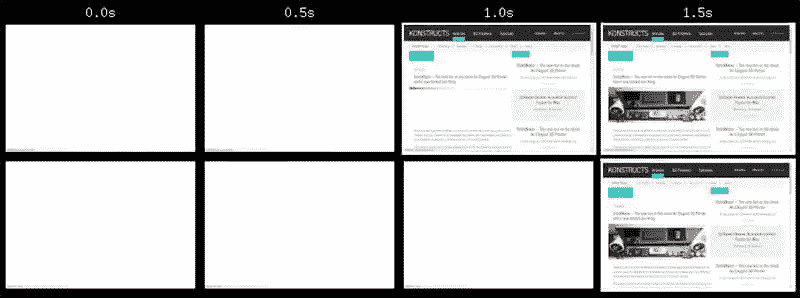

# 如何以及为什么你应该内联你的关键 CSS

> 原文：<https://www.sitepoint.com/how-and-why-you-should-inline-your-critical-css/>


在互联网的早期，网站主要用于显示基于文本的信息。慢慢地，我们的连接速度提高了，用户能够相当快地下载高分辨率的图像和视频。现在网站不仅仅是以文本的形式提供必要的信息。网站变得越来越复杂，有 CSS 和 JavaScript 框架，大量插件等等。所有这些都在运行中，加载所有必需的文件可能需要一些时间。

更快的网站可以带来更好的用户体验，这对网站的成功有着巨大的影响。开发人员可以做些什么来开始进行性能改进？开发人员可以做的一件非常有帮助的事情是内联关键 CSS 并异步加载非关键 CSS。在本文中，我们将逐一讨论这些要点，并帮助您提高网站的性能。

## 什么是临界 CSS？

你的项目中的关键 CSS 是用来设计你的网站内容风格的 CSS。文件夹上的内容是用户首先在你的网站上看到的，它可以包括导航和其他元素。因此，尽快恰当地设计和渲染网站的这一部分非常重要。

我想在这里提到的一件事是，你的访问者可能会使用各种不同视窗的设备来访问你的网站。因此，折叠以上的内容本身不会有太大的帮助。为了解决这个问题，你还应该考虑任何与基本布局和排版相关的 CSS 也是至关重要的。

现代 web 开发实践经常建议您内联您的关键 CSS。它会像这样放在你的网页上:

```
<!doctype html>
<html>
  <head>
    <title>An Optimized Web Page</title>
    <style type="text/css"> (Your minified critical CSS would be here) </style>
  </head>
  <body>
     (Your markup)
  </body>
</html>
```

## 为什么内联是必要的？

如果你前往 [Google PageSpeed Insights](http://developers.google.com/speed/pagespeed/insights/) 并分析你的一个网页，你可能会看到关于通过内联关键 CSS 和异步加载渲染阻塞样式表来优化 CSS 交付的警告。

除非浏览器已经加载了你所有的 CSS 文件，否则它不会显示你的网页的上层内容。当需要加载大量文件时，这可能是一件大事。

不是所有的用户都有快速的互联网连接，在他们真正访问他们想要的内容之前，等待库、CSS 和 JavaScript 的加载是非常令人沮丧的。即使是高速互联网用户在某些情况下也会失去连接，比如当他们通过隧道时。在这一点上，如果你的网站已经内联了关键的 CSS，并且在显示主要内容之前没有加载其他文件，他们仍然可以访问主要内容。

下图说明了普通网页和优化网页之间的区别。正如你所看到的，优化版本将允许用户提前 0.5 秒访问内容。当有大量额外的库需要加载时，改进会更加明显。



## 你应该内联关键的 CSS 吗？

看情况吧。如果你没有使用任何沉重的框架或库，你自己的 CSS 文件也很小，那么你可能不需要内联你的 CSS。

如果你正在使用一个像 Bootstrap 这样的框架，你可能没有使用这个框架提供的所有特性。在这种情况下，您可以从框架的样式表中提取关键的 CSS，然后异步加载实际的框架。这将显著提高你网站的速度。

内联时，样式表可以被缓存。HTML 通常不被缓存(这样做通常不是一个好主意！).这意味着两者之间偶尔会有差异。更新时请记住这一点！此外，每当用户加载你的网站时，内联 CSS 会导致一些额外的页面权重。例如，如果你网站的每一页都有 30kB 的内联 CSS，那么一个用户浏览 10 次页面就会花费 300kB。这听起来可能没什么大不了的，但在世界上的一些地方(以及一些 3G/4G 数据计划)，数据非常昂贵。确保**你计划内联的 CSS 对你的网页**真正重要，并且你[没有内联所有的东西](http://calendar.perfplanet.com/2011/why-inlining-everything-is-not-the-answer/)。

## 寻找关键 CSS

手动查找关键 CSS 将是一项令人生畏且枯燥的任务。幸运的是，有一些工具可以帮助你快速做到这一点。

### 使用咕噜声

如果你熟悉 [Grunt](http://gruntjs.com/) 构建系统，有一个插件可以让这个过程变得更容易——流行的 [grunt-critical](https://github.com/bezoerb/grunt-critical) 插件。如果您喜欢 Gulp 或使用 npm，请参见下一节，了解如何使用它们来完成这个过程。

首先，您需要使用以下命令安装插件:

```
npm install grunt-critical --save-dev
```

你还需要创建你的`Gruntfile.js`。这将包含为插件设置各种选项的所有代码，包括视口尺寸以及源文件和目标文件的路径。这里有一个例子:

```
module.exports = function(grunt) {

  grunt.initConfig({
    critical: {
      extract: {
        options: {
          base: './',
          width: 1024,
          height: 768,
          minify: true
        },
        src: 'path/to/initial.html',
        dest: 'path/to/final.html'
      }
    }
  });

  grunt.loadNpmTasks('grunt-critical');
  grunt.registerTask('default', ['critical']);

};
```

在我们的包装函数中，我们使用`grunt.initConfig`方法来指定所有的配置选项。在本例中，我指定了一个基本目录，源文件和目标文件将被写入其中。我还将`minify`选项设置为`true`。这给了我插件提取的关键 CSS 的最终缩小版本。`src`属性包含我们要操作的源文件的位置。`dest`属性包含最终输出需要保存的位置。

如果`dest`文件是一个样式表，那么产生的 CSS 将被保存到一个文件中以备将来使用。但是，如果`dest`属性是一个标记文件(HTML、PHP 等等)，那么 CSS 被内联，现有的样式表被包装在一个 JavaScript 函数中，以便异步加载它们。还为禁用 JavaScript 的用户添加了一个`noscript`块。还有其他的选择。您可以在 [critical 的文档](https://github.com/addyosmani/critical#options)中查看选项的完整列表。

现在，您可以通过在控制台中键入`grunt`来运行插件:

```
C:\path\to\project>grunt
```

如果您的初始文件具有以下标记:

```
<!doctype html>
<html>
  <head>
    <title>The Optimizer</title>
    <link rel="stylesheet" href="link/to/stylesheet">
  </head>
  <body>
     <div>All the markup stuff</div>
  </body>
</html>
```

它现在看起来像是:

```
<!doctype html>
<html>
  <head>
    <title>The Optimizer</title>
    <style type="text/css">Minified Inlined CSS</style>
    <script id="loadcss"> JavaScript to load styles asynchronously... </script>
    <noscript>
      <link rel="stylesheet" href="link/to/stylesheet">
    </noscript>
  </head>
  <body>
     <div>All the markup stuff</div>
  </body>
</html>
```

正如你所看到的，这个插件为你做了所有的工作。现在，如果你使用 PageSpeed 分析你的网页，你应该会得到一个更好的分数。我的情况是，分数从 86 变成了 95。

咕噜还有其他插件可以实现类似的专长——[咕噜-暴击](https://github.com/filamentgroup/grunt-criticalcss)和[咕噜-喷喉](https://github.com/fatso83/grunt-penthouse)。然而，当使用这些插件时，你必须指定从中提取关键 CSS 的样式表。

### 使用 npm 模块

[Critical](https://github.com/addyosmani/critical) 是由 Addy Osmani 创建的 npm 包，它包含 grunt-critical 插件使用的功能。你可以使用 JavaScript 和 npm 从网页中提取并内嵌关键路径或折叠 CSS。要安装该软件包，您需要运行:

```
npm install critical --save-dev
```

一旦安装了这个包，您需要在项目目录中创建一个 JavaScript 文件，并将下面的代码放入其中。

```
var critical = require('critical');

critical.generate({
  inline: true,
  base: 'initial/',
  src: 'homepage.html',
  dest: 'final/homepage.html',
  width: 1366,
  height: 768
});
```

您可以指定一系列选项来创建优化的网页。将 inline 设置为`true`将生成一个内嵌 CSS 的 HTML 页面，否则将生成一个 CSS 文件。`width`和`height`选项设置我们的目标视窗的尺寸。还有很多其他选项，比如缩小内联 CSS，你可以在关键 npm 包的文档中找到[。优化后的 web 页面的标记看起来类似于 grunt 插件的输出。](https://www.npmjs.com/package/critical)

您可以使用的另一个 npm 模块是 [critical-css](https://www.npmjs.com/package/critical-css) 模块。这个模块从提供的 URL 生成关键的 CSS。生成的 CSS 可以使用回调函数进一步处理，因为 grunt 插件是基于这个包的。

### 使用吞咽

如果你更习惯使用 Gulp，Addy Osmani 建议 Gulp 用户直接使用关键的 npm 模块。他在关键的 GitHub 页面上为 Gulp 用户提供的例子是这样的:

```
var critical = require('critical').stream;

// Generate & Inline Critical-path CSS
gulp.task('critical', function () {
  return gulp.src('dist/*.html')
    .pipe(critical({base: 'dist/', inline: true, css: ['dist/styles/components.css','dist/styles/main.css']}))
    .pipe(gulp.dest('dist'));
});
```

关键团队也有一个示例 Gulp 项目来展示这一点。

还有一个 [gulp-critical-css](https://www.npmjs.com/package/gulp-critical-css) 插件，用来生成临界 css。然而，这种方法是通过从 CSS 中提取特定的选择器类型来工作的，而不是通过检测文件夹之上的元素等等。

## 更多资源

另一个可用的工具是 Jonas Ohlsson 的[关键路径 CSS 生成器](https://jonassebastianohlsson.com/criticalpathcssgenerator/)。你所要做的就是输入你的页面 URL，然后提供你想要从中提取关键 CSS 的所有 CSS。点击“创建关键路径 CSS”按钮后，将输出你的 CSS。

这篇关于 CSS-Tricks 的文章概述了如何使用 CSS 预处理程序创作关键文件夹 CSS。此外，SitePoint 过去也发表了一篇关于[优化关键渲染路径](https://www.sitepoint.com/optimizing-critical-rendering-path/)的优秀文章，你可以阅读这篇文章来更深入地理解这个主题。

## 结论

你是否应该内联关键的 CSS 取决于你的用户的访问模式和你的网站结构。如果你的网站只有一页，访问者不会经常访问，或者如果你有一个包含框架和插件的复杂网站，内联关键 CSS 可以显著提高性能。

关于内联的唯一担心是它为每次访问增加了额外的页面权重。这可以通过使用 cookies 和仅在第一次访问时发送关键 CSS 来缓解，同时仍然异步加载完整的 CSS 文件，然后缓存它。这有点复杂，但你可以两全其美。

你在自己的项目中尝试过内联 CSS 吗？这些改进有多重要？你对其他开发者有什么建议吗？请在评论中告诉我们。

## 分享这篇文章