# 产品和仪表板设计的 26 个步骤

> 原文：<https://www.sitepoint.com/26-steps-product-dashboard-design/>

#### 作为一名产品设计师和仪表板设计师，我在 4 年的旅程中学到了什么。

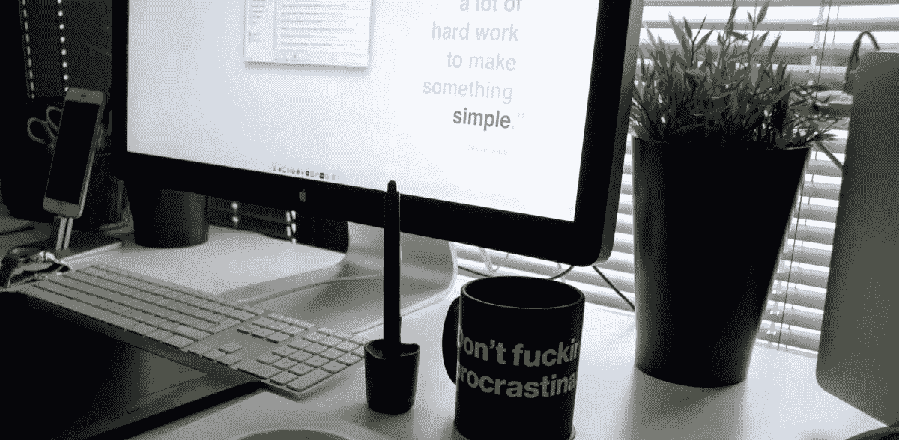

在过去的四年里，我一直在设计仪表板和应用程序，我学会了与不同的部门打交道，并利用他们的知识来使产品设计更好、更高效。

今天，我将分享我学到的并融入日常生活的所有步骤。我相信这些步骤已经帮助我成为一个更好的设计师，我希望你也会发现它们有用。

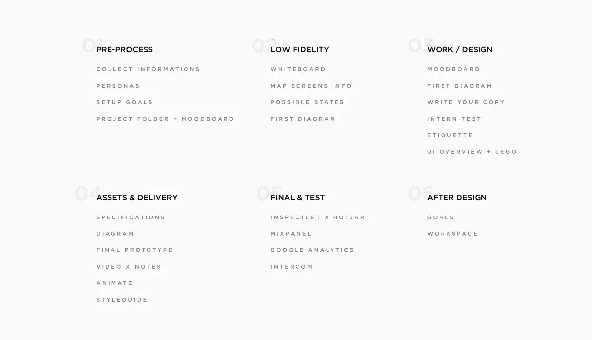

## 1.预处理

### 获取尽可能多的信息(求三个例子)

对我来说，没有什么比看到一个真正的工作实例更能让我明白了。当我和一个新客户一起工作或为一个产品制作一个全新的登陆页面时，我发现最简单的方法就是让客户提供三到四个有启发性的页面，因为这对双方都有帮助。

让你的客户把想法放在桌面上，让你有机会很容易地了解他们喜欢什么，以及他们对完成的设计有什么期望。

如果你和多个团队一起工作，你应该和你的设计师同事在一个产品上花同样多的时间。在开发 Tapdaq 的过程中，我了解到做出有效设计决策的关键是确保尽可能多地与开发团队交流。

就我而言，总会有这样的情况，一个问题的解决方案是我自己想不出来的。我想说的是，目标是在你进入开发阶段之前，尽可能多地消除问题。

### 了解人物角色

起初，我必须承认我对人物角色持怀疑态度，但现在这一切对我来说都有意义了。

因此，与我以前的工作过程完全相反，我可以看到在开发产品特性时，人物角色是多么的重要，尤其是当解决方案有许多不同的边缘案例时。这有助于你理解你到底是在为谁设计。我的目标是有大约四到五个角色。如果可能的话，最好使用基于实际用户的人物角色，因为这可以帮助您在电话或面对面与他们聊天或浏览您的解决方案时发现问题。

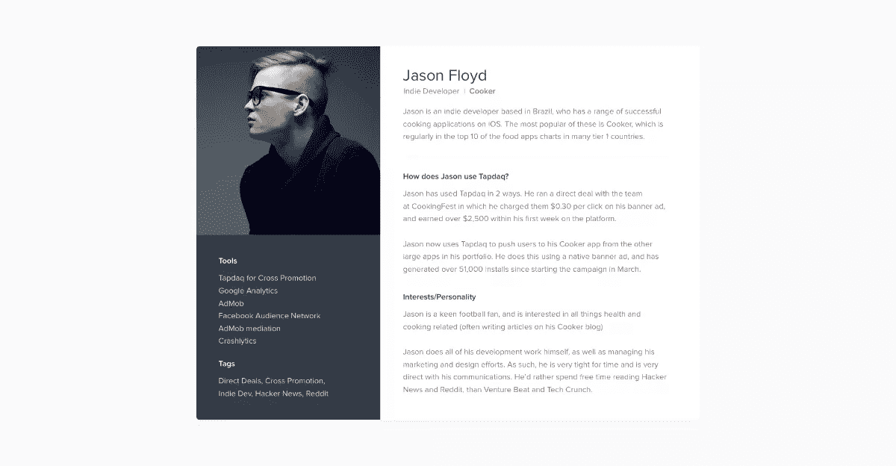

人物角色模板—在此下载:[http://janlosert.com/persona-template.zip](http://janlosert.com/persona-template.zip)

### 设定确切的目标——我们到底应该追踪什么？

我觉得大部分设计师/客户都忽略了这一步，但是对于双方来说，设计最重要的一个方面就是理解你在设计的产品的目标。我们倾向于直接跳到像素，并快速充实项目的 UI。如果是一个全新的网站或新功能，一定要为你想要实现的目标设定明确的目标。

因为一切都是可追踪的，所以讨论一下你要追踪的确切点。例如，这些因素可能包括新注册人数、使用 Paypal 的预期客户数量以及使用信用卡的购买量。一定要确保你一开始就知道你的目标有多高！

无论如何，在这个过程的后面，你都需要在 Mixpanel 上设置漏斗。

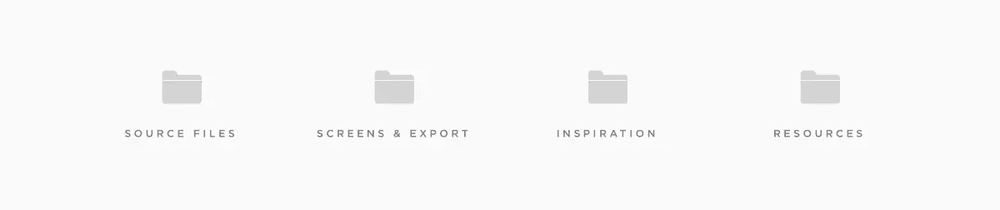

项目结构

### 建立一个项目文件夹，开始收集 Moodboard

有很多激发灵感的网站——Dribbble、Behance、Pttrns、Pinterest 等。找到与你将要从事的项目相似的项目真的很容易。此外，对于您正在经历并试图解决的问题，可能已经有了解决方案。

当我开始一个新项目时，我总是建立一个文件夹，里面有一些文件夹名为“源文件”、“屏幕和导出”、“灵感和资源”。我把在网上找到的所有东西都保存到我的“灵感文件夹”里，以备日后在基本的 moodboards 中使用。这个文件夹可以放入任何东西，从插件、样本甚至是 Behance 的完整案例研究。

## 2.去低保真度

### 白板

如果有人记得，我在以前的文章中并不太关心线框的质量。我现在使用的方法如下:

如果我们想增加一个新功能或重新设计一个流程，我们坐下来，会议上的每个人都开始在白板、纸张甚至 iPad 上勾画想法。这个动作可以让我们把团队中的每个人都放到设计师的位置上。后来，我们得出了两个设计方案，看看哪一个效果最好。

在过程的这一部分，我们总是试图回顾整个经历，并讨论大多数边缘情况。相对于在设计阶段，或者更糟糕的是在开发阶段，现在解决这些问题是非常重要的。那时候你反而会损失很多时间和精力。

### 绘制出所有屏幕信息(用户需要输入什么数据)

这是超越白板并列出所有用户输入和故事的时候了。写下用户应该在一个特定的屏幕上插入什么，以及用户如何才能达到预期的目标。

### 写下所有可能的状态

因为所有的仪表板、应用程序或网站表单都有不同的状态，这是你不应该忘记的另一个重要步骤。

在设计时，我们需要确保解决所有这些问题。在我们的草图文件或 PSDs 中有闪亮的图形和很酷的轮廓图片是很好的。然而，最有可能的是，用户会看到你的应用程序的反面。尤其是当他们谈到你的产品时。有准备是必要的。下面是我们如何在一个数据组件中处理空状态的例子。

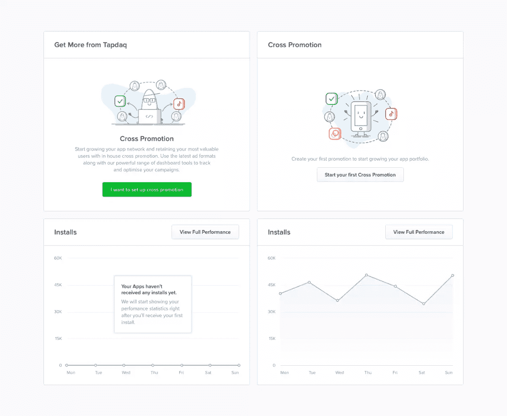

Tapdaq —交叉促销小部件状态

### 准备第一张图

所有这些导致了低保真度短语的最后一部分。由于白板任务的结果，我们现在知道了所有可能的状态、用户的输入和目标。为了总结所有的互动，我创建了一个图表，老实说，我已经多次改变了我使用的风格。它们可以是任何东西，从具有光栅化布局的草图文件到只不过是象征每一页并在下面标上名称的粗糙矩形。

也就是说，这个过程总是痛苦的，我通常会遇到这样的情况，我们想要在过程的后期改变或添加一些东西。对于这些解决方案，我通常被迫做更多的步骤；例如改变线、箭头和图像的位置。

做完这些之后，我们最终使用了 [Camunda Modeler](https://camunda.org/download/modeler/) ，这并不完全是一个设计工具。这是一个用于创建技术图表的简单应用程序。这听起来很奇怪，但这个应用程序是开发来帮助您建立基本的图表。最重要的是，创造的一切都是完全可扩展的。您可以轻松地拖放任何一点，它会自动为您创建线条和箭头。

您还可以选择不同类型的点，例如，当用户从 Intercom 收到电子邮件时突出显示这些点。Camunda 允许导出到 SVG，这使得在草图中给可跟踪的点着色变得容易。

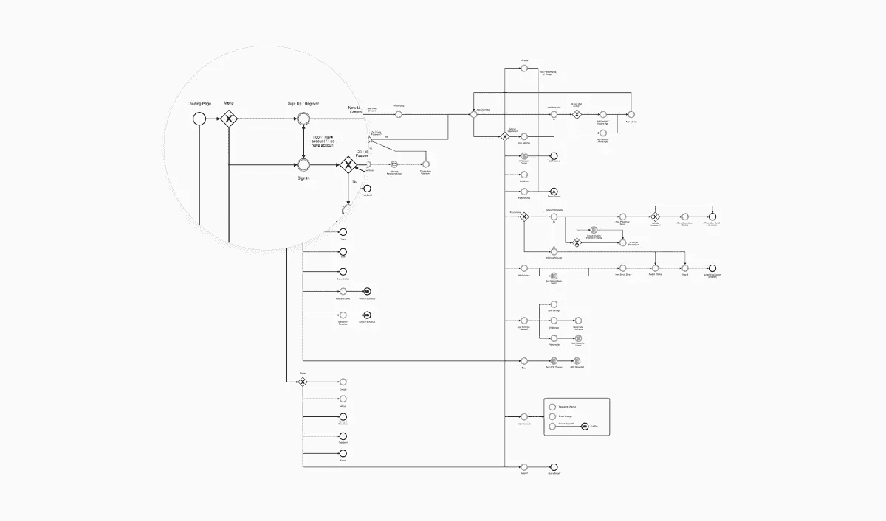

Tapdaq 菜单+屏幕结构(从 Camunda Modeler 导出)

## 3.工作/设计

### Moodboard

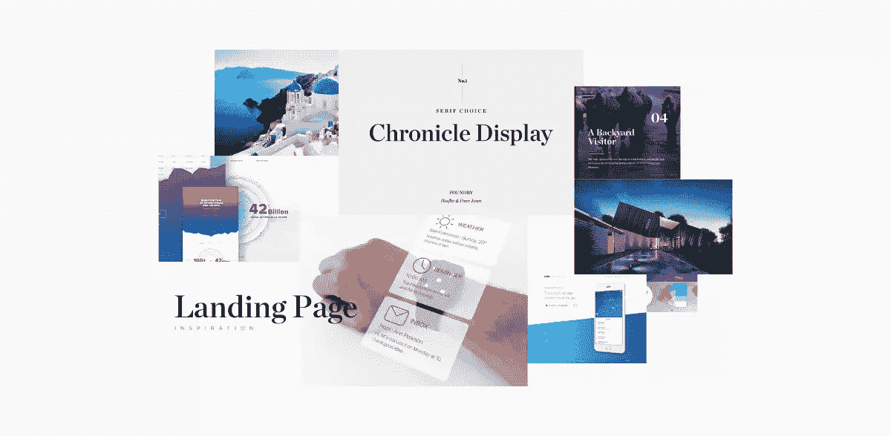

带有历史显示和亮蓝色的 Moodboard

我可以从创建 moodboard 开始，因为我将图像收集到我的灵感文件夹中。我使用 moodboards 主要是为了和同事讨论我的想法，并在开始像素过程之前描述一些视觉想法。

### 初稿

设计永远是一个持续的过程。你将会一路迭代很多次来获得一个好的结果。有了初稿，还需要收集反馈。你不必为了开始接收队友、客户或潜在用户的反馈而来到 pixel perfect design。

为了获得他们的第一想法并开始讨论，我通常会将我们当前设计的屏幕混合在一起(如下图所示)。这使得我们可以在不到一天的时间内开始玩真正的设计。你可以先做一个简单的原型来测试这些东西是否能很好地连接在一起。

### 写你的文案(语气)

文案是用户决策的关键因素之一，我认为它是设计的关键部分。虽然我的母语不是英语，但我仍然有能力设定文案的基调。没有什么比一个漂亮的对话框设计更糟糕的了，用户很难找到下一步。

### 第一次实习生考试

有了第一份草稿，你可以在 [Marvelapp](https://marvelapp.com/) 或 [Invision](https://www.invisionapp.com/) 中快速创建一个原型。这是我最近开始做的事情，事实证明这是另一个令人惊奇的验证方面。有了原型，您现在可以轻松地与团队中的 3 或 4 个人建立通话，与他们分享 Invision 或 Marvelapp 原型，并在测试特定流程/场景时尝试询问一些问题。

这样你就可以很容易地测试你的提问技巧，并且明显地在真实用户身上测试你的设计决策，而不用担心浪费资源和时间。我通常倾向于选择不怎么参与仪表板开发的人。还有，尽量避免看之前已经有机会玩样机的人。

### 礼仪

我们都知道保持整洁有多难。如何提供另一个特性。这通常会导致一个凌乱的草图或 PSD 文件。在设计[仪表板 UI 套件](http://janlosert.com/store/dashboard-ui-kit)的过程中，我学到了很多东西，尤其是关于在初创公司中作为一名设计师、在团队中工作或开发我的数字产品之间的区别。当我在 Tapdaq 工作时，我对我同事的技能很有信心，即使我知道我在努力保持文件整洁，但有时这是不可能的！

然而，当你在一个团队中工作时，我认为我的 PSD 就像我在为别人创造它们一样。我使用的规则是，如果一个文件夹中有超过 8 层，那么你应该创建一个新的。


仪表板 UI 套件—文件夹结构

我发现了一个很棒的 Sketch 插件，它节省了我开发 UI 套件的时间。重命名-[github.com/rodi01/RenameIt](https://github.com/rodi01/RenameIt/)

你仍然可以看看这些旧的礼仪指南(大多数要点对你使用的任何编辑器都有效)——[Photoshopetiquette.com](http://photoshopetiquette.com/)

### 把所有东西都放到画布上

我一直在努力设计漂亮的页眉，而画布的其余部分是白色的。在设计的时候，我学会了先把所有的内容放在适当的位置——只是玩玩布局和排版。在内容到位的情况下，设计漂亮的细节和玩转整个概念要容易得多。

### 创建 UI 元素并开始玩乐高

我可能参加聚会要迟到了，在我写的时候，这听起来已经过时了。我们在这里的旅程中没有做任何线框化的原因很简单。Sketch 39 附带了一些我觉得不可思议的东西，那就是“具有调整大小属性的形状”。它迫使我最终重新创建所有 50+ Tapdaq 屏幕。这使得团队中的每个人都可以轻松地进行设计。我们的草图文件现在是纯粹的拖放。你可以很容易地给你的任何队友一张空白画布，他们可以创建几乎高保真的草稿。由于这一点，我们能够跳过所有的线框工具，从几乎真实的像素开始。

这也与我们能够将线框转换为真实设计的能力齐头并进。任何下午可以创建线框，然后我可以很容易地接管它，并转换到高保真。

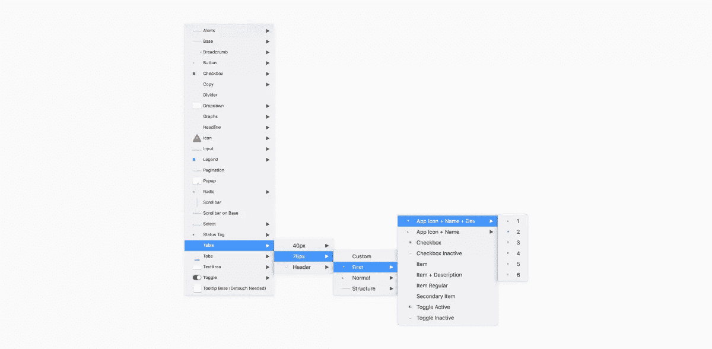

拖放 Tapdaq 草图文件中的元素

## 4.资产与交付

当你完成了基于第一次反馈的设计和迭代，你还没有完成。现在是时候把你的设计交给你的工程师/开发者了。

### 规格

我的一个主要目标是始终能够与团队沟通我的决定，并能够尽可能地为我们的开发人员减少困难，以便为他们提供尽可能好的资源。对我来说，这绝对是我作为设计师工作中最重要的部分。

因为我们记录了所有的交互，并且从流程开始就做好了一切准备，所以创建规范是小菜一碟。我倾向于在谷歌文档或屏幕下方的草图文件中写规格。这是很好的处理你的设计与所有功能的解释，这样任何人都可以在未来抓取你的文件。

### 图表

当我在 Badoo 为团队和利益相关者做演示时，我们经常使用这种技术。这种技术非常适合打印出设计并与团队讨论。但是现在我认为有更好的选择。例如准备好最终的原型。

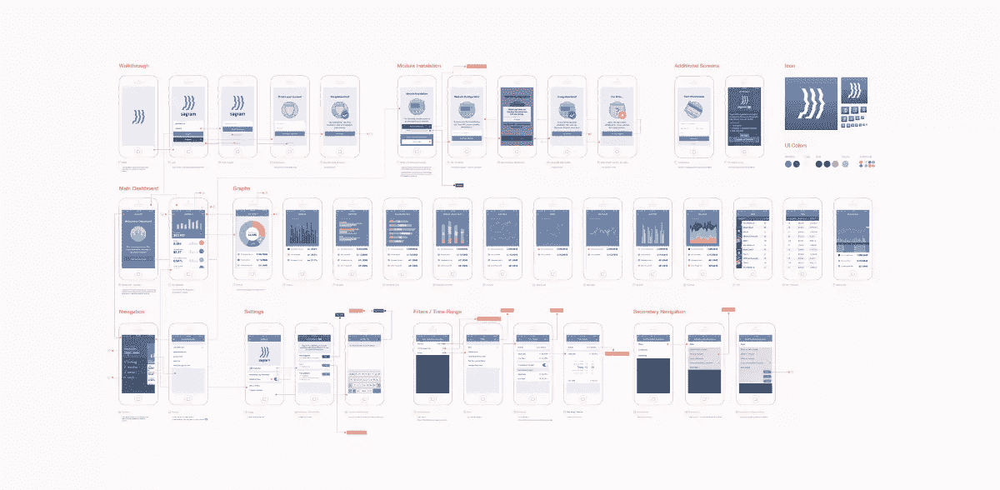

Sagram Analytics 应用的完整图表

### 最终原型

对我来说，最重要的事情之一是在原型中总是准备好所有的交互。我通常会在与队友的那些小会议或展示一些特定流程的最终版本的路上结束 3-5 个原型。我倾向于在一个画板中准备草图中的所有状态，然后复制这些画板，以便在导出时准备好每个状态。

就像我之前说的，你可以使用 [Marvelapp](https://marvelapp.com/) 或者 [Invision](http://invision.com/) 。在你的部分设计中添加评论来扩展你的规范是很棒的，这样即使是文案也可以很容易地检查真实的像素和流动，如果每个副本和对话都按要求工作的话。

### Quicktime 视频比笔记好

当我没有在 Hangouts 上向团队或客户展示东西时，我会发送一个屏幕共享视频，展示我浏览原型并解释我设计的所有东西。这是一个很好的方法，可以在任何演示之前向自己确认我知道任何问题的答案，以及我决定设计的可能的花哨交互。当在远程团队中工作时，也可以很好地使用它。每个人都有机会随时回放整个交互思维。

### 动画制作

一个很好的设计的最后润色，你可以在效果或原理之后使用。很好的解释了你希望这个和那个如何移动或者悬停。

### 样式指南

对于工程师来说，另一个关键点是知道事情在不同的场景下会如何反应。考虑输入的错误状态或在哪里显示错误消息。类似地，考虑提交按钮的禁用状态将会是什么样子，在输入中将微调器放在哪里等等。由于有一个名为“乐高积木”的草图文件，工程师在开始编写所有屏幕代码之前，只需浏览你的符号画板和一个接一个的风格元素就非常容易了。

所有元素的样式指南和视觉概览实际上是我的[仪表板 UI 套件](http://janlosert.com/store/dashboard-ui-kit)的下一次更新中最需要的功能/设计之一。

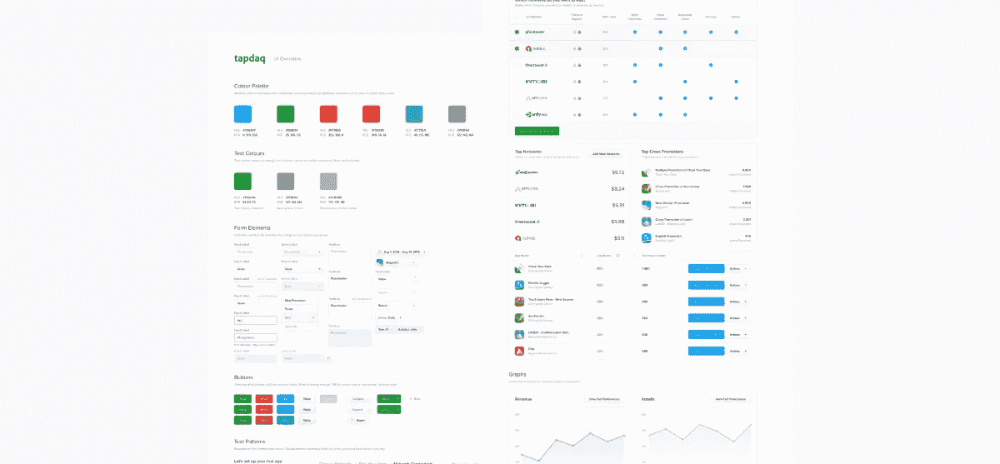

Tapdaq 用户界面概述—样式指南

## 5.最终和测试

既然我们已经完成了将设计交给工程师的工作，我们就可以专注于流程的最后一部分——测试我们的决策！

### Inspectlet / HotJar

在设计转化成工作代码后，不要忘记包含你的 [Inspectlet](http://www.inspectlet.com/) 或 [HotJar](https://www.hotjar.com/) JS 片段。看到用户如何浏览我们的仪表板，或者他们在我的投资组合页面上做什么，我总是感到兴奋(或沮丧)。

Inspectlet 在捕获所有用户会话方面非常出色，对于更大的项目也非常有用。它带有简单的“/页面”过滤功能，可帮助您查看特定功能或流程的会话。我们在 Tapdaq 中使用 Inspectlet。

对于我的个人投资组合，我使用 HotJar 的免费功能来生成热图，并记录至少一些浏览我的投资组合的用户。

### 混合面板

Mixpanel 对于验证我们的目标(我们在过程的最开始就建立了目标)非常有用。Mixpanel 有助于了解有多少用户完成了特定的流程。在设置帐户之前有多少用户退出。有多少人从主登录页面转到商店，转到我们最有价值的产品。

### 谷歌分析

我没有能力编写大的东西，但是我能够处理 CSS 文件和简单的代码。最近，我对查看用户点击的位置很感兴趣，在查看 Hotjar 热图时，我决定在 Google Analytics 中设置基本的点击跟踪器。你也可以很容易地跟踪用户在你网站上的每次点击。

下面是跟踪点击的示例代码

```
**1\. Paste script to your code**

<script> function track(name,label){
        ga('send', 'event', name, 'click', label, {
            hitCallback: function(){
            console.log('Event sent to Google Analytics');
                }
            });
        } </script>

**2\. Add onclick to your links**

<a href=“link” onclick="track('Click-Name','Click-Label')">Link</a>

**1\. Paste script to your code**
```

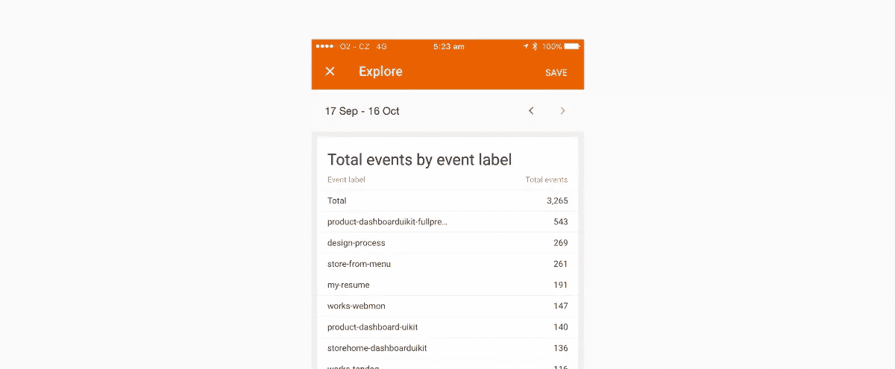

谷歌分析跟踪结果

正如你所看到的，我在跟踪每个按钮，每个链接，我总是给每个锚点贴上不同的标签。这有助于我轻松地描绘出用户的行为。例如，我发现人们在介绍文本中使用顶部导航的次数是高亮链接的 5 倍。您也可以随意将这段代码编写到您的网站上。

可悲的是，它没有计算 AdBlock 用户的点击量。感谢 [@snapeuh](https://twitter.com/snapeuh) 帮我设置这个。

### 对讲机

当我们就初始流程达成一致时，我们讨论的是用户从 Intercom 接收电子邮件的部分流程。我们的责任是确保所有的内容和信息本身有意义，并且对访问者有帮助。确保你的邮件引导你的用户找到你的结果。并且总是试图提供具体的支持文章和信息，如何继续流动。

## 6)设计后——我如何管理我的工作？

### 目标

在旅程的最后部分，我将自己设定为一个月的冲刺——分为工作/Tapdaq 相关目标、个人项目目标和生活目标。我仍然使用有教养的代码将那些项目分解成容易签署的小任务。我曾经同时做 5 个不同的项目，但总是因为不能完成任何事情而沮丧。

目前我的目标是每个月至少发布一个东西。这个“东西”可以是我的投资组合中的两个新的子页面，一个新产品或一个客户的新的登录页面——只是为了让自己继续下去，并对完成的东西保持快乐。

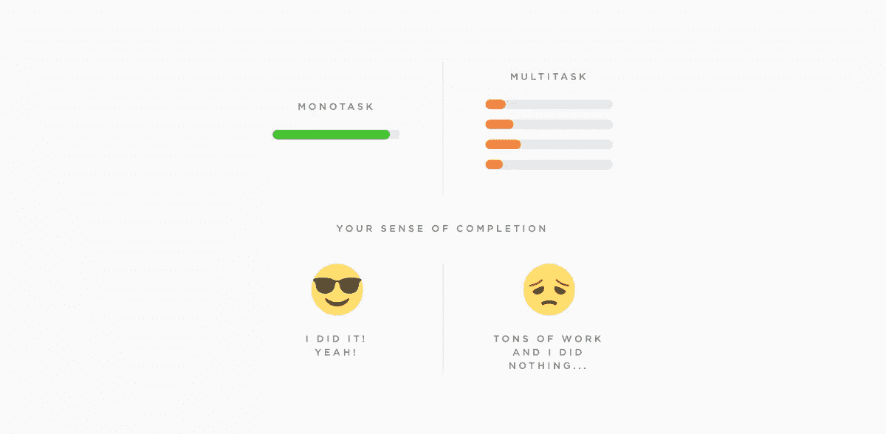

原文来自 Siavash Mahmoudian—[https://mobile . Twitter . com/Siavash/status/618093511066435585](https://mobile.twitter.com/siavash/status/618093511066435585)

### 工作空间

我已经在我的大部分设计中使用 Sketch 了，但是我在 Instagram 上已经有很多人要求我的 Photoshop 工作空间，所以你可以开始了！janlosert.com/workspace.zip

## 7.最后几个字

这是我交付设计的所有步骤的概述。显然，我并没有一直遵循完全相同的程序，但这让你知道我是如何工作的。

### 留下水滴

从我所学到的和我的设计在过去 4 年中的变化来看，我认为 Dribbble 是我们设计师吸引新客户和展示我们作品的最佳方式。但这不一定是你想为之创作设计的地方。我一直希望 Dribbble 有漂亮的像素和性感的个人资料图片，但这不是真正的用户需要和将要使用的。

这是 Tapdaq 中的一个例子——我为 Instagram 设计了一个很好的镜头，并牢记在心。但我也展示了在我们花了几个小时观察人们编辑他们的个人资料后，以及在我意识到他们实际上要求和需要什么信息后，当前屏幕的样子。

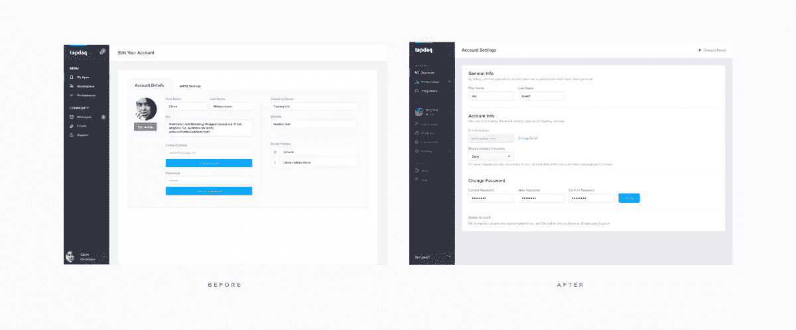

帐户设置—之前和之后

你可能会收到 500 个对土豆或滑动披萨的明亮疯狂动画的赞，但真正重要的是，你的用户会发现如何管理公司电子邮件的频率，或者如何过滤他们的绩效分析。

### 未来(我想学什么)

我的下一个任务最重要的是深入 UX 进行研究。为了能够在我的下一篇文章中分享我用于 A/B 测试和收集数据的 UX 工具的概述。我对 UX 还很陌生，我在以前的工作中没有太多学习的机会。但是，目前，我热衷于跟踪和观察每个用户在我工作的每个新项目中的行动。

## 结尾

我很乐意听听你的工作流程——你通常在个人项目中采取哪些步骤，或者在团队工作中你的流程有何不同。我喜欢看别人的工作空间。最重要的是，请随时分享您对我的流程中所有/额外步骤的想法。

我会在 [dribbble](https://dribbble.com/JanLosert) 上发布更多来自 Tapdaq 和我个人项目的内容，我很乐意在 [Twitter](https://twitter.com/JanLosert) 上听到你们的想法。

*最初发表于[媒体](https://medium.com/sketch-app-sources/26-steps-of-product-dashboard-design-c97af84c4146#.fno6gt4w3)。经许可后重新发布。*

## 分享这篇文章