# 虚拟现实耳机比你想象的要多！

> 原文：<https://www.sitepoint.com/there-are-more-virtual-reality-headsets-than-you-realize/>

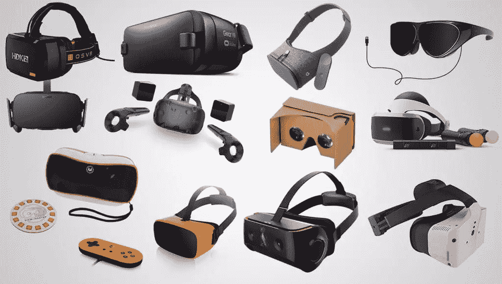

虚拟现实(VR)是目前有点热门的话题！我花了很多时间编写了一份每周简讯,内容都是关于虚拟现实等新兴技术的新闻，在活动中谈论虚拟现实，向人们展示虚拟现实的可能性，教人们建立虚拟现实体验等等。有很多 VR 的想法充斥着我的这个大脑！在整个过程中，我遇到了大量的虚拟现实耳机，我想我应该分享一些没有很多人意识到的东西——虚拟现实耳机比你想象的要多得多……甚至更多！下面看看我的最爱，从比较常见的开始！

## Oculus 裂缝

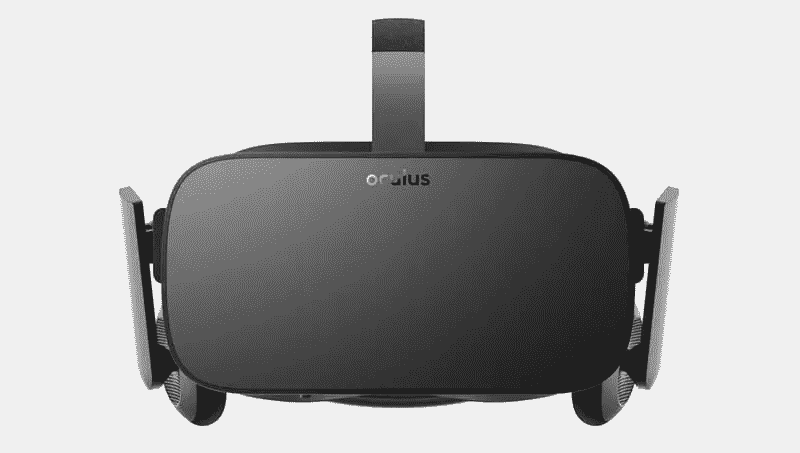

Oculus Rift 消费者版耳机

Oculus Rift 是又一次开启了整个 VR 潮流的 VR 头戴设备！甚至这款耳机的历史也比很多人意识到的要长。它已经有了几次开发者迭代，包括 2013 年为他们的 Kickstarter 支持者发布的 Oculus Rift 开发套件 1 (DK1)和 2014 年发布的分辨率更高的 Oculus Rift 开发套件 2 (DK2)，最终在 2016 年向世界各地许多热切的 VR 采用者发布了 Oculus Rift 消费者版。中间还有其他未发布的裂缝原型，但是为了简单起见，我们将坚持发布给开发者的版本！

Rift 本身是通过连接到 PC 上来工作的。它目前不再支持 Mac OS。老实说，我不认为本文中将要提到的任何一款 VR 头戴设备能与 Mac OS 兼容。VR 应用可以通过 Oculus 商店安装。

与其他耳机相比，Rift 的性能如何？以下是我将在本文中提到的所有现有耳机中使用的简化功能列表:

**分辨率:**每只眼睛 1080×1200。
**视野:** 110
**显示技术:**每只眼睛一个有机发光二极管屏幕。
**刷新率:** 90 Hz
**耳机:**集成到耳机中。
**坐着/站着还是房间尺度:**大部分体验都是坐着或站着。很快就可以购买额外的传感器(2016 年 10 月宣布)，这将允许在空间中行走的能力，但我不确定有多少 Rift 游戏为此而建造。很大程度上，Oculus 一直专注于你可以站在/坐在一个地方的 VR 体验。
**控制器:**2016 年 10 月起可订购的 Oculus Touch 手持控制器。

## HTC Vive

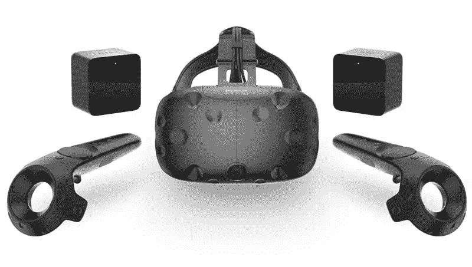

HTC Vive 耳机及其 Lighthouse 传感器和控制器

HTC Vive 在科技和游戏社区之外并不太知名，但它的增长势头是当之无愧的！Vive 是 HTC 和 Valve 的合作项目，于 2015 年 3 月正式对外透露。我最喜欢 Vive 的一点是，它配有“灯塔传感器”，允许你在最大 15×15 英尺的区域内行走。这种四处走动的能力被称为“房间尺度”。它还配有两个手持控制器。正因为如此，大量的 Vive VR 应用和游戏在完全沉浸的情况下工作得非常好——你可以在体验中四处走动，从不同的角度看它，并使用双手控制器与它互动。我最喜欢的 VR 应用程序之一，Tilt Brush，可以让你在 3D 空间中绘图。你可以在你周围画一个环境，从各个角度观察它，并(通过最新的更新)让它对音乐做出反应！太棒了。

就像 Rift 一样，Vive 通过连接到 PC 来工作。HTC Vive 游戏和 VR 体验可以从 Steam 或 Vive 自己的商店 Viveport 购买。Steam 的 VR 体验也可以在其他 VR 头戴设备上播放，这取决于应用程序的要求(例如，如果它需要 Vive 控制器，那么应用程序就不太可能兼容)。

**分辨率:**每只眼睛 1080×1200。
**视野:** 110
**显示技术:**每只眼睛一个有机发光二极管屏幕。
**刷新率:** 90 Hz
**耳机:**需要外接耳机插入。
**坐式/站立式或房间规模:**Vive 尤其以其房间规模的功能而闻名！
**控制器:**Vive 自带两个手持控制器。

## 索尼 PlayStation VR

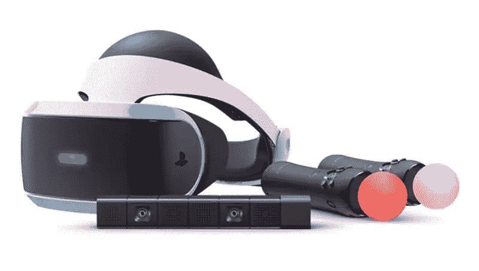

带有移动控制器和 PlayStation 摄像头的 PlayStation VR 耳机

很多人不知道这一天的到来，但到了圣诞节，虚拟现实将走进世界各地的许多家庭。它通过连接到 PlayStation 4 来工作，并有自己稍微不太先进的控制器。它的价格比上面两种耳机便宜，但功能不全。不过，从它的声音来看，这个平台上的游戏可能会弥补它稍微不那么令人印象深刻的规格。索尼在游戏开发行业有很多合作伙伴。像《蝙蝠侠:阿卡姆虚拟现实》和《生化危机 7》这样的游戏听起来会很有趣！每个游戏都有不同的 VR 兼容性水平，不同的控制器要求…等等，这些都会列在每个游戏盒子上。

**分辨率:**每只眼睛 960×1080。
**视野:** 100
**显示技术:**每只眼睛一个有机发光二极管屏幕一分为二。
**刷新率:**可以在 120Hz 和 90 Hz 之间切换。
**耳机:**需要外接耳机插入。
**坐姿/站姿或房间尺度:**索尼建议人们在大部分虚拟现实体验中坐着。没有像 Vive 的房间尺度那样四处走动的能力。
**控制器:**游戏可以使用典型的 PlayStation 控制器，也可以单独购买一两个 PlayStation Move 控制器。它们还与耳机捆绑在一起。第一人称射击游戏的“PS Aim 控制器”也在路上。

## 谷歌纸板

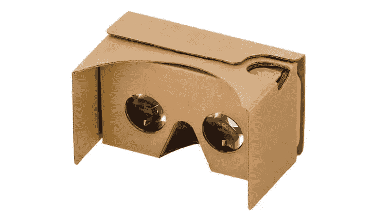

最新的谷歌纸板耳机

谷歌纸板耳机是一款便携式耳机，最初确实是由纸板制成的！在所有的 VR 头戴设备中，这是我见过的大多数人都尝试过的一种。与其说耳机本身能做很多事情，不如说它是智能手机运行应用程序的容器。每个 VR 应用程序在分屏视图中显示两幅图像，每只眼睛一幅。这些观点是通过纸板耳机中的透镜来观察的。这些是最便宜也是最容易尝试虚拟现实的方法，因为它们最初的价格在 20 美元左右，现在甚至可以更便宜！有很多商店一直在销售相对便宜的谷歌纸板兼容耳机，包括 Aldi，Lincraft，Tesco，Walmart 和 Costco。如果我把现在所有的谷歌纸板风格的耳机都包括在内，这个列表可能会有三倍长！Google Cardboard 应用可以在 Google Play 商店中找到，WebVR 体验(在智能手机浏览器中运行的虚拟现实)也很容易在 Google Cardboard 上试用。

**分辨率:**取决于你拥有的智能手机！
**视野:** 90
**耳机:**需要插上外置耳机或者调高手机音量。一些纸板风格的耳机提供了一个开口，以达到手机上的耳机插孔，但许多没有。
**坐着/站着或者房间尺度:**坐着或者站着，虽然没有办法走动！
**控制器:**有些在侧面有一个按钮，可以触发动作，然而，这在后来的谷歌 Cardboard 耳机上已经被淘汰了。

## 谷歌白日梦视图

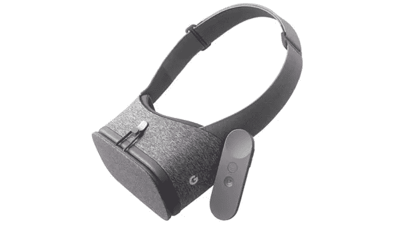

谷歌 Daydream View 耳机

谷歌 Daydream View 是谷歌 Cardboard 耳机的继任者，仅适用于较新的兼容 Daydream 的智能手机。Daydream 是一个将内置到 Android 7.1 中的 VR 平台。谷歌告诉智能手机制造商，手机上需要什么软件和硬件才能兼容。Daydream VR 耳机将于本月晚些时候上市(2016 年 11 月，读者将在几个月后看到这篇文章！).

其他制造商也可以制作自己的 Daydream 兼容耳机，然而，“Daydream View”耳机是谷歌的第一款官方耳机，由轻质布料制成，我听说这是任何 VR 耳机中最舒适的材料之一。

**分辨率:**取决于你拥有的智能手机！
**视野:**细节似乎还没有发布。
**耳机:**需要外接耳机插入。耳机的图片看起来有耳机插孔可供人们这样做。
**坐式/站立式或房间式:**与此刻的纸板相同。
**控制器:**Daydream View 耳机配有一个无线控制器，这应该是所有 Daydream 耳机的标准设计。

## 三星 Gear VR

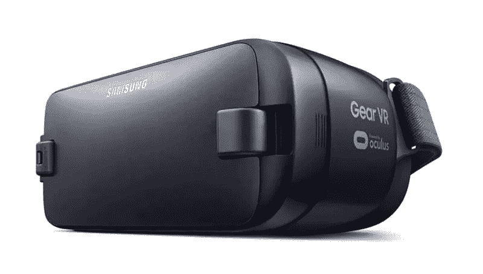

第二款消费版 Gear VR 耳机

Gear VR 耳机是三星和 Oculus 的合作伙伴，旨在制造一款移动 VR 耳机，其工作方式类似于谷歌 Cardboard 耳机，但 Gear VR 耳机还提供了对耳机位置的额外跟踪，使其比智能手机本身更准确。这款耳机也有多种版本——两款“创新者版”耳机和两款“消费者版”耳机。这些耳机仅适用于特定的三星智能手机。2014 年的第一款“创新者版”one 只兼容三星 Galaxy Note 4。最新的“消费者版”耳机与 S6、S6 edge、Note 5、S7 和 S7 edge 兼容。考虑到 Note 7 的安全问题，Gear VR 禁止在耳机中使用这款手机。如果你仍然拥有一部 Note 7，你真的应该把它还回去。

Gear VR 在让高质量的虚拟现实应用进入其平台方面取得了很大的成功。许多流媒体 VR 直播活动一直是 Gear VR 的专属。它还被分发给许多家庭，因为许多人在购买三星智能手机时都免费获得了一部。

**分辨率:**每只眼睛 1280×1440。
**视野:**早期版本有 96°视野，最新的 2016 款有 101°视野。
**耳机:**需要外接耳机插入。
**坐式/站立式或房间式:**与此刻的纸板相同。
**控制器:**在耳机本身侧面提供按钮。

## OSVR

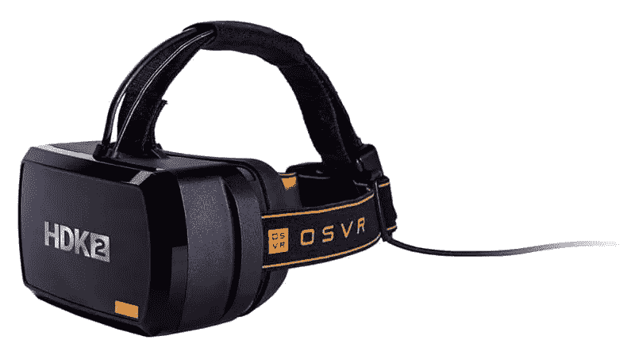

雷蛇 OSVR HDK 2

OSVR 代表开源虚拟现实，它就是这样！它试图创建一个“跨不同品牌和公司的技术的通用开源 VR 生态系统”，由 Sensics 和 Razer 共同创建。他们的目标是让 VR 成为与 PC 生态系统相同的开放生态系统，在那里你可以即插即用一系列不同的耳机和控制器等等。其首款耳机(HDK 1)于 2015 年发布，其最新款耳机(HDK 2)于今年(2016 年)发布。

就最新的 HDK 2 而言，它的能力如下:

**分辨率:**每只眼睛 1200×1080。
**视野:** 100
**显示技术:**每只眼睛一个有机发光二极管屏幕一分为二。
**刷新率:** 90 Hz
**耳机:**需要外接耳机插入。
**坐姿/站姿或房间尺度:**仅坐姿/站姿。
**控制器:**目前还没有控制器。

## Mattel 视图-主视图

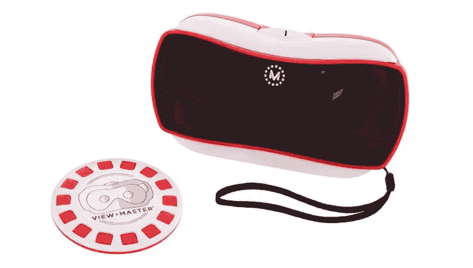

首款 View-Master VR 头显

这是一款基于 Google Cardboard 的耳机，但我将它单独列出来，因为它已经是一款可以在今天的商店中购买的产品，并且有自己的 VR 体验生态系统！孩子们已经有了这些耳机，肯定渴望更多的内容。虚拟现实开发者——这是一个机会！

**分辨率:**取决于你拥有的智能手机！
**视野:** 90(与纸板相同)
**耳机:**耳机不适合当前版本但即将推出的版本可能会有耳机插孔。
**坐着/站着或者房间尺度:**坐着或者站着，都没有办法走动，就跟用纸板一样。
**控制器:**View-Master 侧面有一个按钮，其实挺靠谱的。

## 微微近地天体

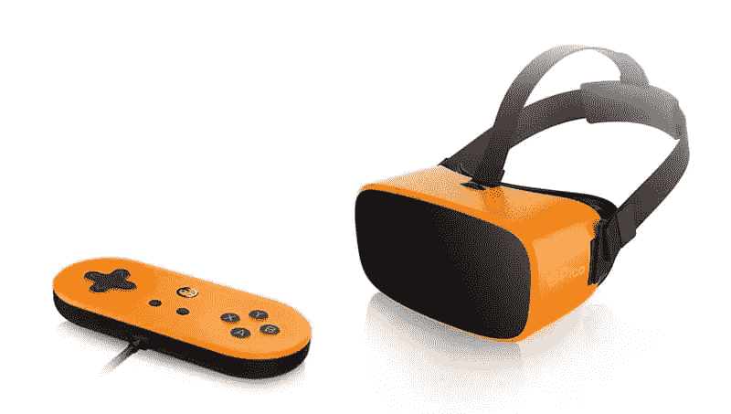

Pico Neo 耳机

Pico 有点像 Oculus 和谷歌 Cardboard 的混合体。这款耳机包含一个由智能手机共享的芯片，运行 Android 6.0，因此它不是将智能手机放入其中，而是具有类似于智能手机的处理能力。它可以独立于 PC 工作，但也可以连接到 PC 以获得更多体验。

**分辨率:**每只眼睛 1200×1080。
**视野:** 102
**显示技术:**每只眼睛一个 AMOLED 屏幕。
**刷新率:** 90 Hz
**耳机:**它有一个耳机插孔，供你插自己的耳机。
**控制器:**可以使用 D-Pad 风格的控制器，它也有看起来非常像 PlayStation Move 控制器的控制器，以及 PlayStation camera 风格的设置。

## 德洛德洛

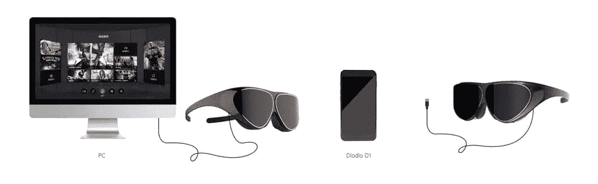

德洛德洛 V1 耳机

国内那家名字相当奇怪的 VR 公司，绝对不是大多数 VR 爱好者连听都没听过的！他们的 Dlodlo Glass H1 耳机*(我被告知发音为“dodo”)*非常像 Gear VR，需要智能手机，但包括传感器以改善耳机内的跟踪。

然而，V1 号的设计更加迷人。它看起来像一副略显笨重的太阳镜(厚度为 16 毫米)，重量仅为 88 克。为了运行它，你可以通过电缆或智能手机将其连接到 PC。据我所知，有很多光线会渗入你的视野(这是可以理解的，但对虚拟现实来说并不理想)，眼镜在你的头上并不太稳定(因为它们没有绑在你的脸上)。尽管如此，优点可能会超过缺点，因为你最终会得到一个相对便携的 VR 耳机！

**分辨率:**每只眼睛 1200×1200。
**视野:** 105
**显示技术:**每只眼睛一个定制液晶屏。
**刷新率:** 90 Hz
**耳机:**我的猜测是可以把耳机插到智能手机上。他们还有[一副在 Kickstarter](https://www.kickstarter.com/projects/203407287/dlodlo-v1-opening-a-new-world-of-vr#h:free-add-ons) 中提到的无线耳机。
**控制器:**刚才还没有提到控制器。然而，他们在 Kickstarter 页面上的常见问题提到他们“离发布手势识别和空间定位功能以提升 D1 和 V1 的沉浸式体验不远了”

## 还有更多的耳机即将推出！

### 锐利的原型

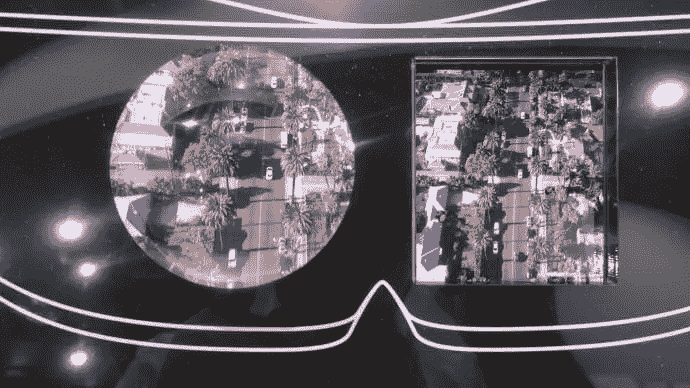

夏普原型机展示的特写镜头(图片来源:Geek.com)

夏普有一个原型，每只眼睛的显示器为 1920 x 2160——超过了我们提到的所有现有的虚拟现实耳机！然而，高 4K 分辨率需要顶级的 PC 设置才能工作！

### 惠普、戴尔、联想、华硕和宏碁都与微软有合作关系

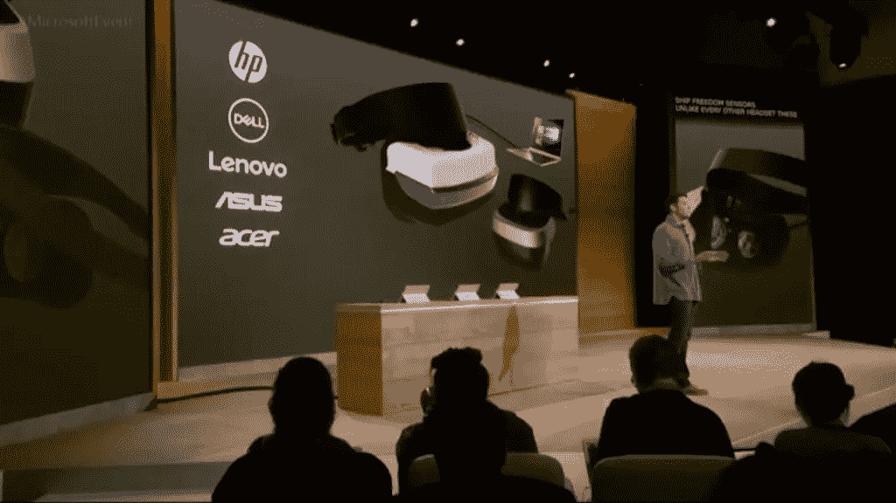

图片来源:UploadVR

惠普、戴尔、联想、华硕和宏碁都在与微软合作，为你的电脑开发虚拟现实头戴设备。

这些耳机最令人兴奋的事情是，微软已经授权他们从 HoloLens 进行“由内而外”的跟踪，以跟踪耳机在空间中的方向——不需要像 Rift 和 Vive 那样的任何外部传感器。不仅如此，这款耳机的起价更低，为 299 美元。

### VaiaVR

这是一个即将到来的努力，旨在制作一个移动房间大小的虚拟现实体验，它将与 SteamVR 游戏兼容——像 Vive 一样，但没有电线和灯塔传感器。现在还为时尚早，但这是一个令人兴奋的原型！[根据 VRFocus](http://www.vrfocus.com/2016/09/zeiss-and-dacuda-partner-for-roomscale-mobile-vr/) 、*“da cuda 的 6 自由度追踪器使用手机内置的摄像头，每秒钟确定头部位置和旋转超过 60 次”*。

### FOVE

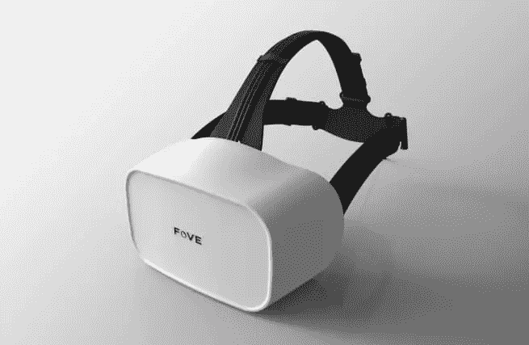

最新的 FOVE VR 耳机设计

这款手机很快就要上市了，本周将开放预购！FOVE 耳机令人兴奋，因为它包含眼球追踪，这意味着耳机可以告诉你的眼睛在看哪里。理论上你可以用你的目光来引导体验。这也允许一种称为“凹进渲染”的技术，它在你看的地方渲染更高质量的纹理和内容，而保持其余的较低质量。

### 骁龙 VR820 参考平台

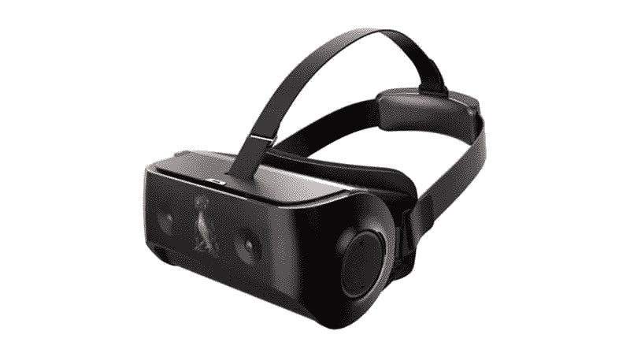

骁龙 VR820 参考设计

高通为智能手机创造了参考设计，其他制造商将其作为自己的指南，作为时代的标志，他们还为虚拟现实耳机整合了[参考设计。它还具有眼球追踪功能，就像 FOVE 和一对分辨率高达 1440×1440 像素的 AMOLED 显示器一样。它还具有外部前置摄像头，以允许简单的增强现实体验和可能的额外跟踪(类似于微软的上述概念)。正如惠普、戴尔、联想、华硕和宏碁的 VR 头戴设备正在使用微软的参考平台一样，骁龙 VR820 参考平台可能会引领一系列智能手机制造商也建立自己的 VR 头戴设备。我们很快就会有大量的虚拟现实耳机！](http://arstechnica.com/gadgets/2016/09/qualcomm-snapdragon-vr-820-price-specs-release-date/)

### 英特尔项目合金

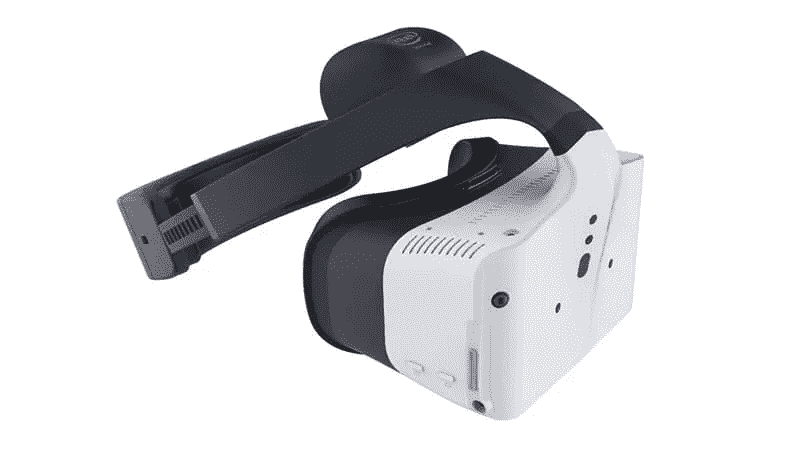

英特尔的 Project Alloy 耳机

In August 2016, Intel also announced their own all-in-one virtual reality solution that uses Intel RealSense technology to prevent the need for any other sensors. Their RealSense cameras on the headset may be used to bring your hands into the VR experience and also to prevent you walking into walls or objects around you. The headset itself is a self-contained headset with computing power all on its own, so there’ll be no cords to attach to your PC. It is also a set of technologies that other headset manufacturers may also licence, like the previous two.

## 结论

今天已经有数量惊人的虚拟现实头戴设备问世，比人们意识到的多得多！不仅仅是大家熟知的 Google Cardboard，Gear VR，Oculus Rift，HTC Vive！不仅如此，在未来的几个月和几年里，还会有更多的事情发生。虚拟现实是一个具有如此多令人兴奋的潜力的领域，具有改进的跟踪(尤其是不需要外部传感器的“由内而外”跟踪！)和眼睛跟踪，这将以新的方式改变媒体的功能。如果你还没有虚拟现实耳机，或者如果你还没有尝试虚拟现实，你有很多选择！

## 分享这篇文章