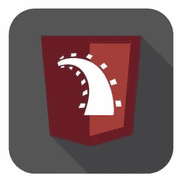

# 为什么学习 Rails 在 2016 年仍然是一个很棒的选择

> 原文：<https://www.sitepoint.com/why-learning-rails-is-still-a-great-choice-in-2016/>

Rails 已经存在超过 12 年了。这在任何技术中都是永恒的。存活了这么久的软件相关项目的列表必须只包含少数几个。坐在这里思考这个问题，我只能想到:

*   Linux 操作系统
*   Vi/Vim(我用它来写这篇文章)

好吧，好吧，我似乎不擅长列表。我敢肯定还有更多，但重点仍然是:Rails 已经存在很久了。上面有毛。

正如我们所知，软件正在以光速变化，尤其是在 web 领域，像 Rails 这样的东西怎么能坚持下去呢？作为一个 web 框架，它还有什么意义吗？我的意思是，伴随着 Concurrent——this 和 Functional——总是占据头条，这个基于面向对象语言的框架怎么还值得学习呢？

这就是我今天要假设的。Rails 仍然非常值得学习。

*免责声明:我已经为 Rails 5 更新了 SitePoint 的书 Rails:新手到忍者，所以我对 Rails 的可行性有既得利益…*

## 教义和愿景

Rails 有一个*主义*。不，真的，有关系。就在这里的。我不知道你怎么想，但是每当我看到*这样那样的*教义，我就会想到那些无脑的旅鼠被一些暴虐的自大狂强迫成为奴隶。不过，我可能读了太多后启示录科幻惊悚片。不过，铁路主义还是不错的。以下是一些原则:

*   为了程序员的幸福而优化
*   约定胜于配置
*   菜单是 omakase
*   没有一个范例
*   赞美美丽的代码
*   提供锋利的刀具
*   价值集成系统
*   稳定之上的进步
*   支起一个大帐篷

现在，我不会把这些都浏览一遍，但是我想让你们读一读。你知道他们没说什么吗？“做个网站。”列表中有诸如“幸福”、“美丽”、“进步”、“价值”之类的词。这是为了一个*网络框架*。想一想这个。

这些都是崇高而有价值的原则，几乎适用于任何制造产品的工作。它们为框架和围绕它的社区的方向定下了基调。虽然你可能不同意所有的观点，但至少你知道它们是什么。它们被写下来给每个人看。

考虑一下创建这个列表的想法。任何将这种思想融入到驱动它的原则中的框架都必须是成熟和明智的。我喜欢这些原则，知道它们驱动 Rails 让我很乐意使用它。

## 立即成功

Rails 允许开发者冲出大门，这是一个由来已久、众所周知的事实。如果你想快速建立一些东西作为概念验证，你将很难找到比 Rails 更好的工作。因此，几代人以来，Rails 一直是初创公司的选择。

但是，这不仅仅适用于初创公司。当你试图学习新的科技知识时，往往需要很长时间才能看到你的学习成果。你必须超越某一点，很可能超越“新手”状态才能使用它。当你转行或承担其他责任时，这种承诺可能很难维持。如果您是 web 开发的新手，Rails 可以让您提前获得成功。很早。你不需要*有*去学习一门完整的编程语言，只要足够开始就行了。事实上，如此多的人通过 Rails 来到 Ruby，以至于 Rails 经常与语言本身混淆。

学习 Rails，因为您将能够立即看到进展。这会让你不断学习。

## 学习网络之道

Rails 的创造者和用户反复念叨的另一个方面是“约定胜于配置”。本质上，这意味着 Rails 已经采用了假定某些配置的约定(做事的方式)。例如，在开始使用 Rails 时，您不必选择数据库。如果不配置另一个数据库，Rails 将按照惯例使用 SQLite*。虽然这肯定有助于我之前的直接成功，但它也向你展示了*网络是如何工作的*。*

 *等等，我这是什么意思？我的意思是，大多数网站都需要存储数据，所以 Rails 对此有一个约定。绝大多数 web 应用程序都使用基于会话的身份验证，所以 Rails 对此有一个约定。一旦你学会了约定，你现在就有了一个 web 应用程序需要的东西的列表。你有一张“网络之道”的清单。这里还有一些例子:

*   RESTful 端点
*   资产压缩和构建
*   数据库迁移
*   包和依赖关系管理
*   测试

还有更多的，但你得到的想法。您可以使用这个列表并调整配置来查看其他方法。您可以直接用 gems 或您自己的代码删除或替换这些约定。当你准备好了，你就可以更深入地研究每一个约定，并了解它为什么存在。这些更深入的探索最终将教会您一些关于 web 应用程序开发和部署的基础知识。更好的是，你可以使用这些惯例，直到你准备好，按照你的步调学习，同时仍然产生一个可靠的 web 应用程序。

## 站在巨人的肩膀上

基于最后一点，Rails 是由一些 web 开发巨头开发的。Rails 最初是作为用于构建 Basecamp 的框架而诞生的，base camp 是一个非常成功的高流量产品。这意味着在创建一个数据驱动的高流量网站时出现的问题已经被 Basecamp 解决了，我们可以从中获益。

12 年来，Rails 已经被用于许多成功的网站。参与这些网站的许多人已经炮制出难以置信的开源宝石来解决他们旅途中困扰他们的问题。最好的例子之一是[设计](https://github.com/plataformatec/devise)，Rails 中事实上的认证宝石。使用 Devise(和其他 gem ),您可以允许您的用户以多种方式进行身份验证。电子邮件/密码，Twitter，脸书，Github，JWT，等等。设计只是成千上万个例子中的一个。

Rails 是由巨人构建的，围绕它已经建立了一个巨人社区。

## 你和什么军队？

当您开始使用 Rails 时，这个社区就变成了您的社区。如果你前往 [Rubygems](http://rubygems.org) 和[搜索“rails”](https://rubygems.org/search?utf8=%E2%9C%93&query=rail://rubygems.org/search?utf8=%E2%9C%93&query=rails)，你会看到大约 160 页的 gems 结果。 *160 页！！*而且每周都有更多的宝石问世。

此外，在互联网上搜索 Rails 帮助会产生无数选项。在 [SitePoint](https://community.sitepoint.com) 和[其他地方](https://railsforum.com/)都有论坛可以提问。有一个[懈怠团](http://www.rubyonrails.link/)。不打至少 12 个 Rails 资源求答案，你是不可能在网上甩死猫的。喵喵！

此外，关于 Rails 的书籍、视频和博客的数量永远不会停止。我有没有提到过我们在 Rails 5 上有一本书几天后就要出版了…*咳嗽*。

关键是，有一大群使用 Rails 的人在帮助你。所以，当有人说“是吗？你和什么军队？”，你会有一个很棒的答案。

[https://w.soundcloud.com/player/?url=https%3A//api.soundcloud.com/tracks/296598536&auto_play=false&hide_related=false&show_comments=true&show_user=true&show_reposts=false&visual=true](https://w.soundcloud.com/player/?url=https%3A//api.soundcloud.com/tracks/296598536&auto_play=false&hide_related=false&show_comments=true&show_user=true&show_reposts=false&visual=true)

## 露比很漂亮

在我看来，学习 Rails 的最好理由之一是因为它是基于 Ruby 的。在我几十年的编程生涯中，我经历了许多语言。有些甚至已经不存在了(Powerbuilder，有人知道吗？magik 怎么样？好吧，那就 QuickBasic 吧……)当一些语言消亡的时候，我抛弃了另一些语言，因为我对这种语言感到失望。

> 对鲁比，那是一见钟情，大约 10 年后，我仍然深爱着她。毫无疑问，所有这些情话会让露比不舒服，但我不在乎。Ruby 是一种美丽的语言，我会在服务器端大声说出来。

在 Ruby 早期的一篇文章中，Yukihiro Matsumoto(Ruby 的创造者)写道“…Ruby 是为了让程序员开心而设计的。”难道你不希望 T1 使用一种设计者以此为目标的语言吗？我知道。哦，他在实现这个目标方面做得很好。

## 它还在

嗯，在这场盛大的 Rails 爱好者聚会结束时，你可能会说，“好吧，那太好了，但是我能用 Rails 赚钱吗？”我不会给出我的观点，只是说我几乎每天都在专业地编写 Ruby 和 Rails，我会引用一些真实的数据:

*   [Ruby 和 Rails 位列 2016 年十大编程语言](http://spectrum.ieee.org/computing/software/the-2016-top-programming-languages)
*   [Ruby/Rails 是 2016 年最受欢迎的 9 种语言之一](http://www.codingdojo.com/blog/9-most-in-demand-programming-languages-of-2016/)
*   Ruby/Rails 正在列表中向上移动。这里比 2015 年上升了 6 位

你可以找到许多类似的文章和列表。也许回答这个问题的最佳方式是给你一篇法比奥·秋田写的文章，名为[“Rails 赢了:房间里的大象”](http://www.akitaonrails.com/2016/05/23/rails-has-won-the-elephant-in-the-room)。这篇文章不是 Rails 上最受称赞的文章，但标题是真实的。Rails 已经赢了。初学者可以学习它，专家可以用它来建造伟大的东西。Rails 仍在做出重大改变，以跟上不断变化的 web 开发环境。

虽然我提到我希望每个人都想学习 Rails，所以他们买了我的书，我赚了很多钱，退休后过着不停的 Pokemanning 生活，但这本书并没有影响我对 Rails 的看法。我从 2006 年开始使用 Rails。在那段时间里，其他框架已经进入我的工具箱并被丢弃。Rails 留了下来。它确实是我用来构建大多数 web 应用程序的最好工具。那么，该不该学呢？现在看来这是个愚蠢的问题，不是吗？

## 如何学习 Ruby 和 Rails？

如前所述，我最近发布了我的书 [Rails:新手到忍者](https://www.sitepoint.com/premium/books/rails-novice-to-ninja)的第三版。如果你是 SitePoint 的会员，你现在就可以在网站上找到它。或者，你也可以购买一本[电子书](https://www.sitepoint.com/premium/products/Z2lkOi8vbGVhcm5hYmxlL1Byb2R1Y3QvMTA4?utm_source=article&utm_medium=sitepoint&utm_campaign=rails_promo242_Rails_Book&utm_term=rails&utm_content=article_eBook)或[时尚平装本](http://shop.oreilly.com/product/9780994347008.do?utm_source=article&utm_medium=sitepoint&utm_campaign=rails_promo242_Rails_Book&utm_term=rails&utm_content=article_paperback)。想要先睹为快，看看这个[样本章节](https://uploads.sitepoint.com/wp-content/uploads/2016/10/1477911297rails3sample-1.pdf)。

现在出去学 Ruby 吧。我相信你会和我一样喜欢它。

## 分享这篇文章*