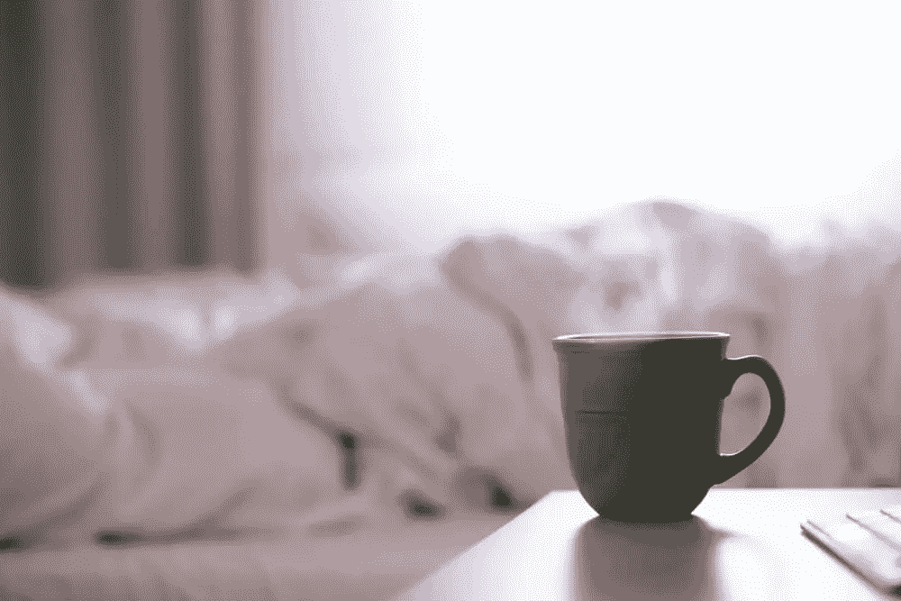
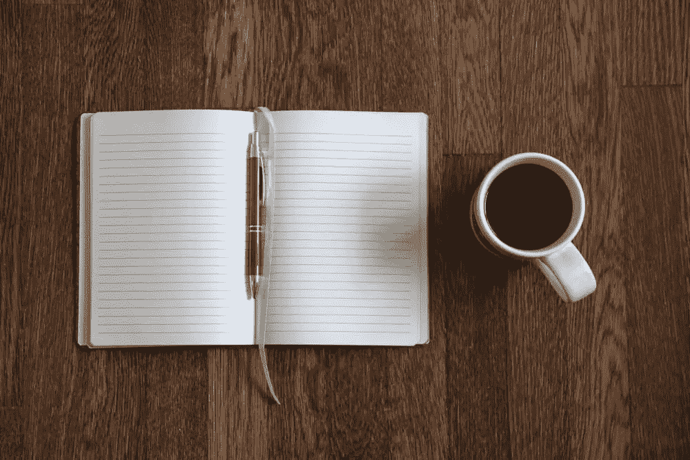
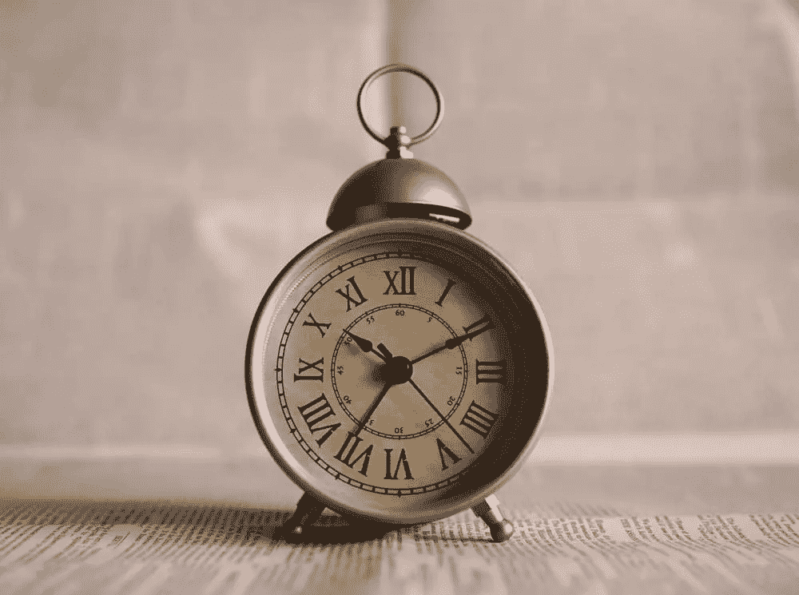

# 启动你创造性生产力的 7 个早晨习惯

> 原文：<https://www.sitepoint.com/7-morning-rituals-to-kickstart-your-creative-productivity/>

时间是企业家可以拥有的最重要的资产，但是一天中似乎没有足够的时间。即使你在办公桌前连续坐了 12 个小时，如果你没有有效地利用这段时间，你会在一天结束时感到没有成就感。

对大多数人来说，早晨是一天中最重要的时间，⏤。你早晨的行动为一天的其余时间定下了基调。不幸的是，我们大多数人醒来时都感到压力、疲惫，被待办事项清单上无数的任务压垮了。这种在一天开始时的消极心态只会让你走向失败。

一天有一个积极的开始将确保你一天的剩余时间也能如此。即使你不是一个真正的早起者(老实说，谁是呢？)，简单地制定一个常规就可以成为浪费的一天和有创造力的一天的区别。有条理可以减少压力，让你早上的思维更加清晰，准备好处理你已经有的想法，并产生更多的想法。

这里有 7 个早晨的习惯来启动你的创造性生产力！

## 1.锻炼

早上活跃起来是你能为创造力做的最好的事情之一。无论你是去跑步，做几个瑜伽姿势，还是做一些快速俯卧撑，你都在打破起床后去上班的可怕循环，⏤做一些积极的事情(或者只是不同的事情)的兴奋感可以带来更多创造性的见解。《Vogue》杂志的为安娜·温图尔打扮几乎每天早上 5:45 都会打一个小时的网球。

从科学上来说，运动还可以通过帮助血液流向大脑和释放内啡肽来鼓励我们大脑中的创造力，内啡肽是一种让你感觉愉悦的神经递质。快乐的人是有创造力的人！

## 2.冲凉

你可能是那种“头天晚上洗澡”的人，宁愿在床上多呆 30 分钟，但是如果早上洗澡能让你更有创造力呢？

早上洗个热水澡不仅能让你精力充沛，还能释放多巴胺，这是另一种增加肾上腺素和创造力的神经递质。当我们洗热水澡时，它会让我们放松，我们会在一定程度上变得心不在焉，沉浸在温水中的快乐中。

这种放松的心态促进了多巴胺的释放，让我们的创意源源不断。

或者，如果你足够勇敢，冷淋浴和对比淋浴(热 2-3 分钟，然后冷 1 分钟，重复)也被认为可以提高创造力。

当冷水浇到我们身上时，我们会感到震惊和肾上腺素激增。我们吸入更多的氧气来取暖，心率也会加快。这导致血液在我们的身体中流动，给我们能量提升和充满活力的感觉，我们需要用嗡嗡声开始新的一天。

## 3.开放式监控冥想

我们与周围环境的互动和经历激发了我们的创造力，鼓舞了我们，但有时我们太过不知所措和焦虑，以至于没有注意到它。一种冥想可以改变这种情况。

**开放式监控冥想**对创意者尤其有益。这种练习不会专注于一个单一的物体、人或概念(就像专注冥想一样)；相反，它让你对周围环境敞开心扉，并提高你的意识。这种思想开放的促进据说会持续一整天。

开放式监控冥想可以清除你头脑中的负面干扰，让你更加专注，从而让你受到周围事物的启发。

## 4.记下梦想日记

德米特里·门捷列夫梦想着元素的排列，然后在 1869 年他出版了第一版周期表。克里斯托弗·诺兰的《盗梦空间》和甲壳虫乐队 1965 年的经典单曲《昨日 T2》也存在，因为这个想法出现在一个梦里。我们做梦的时候会有很多想法(其中一些非常奇怪),但我们大多在醒来后几分钟内就忘记了。

写梦想日记是一种在早上激发创造力的有效方法。如果你一醒来就写下你所记得的关于梦的一切，你可能最终会从这些想法中创造出你最好的作品！

## 5.写 3 篇“晨报”

《晨报》是由作家朱莉娅·卡梅伦发起的一项运动。你每天早上醒来，写下 3 页纸(徒手)任何你想到的东西；你的感受，那天你要做什么，天气怎么样。想到什么就说什么。

当我们醒来时，我们有太多的事情要考虑，以至于我们无法清晰地思考。早间新闻就像一个“大脑垃圾场”,你通过把它写在纸上来清理你脑海中的一切。通过这样做，我们开始意识到一些想法是多么的不重要，或者为我们一直担心的任务和问题找到解决方案。

这种练习不仅能清除我们头脑中琐碎的想法(从而让创造性的想法取代它们)，还能让我们记住藏在我们脑海深处的创造性想法。

## 6.忽略你的收件箱

当我们醒来时，我们倾向于做的第一件事是从床头柜上拿起我们的联网设备，查看我们的电子邮件⏤:这是一个巨大的错误。一打开收件箱，你可能会收到一封来自客户或老板的邮件，提醒你当天需要做的工作。它会堵塞你的大脑，让你没有空间让创造性思维绽放。

我们早上只有有限的时间来为自己创造成功的一天做准备，如果浪费时间查看收件箱和脸书反馈，那将是一种耻辱。我相信我们都同意，看看你的朋友早餐吃了什么可以等到以后！

## 7.早点醒来

正如我之前提到的，我们早上只有非常有限的时间来为自己创造一天。比平常时间提前 30 分钟起床可以帮助你适应冥想或快速淋浴，否则你可能会因为时间不够而错过。

## 结论

我们如何度过时间很重要。最成功的企业家不是因为他们有更多的时间，而是因为他们知道如何利用好时间。

早上起床并遵循这些习惯会创造一个早晨的惯例，让你清除头脑中的压力和焦虑；它鼓励你被周围的事物所激励(向外思考)，而不是对即将到来的一天感到焦虑(向内思考)。当这是你的心态时，你将迎来一个巨大成功和充满创造力的一天。

你早上遵循什么常规来鼓励创造性的想法？请在评论中告诉我们！

## 分享这篇文章