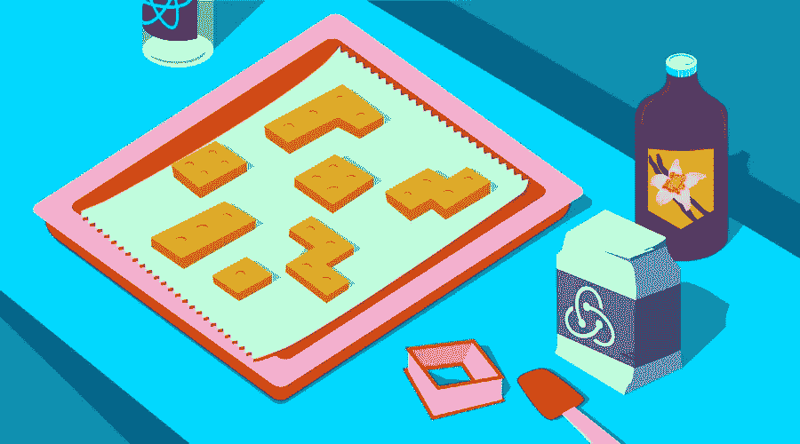
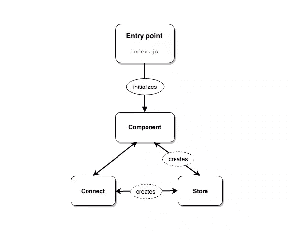

# Redux 不带 React——普通 JavaScript 中的状态管理

> 原文：<https://www.sitepoint.com/redux-without-react-state-management-vanilla-javascript/>

这篇文章由 [Vildan Softic](https://www.sitepoint.com/author/vildansoftic/) 进行了同行评审。感谢 SitePoint 的所有同行评审员使 SitePoint 的内容尽可能做到最好！



我是那些喜欢从头开始做事情并了解一切如何工作的开发人员之一。尽管我意识到了自己所做的(不必要的)工作，但它确实帮助我欣赏和理解了特定框架、库或模块背后的东西。

最近，我又经历了一次这样的时刻，开始使用 **Redux 开发一个 web 应用程序，除了普通的 JavaScript** 什么都不用。在这篇文章中，我想概述一下我是如何构建我的应用程序的，在查看我选定的解决方案和我在这个过程中学到的东西之前，检查一下我早期的(最终不成功的)迭代。

## 设置

你可能听说过流行的 [React.js](https://facebook.github.io/react/) 和 [Redux](http://redux.js.org/) 组合，用最新的前端技术构建快速而强大的 web 应用程序。

React 由脸书公司开发，是一个基于组件的开源库，用于构建用户界面。React 只是一个**视图层** *(不是 Angular 或 Ember 之类的完整框架)*，Redux 管理你应用的状态。它作为一个*可预测状态容器*，整个状态存储在一个单独的对象树中，只能通过发出一个所谓的*动作*来改变。如果你对这个话题完全陌生，我推荐你看看这篇说明性的文章。

对于本文的其余部分，不要求成为 Redux 方面的专家，但是至少对它的概念有一个基本的理解肯定是有帮助的。

## Redux without React —从零开始的应用程序

Redux 的伟大之处在于它迫使您提前思考，并对您的应用程序设计有一个早期的了解。您开始定义实际应该存储什么，哪些数据可以而且应该更改，以及哪些组件可以访问存储。但是由于 Redux 只关心状态，我发现自己对如何构造和连接应用程序的其余部分有点困惑。React 很好地指导您完成了所有的工作，但是没有它，就要由我来决定什么是最有效的。

有问题的应用程序是一个移动优先的俄罗斯方块克隆，它有几个不同的视图。实际游戏逻辑在 Redux 中完成，而离线能力由`localStorage`提供，自定义视图处理。这个库可以在 [GitHub](https://github.com/morkro/tetrys) 上找到，尽管这个应用程序仍在积极开发中，我在写这篇文章的时候也在使用它。

## 定义应用程序架构

我决定采用 Redux 和 React 项目中常见的文件结构。这是一个逻辑结构，适用于许多不同的设置。在这个主题上有许多 [变体](http://engineering.kapost.com/2016/01/organizing-large-react-applications/)[，并且大多数项目做的事情略有不同，但是整体结构是相同的。](http://marmelab.com/blog/2015/12/17/react-directory-structure.html)

[src/scripts/](https://github.com/morkro/tetrys/tree/master/src/scripts)

```
actions/
├── game.js
├── score.js
└── ...
components/
├── router.js
├── pageControls.js
├── canvas.js
└── ...
constants/
├── game.js
├── score.js
└── ...
reducers/
├── game.js
├── score.js
└── ...
store/
├── configureStore.js
├── connect.js
└── index.js
utils/
├── serviceWorker.js
├── localStorage.js
├── dom.js
└── ...
index.js
worker.js 
```

我的标记被分离到另一个目录中，最终由一个单独的`index.html`文件呈现。结构类似于`scripts/`，这样可以在我的代码库中保持一致的架构。

[src/markup/](https://github.com/morkro/tetrys/tree/master/src/markup)

```
layouts/
└── default.html
partials/
├── back-button.html
└── meta.html
pages/
├── about.html
├── settings.html
└── ...
index.html 
```

## 管理和访问商店

要访问商店，需要创建一次，然后传递给应用程序的所有实例。大多数框架都使用某种[依赖注入](https://en.wikipedia.org/wiki/Dependency_injection)容器，所以作为框架的用户，我们不必想出自己的解决方案。但是，在推出我自己的解决方案时，我如何才能让我的所有组件都可以访问它呢？

我的第一次迭代有点失败。我不知道为什么我认为这是一个好主意，但是我把商店放在它自己的模块(`scripts/store/index.js`)中，然后它可以被我的应用程序的其他部分导入。我最终后悔了，并很快处理了[循环依赖](https://en.wikipedia.org/wiki/Circular_dependency)。问题是当组件试图访问存储时，存储没有正确初始化。我制作了一个图表来展示我正在处理的依赖流:



应用程序入口点正在初始化所有组件，然后这些组件直接或通过助手函数(这里称为 *connect* )在内部使用存储。但是由于存储不是显式创建的，而只是作为它自己的模块中的一个副作用，组件在存储被创建之前就已经使用它了。没有办法控制组件或助手函数何时第一次调用存储。当时很混乱。

商店模块如下所示:

`scripts/store/index.js` *(☓坏)*

```
import { createStore } from 'redux'
import reducers from '../reducers'

const store = createStore(reducers)

export default store
export { getItemList } from './connect' 
```

如上所述，商店是作为副作用创建的，然后被导出。助手功能也需要存储。

`scripts/store/connect.js` *(☓坏)*

```
import store from './'

export function getItemList () {
  return store.getState().items.all
} 
```

这就是我的组件最终成为[相互递归](https://rosettacode.org/wiki/Mutual_recursion)的确切时刻。助手函数需要`store`来运行，同时从存储初始化文件中导出，使它们可以被我的应用程序的其他部分访问。你知道这听起来有多乱吗？

### 解决方案

现在看来显而易见的事情，我花了一段时间才明白。我通过将初始化转移到我的应用程序入口点 ( `scripts/index.js`)来解决这个问题，并将其传递给所有需要的组件。

同样，这非常类似于 React 如何使商店可访问*(查看[源代码](https://github.com/reactjs/react-redux/blob/master/src/components/Provider.js#L23) )* 。它们合作得如此之好是有原因的，为什么不借鉴它的理念呢？


应用程序入口点首先创建存储，然后将其传递给所有组件。然后，组件可以*将*与存储和分派动作连接起来，订阅更改或获取特定数据。

让我们来看看这些变化:

[scripts/store/configure store . js](https://github.com/morkro/tetrys/blob/master/src/scripts/store/configureStore.js)T2【好】

```
import { createStore } from 'redux'
import reducers from '../reducers'

export default function configureStore () {
  return createStore(reducers)
} 
```

我保留了这个模块，但是导出了一个名为`configureStore`的函数，这个函数在我的代码库中的其他地方创建了存储。*注意，这只是基本概念；我还利用了 [Redux DevTools 扩展](https://github.com/zalmoxisus/redux-devtools-extension)，并通过`localStorage`加载一个持久状态。*

[scripts/store/connect . js](https://github.com/morkro/tetrys/blob/master/src/scripts/store/connect.js)T2【好】

```
export function getItemList (store) {
  return store.getState().items.all
} 
```

`connect` helper 函数基本上没有改动，但是现在需要将存储作为参数传递。起初我对使用这个解决方案犹豫不决，因为我认为*“那么助手功能有什么意义呢？”*。现在我认为它们足够好和高水平，使一切更具可读性。

[脚本/索引. js](https://github.com/morkro/tetrys/blob/master/src/scripts/index.js)

```
import configureStore from './store'
import { PageControls, TetrisGame } from './components'

const store = configureStore()
const pageControls = new PageControls(store)
const tetrisGame = new TetrisGame(store)

// Further initialization logic. 
```

这是应用程序的入口点。创建了`store`,并传递给所有组件。`PageControls`为特定的动作按钮添加全局事件监听器，`TetrisGame`是实际的游戏组件。在将商店移到这里之前，它看起来基本上是一样的，但是没有将商店单独传递给所有模块。如前所述，组件可以通过我失败的`connect`方法访问商店。

## 成分

我决定使用两种组件:*表示组件*和*容器组件*。
表示组件除了纯粹的 DOM 处理之外什么也不做；他们不知道这家商店。另一方面，容器组件可以分派动作或订阅更改。

Dan Abramov 写了一篇关于 React 组件的很棒的文章，但是这种方法也可以应用于任何其他的组件架构。

对我来说，也有例外。有时候一个组件真的很小，只做一件事。我不想把它们分成前面提到的模式，所以我决定把它们混合起来。如果组件增长并获得更多逻辑，我会将其分离。

[脚本/组件/页面控件. js](https://github.com/morkro/tetrys/blob/master/src/scripts/components/pageControls.js)

```
import { $$ } from '../utils'
import { startGame, endGame, addScore, openSettings } from '../actions'

export default class PageControls {
  constructor ({ selector, store } = {}) {
    this.$buttons = [...$$('button, [role=button]')]
    this.store = store
  }

  onClick ({ target }) {
    switch (target.getAttribute('data-action')) {
    case 'endGame':
      this.store.dispatch(endGame())
      this.store.dispatch(addScore())
      break
    case 'startGame':
      this.store.dispatch(startGame())
      break
    case 'openSettings':
      this.store.dispatch(openSettings())
      break
    default:
      break
    }

    target.blur()
  }

  addEvents () {
    this.$buttons.forEach(
      $btn => $btn.addEventListener('click', this.onClick.bind(this))
    )
  }
} 
```

上面的例子就是这些组件中的一个。它有一个元素列表(在本例中，所有元素都有一个`data-action`属性)，并根据属性内容在单击时调度一个动作。没别的了。然后，其他模块可能会监听存储中的变化，并相应地更新自己。如前所述，如果组件也进行了 DOM 更新，我会将其分开。

现在，让我向您展示两种组件类型的清晰分离。

## 更新 DOM

在项目开始时，我遇到的一个更大的问题是如何更新 DOM。React 使用一种叫做[虚拟 DOM](http://reactkungfu.com/2015/10/the-difference-between-virtual-dom-and-dom/) 的 DOM 的[快速内存表示来保持 DOM 更新最少。](https://facebook.github.io/react/docs/working-with-the-browser.html)

我实际上也在考虑这么做，如果我的应用程序变得更大更重，我也可以切换到虚拟 DOM，但是现在我做的是 T2 经典的 DOM 操作，用 Redux 也可以。

基本流程如下:

*   一个容器组件的新实例被初始化并传递给`store`供内部使用
*   该组件订阅存储中的更改
*   并使用不同的表示组件在 DOM 中呈现更新

*注意:我是 JavaScript 中任何与 DOM 相关的符号前缀的粉丝。正如您可能已经猜到的，它取自 jQuery 的`$`。因此，纯表示性的组件文件名以美元符号为前缀。*

[脚本/索引. js](https://github.com/morkro/tetrys/blob/master/src/scripts/index.js)

```
import configureStore from './store'
import { ScoreObserver } from './components'

const store = configureStore()
const scoreObserver = new ScoreObserver(store)

scoreObserver.init() 
```

这里没什么特别的。容器组件`ScoreObserver`被导入、创建和初始化。它实际上是做什么的？它更新所有与分数相关的视图元素:高分列表，以及在游戏过程中，当前的分数信息。

[脚本/组件/scoreObserver/index.js](https://github.com/morkro/tetrys/blob/master/src/scripts/components/scoreObserver/index.js)

```
import { isRunning, getScoreList, getCurrentScore } from '../../store'
import ScoreBoard from './$board'
import ScoreLabel from './$label'

export default class ScoreObserver {
  constructor (store) {
    this.store = store
    this.$board = new ScoreBoard()
    this.$label = new ScoreLabel()
  }

  updateScore () {
    if (!isRunning(this.store)) {
      return
    }

    this.$label.updateLabel(getCurrentScore(this.store))
  }

  // Used in a different place.
  updateScoreBoard () {
    this.$board.updateBoard(getScoreList(this.store))
  }

  init () {
    this.store.subscribe(this.updateScore.bind(this))
  }
} 
```

请记住，这是一个简单的组件；其他组件可能有更复杂的逻辑和需要处理的事情。这是怎么回事？`ScoreObserver`组件保存一个对`store`的内部引用，并创建两个表示组件的新实例供以后使用。`init`方法订阅商店更新，并在每次商店更改时更新`$label`组件——但前提是游戏实际运行。

`updateScoreBoard`方法用在不同的地方。每次发生变化时更新列表是没有意义的，因为视图无论如何都不是活动的。还有一个路由组件，它在每次视图更改时更新或停用不同的组件。它的 API 大致如下:

```
// scripts/index.js

route.onRouteChange((leave, enter) => {
  if (enter === 'scoreboard') {
    scoreObserver.updateScoreBoard()
  }

  // more logic...
}) 
```

*注意:`$`(和`$$`)不是 jQuery 参考，而是`document.querySelector`的便捷实用快捷方式。*

[脚本/组件/scoreObserver/$board.js](https://github.com/morkro/tetrys/blob/master/src/scripts/components/scoreObserver/%24board.js)

```
import { $ } from '../../utils'

export default class ScoreBoard {
  constructor () {
    this.$board = $('.tetrys-scoreboard')
  }

  emptyBoard () {
    this.$board.innerHTML = ''
  }

  createListItem (txt) {
    const $li = document.createElement('li')
    const $span = document.createElement('span')
    $span.appendChild(document.createTextNode(txt))
    $li.appendChild($span)
    return $li
  }

  updateBoard (list = []) {
    const fragment = document.createDocumentFragment()
    list.forEach((score) => fragment.appendChild(this.createListItem(score)))
    this.emptyBoard()
    this.$board.appendChild(fragment)
  }
} 
```

同样，一个基本的例子和一个基本的组成部分。`updateBoard()`方法获取一个数组，遍历它，并将其内容插入到分数列表中。

[脚本/组件/scoreObserver/$label.js](https://github.com/morkro/tetrys/blob/master/src/scripts/components/scoreObserver/%24label.js)

```
import { $ } from '../../utils'

export default class ScoreLabel {
  constructor () {
    this.$label = $('.game-current-score')
    this.$labelCount = this.$label.querySelector('span')
    this.initScore = 0
  }

  updateLabel (score = this.initScore) {
    this.$labelCount.innerText = score
  }
} 
```

这个组件几乎和上面的`ScoreBoard`完全一样，但是只更新了一个元素。

## 其他错误和建议

另一个要点是实现一个*用例驱动的*存储。在我看来，重要的是**只存储对应用程序来说必不可少的东西。在最开始，我存储了几乎所有的东西:当前活动视图、游戏设置、分数、悬停效果、*用户的呼吸模式*等等。**

虽然这可能与一个应用程序相关，但与另一个应用程序无关。存储当前视图，并在重新加载时在完全相同的位置继续可能是好的，但在我的情况下，这感觉像是糟糕的用户体验，并且与其说有用，不如说烦人。你也不想存储菜单或模态的切换，是吗？为什么用户应该回到那个特定的状态？这在更大的 web 应用程序中可能是有意义的。但是在我的小型移动游戏中，仅仅因为我离开了那里就回到设置屏幕是相当烦人的。

## 结论

我在有和没有 React 的情况下都做过 Redux 项目，我的主要收获是，应用程序设计中的巨大差异是不必要的。React 中使用的大多数方法实际上可以适用于任何其他视图处理设置。我花了一段时间才意识到这一点，因为我开始认为*我必须以不同的方式做事情*，但最终我认为这没有必要。

然而，*与*不同的是你初始化你的模块、你的存储的方式，以及一个组件对整个应用程序状态的感知程度。概念保持不变，但是实现和代码量完全适合您的需求。

Redux 是一个很棒的工具，它可以帮助你以一种更加深思熟虑的方式构建你的应用程序。在没有任何视图库的情况下单独使用时，一开始可能会很棘手，但是一旦你克服了最初的困惑，就没有什么能阻止你了。

你觉得我的方法怎么样？你有没有在不同的视图处理设置中单独使用 Redux？我很想得到你的反馈，并在评论中讨论它。

* * *

如果你想了解更多关于 Redux 的信息，请查看我们的课程[重写和测试 Redux 以解决设计问题](https://www.sitepoint.com/premium/courses/redux-design-issues-and-testing-2962)迷你课程。在本课程中，您将构建一个 Redux 应用程序，通过 websocket 连接接收按主题组织的推文。为了让你初步了解即将推出的产品，请查看下面的免费课程。

## 分享这篇文章