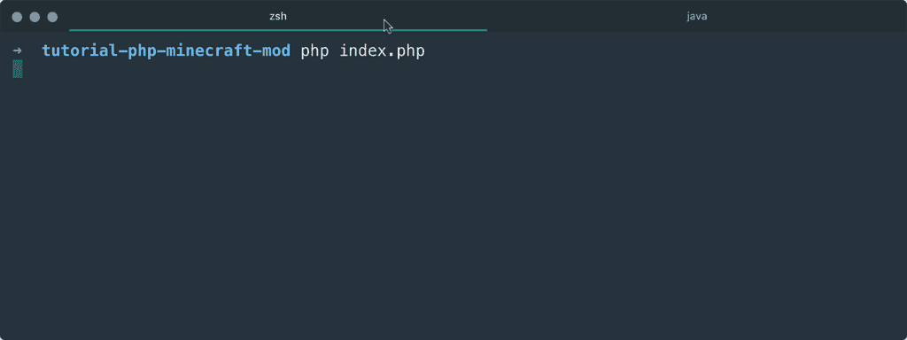
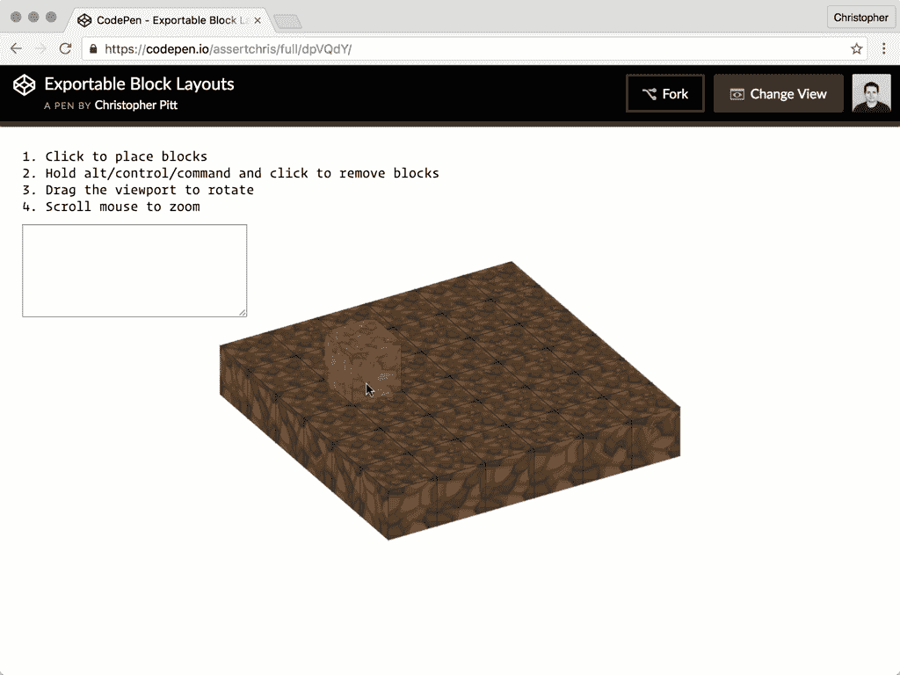
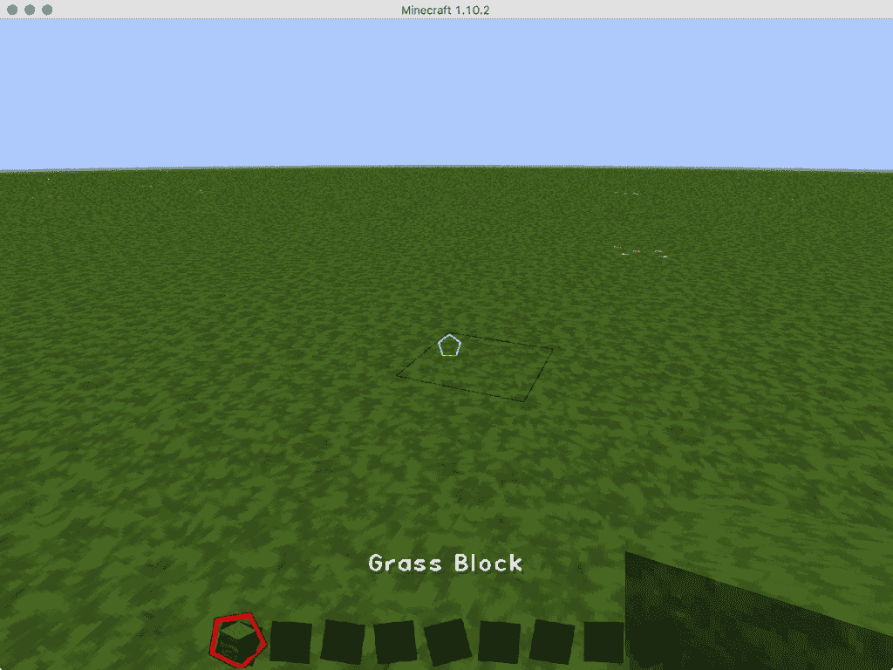

# 用 PHP 修改《我的世界》——从代码中构建！

> 原文：<https://www.sitepoint.com/modding-minecraft-with-php-buildings-from-code/>

我一直想做一个《我的世界》模型。可悲的是，我从来没有非常喜欢重新学习 Java，这似乎总是一个要求。直到最近。


感谢顽强的坚持，我实际上发现了一种制作 Minecraft mods 的方法，而不需要真正了解 Java。这里有一些技巧和注意事项，可以让我们在自己的 PHP 中轻松地制作出我们想要的所有模块。

这只是冒险的一半。在另一篇文章中，我们将看到一个整洁的 3D JavaScript《我的世界》编辑器。如果这听起来像是你想学的东西，一定要去看看那个帖子。

本教程的大部分代码可以在 Github 上找到[。我已经测试了最新版本 Chrome 中的所有 JavaScript 位和 PHP 7.0 中的所有 PHP 位。我不能保证它在其他浏览器中看起来完全一样，或者在 PHP 的其他版本中也一样，但是核心概念是通用的。](https://github.com/assertchris-tutorials/tutorial-php-minecraft-mod)

## 设置事物

你马上就会看到，我们将在 PHP 和《我的世界》服务器之间进行负载通信。只要我们需要 mod 的功能，我们就需要一个脚本来运行。我们可以使用传统的忙循环:

```
while (true) {
    // listen for player requests
    // make changes to the game

    sleep(1);
} 
```

…或者我们可以做一些更有趣的事情。

我变得非常喜欢 AMPHP。它是一个异步 PHP 库的集合，包括 HTTP 服务器和客户端，以及一个事件循环。如果你不熟悉这些东西，不要担心。我们会慢慢来。

让我们首先创建一个事件循环和一个函数来监视文件的变化。我们需要安装事件循环和文件系统库:

```
composer require amphp/amp
composer require amphp/file 
```

然后，我们可以启动一个事件循环，并检查以确保它按预期运行:

```
require __DIR__ . "/vendor/autoload.php";

Amp\run(function() {
    Amp\repeat(function() {
        // listen for player requests
        // make changes to the game
    }, 1000);
}); 
```

这类似于我们的无限循环，除了它是非阻塞的。这意味着我们将能够执行更多的并发操作，同时等待通常会阻塞进程的操作。

## 穿过应许之地的一小段弯路

除了这个包装器代码，AMPHP 还提供了一个简洁的基于 [promise](https://promisesaplus.com) 的接口。您可能已经熟悉这个概念(来自 JavaScript)，但这里有一个简单的例子:

```
$eventually = asyncOperation();

$eventually
    ->then(function($data) {
        // do something with $data
    })
    ->catch(function(Exception $e) {
        // oops, something went wrong!
    }); 
```

承诺是一种表示我们还没有的数据的方式——最终的价值。它可能很慢(比如文件系统操作或 HTTP 请求)。

关键是我们没有立即获得价值。我们不是在前台等待值(传统上这会阻塞进程)，而是在后台等待它。在后台等待的同时，我们可以在前台做其他有意义的工作。

AMPHP 承诺更进一步，使用发电机。在一次会议中解释这一切可能有点紧张，但请耐心听我说。

生成器是迭代器的语法简化。也就是说，它们减少了我们需要编写的代码量，从而能够迭代数组中尚未定义的值。此外，它们使得将数据发送到生成这些值的函数中成为可能(当它正在生成时)。开始感觉到一种模式了吗？

生成器允许我们按需构建下一个数组项目。承诺代表最终的价值。因此，我们可以重新调整生成器的用途，以生成一系列步骤(或行为)，这些步骤(或行为)可以按需执行。

通过查看一些代码，这可能更容易理解:

```
use Amp\File\Driver;

function getContents(Driver $files, $path, $previous) {
    $next = yield $files->mtime($path);

    if ($previous !== $next) {
        return yield $files->get($path);
    }

    return null;
} 
```

让我们考虑一下这在同步执行中是如何工作的:

1.  呼叫`getContents`
2.  调用`$files->mtime($path)`(想象这只是一个 [`filemtime`](http://php.net/function.filemtime) 的代理)
3.  等待`filemtime`返回
4.  调用`$files->get($path)`(想象这只是一个 [`file_get_contents`](http://php.net/function.file_get_contents) 的代理)
5.  等待`file_get_contents`返回

有了承诺，我们可以避免阻塞，代价是一些新的闭包:

```
function getContents($files, $path, $previous) {
    $files->mtime($path)->then(
        function($next) use ($previous) {
            if ($previous !== $next) {
                $files->get($path)->then(
                    function($data) {
                        // do something with $data
                    }
                )
            }

            // do something with null
        }
    );
} 
```

由于承诺是可链接的，我们可以将其简化为:

```
function getContents($files, $path, $previous) {
    $files->mtime($path)->then(
        function($next) use ($previous) {
            if ($previous !== $next) {
                return $files->get($path);
            }

            // do something with null
        }
    )->then(
        function($data) {
            // do something with data
        }
    );
} 
```

我不知道你怎么想，但对我来说这还是有点乱。那么发电机如何适应这种情况呢？嗯，AMPHP 使用`yield`关键字来评估承诺。我们再来看看`getContents`函数:

```
function getContents(Driver $files, $path, $previous) {
    $next = yield $files->mtime($path);

    if ($previous !== $next) {
        return yield $files->get($path);
    }

    return null;
} 
```

`$files->mtime($path)`回报承诺。函数不再等待查找完成，而是在遇到关键字`yield`时停止运行。过了一会儿，AMPHP 被通知 stat 操作已经完成，它恢复这个功能。

然后，如果时间戳不匹配，`files->get($path)`获取内容。这是另一个阻塞操作，所以`yield`再次暂停该功能。当文件被读取时，AMPHP 将再次启动这个函数(返回文件内容)。

这段代码看起来类似于同步替代方案，但是使用了承诺(透明地)和生成器来使其非阻塞。

*AMPHP 与 Promises A+规范略有不同，因为 AMPHP promises 不支持`then`方法。其他 PHP 实现，像 [React/Promise](https://github.com/reactphp/promise) 和 [Guzzle Promises](https://github.com/guzzle/promises) 都是这样。重要的是理解承诺的最终本质，以及它们如何与生成器接口，以支持这种简洁的异步语法。*

## 监听日志

上次我写了关于《我的世界》的文章，是关于利用《我的世界》一所房子的门来触发现实世界的警报。在那篇文章中，我们简要介绍了从《我的世界》服务器获取数据并将其放入 PHP 的过程。

这一次，我们花了更长的时间，但我们本质上做的是同样的事情。让我们看看识别玩家命令的代码:

```
define("LOG_PATH", "/path/to/logs/latest.log");

$files = Amp\File\filesystem();

// get reference data

$commands = [];
$timestamp = yield $filesystem->mtime(LOG_PATH);

// listen for player requests

Amp\repeat(function() use ($files, &$commands, &$timestamp) {
    $contents = yield from getContents(
        $files, LOG_PATH, $timestamp
    );

    if (!empty($contents)) {
        $lines = array_reverse(explode(PHP_EOL, $contents));

        foreach ($lines as $line) {
            $isCommand = stristr($line, "> >") !== false;
            $isNotRepeat = !in_array($line, $commands);

            if ($isCommand && $isNotRepeat) {
                // execute mod command

                array_push($commands, $line);

                print "executing: " . $line . PHP_EOL;
                break;
            }
        }
    }
}, 500); 
```

我们从获取引用文件的时间戳开始。我们用这个来判断文件是否已经改变(在`getContents`函数中)。我们还创建了一个空列表，在那里我们将存储所有已经执行过的命令。这个列表将帮助我们避免两次执行同一个命令。

*您需要将`/path/to/logs/latest.log`替换为《我的世界》服务器日志文件的路径。我推荐运行[独立的《我的世界》服务器](https://minecraft.net/en/download/server)，它应该把`logs/latest.log`放在根目录下。*

我们已经告诉`Amp\repeat`每隔`500`毫秒运行一次这个闭包。在此期间，我们检查文件更改。如果时间戳已经更改，我们将日志文件的行分割成一个数组，并反转它(这样我们首先读取最近的消息)。

如果一行包含“> >”(如果玩家输入“>某个命令就会发生这种情况)，我们假设该行包含一个命令指令。



## 创建蓝图

在《我的世界》，最耗时的事情之一就是建造大型建筑。如果我能把它们计划出来(使用一些时髦的 3D JavaScript 生成器)，然后用一个特殊的命令把它们放到这个世界上，那就简单多了。

我们可以使用我在前面提到的另一篇文章中提到的构建器的[稍加修改的版本](https://codepen.io/assertchris/full/dpVQdY)来生成自定义块放置的列表:



目前，这个建筑商只允许放置泥土块。它生成的数组结构是放置的每个污垢块的`x`、`y`、`z`坐标(初始场景渲染后)。我们可以把它复制到我们一直在做的 PHP 脚本中。我们还应该弄清楚如何确定确切的命令来构建我们设计的任何结构:

```
$isCommand = stristr($line, "> >") !== false;
$isNotRepeat = !in_array($line, $commands);

if ($isCommand && $isNotRepeat) {
    array_push($commands, $line);
    executeCommand($line);
    break;
}

// ...later

function executeCommand($raw) {
    $command = trim(
        substr($raw, stripos($raw, "> >") + 3)
    );

    if ($command === "build") {
        $blocks = [
            // ...from the 3D builder
        ];

        foreach ($block as $block) {
            // ... place each block
        }
    }
} 
```

每次我们收到一个命令，我们可以把它传递给`executeCommand`函数。在那里，我们从第二个`>`提取到行尾。我们此刻只需要确定`build`的命令。

## 与服务器对话

监听日志是一回事，但是我们如何与服务器通信呢？独立服务器启动一个管理聊天服务器(称为 RCON)。这是相同的管理聊天服务器，使其他游戏中的 mods，如反恐精英。

原来有人已经构建了一个 RCON 客户端(尽管有些阻塞)，最近我为此写了一个很好的包装器。我们可以安装它:

```
composer require theory/builder 
```

让我为图书馆的庞大道歉。我包含了一个版本的《我的世界》独立服务器，这样我就可以为这个库构建自动化测试。太匆忙了……

我们需要配置我们的独立服务器，以便我们可以对它进行 RCON 连接。将以下内容添加到服务器`jar`所在的文件夹中的`server.properties`文件中:

```
enable-query=true
enable-rcon=true
query.port=25565
rcon.port=25575
rcon.password=password 
```

重新启动后，我们应该能够使用类似如下的代码连接到服务器:

```
$builder = new Client("127.0.0.1", 25575, "password");
$builder->exec("/say hello world"); 
```

我们可以改进我们的`executeCommand`功能来构建一个完整的结构:

```
function executeCommand($builder, $raw) {
    $command = trim(
        substr($raw, stripos($raw, "> >") + 3)
    );

    if (stripos($command, "build") === 0) {
        $parts = explode(" ", $command);

        if (count($parts) < 4) {
            print "invalid coordinates";
            return;
        }

        $x = $parts[1];
        $y = $parts[2];
        $z = $parts[3];

        $blocks = [
            // ...from the 3D builder
        ];

        $builder->exec("/say building...");

        foreach ($blocks as $block) {
            $dx = $block[0] + $x;
            $dy = $block[1] + $y;
            $dz = $block[2] + $z;

            $builder->exec(
                "/setblock {$dx} {$dy} {$dz} dirt"
            );

            usleep(500000);
        }
    }
} 
```

新的和改进的`executeCommand`函数检查命令(类似于`<player_name> > build`的消息)是否以单词“build”开始。

*如果构建器是非阻塞的，那么使用`yield new Amp\Pause(500)`，而不是`usleep(500000)`，会好得多。我们还需要将`executeCommand`视为一个生成器函数，我们在这里调用它，这意味着使用`yield executeCommand(...)`。*

如果是的话，这个命令会被空格分开，以获得应该构建设计的`x`、`y`和`z`坐标。然后，它获取我们从设计器中生成的数组，并将每个块放入世界中。



## 从这里去哪里？

您可能会想到我们刚刚创建的这个简单的 mod 类脚本的许多有趣的扩展。设计者可以被扩展以创建由许多不同种类和配置的块组成的布置。

mod 脚本可以扩展为通过 JSON API 接收更新，这样设计者就可以提交命名的设计，而`build`命令可以精确地指定玩家想要构建的设计。

我会把这些想法留给你作为练习。别忘了查看一下[的配套 JavaScript 帖子](https://www.sitepoint.com/javascript-3d-minecraft-editor)，如果你有任何想法或评论要分享，请在评论中提出！

## 分享这篇文章