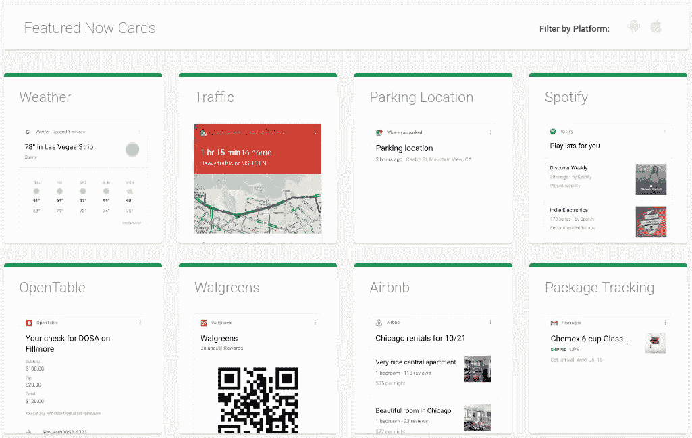

# 引导卡简介:引导卡变得简单

> 原文：<https://www.sitepoint.com/introducing-bootcards-bootstrap-cards-made-easy/>


Bootcards 是一个用于卡片界面的 UI 框架。顾名思义，它基于 Bootstrap 框架，具有桌面和移动双面板功能。

如今信息无处不在，有时大量的信息会让我们困惑。随着移动设备的兴起，UX 的设计师们一直试图创造出简约而又不会让用户信息过载的界面。

卡片界面越来越受欢迎，主要是因为它们专注于重要的东西，而且在图形上很吸引人。

[Bootcards](http://www.bootcards.org/) 主要用于列表、摘要卡、不同类型的文件卡和媒体卡，如 Twitter 卡。当我们想要创建包含比平常更多信息的列表时，这个框架很有帮助。Bootcards 的另一个用例与摘要卡有关，它是创建基于卡的仪表板的一种很好的方式。

## 为什么是卡片

卡片现在很流行。它们通过将焦点严格集中在关键点上，准确地展示了用户想要的东西。您可以使用卡片来显示联系人详细信息、摘要、文件信息等。这种模式将内容分解成小组件，并以醒目的设计方式排列。

谷歌、Spotify、Pinterest 和亚马逊等许多大公司都在他们的设计中使用了卡片，尤其是在移动设备中。当卡片第一次被 Twitter 使用时，它变得越来越重要。推特卡片于 2012 年推出，从那以后，宣传开始升温。

基于卡片的布局由文本、图像、视频等组成，所有这些组成了一个有价值的信息组合。Twitter 使用卡片在用户和内容之间建立联系:用户可以快速找到对他们来说重要的摘要，而不必浏览整个内容。使用推特卡的另一个很好的原因是提高你的推特参与度。



Google Now Cards 的口号是在正确的时间提供正确的信息。Google Now 卡通过只显示有价值的信息来实现这一点，重点是移动用户的需求。

Bootcards 提供了一整套创建高质量卡的功能。该框架针对所有设备和媒体查询进行了优化。另一个优点是它的原生外观和感觉。它为每个平台提供了单独的样式表:iOS、Android 或桌面。

## 快速启动启动卡

在本节中，我们将学习如何在引导卡的帮助下创建卡片。首先，在添加 Bootcards 文件之前，我们需要添加 [Bootstrap](http://www.getbootstrap.com/) 。接下来，您可以添加 Bootcards 的特定于操作系统的 CSS 文件(桌面、Android 或 iOS)及其 JavaScript 文件。

Bootcards 拥有特定于操作系统的 CSS 文件的原因是为了提供一个可以根据您使用的平台改变其外观和感觉的 UI。不同的 CSS 文件将改变默认的标题颜色，使导航栏可折叠和其他用户界面的变化。请注意，您只需要加载一种类型的 CSS 文件，这取决于用来查看您的网页的设备。

```
<link href="//maxcdn.bootstrapcdn.com/bootstrap/3.3.4/css/bootstrap.min.css" rel="stylesheet">

<!-- Important: you'll only need one of the Bootcards CSS files below for every platform -->

<!-- Bootcards CSS for iOS: -->
<link rel="stylesheet" href="//cdnjs.cloudflare.com/ajax/libs/bootcards/1.0.0/css/bootcards-ios.min.css">

<!-- Bootcards CSS for Android: -->
<link rel="stylesheet" href="//cdnjs.cloudflare.com/ajax/libs/bootcards/1.0.0/css/bootcards-android.min.css">

<!-- Bootcards CSS for desktop: -->
<link rel="stylesheet" href="//cdnjs.cloudflare.com/ajax/libs/bootcards/1.0.0/css/bootcards-desktop.min.css">

<!-- Bootstrap and Bootcards JS -->
<script src="//netdna.bootstrapcdn.com/bootstrap/3.2.0/js/bootstrap.min.js"></script>
<script src="//cdnjs.cloudflare.com/ajax/libs/bootcards/1.0.0/js/bootcards.min.js"></script>
```

您可以通过添加它的 CSS 文件来开始使用 Bootcards，但是为了增强可用性，请确保您包括下面的 JavaScript 函数:

```
bootcards.init({
  offCanvasBackdrop: true,
  offCanvasHideOnMainClick: true,
  enableTabletPortraitMode: true,
  disableRubberBanding: true
});
```

如果您的目标是移动或 iOS 用户，这些选项尤其有用。要在显示 offcanvas 菜单时显示背景，请将`offCanvasBackdrop`设置为`true`。如果你想在点击时隐藏 offcanvas 菜单，你可以使用`offCanvasHideOnMainClick`。您还可以通过将`enableTabletPortraitMode`设置为`true`来启用纵向模式下的平板电脑的单面板模式。上面最后一个设置`disableRubberBanding`，用于禁用 iOS 设备上的橡皮筋效果。

## 创造更好的卡片

在我们设置好环境之后，我们可以开始创建一些样本卡。如果你愿意跟随，你可以在 GitHub 上找到这些样本。我们将讨论这个框架中最常用的组件及其用途。

### 详细列表和基本卡

我们将构建的第一个 Bootcards 示例是一个显示公司详细信息的联系人列表，顶部是一个[搜索表单](http://bootcards.org/site/docs.html#doc-listsearch)。当我们点击公司名称时，联系人列表将得到增强。该列表由两部分组成:详细列表和基本卡。

[详细列表](http://bootcards.org/site/docs.html#doc-listdetail)可以用来显示公司名称和一些关于公司的小细节。如果用户想要了解特定公司的更多信息，他们可以单击该公司详细列表上的链接，显示相应的基本卡和相应的公司详细信息。

[基本卡片](http://bootcards.org/site/docs.html#doc-basecard)是用于详细描述的最佳卡片类型，因为它们以列表形式显示信息。每个列表都用分隔线隔开。

最后，详细列表和基本卡是相互关联的:在我们的演示中，详细列表中的每个公司都在相应的基本卡中显示其完整信息。

见笔 [Bootcards:在](https://codepen.io/SitePoint/pen/NRrpJa) [CodePen](http://codepen.io) 上通过 SitePoint ( [@SitePoint](http://codepen.io/SitePoint) )详细列出&底牌。