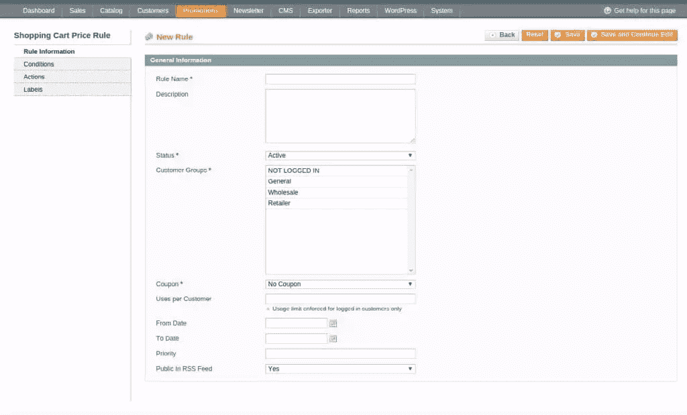
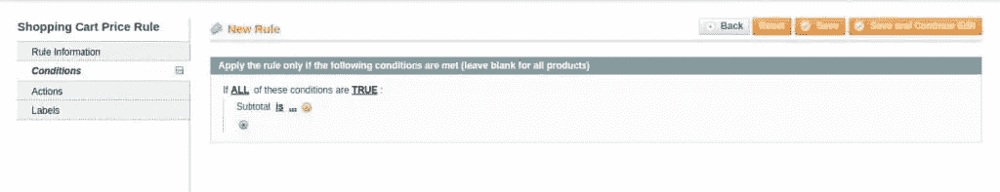
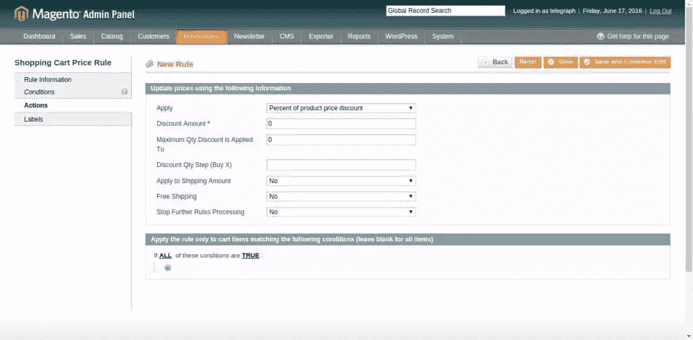

# 快速提示:如何将优惠券添加到 Magento 电子商务商店

> 原文：<https://www.sitepoint.com/quick-tip-how-to-add-coupons-to-a-magento-ecommerce-store/>

假设您想在 Magento 电子商务商店上开展促销活动；或者给你的用户促销折扣；或者买一送一。

Magento 允许管理员创建优惠券代码，并设置条款和条件。Magento 2 更新使得为您的活动创建优惠券代码变得更加容易。

优惠券代码可以与购物车价格规则一起使用，以应用根据特定条件预设的折扣。优惠券代码可以为特定的客户群生成，也可以为任何购买超过一定金额的人生成。优惠券可以通过电子邮件发送给顾客，或者 Magento 商店的老板可以为移动用户创建店内优惠券。

## 从管理面板添加优惠券

让我们看看如何从管理面板添加优惠券。

登录管理面板后，导航至**促销>购物车促销规则**。

新页面向您显示所有已添加的购物车促销价格规则。要添加新规则，点击右侧的**添加新规则**按钮。

这将加载一个新页面，您可以通过该页面添加新规则。

以下是字段详细信息:

*   **规则名称**:标识和描述规则的名称。
*   **描述**:详细说明其用途。
*   **状态**:有效/无效申请/不申请。
*   **客户群**:选择*普通*和*未登录*，覆盖访问前端的访客和注册用户。
*   **优惠券**:从下拉菜单中选择*特定优惠券*，并在其下方的字段中添加您的唯一优惠券代码。您还可以设置每张优惠券的*使用次数*和每名客户的*使用次数*来限制注册用户使用优惠券。
*   **从日期/到日期**:如果要为某个特定期间设置规则，可以选择日期。
*   **优先级**:当有多个规则适用时，优先级很重要。它将根据该字段中设置的规则优先级工作。

在为规则添加了基本的细节之后，现在我们需要为规则添加条件，如果需要添加的话。

*   转到规则的**条件**选项卡。
*   如果您想将规则应用于所有产品，您可以不做任何更改就离开此部分。要添加新条件，点击 **+** 图标。
*   您应该从下拉菜单中选择所需的条件。
*   一旦选择了所需的条件，您可以通过单击点来添加条件的值:

当您找到符合您需求的合适规则时，添加该规则，然后单击复选标记应用该规则。

接下来，您应该配置当条件满足时，新创建的集合将应用于您选择的产品或产品组的操作。这可以通过左侧的**动作**菜单来完成。您可以选择规则是应用统一折扣率还是百分比，然后在下一页添加金额:

当您准备好设置后，点击右上角的**保存**按钮。

您现在已经为 Magento 电子商务商店创建了优惠券。

## 分享这篇文章