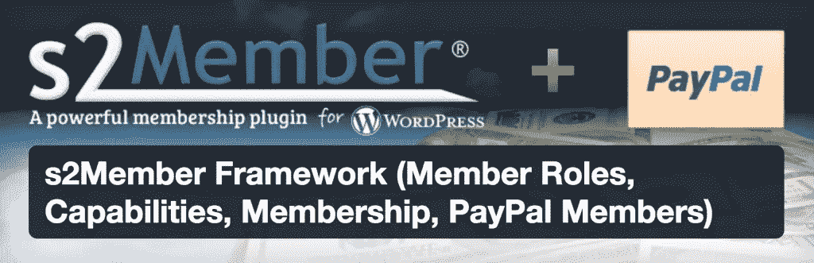

# 一个黑仔 WordPress 会员网站在 1 小时内

> 原文：<https://www.sitepoint.com/a-killer-wordpress-membership-site-in-under-1-hour/>

无论你从事什么类型的业务，创建会员都是增加收入的有利方法。你可以创造经常性收入，从你的观众那里获得持续的支持，并扩大你的品牌影响力。你可以利用会员资格来销售在线课程、辅导以及任何你能想到的东西。

使用 WordPress 创建一个功能齐全的会员网站非常容易。事实上，你可以只使用一个插件，在不到一个小时的时间里就可以建立并运行一个完整的 WordPress 会员网站。

在本指南中，我将探索创建一个 WordPress 会员网站的不同选项，然后我将向你展示如何设置它。

## 哪个 WordPress 会员插件适合你？

市场上有几个强大的会员插件，它们都提供了大量的功能。以下是一些最受欢迎的选择的简要概述:

### [S2 成员](https://wordpress.org/plugins/s2member/)

s2member 为您提供了使用 WordPress 创建会员网站所需的一切。它给你一个广泛的可定制的选项，很好地与贝宝集成，并使用短码使整个过程尽可能简单。有免费版和付费版，但是免费版已经足够让你开始使用了。

### [会员 2](https://wordpress.org/plugins/membership/)

会员插件背后的团队已经将它修改成了目前的版本，会员 2。这个插件包含了你期望从会员插件中得到的所有功能:访问下载、自动循环支付、付费墙选项和几种会员类型，包括滴流内容会员。虽然也有专业版，免费版是一个伟大的框架，不花一分钱。

### [简单会员](https://wordpress.org/plugins/simple-membership/)

顾名思义，这个插件为基于 WordPress 的会员网站提供了一个简单的解决方案。它有各种各样的功能，有各种会员级别、定期支付和 PayPal 集成。这个插件独有的一个很好的特性是一个登录窗口小部件，你可以把它放在边栏中，这样会员就可以很容易地访问他们的账户。

还有其他几个选择，但这三个是最受欢迎的竞争者。出于本指南的目的，s2member 将是我们的首选插件，但是您使用的任何成员插件都应该具有类似的特性。

## 入门指南

安装并激活插件后，第一步是设置基本会员资格。你需要在这里做一些重要的决定:

*   您将拥有多少会员级别？
*   你将如何称呼每一级？(例如。银、金等。)
*   每一关的费用是多少？

一旦你回答了这些问题，你就可以通过几个步骤来实现这些答案。您可以按任何顺序完成这些步骤。

正如我上面提到的，在本教程中，我们将使用 [s2member](https://wordpress.org/plugins/s2member/) 。

### 步骤 1:修改会员页面

会员选项页面是您网站上的一个页面，读者可以在这里购买会员资格。您需要为此创建一个新页面。s2member 建议称之为会员注册，但是你可以随便叫它什么。

创建页面后，您可以在 s2member 的成员选项页面部分调整您的选项。导航至 S2 成员>常规选项>成员选项页面。确保会员选项页面是正确的，你可以进入这里。

### 步骤 2:修改登录欢迎页面

进入 S2 成员>通用选项>登录欢迎页面。就像您对会员页面所做的那样，您可以创建一个新页面，会员在登录后可以看到它。或者，您可以指定重定向 URL。s2member 还在这里提供了一篇[有用的知识库文章，以防您陷入困境。](https://s2member.com/kb-article/customizing-your-login-welcome-page/)

### 步骤 3:自定义注册

进入 S2 成员>通用选项>注册/个人资料字段和选项。在这里，您可以自定义新成员将经历的注册过程。您可以设置自定义字段、切换自定义密码、选择最小密码长度、强制个人电子邮件等等。

### 步骤 4:注册设计

这一步是可选的。它允许您更改登录界面的设计。用户将像你一样在[http://yoursite.com/wp-login.php](http://yoursite.com/wp-login.php)登录。如果你想要一个审美优势，这是你的网页。您可以更改字体和颜色，插入您的徽标，并创建自定义页脚。

### 步骤 5:创建会员资格

现在是时候创建不同的会员资格了。在 s2member 中，您可以通过进入 s2member >常规选项>会员级别/标签来完成此操作。在这里，您可以为不同的访问级别创建特定的成员资格。s2member 为您提供了允许免费会员的能力，它也有 4 个级别的付费会员。(一会儿你会看到这些是如何工作的。)

现在，选择您将拥有的会员数量。然后决定每个级别可以访问什么样的内容。稍后您会用到这些信息。

### 第六步:整合支付

s2member 与 PayPal 合作，PayPal 是大多数会员插件最受欢迎的支付处理器之一。在 s2member 中，您可以通过 s2member > PayPal 选项链接您的 PayPal 帐户。在 PayPal 帐户详细信息选项卡中，您需要输入您的基本详细信息，例如您的 PayPal 电子邮件、商家 ID 和 API 证书。

接下来，转到 PayPal PDT/自动退货集成。您需要在 PayPal 上找到您的 PDT 身份令牌，但不要担心，s2member 会友好地告诉您在哪里可以找到它。

您还可以更改注册确认电子邮件、发布/页面确认电子邮件，以及更改 EOT(期末)行为。修改 EOT 行为是至关重要的，因为您可以决定一旦他们的会员资格结束，客户会发生什么。

### 步骤 7:创建自定义购买按钮

现在，您需要创建一个特定的购买按钮，成员可以使用它来注册。导航至 S2 会员> PayPal 按钮。s2member 不遗余力；它为每个成员级别提供了自定义按钮生成器。

要创建 1 级按钮，请点击“1 级访问按钮”您将看到按钮发生器。更改选项以反映您的 1 级会员资格的价格和期限，然后单击“生成按钮代码”代码将显示在表单下面的 WordPress Shortcode 部分。复制并粘贴到你为新成员注册制作的页面上。当读者访问该页面时，他们会看到自定义的 PayPal 按钮。您需要添加一些文本来描述成员资格。

然后，您可以简单地对级别#2、#3 和#4 重复此操作。您可以选择将所有的 PayPal 按钮放在同一页面上，或者为不同级别的会员使用不同的页面。

### 第八步:完成你的页面

回想一下您之前设置的页面——您的会员注册和登录欢迎页面。确保这些是你喜欢的。

### 步骤 9:创建和保护内容

每当您创建页面或帖子时，您都会在右上角看到 S2 会员保护部分。在这里您可以选择哪些级别的成员可以看到内容。您最关心的是限制选项，因为定制功能超出了本指南的范围。

值得注意的是，如果您将内容提供给某个级别，所有更高级别的成员也将能够查看它。因此，如果你发布了一个帖子，并要求 3 级会员，那么 4 级会员也可以看到它。

借助 s2member 的保护功能，您可以有多种选择来显示内容。您可以创建一个完全只对会员开放的网站，这样人们就必须注册才能看到内容，或者您可以发布公共内容和只对会员开放的内容。

## 结论

好了，现在你有了一个有效的会员网站，而且花了不到一个小时。我没有介绍所有的特性，如果你愿意，还可以做更多的调整。你现在拥有的是完全可操作的，并为新成员注册做好了准备。

请用下面的评论告诉我们你最喜欢的会员插件是什么，为什么？

## 分享这篇文章