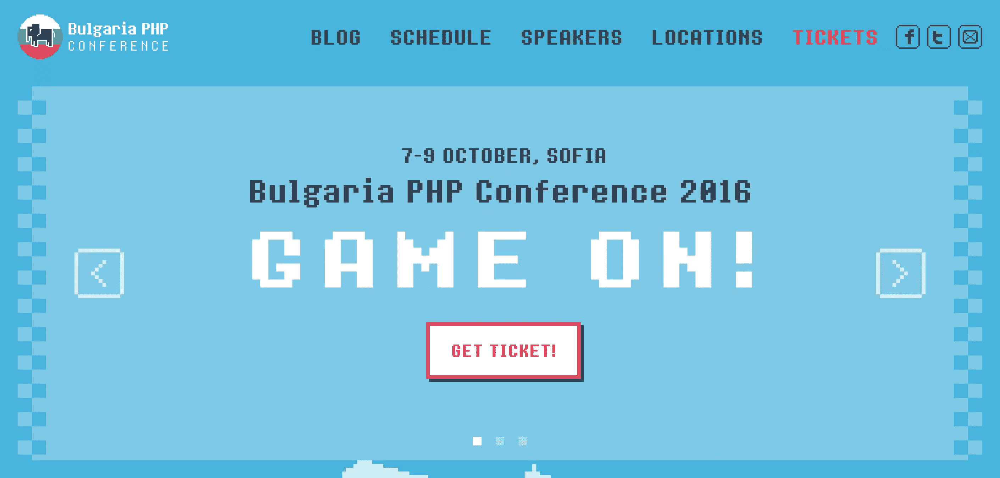
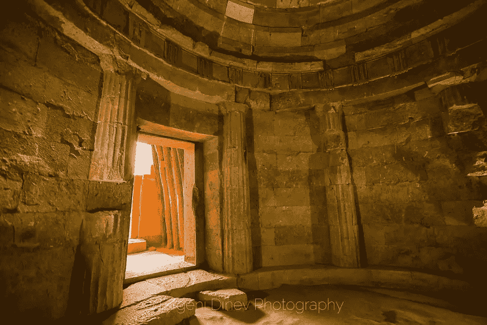

# 保加利亚 PHP 回顾-游戏开始！

> 原文：<https://www.sitepoint.com/a-review-of-bulgaria-php-game-on/>

[BulgariaPHP](http://bgphp.org) 是一个 PHP 会议，由一个研讨会日和两个讲座日组成，每个讲座日有两个专题讲座。就像去年一样，今年的发布会发生在保加利亚索非亚的 SEC(索非亚活动中心)，在天堂购物中心的顶层。

然而，与去年不同的是，今年的版本有一个主题。

在由 500 名员工组成的共享和云托管提供商 [SiteGround](https://www.siteground.com/) 的活动团队的出色组织下，会议在复古游戏中进行，从与会者的徽章和贴花，到活动的环境和微型活动。甚至所有的工作人员都打扮成超级马里奥，我敢肯定，如果任天堂的律师们听到风声，他们会有一两个动脉瘤的想法。

## 演讲者:被宠坏了

作为演讲者，我们被带到了一次奇妙的乡村之旅，最终在一个维京风格的大厅里举行了一场盛宴，然后参观了一座最近在 T2 出土的古代色雷斯神庙。目睹如此古老和巨大的东西，是一个非宗教逻辑的现代人所能拥有的最接近精神体验的东西，所以我非常欣赏它。

(稍微有点长的)巴士旅程也为我们提供了充分的机会去了解彼此。在一些单挑游戏和品客薯片品尝之后，我们就像一家人一样。

> 今天早上..有些惊艳的 [#phpbus](https://twitter.com/hashtag/phpbus?src=hash) 剧组[@ bgphpconf](https://twitter.com/bgphpconf)[# bgphp 16](https://twitter.com/hashtag/bgphp16?src=hash)[# PHP](https://twitter.com/hashtag/php?src=hash)[# phpc](https://twitter.com/hashtag/phpc?src=hash)[@ bgphp](https://twitter.com/bgphp)[pic.twitter.com/dHT7kt4vH1](https://t.co/dHT7kt4vH1)
> 
> —7 PHP::Khayrattee(@ 7 PHP)[2016 年 10 月 5 日](https://twitter.com/7php/status/783584077479866368)