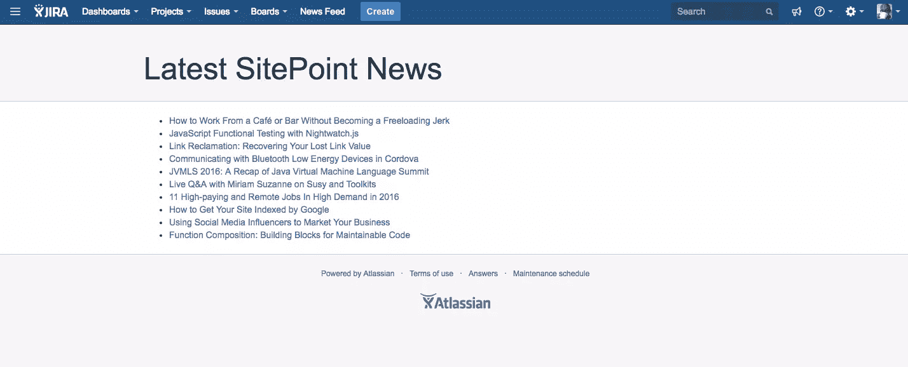
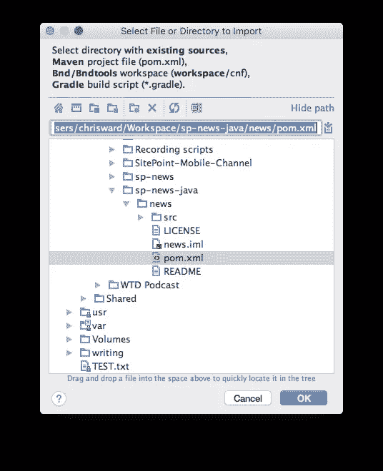
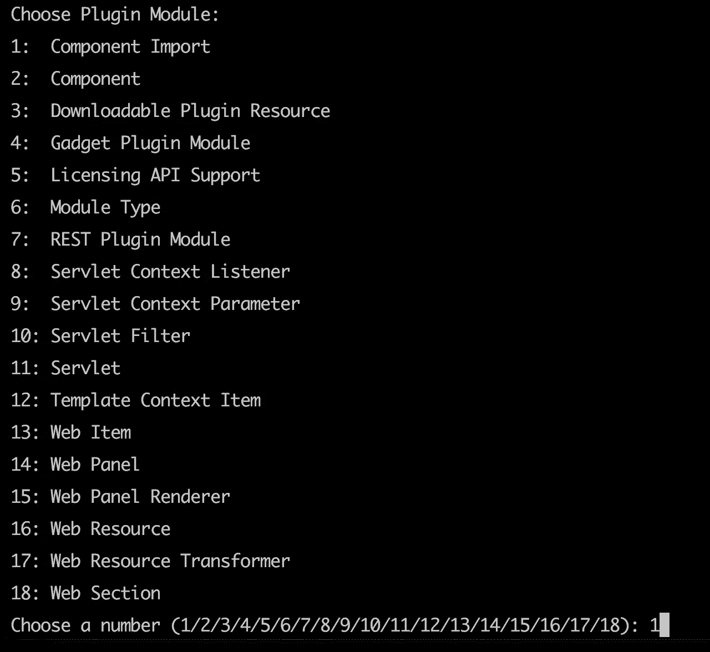
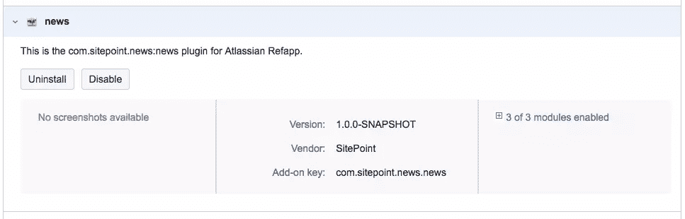
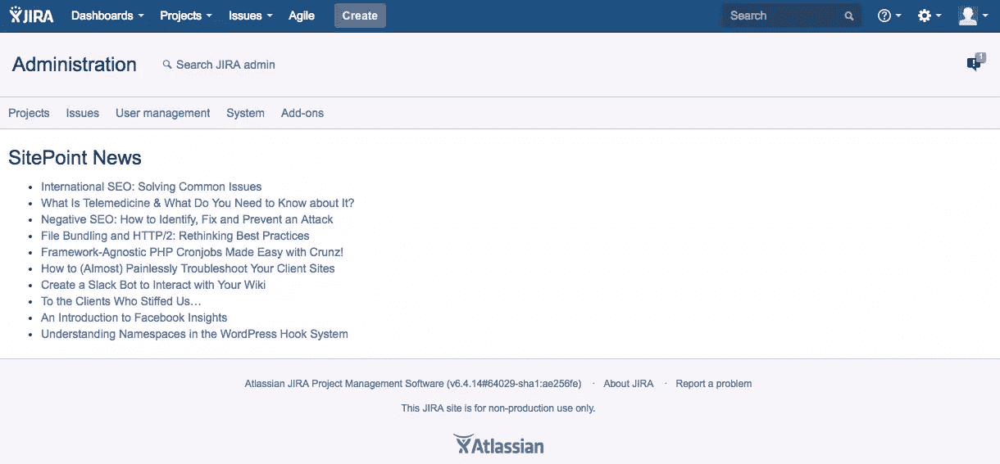

# 为 JIRA 这样的企业应用开发附加软件

> 原文：<https://www.sitepoint.com/developing-add-ons-for-enterprise-apps-like-jira/>


自 2008 年以来，许多开发商专注于建设、分销和销售(或希望销售)他们在两个策划的、有围墙的花园商店中的作品。苹果应用商店和 Google Play(及相关)商店已经帮助开发者找到了全球数十亿的受众。这并非一帆风顺。一些人说，“应用商店”模式已经迫使一场底部竞争，价格和开发者收入份额下降，尽管有如此庞大的受众。

这感觉就像我们都被分散了六年的注意力，认为应用商店是一个新的想法，忘记了这个想法最初是在哪里普及的——企业软件(尽管具有讽刺意味的是，这个前身可能启发了史蒂夫·乔布斯)。他们可能没有消费者应用程序商店的受众水平或魅力，但企业应用程序商店通常有可靠的客户群，他们愿意更经常地花更多的钱，开发人员通常可以获得更及时的支持。

我开始着迷于理解这些企业生态系统是如何运作的，以及它们与我最熟悉的开源世界有何不同。在本教程中，我将介绍澳大利亚的成功故事，Atlassian。

Atlassian 商店中有来自 800 多个第三方供应商和开发人员的 2000 多个附加组件，有足够的兴趣，但也有足够的空间让开发人员发现和填补空白。

Atlassian 生产一套连接良好的产品。并不是所有的都开放给开发人员来扩展，为他们开发的步骤可能会有所不同。在本文中，我将重点介绍他们的旗舰产品， [JIRA](https://www.atlassian.com/software/jira) 。

## JIRA

JIRA 是 Atlassian 的起点，其背后的战略一直很聪明，包括足够的默认功能，让人们首先订阅，但也留下足够的空白，以鼓励健康的第三方生态系统。

Atlassian 商店里有 900 多个 JIRA 特有的插件。

JIRA 有两种风格，功能基本相同，但范式不同。Atlassian 托管 JIRA 云，但为其开发扩展要容易得多。您在本地安装 JIRA 服务器，这可以为用户提供更紧密的集成机会，但是开发更加困难。

### JIRA 云

JIRA 云的扩展使用一套更新的工具，称为“Atlassian Connect”，JIRA 连接应用程序的日用户超过 13 万。你用 JavaScript 编写插件来访问 JIRA REST API。该 API 允许您访问和操作 JIRA 的大多数方面，包括用户详细信息、配置、问题、项目和自定义组件。

Atlassian 提供了一套方便的开发工具。要获得它们，使用 Node.js 安装`atlas-connect` npm 模块:

```
npm install -g atlas-connect 
```

这使得一个新的`atlas-connect`命令可用于创建和管理项目。对于本例，您将创建一个小应用程序，将最新的 SitePoint 文章添加到 JIRA 界面。您的开发人员需要了解最新的开发人员新闻！你可以在 [GitHub](https://github.com/sitepoint-editors/SitePoint-News-for-Jira) 上找到最终代码，但是如果你想从头开始，创建一个新项目并安装它的依赖项:

```
atlas-connect new sp-news
cd sp-news
npm install 
```

这个例子也将使用 [feedparser](https://www.npmjs.com/package/node-feedparser) ，所以也要安装依赖项:

```
npm install node-feedparser --save 
```

如果你对 JavaScript 有经验，那么大多数生成的代码应该看起来很熟悉，因为 connect 使用了 [Express](https://expressjs.com/) 框架作为其基础。

打开`atlassian-connect.json`，为附加组件添加一个更具描述性的名称，以及 JIRA 期望的其他信息:

```
{
  "name": "SitePoint News Feed",
  "description": "Shows the latest news from SitePoint.com",
  "key": "com.sitepoint.newsfeed",
  "baseUrl": "https://sitepoint.com",
  "vendor": {
     "name": "SitePoint Pty Ltd",
     "url": "https://sitepoint.com"
  },
  … 
```

**注意**:我不会解释这个 JSON 文件的所有方面，有些方面比其他方面更容易理解，但是[如果你有兴趣了解更多关于完整规范的信息，我推荐你阅读这个指南](https://developer.atlassian.com/static/connect/docs/latest/modules/)。

在`generalPages`键中，将数值更改如下:

```
"generalPages": [
  {
    "key": "news-feed-page-jira",
    "location": "system.top.navigation.bar",
    "name": {
      "value": "News Feed"
    },
    "url": "/news-feed",
    "conditions": [
      {
        "condition": "user_is_logged_in"
      }
    ]
  }
] 
```

第一个条目将一个菜单项添加到 JIRA 界面的顶部栏，第二个条目是一个新页面，登录(到 JIRA)的用户可以访问该页面。

接下来打开`routes/index.js`并为这个新页面添加一条新路线:

```
app.get('/news-feed', addon.authenticate(), function (req, res) {
  var FeedParser = require('feedparser'), request = require('request');
  var newsItems = {
      newsitems: []
  };

  var req = request('https://www.sitepoint.com/feed'), feedparser = new FeedParser();

  req.on('error', function (error) {
      // handle any request errors
  });

  req.on('response', function (res) {
      var stream = this;

      if (res.statusCode != 200) return this.emit('error', new Error('Bad status code'));
      stream.pipe(feedparser);
  });

  feedparser.on('error', function (error) {
      // always handle errors
  });

  feedparser.on('readable', function () {
      var stream = this
          , meta = this.meta
          , item;

      while (item = stream.read()) {
          newsItems.newsitems.push({
              'title': item.title,
              'link': item.link
          });
      }
  });

  feedparser.on('end', function () {
      res.render('news-feed', {
          title: 'Latest SitePoint News',
          newsitems: newsItems.newsitems
      });
  });
}); 
```

再说一遍，很多都是标准的 JavaScript。在这个路由中，您将解析 SitePoint 新闻提要并将其传递给模板。

说到模板，添加一个新的`views/news-feed.hbs`文件，内容如下:

```
{{!< layout}}
<header class="aui-page-header">
    <div class="aui-page-header-inner">
        <div class="aui-page-header-main intro-header">
            <h1>{{title}}</h1>
        </div>
    </div>
</header>

<div class="aui-page-panel main-panel">
    <div class="aui-page-panel-inner">
        <section class="aui-page-panel-item">
            <div class="aui-group">
                <div class="aui-item">
                    <ul>
                        {{#each newsitems}}
                            <li><a href="{{ link }}">{{ title }}</a></li>
                        {{/each}}
                    </ul>
                </div>
            </div>
        </section>
    </div>
</div> 
```

这里您使用传递的变量来填充模板数据。

运行`node app.js`并使用 [ngrok](https://www.sitepoint.com/use-ngrok-test-local-site/) 将你的本地服务器暴露给互联网。将`atlassian-connect.json`中的`baseUrl`值改为 Ngrok 提供给你的安全服务器。

按照这个 Atlassian guide 上的步骤设置你的 JIRA 测试副本，当你到达步骤 3 时，使用来自 Ngrok 的同一个安全服务器地址。这将安装你的插件。

点击新的 *News Feed* 按钮，它现在有望出现在你的 JIRA 菜单栏中，你将看到 JIRA 境内最新的 SitePoint 新闻。




### JIRA 服务器

JIRA 服务器是 JIRA 的自托管版本，大型企业客户可能会使用。要为这个版本开发插件，你需要使用 Atlassian SDK。这是一套用于生成样板 Java 代码的工具，您可以将这些代码导入到您的 IDE 中。在这里下载并安装它[，在这个例子的其余部分，我将使用 JetBrains 的 InteliJ IDEA。(](https://developer.atlassian.com/docs/getting-started)[这里有其他 ide 的说明](https://developer.atlassian.com/docs/developer-tools/working-in-an-ide)。)

你用 Java 编写插件，这是多年来编写 Atlassian 插件的传统方式。这意味着开发要复杂得多，但你也有一个更大的生态系统和工具套件可供你使用——比如开发者工具栏，它可以突出显示与你的插件相关的页面上的有用信息。

Atlassian 关于用 Java 创建插件的文档要广泛得多，但正因为如此，它也更难理解，有很多漏洞、不准确之处，并且需要搜索支持论坛来找到问题的解决方案。

SDK 有很多不同插件的自动生成器。对于这个例子，我使用了`atlas-create-refapp-plugin`。

我不会详细介绍用 Java 复制插件示例的所有步骤，因为它比用 JavaScript 要复杂得多，而且我也不是一个有经验的 Java 程序员。相反，我建议你从 [GitHub](https://github.com/sitepoint-editors/SitePoint-News-for-Jira-java-) 下载我的最终代码，我会解释使它成为 JIRA 插件的具体组件。您可以将代码导入到您的 IDE 中，例如，使用 InteliJ，选择`pom.xml`文件，并保持默认设置不变。



`pom.xml`是一个用于管理依赖关系的 Maven 文件，包含标准的 Maven 实践。很多都是自动生成的，但是您需要添加外部依赖项，例如在这个罗马 RSS 解析器示例中:

```
…
<dependency>
  <groupId>com.rometools</groupId>
  <artifactId>rome</artifactId>
  <version>1.5.0</version>
  <scope>compile</scope>
</dependency>
… 
```

我还发现，手动设置 JIRA 版本可以让一切工作得更可靠:

```
...
<properties>
  <jira.version>6.4.14</jira.version>
  ...
</properties>
... 
```

`atlassian-plugin.xml`文件是一个[描述符文件](https://developer.atlassian.com/docs/getting-started/configuring-the-plugin-descriptor)，它描述了一个 Atlassian 插件的插件，包括组件、资源和元数据。

`admin.vm`是一个[速度模板](http://velocity.apache.org/)文件。在本例中，它在页面上显示提要条目。

描述了一个 Java 类，它解析 SitePoint 新闻提要，然后将数据呈现给 velocity 模板。这里的 Atlassian 特定代码是模板渲染组件，其中很多是使用`atlas-create-refapp-plugin-module`自动生成的，以遍历添加了使用该组件所需代码的向导。



要运行插件，使用`atlas-run --product jira --version 6.4.14`命令指定运行插件所需的产品和版本、下载和依赖项。(是的，这意味着 JIRA 的完整副本。记得将`target`路径添加到一个`.gitignore`文件中)。如果您想要清理您的项目并重新构建一切，在运行这个命令之前使用`atlas-clean`命令，但是注意这将清除 JIRA 实例中的所有数据。

您可以在`<http://localhost:2990/jira/plugins/servlet/upm>`的插件管理器中看到现在启用的插件:



如果你打开网址，瞧，JIRA 服务器上的 SitePoint 新闻！



这种复杂性有一个积极的方面:忽略任何产品特定的 API，这个插件应该可以在其他 Atlassian 产品上工作。

## 填补空白

作为一名拥有近 100%开源历史的开发人员，我发现涉足企业开发领域的经历很不寻常。文档可能很难找到，讨论问题的开放社区论坛很少，开放的代码示例库也很少。如果你愿意致力于付费开发者项目，那么你当然可以直接接触到能够帮助你解决问题的专家(我感谢帮助我解决问题的 Atlassian 员工)。

我鼓励你利用 Atlassian Marketplace，利用涵盖项目管理、沟通、文档管理、版本控制和持续集成的产品，调查你的想法的潜力。我相信你能在某个地方找到一个缺口来填补。

## 分享这篇文章