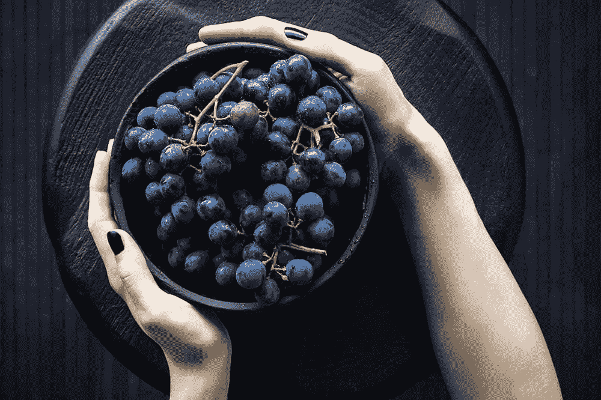

# 如何通过像你的祖先一样饮食来最大化你的生产力

> 原文：<https://www.sitepoint.com/how-you-can-maximize-your-productivity-by-eating-like-your-ancestors/>

人们花费大量的时间和金钱收集无尽的科学证据来告诉我们如何饮食和生活，这并不奇怪，但令人惊讶的是，这些发现往往非常矛盾，因此，我们对如何保持健康感到困惑和不知所措。

正如一些专家建议的那样，健康的生活和最佳的功能(身体和精神)就像我们的祖先在 10，000 年前新石器时代革命之前，在我们开始种植谷物并放弃狩猎采集生活方式之前一样简单。

像我们的祖先一样吃意味着吃大自然给我们的东西。本质上，这是动物、昆虫和植物，当你想到它时，这对我们来说应该是相当容易的，因为我们不再需要自己寻找食物了！

越来越多的研究、临床证据和关于为什么官方建议在过去几十年里效果如此之差的启示似乎表明，在我们进化的大部分时间里模仿我们的饮食方式是一个好主意。但是仍然有一些媒体屈尊俯就，很快指出老方法并不总是最好的方法。这在技术上是正确的，但它忽略了这些方法之所以有效，不是因为它们陈旧，而是因为它们逆转了人类食物消费中一些最近的灾难性创新。

似乎我们大多数人都拒绝了这种生活方式，因为我们被现代时尚饮食所吸引，这些饮食宁愿拿走我们的钱，也不愿帮助我们活得更长、更健康。然而，我们现在开始看到像*古*、*酮*和*原始*这样的饮食越来越受欢迎，这些饮食概述了我们可以像我们的祖先一样饮食和生活以获得最佳健康和生产力的方式。

这些饮食包括什么？让我们来看看。

## 西松的原始蓝图

前跑步运动员和三项全能运动员马克·西松(根据他自己的亲身经历)发现，遵循同样的生活方式“蓝图”,我们的祖先几千年前就追随⏤，⏤今天仍然让我们受益匪浅。他的现代**原始蓝图**几乎与我们祖先的生活方式相同，你可以在他的书 [*原始蓝图*](https://www.amazon.com/Primal-Blueprint-Reprogramme-effortless-boundless/dp/0091947839/) 或[他的网站](http://www.marksdailyapple.com/blog/)上读到更多细节。

它由以下规则组成:

*   吃大量的动物、昆虫和植物
*   经常走动，但速度要慢
*   偶尔跑得很快
*   举起重物
*   获得充足的睡眠
*   玩耍(即尽情享受)
*   每天晒晒太阳
*   利用你的头脑
*   避免外伤和有毒的东西

我不会说太多细节，但你可能已经注意到，其中一些规则听起来有点原始，甚至是显而易见的，但 10，000 年前是一个不同的时代。虽然接触有毒的东西在当时肯定是要避免的事情(现在也是，别担心！)，如今这可能适用于酒精和药物滥用。游戏时间意味着练习投掷长矛，但今天这可能是一场足球比赛。

简而言之，Sisson 提倡类似于我们前辈的均衡饮食和生活方式。摄入足够的蛋白质(鱼和鸡蛋是素食者的绝佳替代品)，摄入足够的蔬菜，确保你不久坐(坐得太久)，偶尔进行剧烈运动，享受乐趣(不要给自己太大压力)，避免将自己置于不必要的危险中(例如不系安全带)，有足够的睡眠来休息你的身体和大脑，避免快餐、精制碳水化合物和糖类以及其他有害物质。

## 为什么精制碳水化合物是敌人

你有没有注意到一旦你吃了像披萨这样的碳水化合物食物，你的大脑会变得多么疲惫和模糊？这是因为我们的祖先从不吃面包和其他谷物，所以我们的身体从未进化到“理解”这些类型的精制碳水化合物。简单来说，你的身体要加班消化这些非天然食物。就进化生物学而言，我们还没有赶上那一步！

正如你可能已经猜到的，当你的身体不得不加班消化食物或处理血糖水平(我们尚未进化到可以处理⏤)时，你的身体会变得疲惫不堪，效率极低。这甚至会导致食物不耐受，并对你的身心健康产生不利影响，包括经常头痛和其他不舒服的症状，这些症状会严重阻碍企业家的最佳表现。

让我们来讨论另外两种饮食，*古*和*克托*。

## 古人类

虽然在某种意义上与西松的原始蓝图非常相似，它建议我们的祖先吃的方式(大量的蔬菜、肉类等⏤，但没有谷物、精制糖和碳水化合物)，但旧石器时代的饮食在几个方面有所不同。最显著的区别是他们对饱和脂肪的立场。Loren Cordain(旧石器饮食法的创始人)认为饱和脂肪是高胆固醇和心脏病的原因，[，尤其是在其他因素不受控制的情况下](http://thepaleodiet.com/paleo-diet-q-a-saturated-fat/)。

而 Sisson 则认为，我们的祖先被发现吃了整个动物(包括大脑！)并且只留下了尸体，这意味着他们消耗了这些今天被认为不健康的脂肪。最重要的是，Sisson 认为，从这些脂肪中获得的营养对神经系统的好处大于坏处。这可能是一个想保持大脑充分运转的企业家感兴趣的事情！

因此，当*古*只关注饮食时，*原始*关注整个生活方式；你最终选择什么样的饮食主要取决于你个人的健康需求。例如，由于旧石器时代的饮食限制你的饱和脂肪，它可能是那些有高胆固醇或心脏病病史的人的更好选择，而原始饮食可以说对生产力和脑力更好。

## 酮类的

生酮饮食是一种低碳水化合物、高脂肪的饮食，由 60-75%的脂肪、15-30%的蛋白质和 5-10%的碳水化合物组成。实践中最常见的宏量营养成分是 65%脂肪、30%蛋白质和 5%碳水化合物。酮饮食的目的是让你的身体处于 T2 酮症状态(燃烧酮而不是碳水化合物来获取能量)。这只有当你的碳水化合物水平是每天 50 克或更低时才会发生。

酮饮食类似于旧石器时代和原始饮食，碳水化合物应该保持在最低水平。虽然酮饮食确实允许复杂的碳水化合物(好的那种)，但对维持酮症的碳水化合物摄入的硬性限制意味着包括它们通常是不切实际的(例如加工碳水化合物，你也应该小心甜土豆和胡萝卜等碳水化合物根类蔬菜)。只有净碳水化合物被计算在内，所以你可以吃大量的纤维蔬菜，如西兰花。

除此之外，酮饮食对乳制品并不严格，因为它们也被视为脂肪的良好来源，你可能还记得，这与旧石器饮食有很大不同。这可能使它更适合素食者，因为有大量的蛋白质和脂肪的非肉类替代品。

科学记者加里·陶布斯支持克托的观点。在他的书《好热量，坏热量:挑战关于饮食、体重控制和疾病的传统智慧》中，他解释了他所谓的“替代假说”。他的假设是，人们普遍认为只有脂肪会导致与饮食相关的疾病、肥胖和精神疾病，这是一个谎言。相反，他将此归咎于碳水化合物，这就是为什么这三种饮食(原始饮食、古 T2 饮食和酮饮食)坚决反对加工过的碳水化合物。

你可以在这里找到更多关于 keto [的入门信息。](http://www.ruled.me/guide-keto-diet/)

## 酮和大脑功能

有人提出，酮饮食不仅适合减肥，而且对大脑功能也有好处，最终会导致非常好的心理健康和提高生产力。酮饮食包含的食物被发现含有许多维生素和矿物质，具有显著的促智(增强大脑)效果。关于这些食物，我不会说得太详细，但是[这里的](https://www.sitepoint.com/the-best-nootropic-smart-drug-for-entrepreneurs-is-nutrition/)是我以前写的一篇关于这个主题的文章，以获得更多的见解。

但除此之外，你的大脑和身体在酮症状态下的工作方式被认为具有深刻的益智效果。简而言之，当我们的肝脏分解脂肪酸时，就会产生酮。主要的三种是羟基丁酸盐、乙酰乙酸盐和丙酮。当细胞燃烧葡萄糖或酮作为燃料时，它被转化为 ATP(三磷酸腺苷)。这种物质是我们细胞的燃料。酮羟基丁酸盐已被证明可以改善产生 ATP 的过程(细胞呼吸),因此表明酮饮食增加了大脑中 ATP 的水平。

除了增强能量产生，[酮症还提供了独特的神经保护和再生益处](https://blogs.scientificamerican.com/mind-guest-blog/the-fat-fueled-brain-unnatural-or-advantageous/)。

旧石器时代仍然是一个健康的选择，但 keto 和 primal 是企业家可能倾向于更高脑力的两种饮食，从而提高生产力。

## 让我们总结一下

*   旧石器时代:鼓励瘦肉多于饱和脂肪
*   酮:鼓励饱和脂肪和奶制品——主要关注宏量营养水平，而不是特定的食物
*   原始的:允许饱和脂肪，也包括对生活方式更全面的看法
*   所有:严格控制碳水化合物，不吃精制食品

## 结论

我们的祖先进化成为强壮、聪明的生物，因为他们过着活跃的生活，他们吃大自然让他们吃的东西。虽然他们可能不是企业家和商人，但他们通过解决问题保持头脑敏锐，例如解决如何将牛赶下悬崖来喂养他们的社区。如果没有他们通过食用其他动物的器官和肉类摄入的欧米伽脂肪酸，我们也不会有今天这样发达进化的大脑。

吃变质的食物就像运行 Internet Explorer 6 ⏤一样，可以工作，但不是很好。

## 分享这篇文章