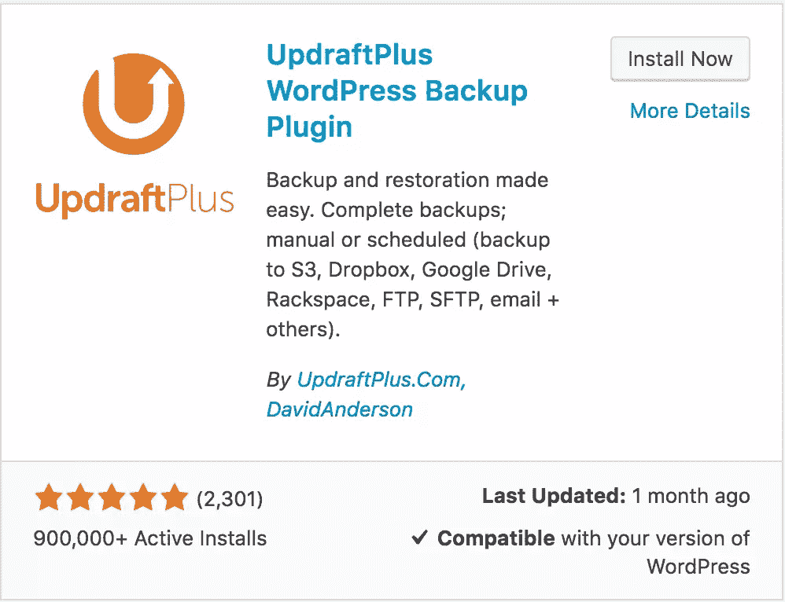

# 让你的 WordPress 网站经得起未来考验的 4 种方法

> 原文：<https://www.sitepoint.com/future-proof-your-wordpress-site/>

在技术和编码标准不断变化的网络世界中，预测未来是很棘手的。在你把辛苦赚来的钱投资到你的网站建设之前，花几分钟思考一下你的 WordPress 站点是否经得起未来的考验，这将确保:

*   未来的定制很容易进行
*   现有流量不会丢失
*   您可以节省支持和维护站点的时间
*   避免高成本和耗时的问题

使用移动优化和广泛流行的平台是你的网站未来的第一步。一个响应 WordPress 主题满足的条件。

然而，这还不够。

在这篇文章中，我们将介绍一些最好的实践来帮助你的 WordPress 网站在未来的证明。

## 使用一个好的托管公司和实践良好的安全性

在这份声明中[谷歌声明网站加载时间或网站速度现在包括在其 200 多个排名因素中](https://webmasters.googleblog.com/2010/04/using-site-speed-in-web-search-ranking.html%22)。这意味着网站速度将对谷歌如何在搜索引擎结果页面(SERPs)中对你的网站进行排名产生重要影响。在一些网站上，有机流量占了网站流量的大部分，你当然不想错过这种潜在的流量。

虽然有很多因素会影响网站的加载时间，但是使用一个好的托管平台可能是最重要的。一个好的托管公司应该为 WordPress 用户提供优化的工具。在最终发布给公众之前，这通常是一个测试主题和插件的舞台。

像[加速你的 WordPress 网站](https://www.sitepoint.com/speed-wordpress/)和[将好的 WordPress 主机从坏的主机中分离出来](https://www.sitepoint.com/separate-the-good-wordpress-hosts-from-the-bad/)这样的文章将帮助你选择合适的主机来服务使用 WordPress 的客户。

实践良好的安全措施，如使用强密码，不要把备份保存在公众可访问的文件夹中，定期更新核心 WordPress、主题和插件，也会帮助你保护网站的完整性。

[Akismet](https://wordpress.org/plugins/akismet/) 、 [Wordfence Security](https://wordpress.org/plugins/wordfence/) 和 [Sucuri](https://wordpress.org/plugins/sucuri-scanner/) 是用于控制防止垃圾邮件和恶意软件攻击的流行且有效的插件。

## 尽可能避免过度依赖

找到完美的网页设计是很难的，大多数网站通过各种测试重复他们的网站设计，例如 A/B 测试，以找到完美的网页设计，以最佳地捕捉线索并赢得更多的客户。

随着许多网站所有者求助于自由网站设计师或代理，避免过度依赖是很重要的。

应该制作代码更改的副本。还应该记录密码和密钥配置的更改。

这使得在未来做出适当的改变成为可能，并避免被冷落，不知道或忘记过去所做的事情。

这也适用于主题和插件的使用。选择主题框架时必须考虑。应该只使用流行的和支持良好的主题和主题框架。

此外，一体式插件应该谨慎使用。这将确保无论何时对插件进行修改，网站的核心功能都不会被破坏。

## 使用符合 WordPress 开发最佳实践并提供良好支持的插件和主题

随着 WordPress 不断发布改进和错误修复，确保所有安装的插件都与最新的 WordPress 版本兼容并遵守最新的 WordPress 标准是很重要的，如 [WordPress Codex](https://codex.wordpress.org/) 中所述。

最新的 WordPress 版本使得检查更加容易。当搜索新的插件或主题时，会显示一个标签，显示它是否兼容。

使用不兼容或开发不完善的插件或主题会给你的网站和访问者的安全带来风险。不兼容的主题或插件也表明开发者可能已经停止修复错误或提供支持。

主题检查是一个流行的插件，可以帮助测试你的主题，确保它符合标准。

这篇文章给出了一些额外的方法来保护自己免受流氓插件的攻击。

## 始终在您的站点上进行备份和维护

而一个好的托管公司可能会定期备份你的网站数据。您也应该自己做这件事，并远程保存一份副本(例如，不在同一个活动服务器上)。这样做将有助于确保在调整您的网站时，如果您遇到问题，您总是可以从最近的备份中恢复。

有很多平台和插件(包括付费和免费的)可以很好地备份你的数据。[back UPP](https://wordpress.org/plugins/backwpup/)和 [Updraft Plus](https://wordpress.org/plugins/updraftplus/) 是两个流行的备份插件。

然而，如果你想手动备份你的站点，[这篇文章](https://www.sitepoint.com/manually-backup-your-wordpress-website/)是必读的。你也应该维护你的网站，我们这里有一个[关于 WordPress 维护的很好的指南](https://www.sitepoint.com/definitive-guide-to-wordpress-maintenance/)。

## 使用子主题

子主题是继承父主题功能的主题。当您对子主题进行更改时，它会覆盖父主题的默认值，而不会触及或破坏父主题中的文件。这允许你更新你的父主题而没有破坏你的子主题的风险，保持定制的完整性。

大多数主题框架在其文档页面上提供了如何创建子主题的说明。

当在你的网站上调整或进行 A/B 测试时，采用子主题有助于节省时间。

在这里，你可以找到[创建儿童主题的简单、逐步的解决方案。](https://www.sitepoint.com/creating-your-own-genesis-child-themes/)

## 结论

这就是了。让你的网站适应未来并不是一件容易的事情，但是从长远来看，这种努力是值得的。

你对 WordPress 网站的未来检验有什么建议和技巧？请在下面的评论中告诉我们。

## 分享这篇文章