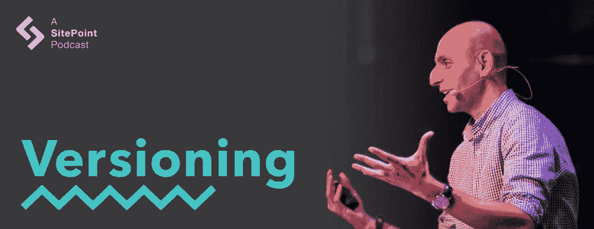

# 自由职业者，和维塔利·弗里德曼一起创办在线杂志

> 原文：<https://www.sitepoint.com/versioning-show-episode-11-with-vitaly-friedman/>

在这一集的版本控制节目中，蒂姆和大卫与《粉碎》杂志的创始人兼主编维塔利·弗里德曼一起。维塔利牵着蒂姆和大卫的手环游早期网络世界，自由职业，创办在线杂志，惊人的免费壁纸，经典失败，编辑指南，以及外国作家的神秘出没。

[https://w.soundcloud.com/player/?url=https%3A//api.soundcloud.com/tracks/286090757&color=ff5500&auto_play=false&hide_related=false&show_comments=true&show_user=true&show_reposts=false](https://w.soundcloud.com/player/?url=https%3A//api.soundcloud.com/tracks/286090757&color=ff5500&auto_play=false&hide_related=false&show_comments=true&show_user=true&show_reposts=false)

[访问版本控制展示主页](https://www.sitepoint.com/versioning-show/)

**[在 iTunes 上订阅](https://itunes.apple.com/us/podcast/the-versioning-show/id1135300597) | [在 Stitcher 上订阅](http://www.stitcher.com/podcast/sitepoint/the-versioning-show) | [查看所有剧集](https://www.sitepoint.com/blog/)**

## 显示注释

*   推特上的砸杂志: [@smashingmag](https://twitter.com/smashingmag)
*   facebook.com/smashmag 在脸书砸杂志:
*   日本人的概念[Wabi-萨比](https://en.wikipedia.org/wiki/Wabi-sabi)
*   [VML](https://en.wikipedia.org/wiki/Vector_Markup_Language)
*   [冲击波](https://en.wikipedia.org/wiki/Adobe_Shockwave)
*   维塔利的[网络开发者手册](http://www.alvit.de/handbook/)
*   [为《粉碎》杂志写稿](https://www.smashingmagazine.com/write-for-us/)
*   [粉碎杂志的出版政策](https://www.smashingmagazine.com/publishing-policy/)
*   [粉碎的作者指南](https://www.smashingmagazine.com/write-for-us/)
*   [幕后:发表一篇精彩文章的代价](https://www.smashingmagazine.com/2016/08/behind-the-scenes-what-it-takes-to-publish-a-smashing-article/)
*   粉碎的[专家小组](https://www.smashingmagazine.com/about/)
*   [粉碎 Conf](https://smashingconf.com/)
*   [一份名单分开](http://alistapart.com/)
*   [站点点](https://www.sitepoint.com/)
*   [SitePoint 的网络频道](https://www.sitepoint.com/web/)
*   [小马符](https://ponyfoo.com/)
*   [CSS-招数](https://css-tricks.com/)
*   在推特上打招呼:[@ mdavid green](https://twitter.com/mdavidgreen)|[@ tevko](https://twitter.com/tevko)|[@ versioningshow](https://twitter.com/versioningshow)|[@ sitepointdotcom](https://twitter.com/sitepointdotcom)

## 谈话要点

> 在某个时候，我看了这个节目，它实际上对我产生了非常深远的影响，其中有一个男孩——一个小孩——和他的祖父在一起……他说,<q>每一天，我和我的祖父，我们都在环游世界，因为它是一个圆。</q>
> 
> 基本上在一天内穿越了整个世界。我想，也许这是可能的。我的意思是，他们有一个非常小的村庄，所以他们不能去任何地方，所以祖父发明了这个故事，他实际上在村庄周围发明了一些小世界，这样他们就可以在北方走一次，在南方走一次，等等，他们会稍微改变方向。他们会绕着世界转一圈。
> 
> 我相信在某些时候，我觉得我可以用同样的方式改变世界。

* * *

> 然后在某个时候，现在——我想这是我一生中最快乐的时刻——是我完全放弃追求完美的时候。我认为更重要的是不要变得完美，拥抱你自己创造的古怪而不平衡的世界。我认为这让你更快乐，也让你更专注一点，因为你不必达到这个无限或这个一开始就不存在的完美。

* * *

> 也许我只是和利己主义者——都是为了我，都是为了我——有点留下痕迹，留下台阶，或者留下有意义的东西。我发现这非常非常重要。这也让我很开心，说实话。

* * *

> 我们决定要做的是从鼓舞人心的文章中脱离出来——因为几乎每个人都在这么做——转向更深刻的东西，这意味着它将描述过程，例如，描述工具，它还将描述人们工作时的组织方式。

* * *

> 我喜欢结局糟糕的电影，所以我真的很期待看到人们如何——我的意思是，不是说我期待它，但是，对我来说，看到人们如何失败以及为什么失败真的很有趣，因为我认为你甚至可以从那里学到比到处都有的成功故事更多的东西。

* * *

> 很明显，我们确实堵车了。这让我们损失了很多流量，但老实说，也许我对此太天真了，但我从来没有为了钱而参与其中。我从没想过要套现。我们有机会，但我从来不觉得我必须这样做。就像人们告诉我我必须发展公司一样。我不觉得我必须发展公司。我觉得很舒服，因为我很小，享受我的小生活幸福/商业/写作/企业。

* * *

> 你必须找到你周围的人，他们可以仔细检查你的文章。把它们发给你，然后得到一些反馈。哪怕只是两个人，或者只是一个人。我的意思是，一个人可能会有偏见，但如果是两个人，他们确实给了你一些反馈，你可以在此基础上，这将提高你的文章 100%。不仅有保证，而且肯定会提高 100%，会使它比开始时好一倍。

* * *

> 我也倾向于去俄语博客，他们有如此多的好材料，令人难以置信。前端开发人员，他们简直是疯了，这确实是一种好的疯狂。他们什么都知道，他们知道每一个小技巧和每一个小黑客，一切都是极端的，令人难以置信。

## 副本

Tim:

嘿，大家好吗？这是蒂姆·埃夫科。

David:

这位是大卫·格林先生。

Tim:

你正在收听的是版本控制播客的第 11 集。

David:

这是一个我们聚在一起讨论从开发到设计的网络产业的地方，一些人今天让它发生，并找到它在下一个版本中的发展方向。

Tim:

所以，让我们开始这个版本吧。

* * *

今天，我们请到了《粉碎》杂志的主编维塔利·弗里德曼。非常感谢你加入我们，维塔利。你今天过得怎么样？

Vitaly:

非常感谢你邀请我。很荣幸，今天能来到这里我真的很兴奋。我过得很好！你们呢？

David:

到目前为止，一切顺利。维塔利，在我们开始采访之前，我们通常喜欢问我们的客人一个哲学问题。既然这是版本秀，我们的哲学问题是:在你目前的职业生涯中，你是什么版本，为什么？

Vitaly:

好吧，这是个难题。在我目前的职业生涯中…嗯，我想这可能是我的第三个版本，如果我应该诚实的话。我之所以说第三，是因为在我成长的过程中，当我还是个孩子的时候，我对这个世界有着非常不同的看法，我不会说这是天真的——当然是——但我真的相信我可以用一天的时间改变世界上的一切。

在某个时候，我看了这个节目，它实际上对我产生了非常深远的影响，其中有一个男孩——一个小孩——和他的祖父在一起，他们走着，这发生在一个小村庄里。好像，我不知道，也许有两三四百人住在那里。他接受了采访，他说了一件小事，这件事真的困扰了我一段时间。他说，每一天，我和我的祖父，我们都在环游世界，因为它是一个圆。

基本上在一天内穿越了整个世界。我想，也许这是可能的。我的意思是，他们有一个非常小的村庄，所以他们不能去任何地方，所以祖父发明了这个故事，他实际上在村庄周围发明了一些小世界，这样他们就可以在北方走一次，在南方走一次，等等，他们会稍微改变方向。他们会绕着世界转一圈。

我相信在某些时候，我觉得我可以用同样的方式改变世界。后来我长大了，我开始学习计算机科学。后来，我成为了那些真正相信科学、确切的事情和精确的人之一，在这一点上，我非常痴迷于完美。一切都是关于完美的，我实验室的储存方式，我房间的装饰方式，一切都应该是精确的。

然后在某个时候，现在——我想这是我一生中最快乐的时刻——是我完全放弃追求完美的时候。我认为更重要的是不要变得完美，拥抱你自己创造的古怪而不平衡的世界。我认为这让你更快乐，也让你更专注一点，因为你不必达到这个无限或这个一开始就不存在的完美。

David:

我喜欢这样。这让我想起了日本人的“Wabi-萨比”概念——欣赏不完美。

Vitaly:

没错。没错。差不多就是这样，是的，我想是的。虽然，我并没有受到那方面的影响，我想，也许吧。我过去对日本哲学没有多少了解。

David:

那很有趣。你在哪里长大的？

Vitaly:

我在东欧的白俄罗斯明斯克长大，直到 2000 年，我一直住在那里。实际上离我现在的位置不远。现在我在立陶宛的维尔纽斯。随着我的成长，这对我来说是一个不错的小故事，因为每一次，每一天，我都经历一些新的东西，我有这些非常疯狂的想法，我甚至不知道为什么要追求这些想法。

举个例子——我认为这很聪明——我脑子里有这样一个想法，世界上没有合适的时间表，所以我会看像欧洲新闻和英国广播公司之类的电视节目，我会记录特定节目播出的时间，我会写下来，然后我会列出所有的时间表——我认为这是完美的，世界上没有人拥有它。我甚至不知道为什么我会这样做，但这是我以前为自己发明的任务。

David [4:18]:

你从一开始就在研究数据科学！

Vitaly:

我也这么认为嗯，我那时真的很小。我不知道我为什么这么做。实际上，这挺好的，因为我的父亲，物理学家——抱歉，那是在成长过程中——家里没有合适的电视。好像有几个频道，但是都很无聊。他设法装上了一个卫星天线，从附近的一家酒店接收信号，可能是非法的，所以我们可以看各种电视节目，各种频道，像意大利和波兰的。

我会一直看，所以我看了《霹雳游侠》和《老友记》，以及所有波兰语的东西，这就是为什么我现在真的懂波兰语了。我不会说波兰语，但我听得懂。这是我成长的世界。这是一种非常疯狂的方式。

David:

太棒了。我必须告诉你，你是我们节目中为数不多的拥有计算机科学学位的人之一。

Vitaly:

是的，没错。

David:

但你本身并不是一名工程师，对吗？

Vitaly:

不，不是真的。事实上，我认为计算机科学学位帮助我以一种不同的方式看待这个世界。我真的很喜欢数学，事实上我的数学比计算机科学更好，这就是为什么我最终选择了更多的数学课程——因为它帮助我建立了这种对事物的逻辑观点。我认为，或者我相信，我很擅长计划，我很擅长看透事情，有点像把事情放在一起，创造这些乐高积木和组装东西。从物理学的角度来说不一定；我不擅长在现实生活中组装小东西，但我认为我在虚拟生活中很擅长。

是的，我认为计算机科学帮助我建立了对世界的理解；它帮助我在工作中做到真正的精确，这就是编辑的全部。有点精确，简洁，抓住要点。虽然我并不是每天都使用计算机科学，但它帮助我形成了对事物和工作的看法。

Tim:

那么，维塔利，在你获得计算机科学学位后，你是如何开始走上创办《粉碎杂志》的道路的？整件事是怎么发生的？

Vitaly:

这是一个很好的观点，但我实际上并没有真正以任何方式过渡。我有点崩溃了。当我开始的时候，我也是自由职业者，因为我年轻，需要钱。所以我开始尽我所能。

基本上，早在 90 年代末，我就在尝试各种旧技术，比如 VML 和 Flash(不，不是 Flash，是 T2 冲击波和 T3)，以及诸如此类的东西。我只是玩了玩。然后，当我们在 2000 年搬到德国的时候(我父亲带着全家人一起)，我试着寻找赚钱的方法，同时也建造一些东西，因为我不会说那种语言，我没有一分钱。我不想让*从我父母那里得到一分钱，所以我想自己做点什么，而我唯一知道怎么做的就是如何建立相当糟糕的冲击波网站。*

所以我决定在学习计算机科学的时候投入进去。当时，我也是自由职业者。那时有一个夜大学的演出，我应该维护其中一个网站，我投入了进去，这是我学习 HTML，CSS 等等的一个机会。实际上，这也是一个非常好的时机，因为这是 CSS 真正成为事物的时候，你可以看到各种各样的文章出现在[的列表中，关于精灵、图像、边框半径技术等等——诸如此类的东西。](http://alistapart.com/)

David [7:43]:

宽按钮的扩展快门，等等？

Vitaly:

是的。你知道，这非常令人惊讶，因为有时我真的能见到这些 10 到 15 年前写这些文章的人。很久以前的事了。滑动门以及诸如此类的东西。我想，哇，这是很久以前的事了。这是我跳入 web 开发的时候。

Smashing Magazine 或多或少成了一种副产品，因为我是自由职业者，我一直在寻找这些技术，我清楚地记得当时在我妈妈的厨房桌子旁花了很多时间，只是为了理解 CSS box 模型——理解所有事情是如何工作的。实际上，这花了我相当多的时间。这并不容易；漂浮并不容易。我真的花了一段时间才明白，为什么我能左右浮动，却能上下浮动。我就是不能理解，这太奇怪了，就像我不能理解的东西。

David:

你和其他人。

Vitaly:

是的，我想是的。所以我开始收集所有这些能让我作为自由职业者的生活更轻松的技巧。最终，它变成了这本大型的[网络开发人员手册](http://www.alvit.de/handbook/)，在某个时候发布。它出现在 Slashdot 和 Dig 上。然后，这是我研究这些技术的一种方式，然后最终我的一个来自德国的同事，他建议创建一本英文杂志，因为他当时正在写一本德语杂志——一本德语杂志。我说，<q>嗯，为什么不呢？</q>当时我正在写博客，所以我只是把我为他写的一些文章，为他的杂志，翻译成英文，这就是这一切是如何开始的——最终我只是收集了一些我可以在工作中使用的技术。我很自私，是个混蛋——你知道这是怎么回事——只考虑我自己，就是这样……也想与社区分享。

David:

我认为最后一点是真正的关键点——希望与社区分享。你不是唯一一个发布这种信息的人，但是《粉碎》杂志在提供真正深入、高质量的内容方面已经获得了惊人的声誉。我很好奇你是如何从一个发布这方面内容的人转变成这样一个顶级出版物的。

Vitaly:

这是一个非常好的观点。我回头看，我意识到这实际上是 2006 年 9 月，差不多 10 年前，当这一切开始的时候。这一切都始于一个快速而廉价的博客帖子，比如 40 张免费的令人惊叹的壁纸，或者 40 个免费的、漂亮的黄色网站，诸如此类的东西。我只是，在这一点上，只是鼓舞人心，我们有各种各样的摄影——黑白摄影和一切。

所以，这一切都是为了发布我们认为好的东西，但也很快做到这一点。但与此同时，当然，主要的优先事项和主要焦点是开发、web 开发、web 设计——所以 CSS、JavaScript、jQuery 和所有相关的东西都是一件大事。然而，我们很快注意到，在某个时候，至少就我个人而言，我遇到了一个问题，因为我无法认同我们正在做的工作。

我们当然看到，如果我们发布类似于 <q>50 张令人惊叹的壁纸，会让你流泪</q>之类的东西，流量就会进来。我们看到人们真的来到网站，流量增加，我们有广告运行，所以显然它有帮助。但我真的没有感觉到我能与此联系起来，也没有感觉到我想让我的名字站在背后。这是一个关键点。在某些时候，有一个合适的编辑工作流程，编辑指导方针，编辑工作，一篇文章能代表自己是非常非常重要的。事实上，我们当时就是这么做的。它只是有一点点不同，因为它更多的是关于收集资源和展示它们。

我确实想推进更深入的材料，这些材料实际上会随着时间的推移而保持相关性。实际上，我有意地想要远离这些壁纸，走向成为一个专业的受尊重的杂志，因为那时我觉得它一点也不受尊重。人们从世界各地来下载壁纸和图标，寻找灵感，也许，但我不觉得粉碎杂志是一个受人尊敬的出版物。它更像是一个博客，也许是一个列表博客，我对此感到不舒服。

所以我们改变了，基本上几乎是一夜之间。我们决定把方向从列表转移到严肃的内容，我们建立了各种各样的东西，像编辑小组，专家小组，他们会在文章发表前对其进行审查。因此，当然，成本也增加了，交通明显下降。这很重要，因为我们因为这种转变失去了很多流量，但我觉得重要的是，我们获得了很多信任，我们也从信任我们的设计师和开发人员那里获得了很多好的流量，他们只是想投资购买我们的产品，或以任何可能的方式支持我们，因为他们知道有人真正关心他们正在做的工作。这对我真的很重要，因为我觉得我今天做的工作真的很重要，因为有人觉得它很有用。

这就是为什么，实际上，就在今天，我完成了这篇疯狂的文章，这篇文章花了我将近四到五个月的时间来准备，大概有九到一万字。这需要大量的研究，大量的采访，等等。但我确实想写它，因为我认为人们会欣赏它。人们会喜欢它，会发现它很有用，会发现它很有价值——甚至可能在某个时候，它会成为那些对人们来说变得很重要的文章之一，他们会回过头来想，哦，是的，那篇文章。

也许我只是和利己主义者——都是为了我，都是为了我——有点留下痕迹，留下台阶，或者留下有意义的东西。我发现这非常非常重要。这也让我很开心，说实话。

Tim [13:35]:

我的问题是，当你从为其他开发者提供的列表式内容或资源转变为真正深入、激烈和充满激情的文章时，你是如何选择要为这个网站的新版本发布的内容的——几乎是在那个时间点——的？

Vitaly:

这是一个非常有趣的观点。我们决定要做的是从鼓舞人心的文章中脱离出来——因为几乎每个人都在这么做——转向更深刻的东西，这意味着它将描述过程，例如，描述工具，它还将描述人们工作时的组织方式。

例如，我们开始深入研究案例。例如，有人可能已经建立了一个项目，可能已经建立了一个网站，那么背后的过程到底是什么？建造或设计它的人在这个过程中学到了什么？他们一直在犯的错误是什么？

我认为，实际上，在过去的五六年里，我试图关注的不一定是那些大的成功故事，你可以在 BuzzFeed 和 Fast Company 等网站或 TechCrunch 上听到这些故事。每个人都喜欢成功的故事，因为它们是人们因为努力工作而成功的表现或证明。就像电影一样。每个人都喜欢有好结局的好电影。但我喜欢结局糟糕的电影，所以我真的很期待看到人们如何——我的意思是，不是说我期待它，但对我来说，看到人们如何失败以及为什么失败真的很有趣，因为我认为你甚至可以从那里学到比到处都有的成功故事更多的东西。

也许这些人实际上已经从失败中恢复过来，后来成功了，因为每个成功的过程中都有几次失败，这就是为什么我们开始关注项目中出错的地方。设计师和开发人员，也许还有项目经理或其他相关人员在这一过程中的痛点是什么？他们从什么开始，最后又以什么结束？也许终点线根本不像他们预期的那样。

我们开始更深入地研究文章的这个特殊方面。更具体地说，所以你做一些东西，你不是作家，这没关系，我们不指望你有出色的写作技巧，因为我们有编辑和校对以及所有能帮助你的人。我们想知道的是你在建造或设计这个东西的时候学到了什么，因为我认为很多人实际上也能从中学到一些东西。

David [16:00]:

当你在开发 Smashing Magazine 的时候，你经历了这个转变，你自己认为这是失败，还是其他什么原因？

Vitaly:

说实话，我从来不觉得这是个失败。我的意思是，我在这个过程中犯了一些错误，当我们有一些奇怪的文章时，也就是说，我真正支持的——我认为是正确的，应该发表的——来自社区所有部分的反馈都很糟糕。这可能是我的错误，我在这一点上有点太相信自己了，推了信封封口——尽管我周围有人告诉我不要这样做。

但是我不认为我们犯了一些关键性的错误。我们喜欢实验，喜欢尝试新事物。所以当我们觉得应该做的时候，我们就会去做。然后，如果它是错的，我们会纠正自己。例如，我们永远不会删除某些东西，删除一篇文章或删除一条推文或删除一条消息或诸如此类的东西，或者说我们不是那个意思，尽管我们实际上是这个意思。我认为你总是可以通过诚实和透明地说出你真正的动机来恢复，因为人们会尊重这一点；他们会感激你对他们坦诚相待。

所以，我不认为这是错误的。很明显，我们确实堵车了。这让我们损失了很多流量，但老实说，也许我对此太天真了，但我从来没有为了钱而参与其中。我从没想过要套现。我们有机会，但我从来不觉得我必须这样做。就像人们告诉我我必须发展公司一样。我不觉得我必须发展公司。我觉得很舒服，因为我很小，享受我的小生活幸福/商业/写作/企业。我们团队目前有 11 个人，当然还有世界各地的许多编辑，他们大部分都是兼职工作，他们太棒了。没关系；这让我很开心。

David:

我想这里有很多人希望你不要决定卖掉，因为保持现状对每个阅读杂志的人来说都非常有用。

Vitaly:

是的。当然，你可以说我们可以做很多事情，但实际上对我来说，真正重要的——一直以来都很重要——是保持独立。我从来不想成为那种——好吧，也许听起来有点刺耳——但是拥有一千本杂志的大品牌背后的人。我永远都不想那样。我认为，这真的很酷，即使十年后的今天，这仍然很好，如果我喜欢，我可以在 WordPress(10 年后，我们仍然在使用)中写下一些东西，然后点击发布按钮，它就会被发布。我不需要问任何人，也不需要征得同意。太神奇了。我甚至觉得知道我可以这样做(虽然我可能不会这样做，因为我们有编辑，我们有各种各样的编辑评论等等)，但知道我可以这样做给了我巨大的动力。

David:

我能想象，而且你说你还在用 WordPress 做后端。我本来想问你更多关于 Smashing Magazine 在技术上是如何运作的。

Vitaly:

是啊。这实际上并不是一个非常复杂的设置。我们运行 WordPress，我们使用 nginx，我们使用 MaxCDN，我们在 Media Temple 上托管(我必须承认，Media Temple 在这一点上一直非常支持我们)。是的，尽管如此，一切都很简单，我们正在运行 PHP，LAMP， [EasyStack](http://www.easystack.cn/en/) ，所以在这一点上恐怕没有什么太大的创新。

Tim:

你提到你采用这种不精确的哲学，但同时，我觉得《粉碎杂志》是一个非常精确的技术，高标准的出版物。那么你是如何平衡这两种哲学和行为的呢？然后我的第二个问题是，你对那些希望制作出和我们在 Smashing Magazine 上看到的一样精确和技术卓越的网站开发者有什么建议吗？

Vitaly [19:46]:

好吧。这个问题很有意思。我认为在这一点上，重要的是发表在网站上的文章是正确的。它不能在代码方面有任何错误，因为我们不能传播不好的做法。这是不可接受的。

同样，我们也承受不起任何可能带有偏见的东西。所以我们没有植入式广告。我们确实有赞助的内容，但它是这样标记的。发表的文章，如果来自我们，来自我们的作者，他们不能有偏见，这就是为什么我们不接受从事特定产品并想写该产品的作者。这是行不通的。

我们也有编辑方针和出版政策，它们清楚地说明了我们做什么和不做什么。显然不是每个作者都读它们，但对我们来说，它们真的很有指导意义。他们帮助我们决定是否选择某一个方向。它帮助我们决定是否接受某篇文章或某个作者。这真的是件好事。我不认为它是完美的。我不认为它会驱使我们走向完美，走向那些你甚至无法触摸的完美的文章，在那里，一切都是不可思议的、闪亮的等等。我认为，为了避免完美，我们倾向于尝试引入个人观点。所以人们只是写他们的经历，他们不可能完美，也不可能不完美:他们只是自己的经历。

当他们写他们的时候，有些事情可能——就像在正常生活中一样——有时你应该，你知道，逻辑上你会这样做，因为这是有意义的，但也许你不会这样做，因为你有业务需求，或者有什么事情发生，诸如此类。所以就像一个故事。而且故事不一定要完美。同样的，我觉得有时我们的作者可能太努力去写这个完美的段落或这个完美的句子，我鼓励他们实际上犯错误。我鼓励他们在一个地方放一个错误的逗号，或者就是不要想太多，只写下你认为重要的真正困扰你的事情。我们会注意逗号，如果我们错过了逗号，也没关系；这没什么大不了的。我的意思是，没有人会死，如果我们有一个错误的分号在错误的地方。

David:

我想我们中的很多人可能会从外面看《粉碎》杂志，我们看到这个美丽、完美的东西出版了，这是令人生畏的，我可以理解为什么一个作者会想在向你提交东西之前真正润色，获得每个细节。

Vitaly:

事情是这样的，事实是我实际上一个月前刚刚发表了一篇文章，讲述了贫穷的作者必须经历的过程( *[幕后:发表一篇粉碎的文章](https://www.smashingmagazine.com/2016/08/behind-the-scenes-what-it-takes-to-publish-a-smashing-article/)* 需要什么)，他们有时会受到恐吓，有时会被字面上的粉碎。我有时会收到一些人的邮件，他们没有哭，但他们很失望——真的很失望——因为他们投入了太多时间，他们觉得我们在让他们经历地狱。老实说，我为此感到骄傲。好吧，不是我在喜欢，但发表好文章是我的工作，所以我真的觉得在某种程度上把作者推到边缘是我的义务。并不是说我要把他们拉下悬崖，而是要把他们推到质疑一切的边缘，有时候感觉自己一直在唱反调。

就像，我知道我会同意作者刚刚写的那句话，我完全同意，而且我很确定大多数开发者都会同意。但我不得不质疑它的有效性。为什么会这样？有数据吗？它来自你的经历吗？你能证明吗？也许这是完全错误的。我总是试着更努力一点，有时候我可能太努力了。但是没关系。我不是来讨人喜欢的。对我们来说真正重要的，也可能是对 Smashing Magazine 向一份出版物——备受尊敬的出版物——发展至关重要的是引入[专家小组](https://www.smashingmagazine.com/about/)。

对我们来说，专家小组是一个由 110 人(目前可能是 120 人)组成的小组，他们来自不同的领域，包括前端、后端、搜索引擎优化、Photoshop、视觉设计、模式库等等。各种不同的领域。

我们所做的是，在那篇文章发表之前，我们总是让它通过这个小组。因此，我们至少需要两个评论，这些提交反馈的人，他们也必须对一篇文章进行评级。如果一篇文章得到一定的平均评分，它就会被发表。它必须是大约 3.6 或 3.7(我认为我们在这一点上提高了门槛)。

那么，为什么它对开发者有帮助呢？嗯，因为我觉得，嗯，很明显，一开始是有帮助的，因为我们试图发表好文章。但我的意思是，对于外面的人，我想我的建议是，你必须找到你周围的人，他们实际上可以仔细检查你的文章。把它们发给你，然后得到一些反馈。哪怕只是两个人，或者只是一个人。我的意思是，一个人可能会有偏见，但如果是两个人，他们确实给了你一些反馈，你可以在此基础上，这将提高你的文章 100%。不仅有保证，而且肯定会提高 100%，会使它比开始时好一倍。

如果你能从业内人士那里得到一些反馈。我认为在我们的行业中，很多人都是非常好的人。我们很荣幸能和这些人一起工作。如果你能把这篇文章发给一个你钦佩的人，他们花 20 分钟阅读它，也许会给你一些笔记，告诉你哪些是错的，哪些是对的，这会给你一个前进的方向。因此，我相信你最终会写出一篇更好的文章。我们鼓励每个人写作，所以每次我发现一个奇怪的、有趣的、疯狂的、奇怪的项目，我都会发电子邮件，或者我们会给作者发电子邮件，鼓励他们写作。

此外，因为我也说俄语，因为我的背景，我也倾向于去俄语博客，他们有这么多好的材料，这太不可思议了。前端开发人员，他们简直是疯了，这确实是一种好的疯狂。他们什么都知道，他们知道每一个小技巧和每一个小黑客，一切都是极端的，令人难以置信。我也试着鼓励他们多写，结果我们也有一些非常有趣和独特的文章发表在 Smashing 上，因为有一些封闭的领域。

非常像——这是我所经历的——中国区；中国前端社区相当封闭。在中国有很多人写前端，但它会用中文写成普通话，所以我们根本看不到它。同样的情况也发生在俄语社区:你经常会发现用俄语写的非常精彩的文章，但没有翻译成英语，所以它们有点滞留在这个社区。我觉得这在某种程度上在法国也发生过，但是我不会说法语，所以我真的不能…我也不会说中文，但是那是另外一个故事了。

*【背景咯咯笑】*

我刚好在中国有几个人告诉我这些文章。我仍然觉得我们有语言障碍，这有点遗憾，但这就是独特视角的来源。所以我总是试图找到这些从事这些奇怪的不寻常项目的人，并以某种方式吸引他们来写作。所以任何人都可以写一篇关于粉碎的文章，每个人也被邀请写一篇文章。这将需要一些时间，这将是艰苦的工作，但如果你愿意接受它，并投入时间，我们会得到良好的结果。

David [27:18]:

太棒了。那么，我们的听众如何在网上找到你呢？

Vitaly:

我认为这并不难。没有多少人知道这一点，但大多数来自我们的超级 Mag 账户的推文都是我发的，我正在尽最大努力确保这个账户不被视为公司账户，而是个人账户。你可以发微博给我。我一直在回复，没那么难。

脸书也是如此:我们的[脸书集团](https://www.facebook.com/smashmag/)也是如此。显然，这是一个非常棒的 Mag 账户，但在某种程度上，这是我的个人账户。这就像在有组织的会议中:有时我觉得我在邀请人们参加我的私人二岁生日派对，和很酷的人一起出去玩。

David:

太棒了。我喜欢你把这些放在一起的方式。我真的很感谢你今天抽出时间来和我们谈话。

Vitaly:

我很乐意。非常感谢！希望我没说太多。

Tim:

一点也不；这是令人愉快的。

Vitaly:

太好了，非常感谢你邀请我。

* * *

Tim:

哇，我觉得我们可以有一本维塔利的问答书。他有丰富的信息，有很多可以分享。

David:

我喜欢他带来的观点。就好像他为自己设计了一种生活，试图分享知识和信息。在这个过程中，他挖掘了如此丰富的有价值的内容，这是令人惊讶的。

Tim:

是啊。这非常有趣，因为我几乎期望他的个性是非常精确和中肯的，因为从读者的角度来看《粉碎杂志》给人的感觉。维塔利似乎更加好奇，并准备好享受整个过程。看到具有这种观点的人能够成功地提出如此令人难以置信的结构良好和经过深思熟虑的内容，这是非常酷的。

David:

内容的深度总是让我感到惊讶，因为你可以去看一篇精彩的杂志文章，你知道你可以在那里花几个小时探索子链接，探索所有的细节。每一件作品都包含了很多东西。我可以想象:他说一个人可能需要几个月的时间才能组合在一起，这绝对会在产品中表现出来。

Tim:

我没有提到这一点，但我已经为 Smashing 杂志写了三篇文章，其中两篇已经发表。有一个被拒绝了，我花了相当多的时间来处理被拒绝的那个。这是为了可访问性，我想只写一些介绍性的东西——就像如果你在一个网站或一个应用程序上工作，这里是你做的东西。编辑人很好，并提供了一些建议；我写了第二稿，他回来说，对不起，这不够，我们必须到此为止。它很糟糕，真的很糟糕，这不是一次有趣的经历，但正如维塔利所说，保持很高的标准，同时让人们从中获得乐趣，我现在更高兴的是，这种经历发生了，因为我知道我最终将在 Smashing Magazine 上阅读的东西会非常非常好。

这是一个非常紧张的过程，任何为 Smashing Magazine 撰稿的人肯定都知道，一旦它出版，就会有难以置信的回报，因为你会看到这种轮廓分明的美丽出版物，当我把它寄给编辑时，我通常不会完美地获得语法和拼写，但最终得到的只是这个由我通常寄给他们的粘土块制成的美丽的雕塑。看到这些总是令人兴奋。

David:

引起我注意的一件事是，Vitaly 来自俄罗斯，他使用多种语言工作，他正在研究来自世界各地的内容。我知道，我去过不同国家的网站，我使用自动谷歌翻译，这样我就可以阅读日文、中文、俄文、韩文或其他任何东西。但是我注意到界面，发展，人们对待事物的方式，是有区别的，这是因为很多这些东西不能跨越不同的语言障碍进行交流。有趣的是，他选择接受这一挑战——尝试引入来自不同背景、使用不同语言的作家，翻译这些作品，并通过 Smashing Magazine 为英语观众带来这些作品。

Tim:

是啊。我对此非常好奇。从我自己的经验来看，由于我只会说一种语言，我寻找的每一种建议和任何东西都是英文的，通常来自美国或英国作家，这也是我获得所有信息的地方。我通常天真地不去想，在其他大洲，有多少人有着丰富的经验和不同的挑战，用不同的设备写着同样的东西，并有着全新的视角，这甚至不在我的思维空间里。我很想听到更多关于这方面的信息，并想更多地了解世界各地的人们都在做些什么。

David [32:37]:

我想了解更多的是——我们没有机会问他更多细节——他必须遵循的那套编辑准则，因为他说的是，它可能不是每个作者都会阅读的东西，但它却成为他们所有作品背后的指路明灯。他们的编辑显然是从这里开始工作的，这让我回想起我自己在敏捷方面的工作，以及一个团队对“完成”有一个明确定义的重要性。这似乎确立了是什么将这份特殊出版物的一篇文章与所有其他文章区分开来。这是我们作为读者，你作为一个作家，你可以看到不同，但很高兴知道它写在某个地方，它是有形的。我要去读那些[作者指南](https://www.smashingmagazine.com/write-for-us/)，因为我现在很好奇。

Tim:

是啊。我几乎感觉到，你在 Smashing Magazine 看到的丰富的建筑和店面，我觉得里面有很多你看不到的东西——编辑之间的文化，他们遵循的准则，他们之间的谈话，以及小组如何评判文章。我总是从看《粉碎杂志》中得到这种感觉，那就是它丰富、充满活力的外表。但是我认为你看不到的东西同样有趣，同样深刻，我非常好奇这个团队是如何从头到尾处理一篇文章的。是的，明确的指导方针是什么，他们如何排序这些文章。因为无论他们在做什么，都很明显是有效的，并且持续不断地产生惊人的内容。

David:

我知道，如果我想读一些又长又有深度的东西，并且真的能回答所有的问题，我会去 Smashing Magazine。我的意思是，如果我想获得向我解释特定技术的教程，我可能会去其他地方，比如，我不知道，也许是 [SitePoint](https://www.sitepoint.com/) 网站，那里会详细介绍这些东西。我们还有课件之类的东西。有趣的是，看到所有这些不同的发布信息的方式在网上真的有一席之地，以及人们如何被吸引到一个或另一个，这取决于他们在寻找什么。

Tim:

是啊。我正在努力思考我是如何做到这一点的，因为我确实从许多不同的来源获取信息。例如，很多时候，如果我想读超长的正式版，我要么去《分手清单》或《粉碎杂志》,而《分手清单》通常更多地是哲学方面的，偶尔会进入具体的技术细节，而《粉碎杂志》是长篇形式，大多是技术性的。在我的情况下，我正在阅读编码的具体文章。然后我会去 SitePoint，例如，如果我在做一个特定的库，我需要知道如何做这件事——或者在我的情况下，我有时会在 SitePoint 上写很多关于哲学主题的文章，在[网络频道](https://www.sitepoint.com/web/)下。然后，有时我会去[的 Pony Foo](https://ponyfoo.com/) 博客，那里有各种各样的东西:有哲学的，有长格式的，有短格式的，有奇怪的技术，并开始编写我以前从未想到过的不同的库和代码。当然，还有 [CSS-Tricks](https://css-tricks.com/) ，其中所有不同的如何在前端做这件事和在 CSS 中做这个很酷的小把戏——因为这是网站的名字。

但是，的确，有如此多的资源，并且每一个(我所关注的五到六个)似乎都提供了他们自己对各种不同任务和哲学的独特观点。这真的很有趣，在这个领域中，不仅仅只有这一种公司<q>这是你如何做这件事的</q>和<q>这是你寻找信息的地方</q>。

David [36:22]:

只要像 Vitaly 这样的出版商愿意坚持他们的独立性，而不是卖给一个将要创建一个统一事物的聚合器，我认为这对每个人都有好处，因为这样我们就可以获得能够看到所有这些不同观点的优势。

非常有趣的是，他谈到了这些资源链接是如何开始的，比如 45 张壁纸等等，以及他是如何建立所有流量的。然后他转向下一个版本，成为长篇文章的丰富内容来源，但他在这个过程中失去了流量，获得了可信度。

Tim:

是的，它几乎就像一个目录，提供优惠券，突然发表关于真实、深入的新闻故事或类似事情的文章。就像，我的优惠券不见了，我不会再看这个了——但然后你会得到整个观众的喜欢，<q>哇，这是我喜欢的令人惊讶和真正有帮助的内容，所以让我留下来。</q>

David:

我很高兴你邀请维塔利上节目，我不知道你以前和他合作过。但这是一位了不起的嘉宾，我相信我们的听众会从有机会听到他要说的话中学到很多。

Tim:

是啊，我很期待。对于那些没有去过的听众来说，一定要去看看世界各地都在举行的[精彩会议](https://smashingconf.com/)。他们在很多地方都这样做。我最近去过的一个地方是在纽约。太不可思议了。有很多高知名度的客人，还有令人惊叹的演讲。我学到了很多。我本想在那里呆上一整个星期，但只呆了三天。如果有机会，一定要去看看。

David:

酷毙了。好吧。

Tim:

非常感谢大家的聆听。我们一直很高兴能与大家谈论技术。

David:

我们还要感谢 SitePoint.com 和我们的制片人 Adam Roberts 和奥菲利·勒沙特。请随时在 Twitter 上给我们发送您的评论—[@ versioningshow](https://twitter.com/versioningshow)——[在 iTunes 上给我们评分](https://itunes.apple.com/us/podcast/the-versioning-show/id1135300597)，让我们知道我们做得如何。

Tim:

我们下次再见，希望你喜欢这个版本。

## 分享这篇文章