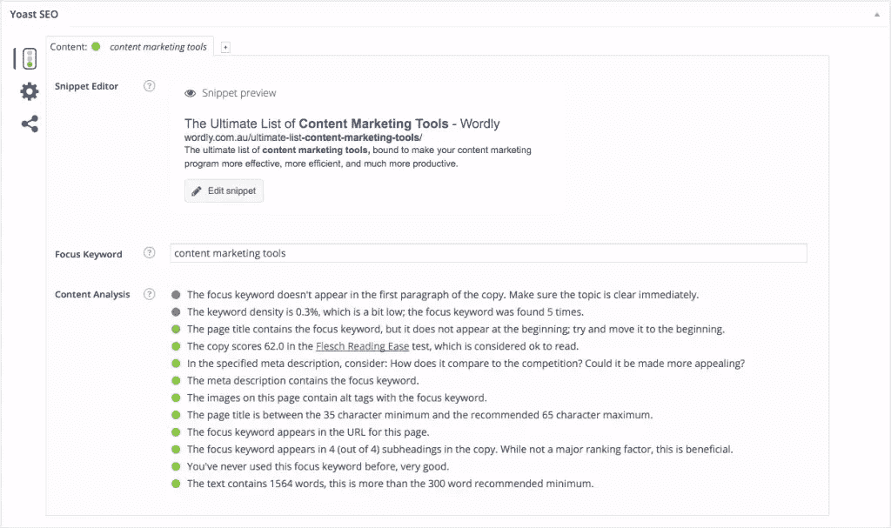
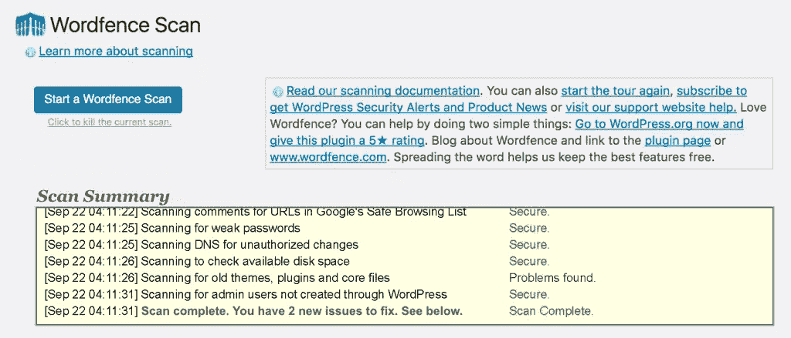
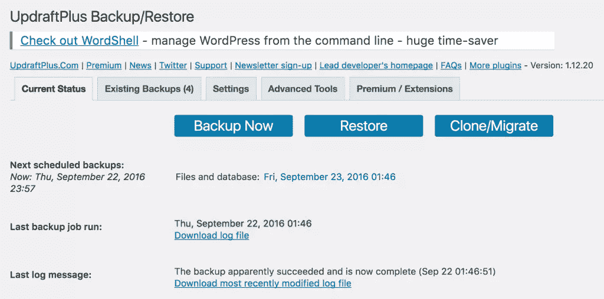
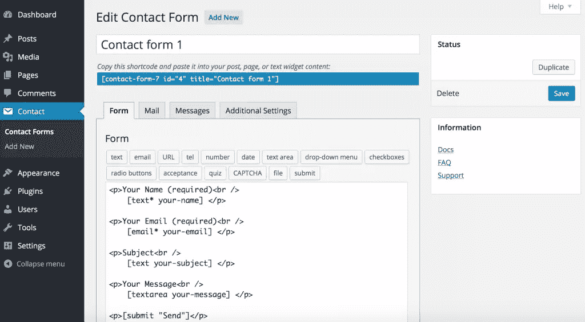
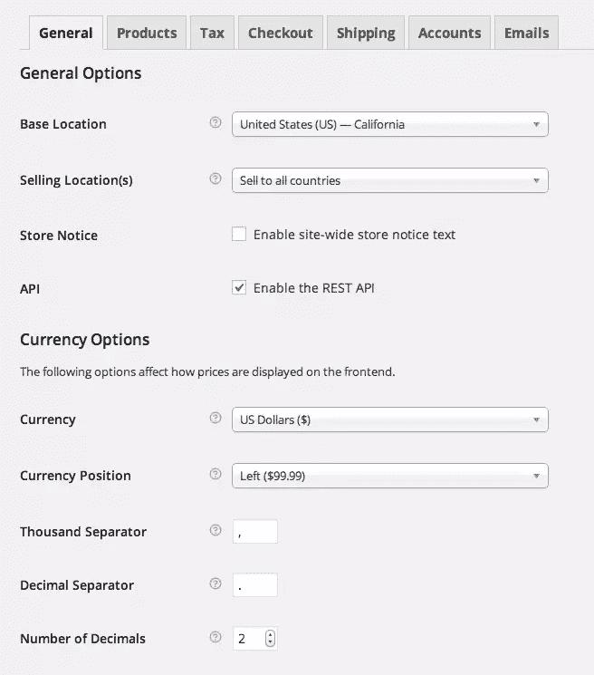
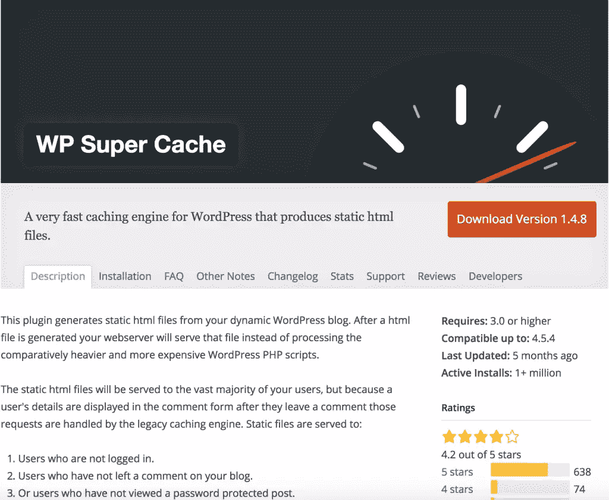

# 7 必须有商业网站的 WordPress 插件

> 原文：<https://www.sitepoint.com/7-must-have-wordpress-plugins-for-business-websites/>

依我拙见，WordPress 真的很棒。它是如此的用户友好和直观，以至于你真的不需要任何 HTML 编码的知识就可以建立一个完整的网站。所以，当我发现现在大约有 7500 万个网站在使用 WordPress 时，我并不感到惊讶。所有这些个人和公司都不会错。所以，如果你正在为你的企业开发一个网站，那么我建议你看看 WordPress。

WordPress 必须提供的最不可思议的特性之一是平台可用的插件数量。这些插件允许你增强(已经很强大的)平台的功能，裁剪、改变和定制你的网站，直到它反映你的业务，更有效地销售你的产品和服务，并为你的客户创造一个吸引人的访问空间。

因此，按照特定的顺序，以下是商业网站的 7 个最佳 WordPress 插件。

## [Yoast SEO](https://wordpress.org/plugins/wordpress-seo)

还有其他可用的 SEO 插件，但是没有一个能与这个不可思议的软件相媲美。它可以让你完全控制你的网站，允许你在一页一页和一篇接一篇的基础上管理页面标题和元描述。

你可以为搜索引擎机器人创建规则(index，follow，nofollow 等。)并设置 301 重定向。你甚至可以为你的脸书和 Google+描述创建完全可定制的描述。谈到 SEO，Yoast 真的是你最好的朋友。

## [喷气背包](https://wordpress.org/plugins/jetpack)

JetPack 对任何商业网站来说都是一个小小的惊喜。它的各种功能都非常有价值，包括:

*   **统计数据和网站流量增长:** Jetpack 会准确报告您的网站有多少访客，然后通过相关帖子、分享和宣传等功能帮助您获得更多。
*   **安全性:**保护您的企业网站应该始终是您的首要任务，Jetpack 正是这样做的。它有助于防止暴力攻击，监控停机时间，自动更新插件，并阻止未经授权的用户登录。
*   **简化的管理:** Jetpack 配备了一个集中的仪表板，使您能够从一个位置管理您的所有插件、菜单、帖子和统计数据。方便，特别是如果你拥有和经营多个网站。
*   **性能:**这个插件依靠 WordPress.com 内容交付网络帮助提高你的站点的速度和性能。

## [文字围栏安全](https://wordpress.org/plugins/wordfence)

你的 WordPress 站点的安全性是你应该认真对待的事情。

Wordfence Security 是下载量最大的安全插件。这个插件首先搜索你的站点，检查任何病毒或恶意源代码。一旦完成，它会执行一系列的操作来确保你的网站安全，甚至执行得更快。

它阻止已知的攻击者(甚至整个恶意网络)，防止未经授权的登录，定期扫描您网站上的漏洞，并提供一系列的统计数据。它的特性和功能实在太多了，无法在此一一列举。

## [升级加备份和恢复](https://wordpress.org/plugins/updraftplus/)

你需要经常备份你的网站。想象一下，如果你的服务器崩溃了，或者你的网站被攻击了，而你没有备份，会发生什么。你会失去销售吗？客户？整个投资组合？这个插件就是答案。

根据您的喜好，它可以为您的企业网站创建完整或部分备份。您甚至可以设置重复备份，并将它们存储在不同的位置，如 Dropbox 或 FTP。它也非常快，整个网站可以在几分钟内备份。

Updraft 是 WordPress 目录中排名最高的备份插件，拥有超过 800，000 个活跃安装。如果你正在寻找其他的选择，看看之前 SitePoint 的文章[关于最好的 WordPress 备份插件对比](https://www.sitepoint.com/best-wordpress-backup-plugins/)。

## [联系方式 7](http://wordpress.org/plugins/contact-form-7/)

商业网站的美妙之处在于它为现有的和潜在的客户提供了与你联系的全天候机会。联系表 7 是任何商业网站的必备插件。它为您和您的客户提供了一种简单的联系方式，留下评论并展开对话，这对于成功的营销非常重要。拥有超过一百万的活跃安装，它是市场上最受欢迎的插件之一。

为了进一步阅读，Ian Chandler 最近也在 SitePoint 上报道了如何用 WordPress 的 Contact Form 7 增加选择加入。

## [WooCommerce](http://wordpress.org/plugins/woocommerce/)

如果你想在你的网站上销售产品，那么就不能越过 [WooCommerce](https://www.sitepoint.com/getting-started-with-woocommerce/) 。WooCommerce 提供了完整的工具包来创造最美好的网上购物体验。它允许您设置多个支付选项，并提供一个用户友好的结帐过程。您可以创建产品评论部分，生成内容并创建主题来吸引和吸引您的客户。你可以添加许多小按钮，如免费送货，折扣券，你甚至可以集成贝宝和谷歌分析来跟踪你的销售。同样，超过一百万的活跃安装，统计数据不会说谎。

## [WP 超级缓存](http://wordpress.org/plugins/wp-super-cache/)

这个插件不只是用于商业网站，它真的应该安装在每一个 WordPress 实体上。它有助于创造每个开发者想要和需要的东西:一个快速的网站。它通过将动态页面转换为 HTML 静态页面来实现这一点，HTML 静态页面的交付速度要快得多，大大提高了页面速度。

## 包扎

虽然所有这些插件都非常有价值，但这并不意味着你应该跳到 WordPress 插件目录并一次安装所有的插件。在你的网站上安装太多插件会导致各种各样的问题，包括速度和响应能力的下降。

你需要有选择性，只安装你的网站和企业真正需要的插件——这些插件将极大地改善你的在线客户的体验。

请在下面的评论中分享你遇到过的其他商业网站必备插件。

## 分享这篇文章