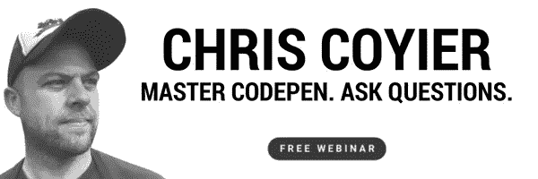

# CodePen 上的 Chris Coyier–加入对话！

> 原文：<https://www.sitepoint.com/chris-coyier-on-codepen-a-webinar/>

 在我们即将到来的网络研讨会上，与联合创始人 Chris Coyier 一起更深入地探讨 **CodePen 是有意义的。了解如何充分利用这一强大的工具，并询问 Chris 您自己的问题。 **[立即注册！](https://app.webinarjam.net/register/20023/787e16b0a7)****

### 什么是 CodePen？

CodePen 自我描述为“前端 web 的游乐场”。你可以使用 CodePen 做各种事情。在这里，前端开发人员可以分享他们有问题的代码以寻求建议，构建或分享有趣的代码示例，尝试新的 CSS 或 JavaScript 技术，等等。在 CodePen 中共享项目的便利性和能力使得它作为一个故障排除和协作工具非常有用。我们甚至使用 CodePen 来演示我们的[文章代码示例！](http://codepen.io/SitePoint/)看看其他一些[受欢迎的笔](http://codepen.io/pens/)，了解人们使用这个平台的目的。

### 与 CodePen 专家 Chris Coyier 聊天

克里斯·科伊尔是 [CodePen](https://codepen.io/) 的联合创始人、 [CSS-Tricks](https://css-tricks.com/) 的创始人，也是[商店脱口秀](http://shoptalkshow.com/)的联合主持人。Chris 从事过设计、前端开发、社交媒体方面的工作，写过无数关于 CSS 和其他 web 开发主题的文章和帖子。显而易见，我们非常兴奋地邀请他参加我们即将举办的[网络研讨会](https://app.webinarjam.net/register/20023/787e16b0a7)，与我们一起讨论 CodePen 并解答您的问题！首先，我们自己问了克里斯几个问题。

Q: How would you describe what you do?

克里斯:我回复电子邮件。我写稿子。我写 CSS。我想想用 CodePen 是什么感觉。我努力鼓励人们做好工作，积极向上。我知道社交媒体上发生了什么。我努力站在 web 开发世界的顶端。

Q: What was the story behind CodePen? (How and why did you start it, your source of inspiration and that lightbulb moment?)

克里斯:对于超级感兴趣的人，我们有一个名为 [CodePen Radio](https://blog.codepen.io/radio/) 的播客，第一集名为[大创意](https://blog.codepen.io/2014/02/18/001-big-idea/)。简而言之，我们认为我们可以做一个更好的版本，让它更像一个社交场所，并在此基础上进行改进。

Who should be using CodePen, and where can it best be applied in a project?

Chris: 使用 CodePen 有很多理由。有一些人用它做项目。我们经常听到的是，人们在 it 中建立原型，与他们的团队和客户讨论原型，然后在项目确定后将它转移到项目中。有些人用它来测试。也许他们正试图找出一个 bug，或者试图隔离一个跨浏览器的问题。有些人把它更像是他们工作和想法的作品集。

What has been a thing that CodePen solved that you didn’t expect?

**Chris:** 我最喜欢的一件事是，人们通过 CodePen 见面后，彼此相遇，一起做一些很棒的事情。我认识了一对(*有意匿名*)在 CodePen 上认识后订婚的情侣。我们在 CodePen 上组建了自由职业者团体。我们有很多人在 CodePen 上被发现后找到了工作。那种东西*让我震惊*。

### 加入对话

我们想确保我们正在帮助你成为更好的 web 开发人员。出于这个原因，我们一直在与各种网站开发和设计专业的专家进行许多现场对话，并给你一个加入的机会！

本周，Chris Coyier 将加入我们，为您提供最大化 CodePen 体验的技巧，并准备在 9 月 28 日下午**3:00 PST**回答您的问题。[现在注册](https://app.webinarjam.net/register/20023/787e16b0a7)参加现场活动，**问克里斯你的密码问题**。

## 分享这篇文章