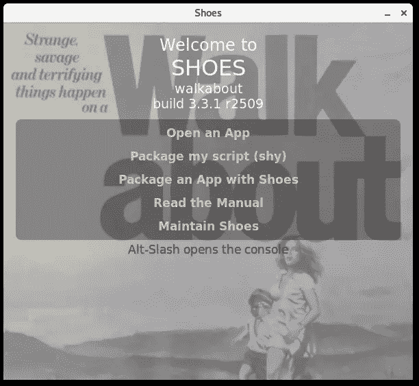
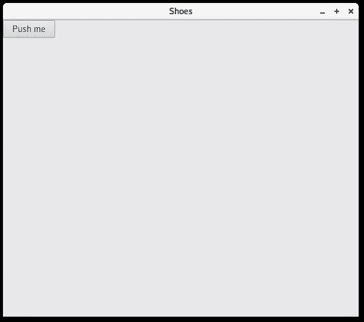
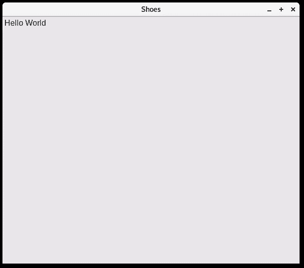
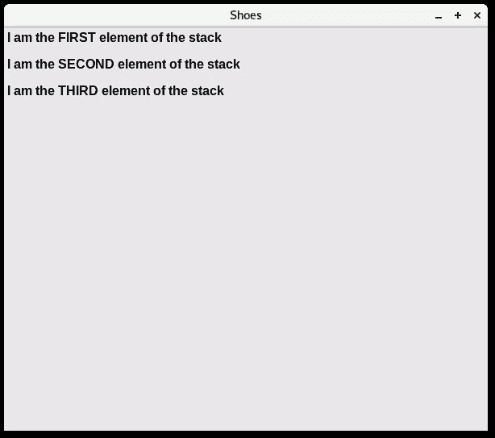
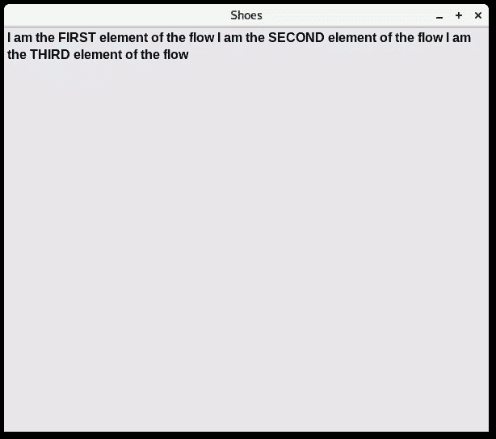
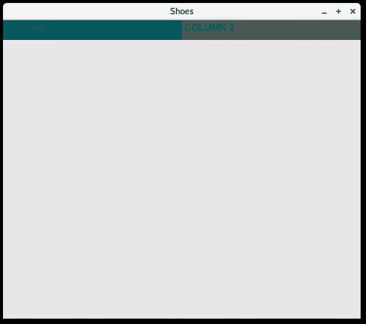
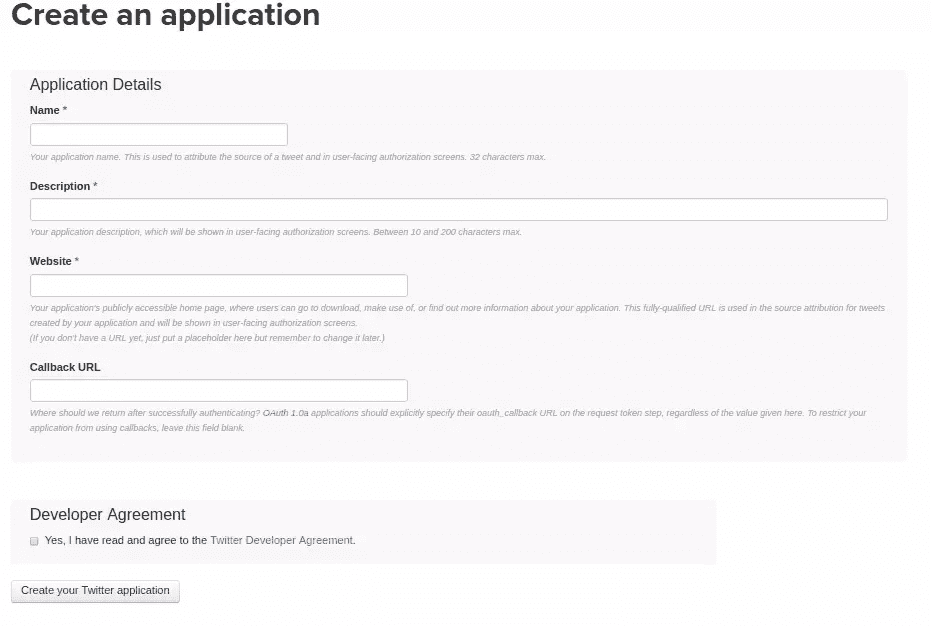
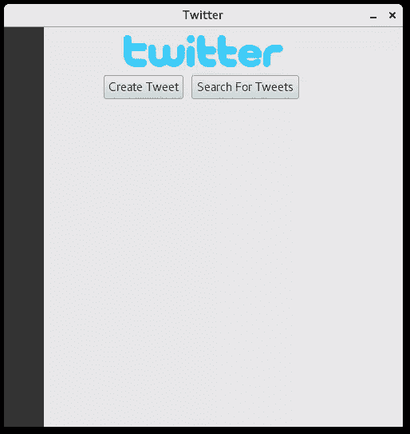
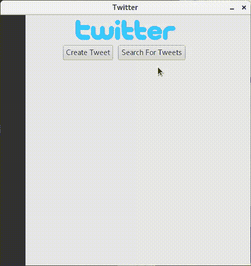

# 用鞋子创建一个 Twitter GUI 客户端

> 原文：<https://www.sitepoint.com/create-a-twitter-gui-client-with-shoes/>


回顾历史，了解软件是如何发展的非常有趣。从那时起，与软件交互就像回答我们程序提出的“问题”一样简单(有点像乒乓球，对吧？).今天，我们有超级复杂的软件，没有好的用户界面是不可能的。但是即使我们今天有非常好的界面，也有很多程序只有命令行界面，而且它们做得很好。我个人用了相当多。但是，当您的应用程序需要图形用户界面(GUI)时，您会怎么做呢？

Ruby 有各种用于创建图形界面的库。我们将关注最常用的鞋。

## 红宝石鞋！

Shoes 是创建 GUI 应用程序最常用的库之一。鞋子背后有一些有趣的历史，你可以在这里了解更多。

在网上搜索鞋子可能会有点混乱。鞋，作为开源(MIT /开源)，有不同的分叉。我们将使用官方版本:鞋子 3.3.1。

## 安装鞋子

直接从 RubyGems 库安装它会给我们一个旧版本的 Shoes。我们必须直接从[鞋子下载页面](http://shoesrb.com/downloads/)获取。下载适合您的操作系统的版本。

我们必须使文件可执行:

```
chmod +x shoes-3.3.1-gtk3-x86_64.install 
```

然后运行:

```
./shoes-3.3.1-gtk3-x86_64.install 
```

鞋子将被复制到**你的家庭目录/。鞋子/徒步**。Alos，如果你在菜单里没有看到鞋子，注销再登录。

## 鞋子介绍

让我们用下面的代码创建一个名为 **example.rb** 的文件:

```
Shoes.app { button "Click me" } 
```

要运行这个应用程序，我们需要使用我们之前安装的鞋子步行程序。



根据您使用的操作系统，应用程序将安装在鞋上。点击**打开一个 App** ，打开我们刚刚创建的文件 **example.rb**

这将运行我们的应用程序:



只需一行代码，就可以创建一个带按钮的窗口。听起来很像红宝石，对吧？

还有另一种方式来运行我们的应用程序，我们将在整个教程中使用。打开您的终端，输入以下内容:

`~/.shoes/walkabout/shoes example.rb`

这将直接打开我们的示例应用程序。

## 鞋子样品

除了创建一个窗口和一个按钮，鞋有更多的权力。让我们先做一些基础工作。 **Hello World** 传统也可以在鞋子上完成。首先，从创建窗口/画布的 Shoes.app 循环开始，这是我们添加所有元素的地方。

**example.rb** :

```
Shoes.app do
  para "Hello World"
end 
```

**para** 是鞋子的元素之一，它代表段落。运行 example.rb

```
~/.shoes/walkabout/shoes example.rb 
```



您还可以使文本以不同的样式显示(强、em、代码):

```
para strong "Hello World" 
```

会使文字显得加粗。有如此多的选项可以操作文本，您可能需要查看文档以了解更多细节。

### 布局

对于鞋子来说，布局是你需要学习的重要内容之一。布局控制组件在应用程序中的显示方式。在鞋子上，我们有两种布局:堆叠和流动。

#### 堆


想象一个书库是一堆书，你添加的每一个元素都在另一个的下面。

```
Shoes.app do
  stack do
    para strong "I am the FIRST element of the stack"
    para strong "I am the SECOND element of the stack"
    para strong "I am the THIRD element of the stack"
  end
end 
```



正如你可能看到的，每一段都在前一段的下面，就像我们的书堆的例子一样。还要注意`strong`标签，使段落看起来加粗。

#### 流动


与堆叠不同，流动试图从一侧到另一侧填充容器，直到填满为止:

```
Shoes.app do
  flow do
    para strong "I am the FIRST element of the flow"
    para strong "I am the SECOND element of the flow"
    para strong "I am the THIRD element of the flow"
  end
end 
```



根据您正在构建的应用程序的不同，**栈**和**流**有不同的用途。有些情况下你可能需要同时使用它们(是的，这是可能的！).下面是一个包含两列的网格示例:


这是通过一个流和两个栈来实现的，划分它们的宽度:

```
Shoes.app do
  flow do
    stack width: "50%" do
      background "#075f63"
      para strong "COLUMN 1"
    end

    stack width: "50%" do
      background "#485956"
      para strong "COLUMN 2"
    end
  end
end 
```



栈和流允许你以一种很好的方式放置元素，但是你可以使用一种更具体的方式来放置你的元素。有`:top`、`:left`、`:margin`等选项。你也可以用`width`和`height`来调整你的元素大小。

## 鞋子推特

让我们用一些基本的功能构建一个简单的 Twitter 应用程序，看看鞋子在跑！我们需要 Twitter gem，Twitter API 的 Ruby 接口:

```
gem install twitter 
```

创建一个名为 **app.rb** 的文件，这将是我们下一部分教程的文件。首先创建一个名为`TwitterApp`的类，它继承自`Shoes`类:

```
require 'twitter'
class TwitterApp < Shoes
end

Shoes.app title: "Twitter", :width => 500, :margin => 5, resizable: false 
```

注意，我们用`title:`来设置标题，并且我们添加了一个新的选项，`resizable:`到`false`，所以窗口是不可调整大小的。

现在让我们试着运行应用程序:

```
$ ~/.shoes/walkabout/shoes app.rb
cannot load such file -- twitter 
```

我们刚刚安装了 twitter gem，但它没有找到它。Shoes 管理自己的 gem，所以安装在我们系统上的任何 gem 都不能直接在我们的应用程序中使用。有两种方法可以解决这个问题。

将此添加到我们的文件顶部:

```
Shoes.setup do
  gem 'twitter'
end 
```

它将安装我们在那里定义的所有 gems，即使它们没有在我们的系统中安装。另一方面，我们可以使用命令行`shoes` app:

```
$ ~/.shoes/walkabout/shoes -g install twitter 
```

你也可以用它来列出鞋子可以买到的所有宝石:

```
$ ~/.shoes/walkabout/shoes -g list -l 
```

现在，如果我们运行我们的应用程序，我们将看到一个空窗口，这正是我们此时想要的。

我们希望不同的功能有不同的屏幕。一个屏幕可以创建推文，另一个可以让我们搜索推文。我们可以用`url`选项定义这些屏幕。我们将创建三个屏幕:一个用于应用程序的主屏幕，另外两个用于创建推文和搜索推文。

```
url "/", :home
url "/CreateTweet", :CreateTweet
url "/SearchForTweets", :SearchForTweets 
```

### Twitter API

让我们先在 Twitter 上注册我们的应用程序。前往 [Twitter 应用](https://apps.twitter.com/)，点击**创建新应用**按钮。



在表格的字段中填写有关你的申请的详细信息。忽略**回调 URL** ，因为在本教程中我们不会使用 OAuth。切换到**密钥和访问令牌**选项卡，复制**消费者密钥(API 密钥)**和**消费者秘密(API 秘密)**。在同一页面上，点击**生成我的访问令牌**。复制**访问令牌**和**访问令牌秘密**。我们需要这四种价值观。

在屏幕中使用`url`的部分之前添加 Twitter REST 客户端代码:

```
...............

$client = Twitter::REST::Client.new do |config|
  config.consumer_key        = "**FocAmowbEcFocAmowbEcFocAmowbEcFocAmowbEc**"
  config.consumer_secret     = "tiosjeOk1LJFVUOT4mz8EB0br6dScPCp27bk92P84JK"
  config.access_token        = "tiEgBqkNjbJKC8mrUwv5mAC7UGavfhWh"
  config.access_token_secret = "VYpAjjENGtiEgBqkNjbwxbrOsWLOCgCaTmTJrwFDWBMP8"
end
................
url "/", :home
url "/CreateTweet", :CreateTweet
url "/SearchForTweets", :SearchForTweets 
```

> > **Note:** These tokens should be stored in a secret file and should never be made public. We only do this for the tutorial.

现在我们需要定义这些屏幕:

```
def home

end

def CreateTweet

end

def SearchForTweets

end 
```

这是我们应用程序的框架。主屏幕总是第一个，所以即使你现在运行应用程序，你也只会看到第一个屏幕。我们将使用按钮将它们导向其他屏幕。我将为每个屏幕粘贴我的代码，并解释它的一部分。

主屏幕:

```
def home
  background "#333", width: 50
  stack displace_left: 50 do
    image "static/twitter_logo.svg.png", margin_left: 100, margin_top: 10
    flow margin_left: 70, margin_top: 5 do
      button "Create Tweet", margin: 5, width: 110 do visit '/CreateTweet'end
      button "Search For Tweets", margin: 5, width: 145 do visit '/SearchForTweets' end
    end
  end
end 
```



添加图像非常简单，只需添加`image`元素并插入图像的路径。我们之前提到过，按钮会将我们的应用程序指向不同的屏幕。别忘了我们在开始时定义了`/CreateTweet`:

```
button "Create Tweet" do visit '/CreateTweet'end 
```

创建 Tweet 屏幕:

```
def CreateTweet
  background "#333", width: 50
  stack displace_left: 50  do
    image "static/twitter_logo.svg.png", margin_left: 100, margin_top: 10
    @input = edit_line text: "Write your tweet!", margin_left: 100, margin_top: 15
    flow margin_left: 120, margin_top: 5 do
      button "Tweet", :margin => 5 do
        puts "Trying to tweet..."
        $client.update(@input.text)
      end
      button "Back", margin: 5 do visit '/'end
    end
  end
end 
```

我们使用`edit_line`从用户那里获得输入，并将其存储在一个变量中。现在将使用 twitter gem 中的`update`方法，使用`button`元素来发布 tweet。

SearchForTweets 屏幕:

```
def SearchForTweets
  background "#333", width: 50
  stack displace_left: 50 do
    image "static/twitter_logo.svg.png", margin_left: 100, margin_top: 10
    @input = edit_line text: "Search for Tweets", margin_left: 100, margin_top: 15
    flow margin_left: 120, margin_top: 5 do
      button "Search", margin: 5 do
        $client.search(@input.text, result_type: "recent").take(3).each do |tweet|
          para  tweet.text + "\n\n", :stroke => "#1da1f2", margin_left: 51
        end
      end
      button  "Back", margin: 5 do visit '/' end
    end
  end
end 
```

使用相同的代码，我们只是从创建推文切换到搜索推文。`search`方法需要另一个参数来搜索 *( `mixed`、`recent`或`popular` )* 。有一个额外的转义字符使它看起来更好一点`\n\n`，我们限制只显示 3 个带有`.take(3).each`的搜索。

如果您遇到一个 SSL 问题，您可以用这一行禁用它，但是，不建议这样做。这是我找到的唯一解决办法:

```
OpenSSL::SSL::VERIFY_PEER = OpenSSL::SSL::VERIFY_NONE 
```

将它添加到该行的顶部，在类声明之后。

完整代码:

```
Shoes.setup do
  gem 'twitter'
end

require 'twitter'

class TwitterApp < Shoes

  OpenSSL::SSL::VERIFY_PEER = OpenSSL::SSL::VERIFY_NONE

  $client = Twitter::REST::Client.new do |config|
    config.consumer_key        = "**FocAmowbEcFocAmowbEcFocAmowbEcFocAmowbEc**"
    config.consumer_secret     = "tiosjeOk1LJFVUOT4mz8EB0br6dScPCp27bk92P84JK"
    config.access_token        = "tiEgBqkNjbJKC8mrUwv5mAC7UGavfhWh"
    config.access_token_secret = "VYpAjjENGtiEgBqkNjbwxbrOsWLOCgCaTmTJrwFDWBMP8"
  end

  url "/", :home
  url "/CreateTweet", :CreateTweet
  url "/SearchForTweets", :SearchForTweets

  def home
    background "#333", width: 50
    stack displace_left: 50 do
      image "static/twitter_logo.svg.png", margin_left: 100, margin_top: 10
      flow margin_left: 70, margin_top: 5 do
        button "Create Tweet", margin: 5, width: 110 do visit '/CreateTweet'end
        button "Search For Tweets", margin: 5, width: 145 do visit '/SearchForTweets' end
      end
    end
  end

  # Create tweets screen

  def CreateTweet
    background "#333", width: 50
    stack displace_left: 50  do
      image "static/twitter_logo.svg.png", margin_left: 100, margin_top: 10
      @input = edit_line text: "Write your tweet!", margin_left: 100, margin_top: 15
      flow margin_left: 120, margin_top: 5 do
        button "Tweet", :margin => 5 do
          puts "Trying to tweet..."
          $client.update(@input.text)
        end
        button "Back", margin: 5 do visit '/'end
      end
    end
  end

  # Search for tweets screen

  def SearchForTweets
    background "#333", width: 50
    stack displace_left: 50 do
      image "static/twitter_logo.svg.png", margin_left: 100, margin_top: 10
      @input = edit_line text: "Search for Tweets", margin_left: 100, margin_top: 15
      flow margin_left: 120, margin_top: 5 do
        button "Search", margin: 5 do
          $client.search(@input.text, result_type: "recent").take(3).each do |tweet|
            para  tweet.text + "\n\n", :stroke => "#1da1f2", margin_left: 51
          end
        end
        button  "Back", margin: 5 do visit '/' end
      end
    end
  end
end

Shoes.app title: "Twitter", :width => 500, :margin => 5, resizable: false 
```



## 结论

鞋子很简单。这篇文章只是一个简短的介绍，告诉你用鞋子创建一个 GUI 应用程序有多快。您也可以使用 Shoes Walkabout 应用程序在其他操作系统上编译相同的代码。我们将在另一篇文章中讨论这个问题。

您是否使用过鞋子进行任何应用？如果有，请在评论中分享

## 分享这篇文章