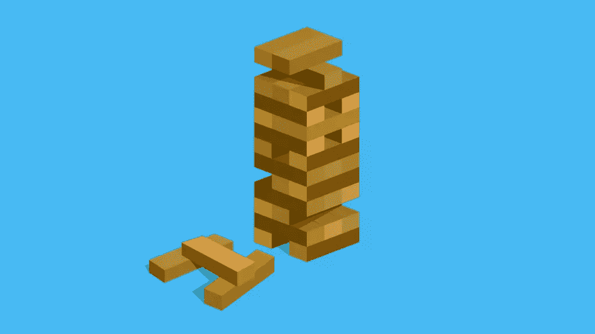

# AtoZ CSS 快速提示:使用悬停和高度

> 原文：<https://www.sitepoint.com/atoz-css-hover-height/>

本文是我们 AtoZ CSS 系列的一部分。你可以在这里
找到这个系列的其他条目，在这里查看 Hover [的完整截屏和脚本。](https://www.sitepoint.com/atoz-css-screencast-hover-pseudo-class)

欢迎来到我们的 AtoZ CSS 系列！在这个系列中，我将从字母表中的一个字母开始探索不同的 CSS 值(和属性)。我们知道有时屏幕广播是不够的，在本文中，我们为您添加了一个关于悬停的新的快速提示。

## h 代表悬停和高度

关于悬停，我没有太多可以说的，我已经在关于字母 h 的视频中介绍过了。但是，有一些很酷的动画，你可以申请悬停状态。谷歌“CSS 悬停效果”，你会发现很多。

这里有几个网站有一些漂亮的效果:

*   [Codrops: CSS 过渡悬停效果](http://tympanus.net/codrops/2012/08/08/circle-hover-effects-with-css-transitions/)
*   [设计小屋:复制+粘贴悬停效果](http://designshack.net/articles/css/5-cool-css-hover-effects-you-can-copy-and-paste/)
*   [CSS-Tricks: pop 悬停](https://css-tricks.com/pop-hovers/)

除此之外，我最近为代码学校制作了一个视频[，全是关于一个名为](https://www.codeschool.com/screencasts/hover-css) [hover.css](https://github.com/IanLunn/Hover/blob/master/css/hover.css) 的图书馆。

另一个 CSS H(在这个网站上我没有详细介绍)是`height`。

height 属性用于定义包含元素的内容高度。所有的标准长度单位(像 px、em、rem、%、vw、vh 等)都可以用来控制`height`。

如果没有特别设置元素的高度，它将被计算为容纳所有包含元素的最小高度(对应于默认值`auto`)。

通常建议避免明确设置任何元素的高度，因为这会限制元素的灵活性，也就是说它不能随着内容的变化而增长。这在处理响应式设计时尤其危险，因为内容需要随着可用宽度的变化而垂直重排。

因此，我倾向于只在有预定义尺寸的元素上设置`height`,比如图像。另一个用例是当使用`absolute`或`fixed`位置作为`height`(和`width`)收缩包裹定位的元素时。

这里有一个例子，演示了设置固定高度的问题。

通过 [CodePen](http://codepen.io) 上的 SitePoint ( [@SitePoint](http://codepen.io/SitePoint) )查看笔[的高度属性](http://codepen.io/SitePoint/pen/NRbwrA/)。