# WordPress 播客初学者指南

> 原文：<https://www.sitepoint.com/a-beginners-guide-to-podcasting-with-wordpress/>

在过去的几年里，播客在互联网上变得非常受欢迎，它给用户提供了一个扩大他们网络影响力的机会，同时也增加了流量。将近 4600 万美国人每月收听播客。

这样的数字很难被忽视。在这篇文章中，我们将告诉你你需要知道的关于 WordPress 播客的一切，并通过向你介绍一些最好的插件来帮助你开始工作。

在我们继续之前，让我们把所有这些放入上下文中。

## 播客简介

虽然这个概念从 80 年代的广播繁荣时期就已经存在，但播客是一个相对较新的术语，是苹果公司的 iPod 媒体播放器和单词 broadcast 的大杂烩。播客的定义是:

> 数字音频或视频文件或记录，通常是主题系列的一部分，可从网站下载到媒体播放器或计算机来源:Dictionary.com

Adam Curry 和 Dave Winer 是 iPodder 的创始人，ipod der 是现代播客的基础。该网站的目的是为用户提供一个优雅的广播机制，使他们能够随时收听音频内容。

### 播客的兴起

播客自 2004 年就已出现，十多年后，它在大众中重新流行起来。根据一项研究，在美国听播客的人比以往任何时候都多。

*   近 4600 万美国人每月收听播客。
*   2700 万美国人平均每周听 6 次播客。
*   超过一半的播客听众在他们的智能手机上消费。
*   45%的播客听众拥有大学学位。
*   25%的播客听众几乎每天都将他们的智能手机插入汽车的音频系统。
*   苹果通过 iTunes 订阅播客的数量已经超过了 10 亿。

播客再次成为潮流，这一次他们将会在这里停留一段时间。大多数播客听众都是年轻、富裕、受过良好教育的人，他们渴望在早晨通勤和日常事务中获得音频内容。

苹果的产品带有股票播客应用，而其他应用如 SoundCloud、Tune In 和 Stitcher 也广泛使用。

### WordPress 中的播客

播客和 WordPress 就像豆荚里的两颗豌豆(双关语！).WordPress 是一个非常受欢迎的 CMS，它的用户喜欢跟上最新的趋势和风格。你可能已经注意到，大多数 WordPress 中心都在他们的网站上添加了一个播客来补充他们的日常博客，涵盖了从最新事件到教程的所有内容。在某种程度上，网站所有者正在将书面内容转化为音频内容。

从市场营销的角度来看，播客和 WordPress 网站的结合对网站所有者更有利，因为两者互相促进，覆盖的范围是前者的两倍。在这一点上，你可能相信很多人(我的意思是很多人)定期订阅播客，但仍然不确定是否值得付出所有的努力。

在下一节中，我们将介绍开办自己的播客的优势，以及它如何为你的在线业务带来好处。

## 为什么你应该从今天开始播客

除了播客为在线企业提供了一个额外的渠道来推广他们的在线业务这一事实之外，这种内容广播机制还有一系列网站管理员可以利用的优势。

### 提高转化率

播客是一种提高转化率的聪明方法。例如，如果你在销售 WordPress 的插件或主题，你可以通过你的节目向你的播客听众推销你的产品。如果你网站的访问者知道他们也会定期收到播客更新，他们更有可能订阅电子邮件。

在你的写作中加入个性和使用对话的语气可以在作者和读者之间建立信任。想象一下播客将会带来的不同。

### 吸引更多的流量

目前互联网上有数千万个博客，而播客的数量仍然只有几十万。这是一个巨大的差异，这意味着新进入者有很大的空间。

开办播客可以让网站管理员为他们的网站吸引更多的流量，并充分利用流行的播客平台来获得认可。

### 提高与访客的互动

音频频道在建立观众(或者在这种情况下，听众)之间的信任方面极大地补充了你的网站。如果你的网站有博客，那么你网站的访问者会通过文字与你互动。让访问者和读者成为听众会给你的网站和团队增加人性化的元素。

一张图片可能胜过千言万语，一个博客可能传达你的信息，但是当涉及到提高与访问者的互动时，一个声音可能会产生很大的不同。

对大多数人来说，从在文本编辑器上输入文字到对着麦克风说出自己的心声，这种转变是平稳而自然的。其他人可能会觉得这是一项相当艰巨的任务。重要的是无论你决定选择什么，都要感到舒适。

## 播客入门

播客的概念一开始有点让人不知所措(相信我，我知道！)并且弄清楚如何开始是困难的。在文章的这一部分，我将带你一步一步地开始 WordPress 中的播客。

事不宜迟，我们开始吧！

### 步骤 1:设置你的 WordPress 站点

创建播客频道的第一步是建立一个 WordPress 网站。如果你还没有，你可以按照 WordPress 著名的 [5 分钟安装](https://codex.wordpress.org/Installing_WordPress)教程来安装。一旦你的网站建立起来，你需要选择一个像样的主机提供商。

建议使用媒体主机，因为媒体文件(音频、视频等。)比普通的 HTML 文档要大。这实质上意味着它们将消耗更多的资源，单独托管它们可以保证更好的性能。我们将在下一节稍后看一些特定于 WordPress 的解决方案。

### 步骤 2:工具和资源

你播客生涯中最重要的资产是你的麦克风。传递给听众的音频质量完全取决于您使用的麦克风，因此在购买第一个麦克风时，最好花点时间(当然还有钱)。

大多数播客专家建议你从一个动态麦克风开始，它具有前置发射和拒绝的功能。该功能使麦克风能够拾取您的声音，并消除录音环境中的任何其他噪音。

*   [骑行播客 USB 动圈话筒](http://www.amazon.com/gp/product/B000JM46FY)。Rode 产品在很多播客中很受欢迎。最棒的是，它们使用起来非常方便，你不用花太多钱就能得到一个动态麦克风。我必须说，这是一场公平的交易。
*   [雪球 USB 麦克风 by 蓝色麦克风](http://www.amazon.com/Blue-Microphones-Snowball-Microphone-Textured/dp/B000EOPQ7E)。如果你刚刚开始播客或者正处于实验阶段，雪球 USB 麦克风是一个很好的选择。
*   [Heil PR-40 动态录音室录音话筒](http://www.amazon.com/Heil-Dynamic-Studio-Recording-Microphone/dp/B000BQXOEM)。Heil PR-40 是专家使用的专业话筒。我建议你推迟购买 Heil PR-40，直到你对播客感到舒适，你的节目真正启动它。

你还需要一些其他设备，比如麦克风和一副像样的耳机。我们已经讨论了硬件方面，但是一个好的播客节目也会认真对待他们的软件。你们中使用个人电脑的人将不必花一分钱录制([帕米拉](http://www.pamela.biz/en/))和编辑([无畏](http://audacity.sourceforge.net/))他们的播客。另一方面，如果你有一台 Mac 电脑，录音软件([Skype](http://www.ecamm.com/mac/callrecorder/)通话录音软件)会花你几美元，但你可以免费编辑(GarageBand)。

我建议你采用一种精益的方法来制作播客，这意味着你应该首先提供最低限度的内容，评估听众的反应，然后从那里开始。通过明智和及时的投资节省更多！

### 步骤 3:发布您的播客

最后一步是将你录制的播客发布到网站上，或者在 iTunes 上直播。像 [SoundCloud](https://soundcloud.com/) 和 [Libsyn](http://www.libsyn.com/) 这样的平台是很好的起点。在一个知名平台上发布你的播客的好处是，你会立刻拥有一大群潜在的听众。

我们将在下一节详细讨论一些特定于 WordPress 的发布解决方案。

## 如何用 WordPress 开始播客

到目前为止，您已经熟悉了播客入门的基本知识。在这一节，我们将带你浏览一个使用 WordPress 最简单的播客插件之一的教程，[非常简单的播客](https://wordpress.org/plugins/seriously-simple-podcasting/)，帮助你获得实际使用该插件的实践经验。

### 安装和配置

严肃简单播客是 WordPress 的一个免费播客插件，所以你可以在你网站的后端搜索“严肃简单播客”(*插件* > *添加新的*)或者直接从 WordPress.org 下载并上传插件到你的网站。

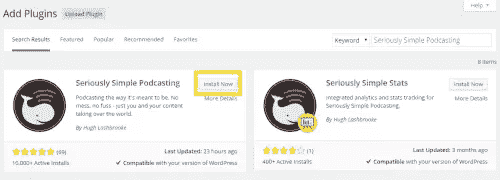

一旦你从*插件*屏幕激活插件，一个新的菜单项*播客*将被添加到 WordPress 导航栏。按照插件的[文档](https://www.seriouslysimplepodcasting.com/documentation/setting-up-your-podcast/)根据您的喜好配置其设置(*播客* > *设置*)。

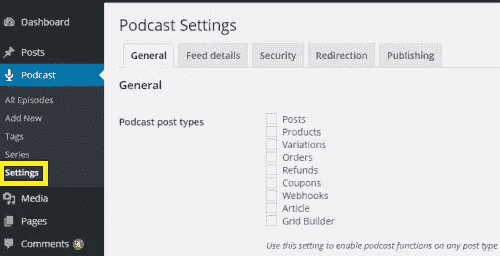

### 添加新剧集

播客由许多被称为剧集的节目组成。以下是你如何用非常简单的播客插件添加新的一集。

选择音频单选框:

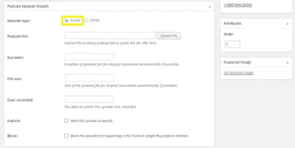

1.  从 WordPress 仪表盘导航到*播客* > *添加新的*。
2.  您将被重定向到“添加新专题节目”屏幕，在这里您可以输入播客专题节目的详细信息:

    1.  剧集标题。
    2.  插曲的描述。
    3.  播客系列。
    4.  播客剧集详情。

    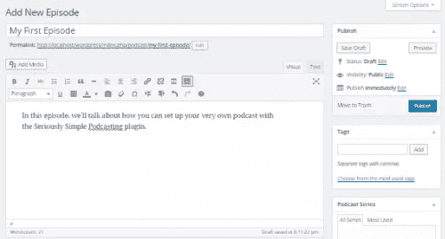

3.  在*播客剧集详情*部分选择*音频*剧集类型。
4.  上传音频文件或提供其 URL(如果它位于另一台服务器上)。
5.  完成后点击*发布*。

## 自定义小部件

非常简单的播客带有三种开箱即用的小工具配置，可以帮助你以最吸引人的方式显示你的播客片段。导航到*外观* > *小部件*详细浏览选项。

### 播客:单集

那些刚开始的人会发现最好利用播客:单集部件来一集接一集地显示他们的剧集。它提供了一个整洁干净的解决方案，使网站管理员能够以优雅的方式显示 epsiode 的详细信息。您可以选择显示最新剧集或特定剧集，以及以下任意(或全部)剧集详细信息:

1.  标题。
2.  摘录。
3.  内容。
4.  音频播放器。
5.  细节。

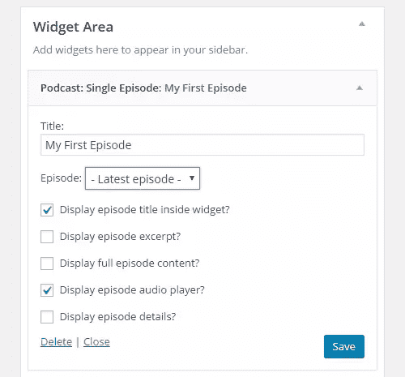

### 播客:最近几集

播客:最近几集小部件使用户能够在小部件区域显示多集。此选项允许您手动添加要在小部件区域显示的最近剧集的数量，并允许您选择是否要显示每集的剧集日期。

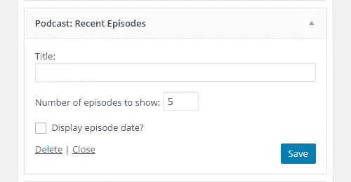

### 播客:系列

“播客:系列”选项对于那些发布不同播客系列剧集的人来说非常有用。这个小部件使用户能够选择他们想要显示的剧集，并选择在小部件区域显示哪些剧集的详细信息:

1.  标题。
2.  描述。
3.  日期

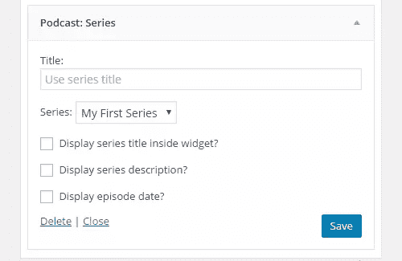

正如你所看到的，这个非常简单的播客插件提供了几个配置选项来帮助你建立一个功能齐全的播客*和*来使它在视觉上吸引人。它还提供了在你的 WordPress 站点上以各种格式显示播客的灵活性。

为了本教程，我们特意选择了最简单的场景，但公平地说，即使这样也为有抱负的播客提供了新的可能性。

## 帮助您入门的五大播客插件

在这一节，我们将仔细看看一些最好的 WordPress 插件，它们将帮助你从一开始就设置一个播客节目。

### [TSG 的播客插件](http://podcastingplugin.com/)

TSG 的播客插件提供了通过你的 WordPress 站点托管你的播客所需的最少资源。该插件通过整合 iTunes 支持并添加其兼容的提要来增强默认的播客支持。

有了这个插件，用户可以根据预先定义的因素获得多个播客提要。他们还可以使用其媒体播放器，使访问者不必离开网站就可以收听(或观看)播客。

TSG 的播客插件可以免费使用，如果你正在尝试播客，绝对值得一试。

### [非常简单的播客](https://wordpress.org/plugins/seriously-simple-podcasting/)

名字说明了一切！非常简单的播客可以让你避免陷入在 WordPress 中主持播客节目的琐碎细节。这个插件特别适合那些回避高级设置页面的网站管理员，他们经常会问:“有这样的插件吗？”(别担心，我也是其中之一)。

该插件具有易于使用的界面和一个简单的过程来设置和管理您的播客。虽然这个插件默认情况下使用起来很简单，但是用户可以进入它的设置来定制他们的体验。

非常简单的播客功能强大，这使得它成为新手和专业人士最受欢迎的选择之一。

### [布鲁布里动力出版社](https://wordpress.org/plugins/powerpress/)

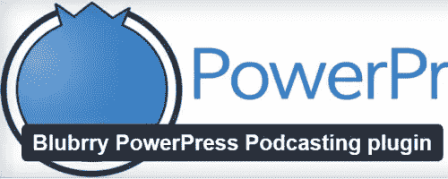

Blubrry PowerPress 是一个功能丰富的插件，它拥有你主持和管理你的播客节目所需的一切——无需离开你的 WordPress 网站。开发者宣称这个插件是 WordPress 排名第一的播客插件。

Blubrry PowerPress 插件支持一些最流行的播客平台，包括 iTunes、Stitcher 和 Google Play。Blubrry PowerPress 给用户带来的最突出的特点是，它还会处理你的播客的 SEO。

有了这个插件，用户可以设置一个定制的订阅菜单，并通过他们的 WordPress 站点创建多个播客频道。无论你是进入播客世界还是寻找一个更强大的工具，Blubrry 都能满足你。

### [Libsyn Podcast Plugin](https://wordpress.org/plugins/libsyn-podcasting/)

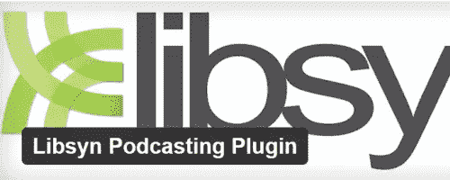

Libsyn 是最受欢迎的发布播客的平台之一，它的 Libsyn 播客插件使得整个过程对于 WordPress 用户来说更加简单。

Libsyn Podcast 插件允许用户从他们的 WordPress 站点直接发布他们的播客到他们的 Libsyn 账户。它负责更新您的 RSS 提要，并确保媒体文件存储在 Libsyn 的服务器上。多酷啊。

该插件会自动管理你的播客并生成你的 RSS 源。这可以让你的网络主机避免拥挤，避免资源被播客一个人用完。

### [辛科帕](https://wordpress.org/plugins/video-playlist-and-gallery-plugin/)

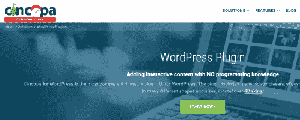

Cincopa 是一个多用途的解决方案，它为 WordPress 用户在他们的网站上添加各种媒体提供了很多选择。他们的众多服务之一是为播客提供媒体播放器，旨在简化整个播客过程。

Cincopa 的插件最好的部分是它带有大量的内置选项，使用户能够立即开始使用。这种轻量级的播客解决方案为用户提供了一个订阅 RSS 提要，减少了维护工作。

## 播客网站的主题

在这一节中，我们将为想要全力以赴进行播客秀的网站管理员们看看 WordPress 的两个最佳播客主题。我们去看看。

### [播客专业版(59.95 美元)](https://www.appendipity.com/themes/podcast-pro-theme/)

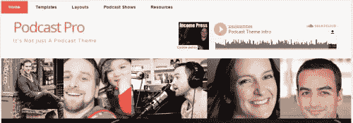

Appendipity 的 Podcast Pro 是一个全方位、多功能的播客主题，适用于想要通过一个平台展示多个播客节目的 WordPress 用户。该主题支持. mp3、SoundCloud 文件和 Libsyn 文件。Podcast Pro 有广泛的定制选项，使网站管理员能够通过选择深色或浅色模板来配置其样式。

除了整体设计之外，用户还可以进入本质的设计细节，调整主题的高亮颜色、排版和自定义标题，以适应他们网站的品牌。Podcast Pro 主题还附带了详细的教程，可以帮助初学者轻松设置自己的网站。

### [播客(44 美元)](http://themeforest.net/item/podcaster-multimedia-wordpress-theme/6804946)

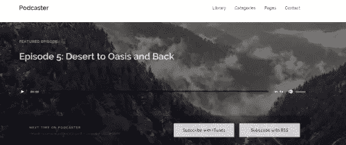

Podcaster 是一个完全响应的、retina ready WordPress 主题，适用于想要创建和管理自己的播客网站的网站管理员。这个主题自带对原生音频和视频播放器的支持。它使网站管理员能够从两个模板中选择一个——浅色或深色。

Podcaster 提供的突出功能之一是，它使用户能够建立播客档案，以允许他们的观众快速访问以前的剧集。该主题针对非常简单的播客插件进行了优化，并附带了全面的[文档](http://themestation.co/documentation/podcaster/)。

### [粉碎多媒体(免费)](https://www.smashingmagazine.com/2009/08/free-podcasting-video-and-photography-wordpress-theme/)

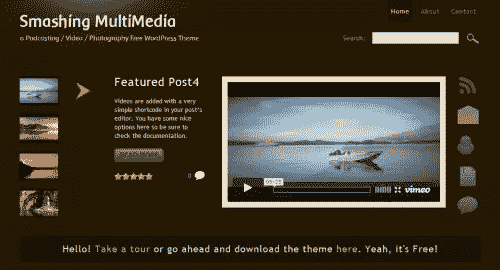

Smashing Multimedia 是播客网站的免费 WordPress 主题，允许网站管理员展示播客，并允许他们网站的访问者在不离开网站的情况下对其进行评级。这个主题的一个突出特点是它允许用户使用简单的短代码或媒体插件来添加媒体文件。

那些喜欢设计定制网站的人可以摆弄一下主题 [PSD 源文件](https://media-mediatemple.netdna-ssl.com/wp-content/uploaimg/multimedia-podcasting-photography-video-wordpress/multimedia-psd.zip)来创建一个真正独特的播客网站。主题从一开始就是本地化的，可以翻译成任何语言。

### [TA 音乐(免费)](http://justfreethemes.com/demo?theme=TA%20Music)

TA Music 是一个功能极其丰富的 WordPress 主题，自带音频播放器。网站管理员可以安排特殊的播客活动，发布播客专辑，甚至发布带有这种播客主题的博客帖子。该主题采用现代音乐风格的布局和设计，一定会吸引观众的注意力。

该主题还允许用户将播客分类为不同的类型。这使得在一个网站上托管多个播客变得容易。除此之外，TA Music 还具有会员功能，允许观众在您的网站上注册。

### 我们的乐队(免费)

我们的乐队是一个免费的 WordPress 主题，有着丰富的功能，为你的播客网站提供了一个视觉上吸引人的布局。它与 [HTML5 MP3 播放列表播放器](https://wordpress.org/plugins/html5-mp3-player-with-playlist/)插件一起工作，在用户的浏览器中实现本地音频播放。我们的乐队支持 gravatars 和作者信息框。

这个独一无二的主题具有一个响应式视差滑块，进一步增强了您网站的视觉吸引力，并允许您在不耗尽宝贵的屏幕空间的情况下显示特色播客。该主题的短代码集成使其非常容易上手——即使对于不太懂技术的用户也是如此。

### [音乐剧(免费)](http://smthemes.com/demo/musical/)

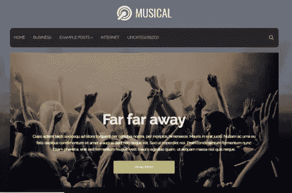

音乐剧是一个完全响应的播客主题，具有令人难以置信的布局和引人注目的排版。该主题带有社交分享按钮和一个开箱即用的自定义滑块。对于刚刚开始播客事业的播客来说，音乐主题是一个很好的起点。

音乐剧最大的优点之一就是它简单而优雅的设计。建立一个以此为主题的全方位播客网站轻而易举。您可以直接从媒体库将音频文件添加到您的播客帖子中，并与您站点的观众共享它们。

## 选择音频设备的简要指南

录制播客的音频设置对你的表现至关重要。说到软件，他们都有合适的功能来帮助你开始播客。不过，你将使用的实际硬件设备要复杂得多，在购买之前，有大量的因素需要考虑。我们一步一步来。

### 麦克风

您最终选择用于 podcast 设置的麦克风可以大致分为两类:

*   **冷凝器。**这些类型的话筒可以拾取最轻微的声音，通常与幻像功率混音器配合使用才能正常工作。如果你有一个录音棚，那么你肯定会选择电容话筒。
*   **动态。**动圈话筒具有方向性，这意味着它只会拾取最大的噪音。这些话筒最适合在嘈杂环境中录音的播客。基本上，如果你在录音棚之外的任何地方录音，你应该选择动态麦克风。

如上所述，我们对播客话筒的首选是:

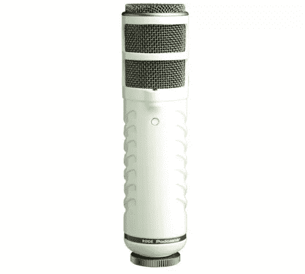

[骑行播客 USB 动圈话筒](http://www.amazon.com/gp/product/B000JM46FY/)。

*   费用:229 美元
*   类型:动态
*   端口:USB
*   使用人: [We Grow Media](http://wegrowmedia.com/) 和 [Mac Power 用户](https://www.relay.fm/mpu/)

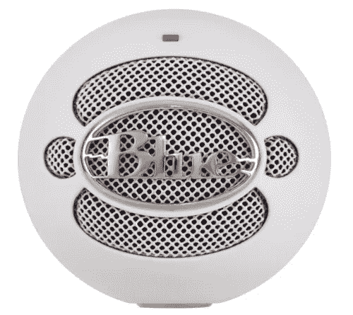

[雪球 USB 麦克风 by 蓝色麦克风](http://www.amazon.com/Blue-Microphones-Snowball-Microphone-Textured/dp/B000EOPQ7E/)。

*   成本:59.99 美元
*   类型:冷凝器
*   端口:USB
*   使用人:[剑](https://player.fm/series/one-of-swords-podcast)和[之一谷歌周刊](http://google-weekly.net/)

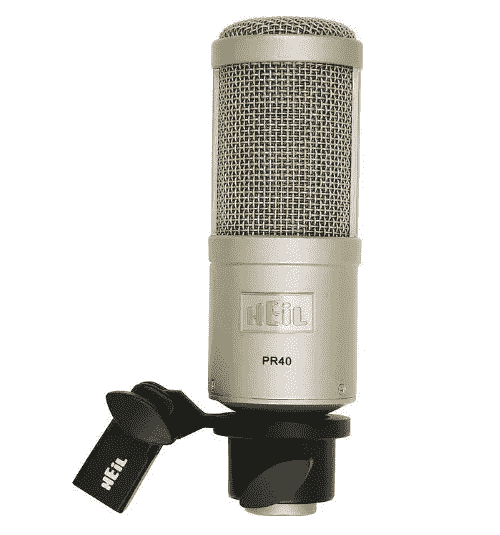

[Heil PR-40 动态录音室录音话筒](http://www.amazon.com/Heil-Dynamic-Studio-Recording-Microphone/dp/B000BQXOEM)。

*   费用:327 美元
*   类型:动态
*   港口:XLR
*   使用人:[灵异播客](http://jimharold.com/category/the-paranormal-podcast/)和 [5by5](http://5by5.tv/)

### 音频接口

如果你正在运行一个单人播客节目，那么你可以使用 USB 麦克风。如果你打算和几个常规团队成员一起主持节目，或者打算在你的工作室进行采访，那么你会选择一个带 XLR 端口的麦克风(或者多个 USB 麦克风，取决于你的偏好)。一个没有音频接口的播客团队是不完整的。以下是你需要考虑的一系列因素:

*   输入通道的数量。
*   一个 USB 接口连接到您的电脑。
*   你的预算。
*   幻像电源(对于电容话筒)。

让我们来看看一些最流行的音频接口和混音器选项。

雅马哈 MW12CX 搅拌机

*   成本:359.99 美元
*   频道:12
*   USB:是
*   幽灵力量:是的

[Alesis MultiMix 8 USB FX](http://www.alesis.com/store)

*   费用:113 美元
*   频道:8
*   USB:是
*   幽灵力量:是的

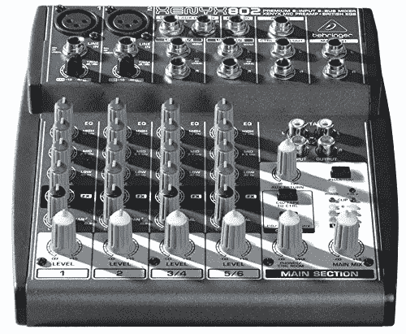

[百灵达 XENYX 802 8 输入 2 总线混频器](http://www.amazon.com/Behringer-802-Premium-8-Input-Preamps/dp/B000J5XS3C)

*   成本:59.99 美元
*   频道:8
*   USB:是
*   幽灵力量:是的

对于那些选择了 USB 麦克风并且是播客节目唯一主持人的人来说，音频接口并不是必需品。我们建议你从小处着手，如果你喜欢的话，在你完成整个播客工作后，投资一个混音器或音频接口。

### 移动录音机

喜欢旅游*和*梦想播客？我们没有忘记你们所有的旅行播客！那些一直梦想主持自己的播客节目但没有追求它，因为你总是在奔波，不能经常在一个新的地方建立一个录音室的人，可以用这些推荐的强大的便携式录音机之一来完成这项工作。

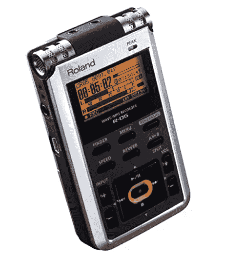

[罗兰 R-05](http://www.amazon.com/gp/product/B003IJ3WIW/)

*   费用:199 美元

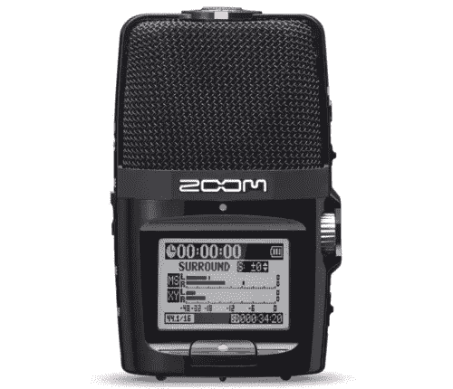

[变焦 H2n](http://www.amazon.com/gp/product/B005CQ2ZY6)

*   成本:159.99 美元

[缩放 H1](http://www.amazon.com/gp/product/B003QKBVYK)

*   价格:96.97 美元

## 如何使用 SoundCloud

SoundCloud 已经发展成为使用最广泛的服务之一，它将在线流媒体和社区意识带到了一个单一的平台上，使用户能够分享音乐和播客。虽然 SoundCloud 主要用于音乐，但越来越多的成员已经开始通过这个强大的应用程序托管他们的播客节目。

在这一部分，我们将看看 SoundCloud 提供的一些突出功能，以及如何在不到五分钟的时间内播放您的第一个播客节目。我们开始吧。

### 步骤 1:在 SoundCloud 上创建一个帐户

首次用户可以使用他们的电子邮件地址或社交媒体账户(脸书或谷歌)注册。

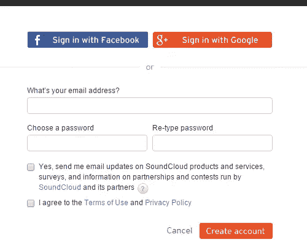

输入您的凭证后，勾选*使用条款和隐私政策*框，然后点击*创建账户*。

### 第二步:设置你的播客简介

这一步可能是整个过程中最关键的一步，因为它最终将决定你的用户如何看待你的播客节目。当你在 SoundCloud(或其他任何地方)建立个人资料时，你必须记住，你是在打造自己的品牌。你写的所有东西都将成为你营销的品牌的一部分。以下是您应该在*描述*框中涵盖的项目的快速清单:

1.  你的名字/你网站的名字。
2.  你的播客内容。
3.  谁应该听你的播客。
4.  听众如何从中受益。

有数百个非常棒的播客。这个*描述*盒子虽然很小，但却是最大的平台之一，用户可以通过它了解*你的节目是关于什么的*，最重要的是*为什么*他们应该听你说什么，而不是实际上播放它。帕特·弗林在他的播客[中对智能被动收入](https://soundcloud.com/smartpassiveincome)有一个很好的描述。

### 步骤 3:上传曲目

现在你已经建立了你的个人资料，是时候进入正题了。通过点击上传按钮(在搜索栏和你的头像之间)，你可以选择:

1.  上传文件
2.  开始新的录制

有了免费账户，你将被分配总共 180 分钟的时间——虽然不多，但足以开始你的播客。一旦你输入了你的曲目的*基本信息*(名称、描述等)，切换到*元数据*的下一个标签，允许你在曲目上设置购买链接。这实质上意味着你可以出售你的歌曲，而不是免费上传。你甚至可以添加一个许可证！

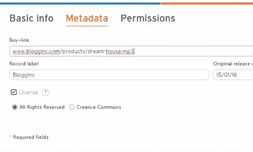

你有它！你可以通过三个简单的步骤制作并运行你的第一个播客。

## 成功播客的例子

### [发布状态:草稿](https://poststatus.com/category/draft/)

由 Brian Krogsgard 和 Joe Hoyle 主持的 Post Status: Draft 播客向 WordPress 开发者和爱好者介绍了这个行业。这个播客包括 WordPress 和 web 社区的帖子状态访谈、对话和社论。

### [WordPress 周刊](http://wptavern.com/wordpress-weekly)

WPTavern 的 WordPress Weekly 是一个每周播客，谈论所有与 WordPress 相关的事情，其专长是新闻和特别采访。该节目由杰夫·钱德勒主持，截至发稿时已有 223 集。

### [连载](http://serialpodcast.org/)

播客《美国生活》的创造者们创造了这个系列节目。这个播客节目的每一季都详细报道了一个真实的故事。如果你正在寻找一个引人入胜、结构良好的故事情节，这个播客是最好的选择之一。

### [Gimlet 媒体](https://gimletmedia.com/show/mystery-show/)

《快速公司》宣布 Gimlet Media 为[十大最具创新力的媒体公司之一](http://www.fastcompany.com/3041669/most-innovative-companies-2015/the-worlds-top-10-most-innovative-companies-of-2015-in-media)。Gimlet Media 的播客分为五个节目:令人惊讶的精彩，神秘节目，回复所有，科学与创业。

### [唤雨者. fm](http://rainmaker.fm/)

Rainmaker.fm 涵盖了从最佳实践到成功故事和技术再到尝试过的策略的所有内容，将帮助您加速您的在线业务。每一集都有宝贵的建议，由真实的经历支持，并符合数字营销的趋势。

### [SitePoint 的版本控制播客](https://www.sitepoint.com/blog/)

你可能熟悉 SitePoint 的版本控制播客，它为你带来了科技行业最优秀的人才，学习是什么让他们的大脑滴答作响，以获得他们对不断发展的 web 开发和设计世界的见解。目标是让你和那些挑战网页设计和开发极限的人保持联系，挖掘他们的智慧，分享他们的见解和想法，这样你就可以把自己的工作提升到一个新的水平。

## 结论

播客是一个不饱和的市场，今天完全有可能强势进入。尽管传统的播客可能已经有十多年的历史了，但它今天仍在快速发展。

一旦你安装好设备，用 WordPress 建立一个播客是非常容易的。我们介绍了一些工具和插件来帮助你开始，希望你现在有一个更好的地方来自己做进一步的事情。要了解更多信息，请务必查看权威的播客指南。

你用哪些插件来播放播客？你听哪些播客，你最喜欢它们的什么？我们很想听到你的意见，所以请在下面的评论区告诉我们吧！

## 分享这篇文章