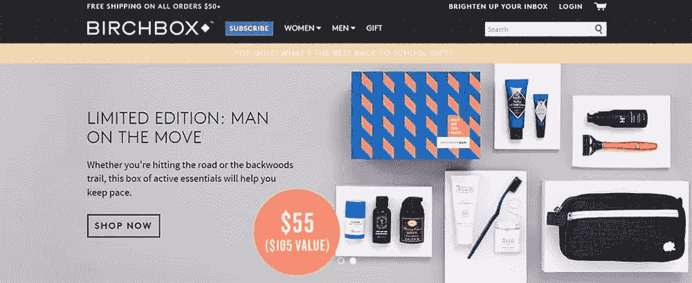
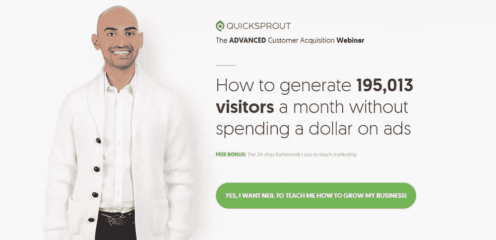
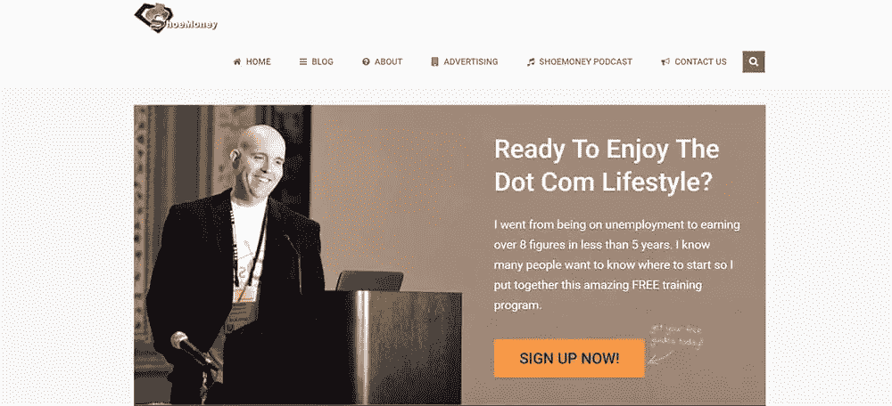
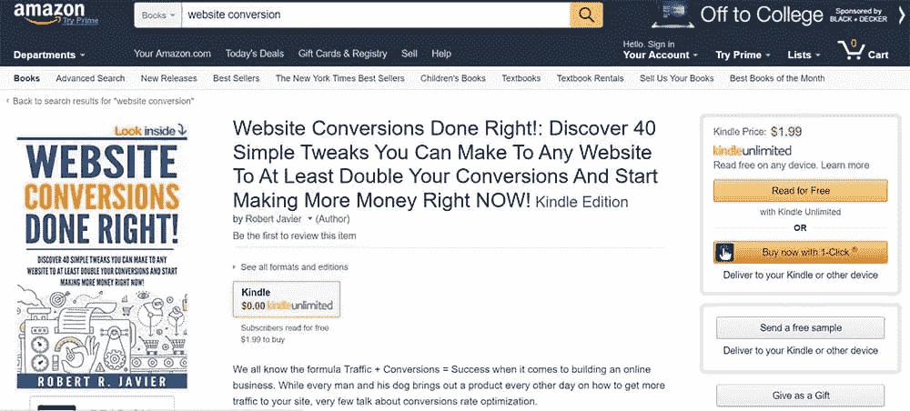
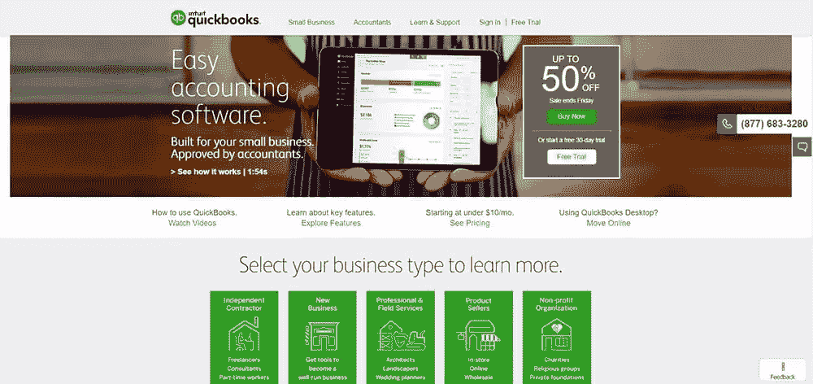

# 高转换率网站有哪些不同之处(如何复制他们的成功)

> 原文：<https://www.sitepoint.com/what-high-converting-websites-do-differently-how-to-copy-their-success/>

你做的一切都是对的。你雇了一个(昂贵的)网页设计师，现在有了一个你引以为豪的时尚网站。你实现了 SEO 来帮助你排名更高。人们正在访问你的网站…但是他们不买。

怎么回事？

拥有一个设计良好，甚至优化良好的网站是一回事。让流量从一个转化为另一个。你必须时刻关注你的观众，以及他们对你网站上发生的事情的反应。

寻找灵感？有很多网站都有这个公式，你可以从中记笔记。在这里，你可以从高转化率的网站上获得经验，并应用到你自己的网站上。

## 1.网站是为访问者设计的，而不是网页设计者

网页设计可能是一个回音室，设计师经常会犯为设计而设计的错误，而不是为了最终用户或搜索引擎优化的目的。

这方面的一个例子是 Flash。现在几乎灭绝[(但不完全是)](http://www.fastcompany.com/3049920/tech-forecast/the-agonizingly-slow-decline-of-adobe-flash-player)，Flash 最初吸引了网页设计师、程序员和企业，因为它为网站提供了新的视觉功能。然而，在这个 SEO 和移动友好网站势在必行的时代，它不再能够满足人们对它的要求。

另一方面，一个用户友好的网站有着令人印象深刻但简单的设计。它很容易导航，用户永远不必等待图像加载。现在这些功能的技术肯定是可用的，所以仍然依赖于旧的，笨重的设计元素的公司将做好升级。

## 2.网站“索要”

即使是最完美的网页文案，平衡了恰到好处的关键字密度，如果没有这个关键因素:一个可靠的行动号召，也可能无法转化客户。访客可以阅读你的惊人网页副本，但之后，你想要什么？如果没有正确的引导，他们可能会去另一个网站，在那里你的竞争对手会很乐意告诉他们该怎么做。

目标明确的行动号召(CTA)会促使人们采取特定的行动。智能网站在一个页面上使用一个 CTA 来避免混淆。当然，一个网页(尤其是主页)应该有多个 CTA 实例，但是驱动应该是完成一个单独的动作，比如:

*   立即购买
*   签约雇用
*   点击了解更多信息

在可能的情况下，CTA 应该制造一种紧迫感。你希望你的访客觉得他们需要马上行动，而不是以后，以利用你提供的难以置信的优惠。鉴于我们的注意力持续时间比金鱼的注意力持续时间短，现在可能是你抓住它们注意力的唯一机会。

这里有一个例子:在订阅公司 BirchBox 的页面上，你可以看到，在前面和中间，有一个按钮吸引你现在购物。对于不想在主页上浏览产品的访问者，他(或她)可以点击那个按钮进入正题。该按钮在主页上重复出现几次。

当然，一个访问者可能会花半个小时来阅读你所有的网页内容，但是对于那些想走捷径的人来说，在你的网站上放置醒目的行动号召。

## 3.它使用按钮把访问者放在动作的中心

网站按钮出现了一个新趋势，它超越了“立即订阅”的标准模式，突出了实际点击按钮的好处。这些按钮有时会提供一些嘲讽的选项来代替点击正面的选项(“是的，我想赚更多的钱”和“不，我有足够的钱。”)，让游客会心一笑。谁想成为那个说自己有足够的钱却不能多花的傻瓜呢？

QuickSprout 的创始人尼尔·帕特尔(Neil Patel)已经完善了这些新一代按钮的艺术。他的网站使用将访问者放在前面和中心的措辞，并在按钮上有策略地放置几个简单的词来提供点击的理由。

为你自己的按钮测试新的措辞，看看你是否能因此提高转化率。您还可以[测试按钮](https://www.aabacosmallbusiness.com/advisor/truth-best-worst-call-action-button-colors-website-212506540.html)的不同颜色，看看哪种转换更高。

## 4.该网站提供了证据

一些网站(甚至可能是你的网站)可能对实际结果模糊不清。如果人们打算在一家公司花钱，他们希望有证据表明这样做会给他们带来好处。

高转化率网站通过统计数据、案例研究和硬数字给出成功的例子。博客写手 ShoeMoney 立即在他的主页上宣传说，他在不到 5 年的时间里从失业变成了收入 8 位数。对一个游客来说，那是令人印象深刻的。但除了这些吹嘘的权利，他还详细介绍了广告收入数字、网站访客和其他数据，向访客展示了他可以如何帮助他们提供广告建议。

## 5.结账过程很简单

电子商务公司在网站上最常犯的一个错误就是没有简化结账流程。如果这是转化率低的原因，您可以通过检查您的废弃购物车统计数据来判断。如果很多人在将商品放入购物车后但在完成交易前离开，你的结账过程可能就是问题所在。

现在，我不知道你，但如果有人已经花时间找到他们想买的我的产品，我当然不想让他们很难完成交易。

成功的网站最大限度地减少了购物者完成交易必须填写的字段数量，并保持了较低的点击页面数量。使用允许购物者保存信用卡信息的商家工具是为回头客简化结账过程的一种方式。

没有比亚马逊的更好的有效结账流程的例子了。购物者一旦建立了账户并输入了财务信息，就可以轻而易举地点击“一键式购买”按钮。当你的网站很容易买到时，人们会买更多。

如果你看到很多购物者放弃他们的购物车，评估一下你自己的结账流程。您可以从流程中删除哪些字段？你能把结账流程简化成更少的页面吗？在这个过程中，是否有一些部分需要很长时间来加载页面？

自己完成结帐过程，并让其他几个人也做这件事，记下瓶颈，这样你就可以改进它们。

## 6.该网站侧重于好处，而不是功能

这是标准营销 101，但如果你不是营销人员，你可能不会意识到这一点。品牌往往倾向于将他们的网页内容集中在他们产品的特点上(“更新、更快、更好”)，而很少考虑他们为最终用户提供的好处(“去除污渍，延长你衣服的寿命”)。

而高转化率的网站，则是把文案的重点放在客户身上。这不是你认为你的公司有多了不起，而是你如何帮助访问者解决问题。使用“你”这个词，而不是“我们”，直接和来访者交谈

QuickBooks 可以在其主页上谈论其会计软件的功能，但它是在与小企业主对话。使用“专为您的小型企业打造”这样的措辞，很明显，至少从营销的角度来看，该公司将小型企业客户放在了心上。

该页面的访问者可以选择他们经营的企业类型。然后，他们会被定向到一个登录页面，该页面会解决他们的具体问题，QuickBooks 可以帮助他们解决这些问题。

通过将焦点从你的品牌转移到你如何帮助人们，你可以与你的观众建立联系，这将导致更高的销售转化率。

通常，你只需要做一两个小调整就可以将你的网络流量转化为客户。但是在你一次实施所有这些策略之前，花点时间评估你的分析。如果不是结账过程把人拒之门外，大多数人会在哪个页面退出？这可能会为您提供问题所在的线索。

如果你的主页有很高的跳出率，看看文案。是否有一个有效且清晰的行动号召来引导人们采取下一步行动？你用来增加搜索结果流量的关键词和人们在你的网站上找到的一致吗？还是网站杂乱难导航？

你可能想让别人而不是你自己用新的眼光来评估这个网站，看看可能有什么问题。一旦你知道是什么没有改变人们，测试一个策略，等几个星期看看改变是否有所改善。如果你想继续前进，实施额外的策略，一次一个，直到你的网站也是一个高转化率的网站。

拥有一个可以转化的网站并不需要你有十亿美元的预算。你只需要注意当你的客户登陆你的网站时，他们看到了什么，并尽可能地让它成为一个友好的地方来满足他们的需求。

## 分享这篇文章