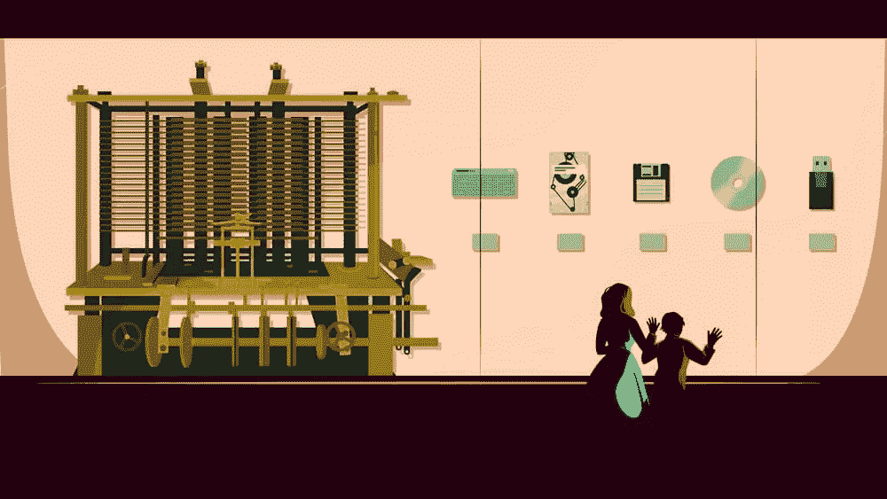

# 未来系统、代码寿命和网络鬼城

> 原文：<https://www.sitepoint.com/version-show-episode-9-code-longevity-and-web-ghost-towns/>

在版本控制节目的这一集中，Tim 和 David 讨论了今天的技术与未来系统的兼容性如何，软件应该持续多长时间，项目组织和渐进增强，一个软件即使有了全新的代码库也能保持其身份的棘手问题，以及网络鬼城(#webGhostTown)。

[https://w.soundcloud.com/player/?url=https%3A//api.soundcloud.com/tracks/283741980&color=ff5500&auto_play=false&hide_related=false&show_comments=true&show_user=true&show_reposts=false](https://w.soundcloud.com/player/?url=https%3A//api.soundcloud.com/tracks/283741980&color=ff5500&auto_play=false&hide_related=false&show_comments=true&show_user=true&show_reposts=false)

[访问版本控制展示主页](https://www.sitepoint.com/versioning-show/)

**[在 iTunes 上订阅](https://itunes.apple.com/us/podcast/the-versioning-show/id1135300597) | [在 Stitcher 上订阅](http://www.stitcher.com/podcast/sitepoint/the-versioning-show) | [查看所有剧集](https://www.sitepoint.com/blog/)**

## 显示注释

*   Twitter 上的#webGhostTown 标签
*   蒂姆的项目[restaurantmenubuilder.com](https://restaurantmenubuilder.com/)。(GitHub repo:[RestaurantMenuGenerator](https://github.com/tevko/RestaurantMenuGenerator)
*   [精益启动](https://en.wikipedia.org/wiki/Lean_startup)
*   [四人帮](http://www.blackwasp.co.uk/gofpatterns.aspx)
*   [GitHub 上的阿波罗发射代码](https://github.com/chrislgarry/Apollo-11)
*   [网络包](https://webpack.github.io/)
*   [RICG WordPress 的响应图片](https://wordpress.org/plugins/ricg-responsive-images/)
*   [雅各布之梯](https://en.wikipedia.org/wiki/Jacob%27s_Ladder)
*   [Google Play 音乐](https://play.google.com/music/listen)
*   在推特上打招呼:[@ mdavid green](https://twitter.com/mdavidgreen)|[@ tevko](https://twitter.com/tevko)|[@ versioningshow](https://twitter.com/versioningshow)|[@ sitepointdotcom](https://twitter.com/sitepointdotcom)

## 谈话要点

> 我不想创建一个网络鬼城。我不想创建在短时间内工作得非常好的大量项目、库和框架，但是当你在手机上浏览网页时，你只会遇到一个又一个不相关的、不再维护的坏东西

* * *

> 这与创建一个环境有关，在这个环境中，一个单独的开发人员或一个小团队可以非常高效地生产，并生产这些错综复杂的软件。这是以抽象为代价的。我们并不像编写阿波罗任务的人那样真正熟悉代码中的每一个细节。

* * *

> 我认为，如果你开始问自己，“软件应该持续多长时间？”，你要确保…组织——这样无论何时你回去看这个东西，你都可以知道当时你在做什么。

* * *

> 作为一名开发人员，你想把软件理解为“在我扔掉它并重新开始之前，它可能最多持续一年。”作为用户，你希望它是永久的。这很能说明现状。

* * *

> 写干净的代码当然更令人满意——你可以展示给别人看而不会感到尴尬的代码。六个月后某人将成为你，所以你最好不要感到尴尬。

* * *

> 代码就像变异的 DNA 病毒一样，不断变化，看起来也不一样。

* * *

> 我打了那个分号。我做到了，我做到了！

## 副本

Tim:

嘿，大家好，这是蒂姆·埃夫科…

David:

…这位是大卫·格林先生…

Tim:

…您正在收听的是版本控制播客的第九集。

David:

这是一个我们聚在一起讨论从开发到设计的网络产业的地方——一些人今天让它发生，并计划它在下一个版本中的走向。

Tim:

今天，只有大卫和我，我们将谈论软件。具体来说，当你正在*构建*软件时，该软件应该持续多长时间？

因此，我们将深入探讨这一点。我们将提出一些有趣的观点和观点，是的，生命周期。

所以，让我们开始这个版本吧。

David:

如果我们要在这一集的开始问一个哲学问题，我们必须问一个软件，因为软件本身需要知道它是什么版本。

Tim:

是的，这有点难做到。

David:

相反，既然我们要谈论这个话题:蒂姆，你提出了这个话题。我很好奇是什么让你想到这个的。

Tim:

是啊。所以，当然，我有一份全职工作。我在一个开发特定软件的团队中工作。这是一个电子商务平台。这是一个网站，你可以去那里购买产品。

然后我也有自己做的开源项目。我做了一个小项目来帮助餐馆老板用 HTML、pdf 之类的东西制作菜单。我在图书馆里有兼职项目，我为开源的东西做贡献，我在工作中致力于这个大的、持久的产品。

很多时候，当我和别人一起工作或者只是和我自己一起工作的时候，我倾向于想，好吧，我想让这个东西永远持续下去，并且可以在每一个设备上工作。这是一个很难理解的模式——为未来而建，让事情经得起未来的考验。我不仅经常问自己做这件事的正确方法是什么，还问自己这是否是我正在做的每一件具体事情的正确心态？

如果我正在开发一个在屏幕上拖放橙色 div 的快速库，我是不是，或者我应该，打算让这个东西超级渐进地增强，在每一个设备上工作，并且能够持续到 2100 年，当我们的大脑中直接有互联网的时候。

David:

我认为 2100 年的人们将会弄清楚如何访问所有这些东西。最近刚在听播客。他们谈论的是美国国家航空航天局把最初的月球探测器发回的所有数据时自己陷入的处境。

他们拍摄这些巨大的照片，这些照片是数字数据，然后被发送回来，当然，这些照片被存储在他们可能负担得起的顶级的卷到卷磁带上，他们确保这些照片尽可能地存档。但是因为这项技术已经完全过时了，他们陷入了这样一种境地，这种信息在磁带上只有一份拷贝，显然是储存在鲸油中的，因为那是一个东西。

然后，他们可以回放的唯一方法是，一名员工偶然亲自购买了可以回放这种磁带的卷对卷磁带播放器，并将其存储在某个谷仓中。他们必须掸去灰尘，让这些东西重新工作。

当我们意识到一些最先进的技术已经无法检索过去 20、30 年的数据时，任何事物都将永远存在的想法开始变得有点不确定。

Tim [3:48]:

这是一个非常有趣的故事，也是一个很好的观点，因为这项技术在 10 年、20 年、30 年后——甚至可能只是 5 年后——对某些人来说可能完全陌生。现在我们用 JavaScript 写，也许 20 年后会改变。也许我们一直在建造的所有这些图书馆和东西在一定时间内都不会那样了。

那么，我想我的问题变成了，你建造是为了什么？因为我有一种与生俱来的感觉，我希望事情能持续下去，只要它们需要。如果我正在做一个东西，而另外十个人突然决定我们也要做这个东西，我应该从一开始就保持什么样的心态呢？在我写第一行代码之前，我的项目生命周期的目标应该是什么？

David:

这是一个有趣的观点。有一种[精益创业](https://en.wikipedia.org/wiki/Lean_startup)的概念，你基本上是为可预见的当前未来而构建，然后随着你的发展而适应。我认为你和我，作为工程师，都有这个愿望去建造尽可能漂亮的东西。

我们编写的代码之美对我们来说非常重要。这其中的一部分美妙之处在于，能够回到你六个月前或六年前编写的代码，理解它，让它运行，并让它适当地适应正在发生的事情。

我认为，纯粹从工程角度来看这是一个挑战，因为我们正在谈论的问题，可以归结为设计问题和业务问题。因为*使用*的情况确实是一个需要考虑的关键问题。这取决于你在构建什么，观众应该是什么样的。

Tim:

那是非常真实的。所以我在想，让我们开始吧，我们心中有一个项目。我们有想要建造的东西。在项目或组织的生命周期中，什么是我们双方都同意的——不考虑目标或事物的预期用途——是重要的？我会说，重要的是，好吧，是的，如果出于某种原因，我在一年内再次遇到这段代码，至少，我希望它属于特定的设计模式，以确保其可读性和组织性。

David:

这确实有道理。

Tim:

然后我会说，因为设计模式会改变，所以有些人会说，“哦，这十年都是关于过程代码，这十年都是关于功能代码。”至少，即使这种情况发生了变化，当我看到一种模式时，我也能分辨出过程模式、面向对象模式和函数模式。

所以我可以说，好吧，如果我在这个项目的整个生命周期中坚持一个特定的模式，即使我回到十年前说，<q>我在想什么？我们完全不再编写这样的代码了。</q>至少，我可以认识到，对，这段代码有一个特定的设计模式，如果我想添加或调整，我可以这样做，因为它不是无处不在。

David:

真有趣。仅仅是“设计模式”这个词就开始让我起鸡皮疙瘩。我开始回想起我在 Java 工作的日子(相信我，我再也不会在 Java 工作了)，我认为是[四人组](http://www.blackwasp.co.uk/gofpatterns.aspx)做了那些设计模式的事情，我记得我早期作为工程师学到的很多东西确实来自于设计模式思维。

后来几年，我发现有一两种模式会变得流行或有用，然后它们会被重新命名，人们会开始在不同的环境中使用它们。我不知道当回顾他们正在做的事情时，人们是否能够从长远的角度考虑设计模式。

你现在谈论的是代码考古学，因为你谈论的是十年后，有人看着今天写的代码。他们将如何破译这种代码中所蕴含的文化的意图，这种意图来自哪里？因为设计模式是从 20 年前到现在的文档，这是一个很好的起点。但是我想知道:在我看来，我们正在向这么多不同的方向进化，这可能还不够。

Tim [8:08]:

你肯定要走得更远。让我们说，好吧，我们有一种特定的方式来组织我们的代码，至少，它是可读的。这只是为了编写代码的思想实验，这些代码应该要么持续很长时间，要么只要需要就可以持续。

然后就变得有点模糊了，因为我们用一种特定的方式构造了代码，但是没有人写代码，就像，好吧，我们从机器码开始，然后我们写所有的东西，我们需要的所有东西都在这里。人们使用库、框架和不同的工具。这意味着它真的开始，马上，取决于(至少对我来说)它开始取决于项目的意图。因为如果我正在为一家公用事业公司写一个 UI，我不知道，我可能希望它尽可能长。

但如果我正在为某个可能只会持续五年的产品做一些类似于特定 Oculus VR 网站的事情，那么我就不一定有相同的目标。

是的，我已经有了我的设计模式，或者说，我想让我的代码结构可读的方式，但是在那之后，当它开始可读的时候，好吧，现在如果我要使用这个库，那么我必须考虑，在接下来的几年里，它会不再有意义或者不再有用吗？或者，如果我正在使用这个特定的构建工具，如果我必须在几个月或几年后重新使用这个工具，我是否必须重新使用一台旧机器才能运行这个版本的 Node？

是的，如果你正在计划这些事情，你必须马上开始考虑。我想也许我们可以列出一些我们同意的事情。我们可以准备好，直到我们必须决定项目的意图是什么。但是看起来你必须立刻这么做。

David:

尤其是库和框架，它们不断地改变版本，它们的依赖关系也不断地改变版本。您需要锁定一个特定的堆栈，准确地锁定一组依赖关系，准确地锁定一组版本。你被这种方式束缚住了，那么你就没有机会进步和利用新技术和新工具。

然后，你还会被浏览器的变化、环境的变化拒之门外。如果你为浏览器开发，你和我做前端工作，我们会考虑为浏览器开发。服务器技术和任何环境都是一样的:环境可以随时改变。

除非你在*同一台机器上使用*相同的操作系统在*相同的软件堆栈——所有这些软件的版本都相同，没有任何更新，并且你的软件的所有用户也处于相同的环境中——否则长期影响是无法预测的。只有在某些情况下，你才能真正限制它。***

 ***举例来说，我想到了医疗保险行业、政府承包、银行业等许多领域。微软很难让这些公司升级旧版本的操作系统，因为他们被旧版本所束缚。据我回忆，最终的情况是，每个人都在尖叫，希望微软最终终结 ie 6。微软无法做到这一点，因为他们的许多客户都被这些版本的软件所束缚，他们不得不重新设计他们的整个平台，以支持新的操作系统。*** 

 ***Tim:

这对我来说几乎是一件可怕的事情，因为当我考虑构建软件，或者甚至只是在前端构建一些东西时，你该如何说，好吧，如果这个东西足够重要，需要持续很长时间，这意味着我真的必须考虑我正在使用的工具和框架的类型。因为，再一次，如果我需要更新它，我可能会遇到一些麻烦，我可能不能。

但是，不要偏离最初的问题太远，软件应该持续多久？看起来我们正在进入这样一个领域，由于网络变化的速度如此之快，很难写出真正能持续很长时间的软件。

David [12:21]:

然而，同时发生的另一件事是我们有了开源社区。因为开源社区，我们处于一个软件可以在十年前发布的情况，因为人们在不断更新它，有一大群人在为此编程，它可以被维护和保持最新，适应和分叉以支持所有这些不同的环境——因此，当前存在的，支持人们想要的任何环境的东西，可能与最初作为开源项目的开始而发布的东西没有什么关系。然而，它仍然是同一个软件。

所以当你谈论软件的生命周期时，你必须意识到它是不断变化的，只要它还活着，它就在不断进化。这是它存活的唯一方法。

Tim:

是啊，只能这样了。我在看 GitHub 上的阿波罗发射代码。我想是这周在 GitHub 上发布的。真是*神奇*。光是看看这个东西把一个东西降落在月球上，就绝对*令人惊叹。太神奇了。*

但是我觉得，那时候的代码和今天的代码有一点不同——至少在我工作的领域是这样。因为现在如果只是，好吧，我正在写一个简单的 JavaScript 程序，我完全可以看到。现在我正在写我的 JavaScript，然后我让 [webpack](https://webpack.github.io/) 转换成 ES6，然后我把它们分成不同的组件。然后，这将是服务器渲染，我们有这个框架做这件事。对我来说，这似乎有点困难，因为你仍然可以保存代码，但当它运行时，你必须希望所有这些不同的复杂性仍然有效。

David:

你还引入了一个有趣的点，因为，坦率地说，你可以让 transpiler 进化，而代码本身保持不变，但不断地让它进行 trans pile，以匹配当前环境的需要。在这种情况下，只需要以与 transpiler 期望的方式一致的方式维护您自己代码的语义。然后依靠 transpilers 来维护代码的流通性。

Tim:

我认为我们在这里发现了一些非常有趣的事情:当你问自己，“这个软件应该持续多久？”答案是，它当然不会永远持续下去。我想我们也已经意识到，当你问自己，“这个软件应该持续多久？”这不仅取决于软件提供了什么，还取决于它是什么类型的软件。如果我们谈论的是前端的东西，那么它的生命周期将与操作系统或浏览器不同。

David:

也为原型工程提供了一个很好的例子。在我工作过的一些公司，我抵制的一件事是引入一名原型工程师来做预开发工作，因为我知道原型往往最终会成为生产代码。它的弹性不够，或者性能不够。

另一方面，你提出的观点是，前端代码需要适应，需要快速变化，这是有争议的，也许有一个想法是，你为前端编写的代码应该被视为原型代码，直到你得到一个性能块。在这一点上，然后你需要进去，使事情更有成效。当然，这也否定了安全问题，因为前端代码肯定会打开许多安全漏洞。你不能让原型代码做这种事情。

Tim [16:00]:

是啊，尤其是在银行和保险等高安全行业。那很有趣。因此，构建软件，问我们自己它应该持续多长时间，我开始考虑两件事，a)它永远不会很长，但是 b)如果你想它持续很长时间，你必须关心依赖和工具。

David:

嗯哼。作为工程师，我认为我们需要准备好从工程的角度来回答这些问题，但显然有一整套相关的问题需要来自公司的业务方面和设计方面，以确定我们是否甚至应该关心软件的生命周期。

作为工程师，我们再次需要能够指出，做出这些与软件生命周期有关的决策，会有成本、收益和权衡，因此，当资助项目的人必须决定这些权衡的去向时，他们会有足够的信息，但需要考虑很多因素。

Tim:

似乎今天的现代开发环境非常倾向于开发人员的生产力、易用性和快速原型开发。许多库、工具和框架的出现使这成为了现实。

另一方面，对我来说，似乎存在一大堆新的工具、库和框架，因为它们太多了，会缩短生命周期，或者缩短你的软件对一大群人有用的时间。似乎大量工具、库和框架的存在会缩短生命周期。这有关系吗？这是开发人员应该关心的事情吗？

David:

我要说我同意你的观点，因为我确实认为你的第二点很重要。对于你的第一点，这让我想到的是我们从实际生产的东西和我们写的东西中得到的抽象层次。你之前提到过 trans pilling，trans pilling 只是其中的一部分，因为我们不仅是 trans pilling，我们还引入了库，我们还引入了框架。

我们建立在这个巨大的代码和上下文卡片房子的顶部，我们真的不知道我们在做什么。如果我们有可能知道如今进入典型代码库的一切，我们都将是天才。我们的头都太大了，以至于我们的身体都装不下，因为要记录的东西太多了。

Tim:

是啊。

David:

这与创建一个环境有关，在这个环境中，一个单独的开发人员或一个小团队可以非常高效地生产，并生产这些错综复杂的软件。这是以抽象为代价的。我们并不像编写阿波罗任务的人那样真正熟悉代码中的每一个细节。

Tim:

我认为这是我问题的核心，也是这一集主题的核心。我在想，我不想创造一个网络鬼城。我不想创建在短时间内工作得非常好的大量项目、库和框架，但是当你在手机上浏览网页时，你只会遇到一个又一个不相关的、不再维护的坏东西——因为我们已经为自己建立了快速迭代的环境，由于所有这些抽象，事情变得很快，但同样，这是以现在的工作为代价的。再说一次，我并不真的相信现在对我们来说超级重要吗？人们逐渐怀疑，在几年内，我们会到达这个网络鬼城的状态。

David [19:50]:

这绝对是人们需要牢记在心的事情。我想如果我现在正在为一个大客户设计一个新项目，这将是我会问的关键问题之一。因为您必须从可用的技术中进行选择，并且必须与特定项目相关的所有可用环境兼容。为了做到这一点，你需要建立在这个庞大的基础设施之上，你需要知道你对它有多大的控制力，以及它与你所工作的公司有多大的关联。

从这个意义上说，我认为幸运的是，对于大多数商业应用程序来说，生命周期——你不应该考虑超过一年或两年，因为在一两年内环境会发生很大变化。而在某些安全或基础设施非常重要的行业，他们会冻结这一点。在这种情况下，我们谈论的变量消失了，因为对用户来说这些都被冻结了，他们被迫使用 IE 6 直到 2011 年，因为他们必须能够控制每个元素。

Tim:

是啊，非常好的观点。我真的希望，虽然就技术和能力以及人们为提供这些抽象而构建的东西而言，现在感觉像是蛮荒的西部，但我们不会得到相反的东西，就像网络鬼城一样。我现在要创造这个短语，所以每个人都开始使用它，网络鬼城。那是一件事。

David:

标签！

Tim:

是的，我认为有一种方法可以帮助它不成为一个问题，同样，如果你在听，你不觉得这将成为一个问题，我们只是要继续迭代技术，没有什么会半途而废，这很酷。

但是，如果那是可能的，我确实觉得渐进增强的想法很有帮助。因为如果我现在正在为功能最少的设备构建一些东西，这意味着我不会依赖于一个特定的基础东西来完全按照它现在需要的方式工作。相反，我只是依靠网络的一般纹理来做它最擅长的事情，这才是我正在构建的东西的真正动力。那么除此之外的一切都是另一层便利。

David:

只要你不是为海军准将阿米加写文章，那会有所帮助。

Tim:

我认为，如果你开始问自己，“软件应该持续多长时间？”你要确定两件事。第一件事，组织——这样无论何时你回头看这件事，你都可以知道你当时在做什么。我将是第一个说，如果我看着我甚至三年前写的代码，我可能会——我不知道——昏过去或什么的，因为我们都看着我们很久以前写的代码，并为此恨自己。

David:

绝对的。

Tim:

我们尽我们所能。现在，如果我开始一个新项目，我会专注于组织和渐进增强。我希望这能让我写的软件在需要的时候一直存在。

David:

而<q>只要需要</q>是第二点，因为那是活在工程内外的问题。工程需要能够给人们一个明确的答案，当环境中的事情发生变化时，他们需要准备什么样的背景。但是最终，无论是谁委托开发一个软件，他都知道它需要持续多长时间，以及它需要服务于什么样的受众。

对于我们来说，开发软件时应该考虑到软件会存在一定的时间长度。如果它需要被一个新项目采用，或者它需要成为下一步要开发的东西的主干，以一种清晰的方式构造代码是很重要的，这样我们就可以在将来理解它。

Tim [23:39]:

这也很有趣，因为通常是业务目标决定了这件事需要持续多长时间。我在工程团队中发现很多，当一个高管或利益相关者说，“我们需要这个东西，”你也有责任说，“听着，他们可能明天或六个月后回来说，我们也需要这个额外的东西。我们想让这个东西做两个额外的事情，这是我们一开始没有说的。”

所以这件事需要持续多久就持续多久，只要它实现了我们为它设定的目标。但也需要持续更长的时间。也许我们需要建立一种特定的方式，如果一个利益相关者过来说，“我们也希望它在你按下这个按钮时给你的脸拍照，”那么我们就需要把它加进去。

你对此怎么解释？你如何解释产品生命周期中不断变化的景观？

David:

我要说那是一个不同的问题。

Tim:

这是公平的。

David:

因为我们讨论的是软件总体应该持续多长时间，它会随着时间的推移而适应和改变。一个软件应该有多灵活？我可以看到这实际上是一个必然的问题，因为它关系到代码如何适应时间，以及软件是否会在这种情况下消失。直到一家公司倒闭，软件完全寿终正寝，在这一点上，你不再需要担心适应该软件做其他事情。

在这个过程中的任何地方，你都可以完全改变一个软件的功能，并且出于任何商业原因仍然称它为相同的软件。从工程的角度来看，这是同一个软件吗？

Tim:

这就像一个乐队的原始成员都已经离开了。

David:

那是非常真实的，但是他们仍然演奏那些同样的歌曲。

Tim:

是的，我确实认为在一天结束的时候，软件应该持续它需要的时间，为了适应这一点，我们构建渐进的增强，并且我们尽可能构建绝对最有组织的方式。我认为这是我们唯一能做的事情。

David:

作为工程师，我认为我们希望这样写。写干净的代码当然更令人满意——你可以展示给别人看而不会感到尴尬的代码。六个月后某人将成为你，所以你最好不要感到尴尬。

Tim:

是啊。我提出这一点是因为我在工程和开发方面获得的经验越多，我就越发现自己在问，“好吧，我正在建造的这个东西的意图是什么？这种情况会在六个月后继续存在吗？”似乎大多数情况下，它确实存在了一段时间，我的意图可能保持不变。它们可能会改变，但总的来说，这些核心原则需要应用到你已经建立的东西上，以防你想走得更远。

David:

我经常从以一种方式建造某物中学到，完全拆除它，然后以完全不同的方式重建它。它仍然是同一个软件。我可能用了不同的语言。我可能使用了不同的框架来做完全相同的事情，并且每个框架都在前一个框架的基础上迭代构建。

这是一个有趣的问题，因为一方面，你在谈论软件本身的生命周期。另一方面，你在谈论进入软件的代码以及这些代码将持续多长时间。我想如果我们把这个问题分解成这段代码能存活多长时间和软件能存活多长时间，那么我想我们已经有了更具体的东西。

Tim:

这很好，因为据我所知，代码永远不会存活。代码就像变异的 DNA 病毒一样，不断变化，看起来也不一样。当我帮助将[响应图像写入 WordPress](https://wordpress.org/plugins/ricg-responsive-images/) 时，我首先写了原始的——我不知道——三个版本，从那时它只是一个在 Sublime Text 的 PHP 文件中的想法，到 Chris Coyier 和我对它的工作，到将 WordPress 与我们的 RICG repo 分支到实际上在 WordPress 仓库中得到类似的东西。

然后，我们开始说，“好吧，让我们做一个插件。我的代码还剩 50%。”然后我们就像，“好吧，插件现在被批准成为 WordPress 下一个 4.0 版本的一个特性。”然后是我 25%的代码。就在我们点击发布按钮之前，WordPress 已经发布了我们的功能，我的代码可能只剩下 1%或者 1%的一半了！

David [28:06]:

我打了那个分号。我做到了，我做到了！

*【笑声】*

Tim:

是啊，现在差不多就是这样了。就像，“你看到那个评论了吗？我写了那个评论。”

*【笑声】*

是的，你真的不应该期望代码能持续那么久，但这就像是雅各布的天梯效应。下一步是您的代码。你肯定不希望的是把一个破的步骤写进软件里。

David:

绝对的。我认为区分代码的寿命和软件的寿命对于思考这个问题是有用的。

Tim:

绝对的。

David:

代码的生存时间。如你所说，代码是不存在的。代码是非常临时的。不同的上下文有不同的代码，但是如果它在网络上存在超过一年，它可能就过时了。

Tim:

放松，放松，耶。因为即使是现在，当你看一年前的代码时，它就像，“嗯，我用了一堆`var`语句，我本来可以用常量的。”那时候常数还不存在，所以你就知道了。

是的，我绝对认为这是一个很好的区分，代码应该持续多长时间？当然，即使使用 JavaScript，所有的 XMLHttpRequests 都将变成 Fetch 请求，AppCache 将变成 Service Worker，等等。如果我们抱着这只是阶梯中的一步的想法来编写代码，它可能在 10 天后就不存在了，但它让我们向前迈进了一点，它有助于改善软件的健康状况。

David:

“一切——转，转，转。”

Tim:

是啊，没错。只要你这样做了，你就会提高你的软件的寿命。是的，我认为把你写的代码看作是另一个步骤是很重要的。

David:

这是一个有趣的话题，也是有争议的。我真的很好奇听众会怎么想，因为他们就在那里，他们有不同的观点。我知道有些是从商业角度，有些是从工程角度。其中一些可能只是从用户的角度来看，当他们得到一个软件或者当他们进入一个网站时，他们希望他们的软件能持续多久。他们希望该网站在那里存在多久，并以可识别的形式存在多久？

Tim:

这很有趣，因为我们在这里，声称要为网络制造东西，而我从来没有想过要问这个问题。我当然知道，当我用 Rdio 听我所有的音乐时，Rdio 倒闭了，这对我来说是一件改变人生的事情。就像，“不，我的音乐，发生什么事了？”

我不得不制作另一个假的 80 年代播放列表，然后我转向 [Google Play Music](https://play.google.com/music/listen) ，我对自己说，我真的希望这能永远持续下去。我投资了这个软件。这是我音乐的来源。当我早上去健身房的时候，我有一个我只知道它是怎么工作的东西。我不用去想。

我想，作为一个用户，我希望我的软件继续变得更好，但我不想离开。

David:

变得更好对用户来说也是一个具有挑战性的问题，因为作为开发人员，当我们<q>做出更好的东西</q>时，它并不总是符合用户期望的行为方式。

Tim:

是啊，肯定的。重新设计也是如此。例如，我们都知道那些把自己重新设计成黑暗洞穴的产品，在那里你知道那些改变了他们的商业策略，把自己一分为二，然后很快死去的产品。

除了因为钱或其他原因而倒闭的产品，我希望它永远存在，因为此时它是我生活的一部分，对于一个音乐应用来说，这听起来很老套。但这就像例行公事，我觉得很舒服。我当然——如果我真的去想的话——我不希望那里的工程师对我真正喜欢的东西做任何不好的事情。我希望它能持续下去。

David [31:48]:

我认为音乐应用程序是这类事情的完美例子，因为当你闭上眼睛时，有什么比你耳朵里的这些小东西发出的声音更亲密的呢？它在你的脑海里。播客最初吸引我的地方之一，是这种音频媒体带来的亲密程度。

有了音乐，你就有了节奏，它融入了你童年记忆中的歌曲和你努力去做的事情，这些都是你生活的一部分。你当然不希望某个地方的某个开发者做出一些改变，从而永久地改变你生活的那个方面。

Tim:

是啊。我只是在想我用过的音乐用品的墓地。第一个是 LimeWire，然后是 Pandora，但 Pandora 不允许你选择不同的歌曲，我最终厌倦了这一点。我心甘情愿地离开了。我确实失去了一大堆我付钱买的站，因为这更像是一个商业模式的事情，而不是一个工程的事情，但是在潘多拉上有一些错误，但是我决定离开。

然后是 Grooveshark。实际上我买了 Grooveshark。我是 Grooveshark 的付费会员，我可以听我所有的歌，我有一百万个播放列表。他们都很优秀。然后有一天，就这样，Grooveshark 不见了。他们会说，“抱歉，我们的诉讼终于来了。”就这样，结束了。我所有的音乐都不见了，没有任何备份。

然后我直接转到了 Spotify——我很快就退出了，因为我无法忍受他们把所有东西都绑定在你的脸书账户上。你几乎必须只使用应用程序，因为他们的网络界面只是一个垃圾箱。(如果你在 Spotify 工作，我真诚道歉。这可能是现在世界上最好的东西，但在当时，它不适合我。)

我很快就从那里转向了 Google Play 音乐，现在我已经安定下来了。我为此付钱，我喜欢它，在这一点上，我只是如此投入，我希望它永远持续下去。这就是我作为用户使用的软件的感受。

David:

所以这是一个完全不同于你作为开发者所想的视角。作为一名开发人员，你想把软件理解为“在我扔掉它并重新开始之前，它可能最多持续一年。”作为用户，你希望它是永久的。这很能说明现状。

Tim:

我也不希望烦人的虫子让我远离对产品的热爱。例如，当我特别想到 Google Play 音乐时，如果我正在更改一首歌曲，而浏览器刷新后却忘记了正在发生的事情，并且这种情况持续发生，我会非常愤怒。我会很不高兴的。

当然，那是代码问题。如果你一路追踪到一个糟糕的框架或者一个正在使用的库，或者一个糟糕的模式，或者有人把一个`if`语句放在了错误的位置，或者一个永远不会退出的`while`循环，那就糟了。这肯定会让我远离某个产品。

从用户的角度来看，这完全是商业决策。继续做出正确的决定，这样我就可以继续使用这个产品，但如果这个东西出现问题，如果我们开始出现错误或奇怪的可用性问题，或者甚至从设计的角度来看，如果你做了一个非常糟糕的重新设计，作为一个用户，我对此有兴趣。但是我实际上并没有考虑这些，因为我只是希望我正在使用的东西能够继续正常工作。

无论是从商业考虑、设计考虑还是从开发考虑，这都可能无法正常工作。如果你的软件被认为是好的，你写你的代码就像一个梯子，每件事都是下一步，你写好你的代码，但你不要求它永远留在那里，掩盖你的东西的优点，只是确保你的代码是好的，设计良好的，快速的和迭代的，那么这是三件事之一——业务，设计，代码——三件事之一。

我认为作为开发人员，我们确实希望我们的软件是好的，并且需要持续多久就持续多久。

David [35:33]:

嗯，松散耦合的模块化开发，当然还有渐进的增强:从开发的角度来看，这就是我们想要构建的。这是一个单独的问题，虽然这是否会满足该公司的业务需求，因为它向前发展，因为它有它的诉讼。或者，它是否会让开发手机操作系统的开发者满意，因为手机操作系统无法升级，因此不支持以前版本中的功能，而这些功能是软件继续工作所必需的。

很难说，“除非你不断地适应它，不断地适应它，否则你不可能做出那么坚固的东西。”

Tim:

非常正确。渐进式改进确实解决了其中的一些问题，但它不能解决所有这些问题。

David:

不，特别是从商业模式的角度来看，因为如果企业需要通过渐进增强来满足投资者或设计者的需求，那么渐进增强解决方案就不能解决这个问题。

Tim:

非常正确。我认为我们已经兜了一圈，当你问自己软件代码应该持续多长时间时，你真正想做的是实现松散耦合、模块化、干净、组织良好的代码；看起来差不多就是这样了。

David:

从工程的角度来看，也许是这样，但我想听听我们听众的意见。我希望人们能就此给我们一些反馈，因为我不认为这是一个我们能够在一次会议中回答的问题。我认为这些术语足够宽泛，可以有很多解释，我很好奇是否有一种观点——我们已经从许多不同的角度来看待它，但显然，我们不可能从每个角度来看待它。我很好奇，是否有一些角度是人们希望听到我们关注的，而我们可能忽略了。

Tim:

是啊。请给我们发电子邮件，发推文，发烟雾信号，无论你做什么。我们肯定会做出回应，我们期待着你们所有人的回答。

David:

那个标签是什么来着？

Tim:

#webGhostTown。

David:

网络鬼城。好吧。在 Versioning Show 上给我们发 Tweet，或者使用#webGhostTown 标签，我们将会寻找这些内容。

Tim:

哦是的。我会把它保存在推特上，我会每天都看。不要让我失望。请你们中的一个人使用它！

David:

酷毙了。

* * *

非常感谢大家的聆听。我们一直很高兴能与大家谈论技术。

Tim:

我们还要感谢 SitePoint.com 和我们的制片人 Adam Roberts 和奥菲利·勒沙特。请随时在 Twitter 上给我们发送您的评论—[@ versioningshow](https://twitter.com/versioningshow)—[在 iTunes 上给我们评分](https://itunes.apple.com/us/podcast/the-versioning-show/id1135300597)，让我们知道我们做得如何。

David:

我们下次再见，希望你喜欢这个版本。*** 

## **分享这篇文章**