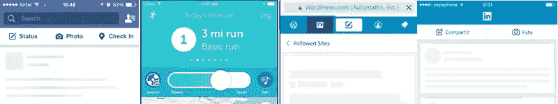
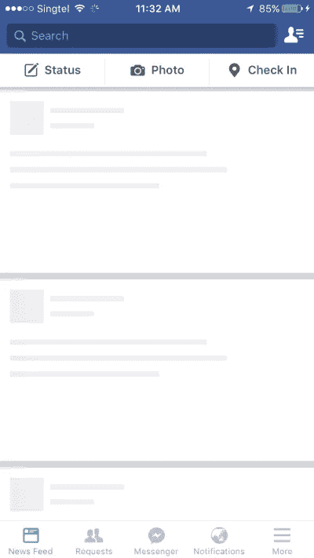

# 如何利用速度感知的心理学

> 原文：<https://www.sitepoint.com/how-to-take-advantage-of-the-psychology-of-speed-perception/>

如果用户体验是网站设计的首要指导方针，我们是否可以说“速度”是它的首要原则？用户的移动速度很快，他们希望网站能快速加载。我们生活在一个毫秒很重要的世界！

但有趣的是:研究表明，与其说是原始的加载时间，不如说是 T2 对加载速度的感知留住了网站访问者。

用户不用秒表来衡量网站加载时间；他们用自己的耐心量表来衡量。这意味着我们可以用一些小技巧让一个网站感觉比实际速度更快。相反，一些网页设计决策会让一个快速的网站看起来很慢——你应该避免这些。

记住，我们是在改变信仰之后！研究表明，加载速度比其他页面快一秒钟的移动网站可以提高 27%的转化率。这会带来巨大的不同。

还是那句话，感知 ***就是*** 现实。那么，我们能做些什么来让我们的网站感觉比它们更快呢？

## 给我涂上蓝色

颜色对人有这样的影响；我敢肯定，当你得知颜色是影响用户如何感知你的网站速度的因素之一时，你不会感到惊讶。

香港科技大学工商管理学院进行的一项研究证实了这一点，该研究发表在《市场研究杂志》上。

对颜色的色调、价值、纯度或强度的控制表明，让人们感到放松的颜色也有助于他们对速度的感知。此外，研究表明，这种看法影响了对网站的评价和向他人推荐网站的可能性。

心理学家称之为“时间-情绪悖论”几十年的研究表明，人类可以以令人难以置信的准确度估计时间。悖论？在情绪的影响下，我们对时间的判断会极不准确。

我们都经历过这个。开心的时候时间过得很快，对吧？

另一方面，在航班取消后看机场时钟是一种令人麻木的缓慢体验。

所以，回到网页设计，以及如何让这个悖论为你所用。

如果你想快速简单地了解颜色的力量，想想大自然。有什么比眺望明亮的蓝色海洋更让人放松的吗？还是飞向蔚蓝的天空？室内设计师使用蓝色来帮助人们在会议室和家里保持平静。

蓝色也代表信任和权威。它有助于建立信心。他们称蓝色套装为动力套装是有原因的！

因此，为了帮助网站访问者在等待网站加载时保持冷静，可以考虑蓝色或其他类似的令人放松的颜色。

## 进度指标

我相信你已经注意到了过多的进度指示器，这些指示器被用来在网站加载时尽量减少访问者的紧张感。

与色彩心理学相一致的是，这些效果可以让用户在等待时放松并保持快乐，部分原因是当他们知道有事情发生时，他们会感觉更有控制力。

请记住，我们在这里谈论的是秒甚至毫秒，但这就是我们今天生活的世界。

但是所有的进步指标并不都是一样的。至少[一个案例研究](http://www.lukew.com/ff/entry.asp?1797)表明，在人们暂停现实并认为你的网站加载速度比实际速度快时，骨架屏幕比旋转器或进度条更能吸引他们，因为你利用了他们的放松悖论。

你几乎肯定见过一个[骷髅屏幕](https://www.sitepoint.com/how-to-speed-up-your-ux-with-skeleton-screens/)，即使你不知道它有名字。随着网站的加载，空白页逐渐被内容填满。

旋转者给人一种缓慢的感觉。就像在候诊室里看着时钟滴答作响，他们实际上标出了你浪费的时间。

骨架屏幕吸引了在等待屏幕填满时放松的游客。这有点像在食堂被递给一个托盘。你知道你会吃东西——问题只是你的盘子里会装满什么。

框架屏幕创造了一种潜意识的进度感，让用户感觉你的网站加载速度比实际情况要快。

## 不要害羞

在一个完美的网络世界中，一家企业创建了一个网站，想要或需要该公司所售商品的用户可以找到彼此——瞧！-我们有转换！

事情并不总是这样，但毫无疑问，消费者访问网站是因为他们在寻找某种东西。如果你的网站没有一个强大的、有吸引力的 CTA，你就错失了良机。

此外，研究表明，让 CTA 在网站加载时快速显示是影响速度感知的因素之一。

确保你的 CTA 不是小而难读的。不要把它埋在一个有很多内容的网站的底部。让访问者简单地知道你想让他们做什么。他们在寻找一些东西，否则他们不会在你的网站上。确保 CTA 在屏幕加载时以某种方式弹出，这样你也能增强访问者对网站速度的感知。

## 感知就是现实

最好的网页设计师了解人类心理。这是有道理的，当人们更舒适时，他们会对他们遇到的任何事情有更积极的看法。研究表明，越放松的用户越容易转化和分享你的网站或内容。

这并不难理解，从某种意义上说，他们玩得很开心，并且想分享。

同理，如果你的网站让他们感到厌烦或沮丧，我相信你可以想象会有什么样的反应。你自己可能也经历过这种情况。

## 总结

设计师可以做很多事情来提高实际速度，所有这些对于用户体验都是必不可少的。

与此同时，重要的是要明白，如果你遵循所有的技术最佳实践，但不理解“时间-情绪悖论”的心理，你的网站就不会那么成功。

当你设计你的网站时，平衡真实速度和感知速度，你会有一个成功的组合！

## 分享这篇文章