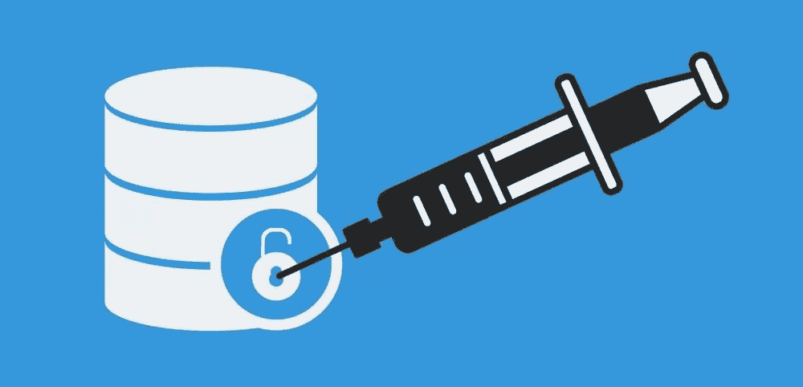
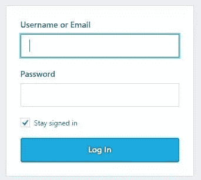
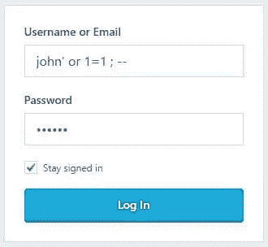

# 如何保护您的网站免受 SQL 注入攻击

> 原文：<https://www.sitepoint.com/how-to-protect-your-website-against-sql-injection-attacks/>



感谢 [Chris Lienert](https://www.sitepoint.com/author/chris-lienert/) 和 Guido Tonnaer 好心帮助[同行评审](https://www.sitepoint.com/introduction-to-sitepoints-peer-review/)这篇文章。

在所有针对网站的攻击中， [SQL 注入](https://bdtechtalks.com/2016/06/02/all-you-need-to-know-about-the-sql-injection-nightmare/)是最危险和最普遍的一种，在过去的一年中，它已经被用来对企业和组织造成真正的破坏。该计划已被用于瞄准知名组织和公司，包括 [TalkTalk](http://www.theregister.co.uk/2015/11/06/talktalk_claims_157000_customers_data_stolen/) 、 [VTech](http://motherboard.vice.com/read/one-of-the-largest-hacks-yet-exposes-data-on-hundreds-of-thousands-of-kids) 、[、《华尔街日报》和](http://www.theregister.co.uk/2015/11/06/talktalk_claims_157000_customers_data_stolen/)[美国政府](http://www.darkreading.com/attacks-and-breaches/fbi-blames-federal-hacks-on-anonymous-campaign/d/d-id/1112650)。

简而言之，SQL 注入(也称为 SQLi)利用网站输入通道中的漏洞来攻击位于 web 应用程序后端的数据库，其中存储了最敏感和最有价值的信息。攻击者可以利用该方案窃取或篡改数据，妨碍应用程序的功能，在最坏的情况下，还可以获得数据库服务器的管理权限。

以下是你需要了解的关于 SQL 注入病毒的知识，以及如何保护你的网站免受其害。

## SQL 注入攻击的工作原理

SQL 注入攻击是通过 web 请求向数据库服务器发送恶意的 SQL 命令来实施的。任何输入通道都可以用来发送恶意命令，包括`<input>`元素、查询字符串、cookies 和文件。

要了解它是如何工作的，假设您有一个登录表单，它需要用户名和密码:



当用户输入他们的凭证并按下“登录”按钮时，信息被发送回您的 web 服务器，并在那里与 SQL 命令组合。例如，在 PHP 中，代码如下所示:

```
$sql_command = "select * from users where username = '" . $_POST['username']; $sql_command .= "' AND password = '" . $_POST['password'] . "'"; 
```

然后，该命令将被发送到数据库服务器，生成的数据集将确定用户名和密码是否对应于有效的用户帐户。一个普通用户输入“john”作为用户名，输入“123456”作为密码([永远不要使用那个密码](https://bdtechtalks.com/2016/05/17/how-do-you-protect-your-passwords/)，顺便说一句)会翻译成下面的命令:

```
SELECT * FROM users WHERE username='john' AND password='123456' 
```

但是，如果用户决定尝试其他东西，比如:



生成的命令如下所示，它将始终返回非空数据集:

```
SELECT * FROM users WHERE username='john' OR 1=1; -- ' AND password='123456' 
```

该代码片段可能允许用户在没有正确凭据的情况下绕过登录屏幕。

这是 SQL 注入最简单的形式之一。只需稍加努力，同一个用户就可以插入新的用户帐户，并删除或修改现有的用户帐户。在显示结果的页面中，可以使用相同的方案来显示记录和信息，否则这些记录和信息将仅限于普通访问者，或者更改记录的内容。

在更严重的情况下，如果通过管理帐户(如 MySQL 中的“root”或 MS SQL Server 中的“sa ”)连接到数据库服务器，攻击者甚至可以完全破坏服务器的操作系统。在 Windows 服务器上，这可能表现为攻击者执行扩展存储过程，如`xp_cmdshell`。在一个案例中，攻击者利用 SQL 注入漏洞在受损的服务器上创建用户帐户，启用远程桌面功能，设置 SMB 共享文件夹并上传恶意软件，除此之外，还几乎搞乱了存储在数据库中的所有内容。

## 如何保护自己免受 SQL 注入攻击

由于用户输入通道是 SQL 注入攻击的主要载体，大多数防御方法都涉及控制和检查用户输入的攻击模式。

这里有几个可以保证用户输入安全的措施。

### 永远不要相信用户输入

关于用户输入的第一条经验法则是“[不要相信和验证](https://en.wikipedia.org/wiki/Trust,_but_verify)”，这实际上意味着所有形式的用户输入都应该被视为恶意的，除非证明不是这样。这不仅适用于简单的输入框，如文本区域和文本框，还适用于所有其他内容，如隐藏输入、查询字符串参数、cookies 和文件上传。

仅仅因为浏览器的用户界面不允许用户操纵输入，并不意味着它不能被篡改。像 [Burp Suite](https://portswigger.net/burp/) 这样的简单工具使用户能够捕获 HTTP 请求，并在将它们提交给服务器之前修改任何内容，包括隐藏的表单值。如果你认为用 Base64 编码你的数据很聪明，恶意用户很容易解码、修改和重新编码。

### 在服务器端验证输入字符串

验证是确保用户提供正确类型的输入，并消除可能嵌入在输入字符串中的任何潜在恶意命令的过程。例如，在 PHP 中，您可以使用`mysql\_real\_escape\_string()`对可能改变 SQL 命令性质的字符进行转义。

前面提到的登录代码的修改版本如下:

```
$con=mysqli_connect("localhost","user","password","db");
$username = mysqli_real_escape_string($con, $_POST['username']); 
$password = mysqli_real_escape_string($con, $_POST['password']); 
$sql_command = "select * from users where username = '" . $username; $sql_command .= "' AND password = '" . $password . "'"; 
```

这个简单的修改可以保护您的代码免受攻击，这种攻击是通过在恶意用户故意添加的单引号前添加转义字符(\)来实现的。

**关于验证的说明:**如果您已经添加了客户端验证功能，做得很好。但不要把它作为抵御 SQL 注入袭击的防御措施。虽然客户端功能可能会使向服务器发送恶意输入变得更加困难，但通过一些浏览器调整和工具(如刚才提到的工具)可以轻松绕过它。因此，您需要用服务器端验证来补充它。

一些编程平台，如 ASP.NET，包括内置功能，可以自动评估用户输入页面回发的恶意内容。但是有足够的勇气和敏锐的黑客可以绕过它们，所以您仍然应该通过您自己的安全检查过程来运行用户输入。你再谨慎也不为过。

### 使用命令参数

一个更好的替代转义的方法是使用命令参数。命令参数是通过在 SQL 命令中添加占位符名称来定义的，这些占位符名称稍后将被用户输入替换。为此，ASP.NET 有一套非常直观且易于使用的 API。

以下用 C#编写的代码显示了如何使用命令参数来保护您的网站免受 SQL 注入攻击:

```
SqlCommand cmd = new SqlCommand ("SELECT * FROM users WHERE username=@username AND password=@password",con); 

SqlParameter username = new SqlParameter(); username.ParameterName = "@username"; username.value = txtUsername.Text; cmd.Parameters.Add(username); 

SqlParameter password = new SqlParameter(); password.ParameterName = "@password"; password.value = txtPassword.Text; cmd.Parameters.Add(password); 
```

首先创建一个`SqlCommand`对象，并在应该插入用户输入的命令字符串中使用`@parameter_name`范例。

然后创建`SqlParameter`对象的实例，在其中插入用户输入，而不是直接将它与命令字符串连接起来。

最后，将`SqlParameter`对象添加到`SqlCommand`对象的参数集合中，这将用提供的输入替换参数。ADO.net 负责剩下的。

在 PHP 中，等价的是准备好的语句，这比 ASP.net 的语句要复杂一些。你可以在这里探索一下[。](http://php.net/manual/en/mysqli-stmt.bind-param.php)

### 显式转换您的输入

这个技巧是针对 PHP 等弱类型语言的，这意味着通常不为变量定义数据类型，语言会自动处理不同数据类型之间的转换。

在涉及非字符串类型的情况下，显式强制转换可以作为转义输入的快捷方式。因此，如果您希望用户为`age`参数输入一个`int`，您可以使用 PHP 中的以下代码来确保输入的安全性:

```
$age = (int)$_POST['age']; 
```

请注意，这个代码片段只验证输入的类型，而不是它的范围。因此，您必须运行其他代码来确保用户不会输入一个负年龄，或者一个不切实际的年龄，比如 1300。

另外，另一个最佳实践是在涉及非字符串输入的 SQL 命令中避免使用单引号。所以不使用下面的代码…

```
$sql_command = "select * from users where age = " . $age; 
```

…使用下面的方法会更安全一点:

```
$sql_command = "select * from users where age = '" . $age . "'"; 
```

## 如何根除 SQL 注入漏洞

一般来说，你应该检查每一页的代码，找出你结合页面内容、命令、字符串等的地方。来源可能来自用户。检查源代码中的漏洞和安全漏洞应该是软件开发过程中固有的一部分。

你也可以使用扫描工具，如 [sqlmap](http://sqlmap.org/) 来抓取你网站的页面，寻找潜在的 SQL 注入漏洞。事实上，黑客经常使用这个工具来寻找和利用目标网站上的 SQL 注入攻击载体，那么为什么不使用它来使它们更加安全呢？

## 你的最后一道防线

无论你如何加强网站的安全性，你都必须为 SQL 注入发生的那一天做好准备。毕竟，正如网络安全行业广为人知的那样，防御者必须赢得每一场战斗，但黑客只需赢得一次。

这里有一些小贴士，当你成为 SQL 注入受害者时，可以帮助你将伤害降到最低。

### 避免管理特权

使用“root”或“sa”帐户将 web 应用程序连接到数据库服务器是您可能犯的最严重的错误之一。正如我已经提到的，一个被破坏的管理帐户可能会让黑客访问整个系统。即使是可以访问服务器中所有数据库的非管理帐户也可能造成损害，尤其是在不同的应用程序和数据库共享数据库服务器的情况下。

因此，最好使用一个对你网站背后的特定数据库只有简单读写权限的账户，这样万一你的网站通过 SQL 注入被黑客攻击，损害范围就保持在那个数据库的范围内。

一种更高级的方法是，对读写数据库的代码段使用单独的连接，并进一步减少每个代码段的权限和角色。例如，列表页面——不对数据库进行任何修改，但大量使用搜索参数——可以编码为使用到数据库的只读连接，以便进一步加强代码的安全性。

在 MySQL 中，通过将对用户帐户的访问限制在特定的 IP 地址范围而不是“%”模式来提高安全性，以防止从远程位置访问受损的帐户。

在 MS SQL server 中，我强烈建议您使用 Windows 身份验证模式，这将限制黑客对数据库的访问，并确保他们无法使用其他渠道进入您的数据库。

此外，除非您计划使用 SQL Server 的一些高级功能，否则最好将 windows 服务设置为使用受限帐户，而不是高权限的“本地系统”帐户。这将在“sa”帐户受损的情况下最大限度地减少损失。

### 加密敏感数据

加密数据库中的敏感数据。这包括密码、安全问题和答案、财务数据、健康信息以及其他可能对恶意行为者有用的信息。这将确保即使黑客得到了您的数据，他们也无法立即利用它，让您有时间发现漏洞，堵塞漏洞，并采取其他反应措施，如强制重置密码，这将确保被盗数据在攻击者破译之前失去其价值。

如果你在散列你的密码，使用强大的算法，如 SHA-2，这将很快成为密码保护的行业标准。 [MD5](http://www.zdnet.com/article/md5-password-scrambler-no-longer-safe/) 和 [SHA-1](https://blog.qualys.com/ssllabs/2014/09/09/sha1-deprecation-what-you-need-to-know) 已经过时，可以逆转。

对于其他形式的加密，注意你在哪里存储密钥，不要把所有的鸡蛋放在一个篮子里。如果密钥就在加密数据旁边，那么使用加密就没有任何意义，一旦黑客攻破服务器，他们就很容易获得密钥。

### 如果不需要，就不要存储敏感数据

每当您在数据库中存储信息时，都要考虑如果信息落入坏人之手会造成多大的损害，并决定是否真的需要存储它。阿什利·麦迪逊黑客事件泄露了大约 3700 万人在互联网上的黑暗秘密和最隐私的信息，并造成了一些严重的损害，其成功部分归功于供应商没有从其数据库中删除敏感信息。

所以底线是，不要在你的数据库中存储敏感信息，除非你真的有必要。即使这样，当信息不再有用时也要删除。

## 最后的想法

SQL 注入已经存在了几十年，并且在未来几年很可能继续高居脆弱性排行榜的首位。这需要几个简单但经过精心计算的步骤来保护您自己和您的用户免受其害，并且在审计您的源代码的安全漏洞时，这应该是您的首要任务之一。

避免成为下一个巨大的 SQL 注入数据泄露的受害者的关键是，首先，控制和验证用户输入，其次，为“何时”做好准备，而不是“如果”

## 分享这篇文章