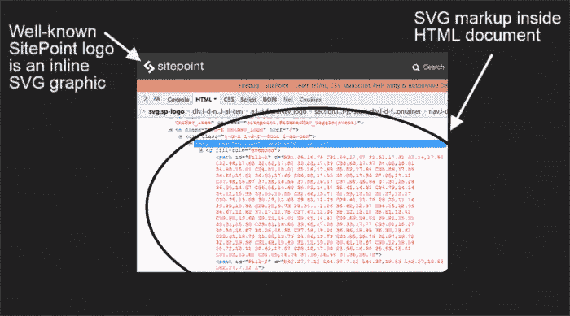

# 是时候诚实地对待图像替换技术了

> 原文：<https://www.sitepoint.com/its-time-to-be-honest-about-image-replacement-techniques/>


在 SitePoint 的一篇关于 CSS 图像替换历史的早期文章中，Baljeet Rathi 介绍了许多图像替换技术，一种比一种更有独创性。这些技术都专注于解决一个问题——如何在 web 上以优美的艺术形式传达文本内容，同时保持人们和搜索引擎都可以访问它。在一个没有现成的自定义字体和强大的 CSS 工具的 web 设计世界中实现这样的目标是一个相当大的壮举。

受 Rathi 文章的启发，我着手解决以下问题:

*   图像替换技术曾经非常流行。今天，这些用背景图片替换文本的方法经常在 web 开发人员中遭到非议。在本文的后面，我将分析一些原因，但是鉴于这种情况，我们可以使用哪些工具和最佳实践来代替呢？
*   图像替换技术仅仅是过去网页设计的幽灵吗，还是说图像替换技术在今天仍然可以被有意义地使用而不用担心使网页变得更丑？

让我们从寻找这项工作的最佳工具开始。

## 这项工作的最佳工具:网络字体和 CSS

**如果你的内容是文本，使用文本**，不要使用文本的图片。

有了今天的工具，你几乎不需要任何图像来以一种美丽的形式传递文本内容。

轻松访问数量惊人的自定义 web 字体，对 [CSS `@font-face`属性](https://developer.mozilla.org/en/docs/Web/CSS/@font-face)的强大浏览器支持，以及字体流服务，如 [Typekit](https://typekit.com/) 和 [Google Fonts](https://www.google.com/fonts) 都为您提供了巨大的能力来传达品牌、传达情感，并通过令人惊叹的 web 排版产生影响。

现代 CSS 的功能使控制透明度级别、添加文本阴影、混合模式甚至向文本添加动画变得轻而易举——无需 Photoshop 或 JavaScript 技巧。

下面是一个你可以用网页字体和 CSS 做什么的例子:

[

智能设计网站显示伟大的排版没有任何图像，只有网页字体和 CSS。](http://smartdesigns.net/) 

使用文本而不是文本图像的主要好处是:

*   用户可以很容易地调整文本大小和改变其颜色，以满足他们的要求。
*   屏幕阅读器可以访问文本，搜索引擎机器人可以抓取并索引它。
*   这是语义上正确的方法，并且尊重[关注点分离](https://en.wikipedia.org/wiki/Separation_of_concerns)，其相关性也被 [W3C 推荐标准](https://www.w3.org/TR/2016/NOTE-WCAG20-TECHS-20160317/G140)所提倡，以满足 Web 内容可访问性指南(WCAG)的成功标准。
*   如果你使用自定义字体，很容易在 [CSS 字体堆栈](http://www.cssfontstack.com/)中提供网页安全字体作为后备。

然而，正如你们许多人所知，这种方法并不适用于所有情况。所以…

## 如果网页字体和 CSS 不总是能胜任工作怎么办？

有些情况下，web 字体和 CSS 不足以达到你想要的效果，转而使用图形是有意义的。一个网站的标志就是一个很好的例子。

徽标是品牌不可或缺的一部分，这意味着你不能在不损害品牌身份的情况下修改徽标，哪怕是轻微的修改。有些情况下，您可能无法使用 web 字体和 CSS 精确地复制徽标。也许，这个标志的字体在网上不容易找到，或者仅仅用 CSS 不能忠实地再现图形艺术。使用图形元素似乎是一条出路。然而，尽管你想让用户看到你的网站上显示的图形元素，你也想让屏幕阅读器和机器人能够访问标志所代表的品牌名称。

此外，考虑使用没有支持文本的图标。这里真正的问题是屏幕阅读器和搜索引擎爬虫很难理解图标的意思。图标不是文本，而是代表文本。例如，现在熟悉的汉堡包图标代表单词“菜单”，但它本身并不是单词“菜单”。因此，在 web 上只显示图标而不显示支持文本会引起严重的可访问性问题。

在上述两种情况下，目标都是通过图像传达一些信息，而不影响屏幕阅读器和搜索引擎爬虫对其文本内容的访问。图像替换技术在过去使这一点变得可能，因此值得研究一下现在是否有更好的东西来做这项工作，而这在一段时间以前还没有广泛使用。

这里有几个选择。

### 内联 SVG

今天，当你不能利用网络字体和 CSS 的力量时，在网页中包含一个标志的一个很好的方法是 [inline SVG](https://css-tricks.com/using-svg/) 。SVG 代表可缩放矢量图形，这是一种基于 XML 的图形格式。我感兴趣的技术包括创建一个 SVG 图标，并将其代码直接转储到 HTML 文档中。如果你从 Illustrator 或 Inkscape 这样的编辑器中导出 SVG，你可以更进一步，[通过去掉多余的标记来优化它的输出](https://sarasoueidan.com/blog/svgo-tools/)。

如果您查看 SitePoint 网站的徽标，您会看到这种技术的一个实例:



内联 SVG 用于在 SitePoint 网站上创建徽标。

这还不是全部。当内联 SVG 被用作向网页添加看起来简洁的图标时，它也能创造奇迹。如果你渴望了解更多，请查看 [Chris Coyer 的关于 CSS-Tricks 的 SVG 课程](https://css-tricks.com/lodge/svg/)，其中也包括一些关于内嵌 SVG 图标的视频教程。

以下是使用内联 SVG 很酷的一些原因:

*   SVG 代码只是标记，通过一个`title`和`desc`元素来添加有意义的上下文，[搜索引擎和辅助技术都可以访问它。你可以按照 T4 的莱昂妮·沃森和希瑟·米格里奥利西的提示来提高内联 SVG 图形的可访问性。](https://webmasters.googleblog.com/2010/08/google-now-indexes-svg.html)
*   SVG 图形根据定义是可扩展的，并且与分辨率无关，这意味着无论用户放大多少，它们看起来都很棒。
*   内联 SVG 图形不需要显示额外的 HTTP 请求，这对网站性能非常好。
*   您可以使用 CSS 和 JavaScript 微调内嵌 SVG 图形的外观和行为，包括制作作品的单个部分的动画，甚至动态变形它们的形状。要了解更多 SVG 动画技术，请阅读 Jordan Wade 的[用内嵌 SVG 制作动画](https://www.codeschool.com/blog/2014/11/04/inline-svg-animations/)。
*   与图标字体相反，你的网站永远不会加载内联 SVG 图标，因为 SVG 代码已经在 HTML 文档中了。

另一个好消息是内联 SVG 有很好的浏览器支持。只有 IE8 缺乏对内联 SVG 的支持。

### 图标字体

尽管不适合显示徽标，图标字体作为在网站上显示图标的一种很好的方式已经很流行了。像[glyphicon](http://glyphicons.com/)和 [Font Awesome](http://fontawesome.io/) 这样的在线图标库的易用性极大地促进了图标字体在网络上的大量出现。

图标字体只是文本，因此你可以用 CSS 控制它们的外观，用户可以根据自己的喜好调整它们的大小。

对于没有伴随文本的有意义的图标，你可以使用 [WAI-ARIA 技术](https://www.w3.org/TR/WCAG20-TECHS/aria)添加辅助信息。

例如，假设您正在使用字体 Awesome 显示一个链接的汉堡包图标，以显示一个隐藏的菜单。只为图标添加标记会使它对屏幕阅读器完全不可见或毫无意义:

```
<a href="#" class="fa fa-bars"></a>
```

为链接添加一个`title`属性对于屏幕阅读器来说是有效的，但是副作用是在没有辅助技术的情况下，有时会向浏览网站的用户显示不需要的工具提示。

[aria-label 属性](https://developer.mozilla.org/en-US/docs/Web/Accessibility/ARIA/ARIA_Techniques/Using_the_aria-label_attribute)使得汉堡图标字体对于屏幕阅读器来说是可访问的，并且去掉了不想要的工具提示:

```
<a href="#" class="fa fa-bars" aria-label="Menu"></a>
```

然而，正如亚历克斯·沃克和 T2·塞伦·戴维斯指出的，在网络上实现图标字体有很多陷阱，你需要充分意识到这一点。

为了更多地了解如何解决使用图标字体带来的可访问性问题，Filament Group 的 Zach Leatherman 的[防弹可访问图标字体](https://www.filamentgroup.com/lab/bulletproof_icon_fonts.html)令人大开眼界。

### ``标签

使用带有合适的`alt`属性的``标签来显示徽标图像是一种可接受且广泛使用的方法。

`alt`属性包含文本，因此考虑到可访问性，``元素将文本的精美图形表示拉入文档进行显示。

W3C 的、他们的[网页可访问性教程](https://www.w3.org/WAI/tutoriaimg/textual/)和[谷歌网站管理员](https://www.youtube.com/watch?v=fBLvn_WkDJ4)都认可这种方法。

您需要考虑的几个小缺点是:

*   多一个 http 请求，会影响网站的加载时间。在不久的将来，当 [HTTP/2](https://http2.github.io/) 完全实现时，这将不再是一个问题。
*   关注点的分离被忽略了:如果你决定改变文本的外观，你必须通过改变标记来实现，而不是 CSS。
*   当用户增加光栅图像的尺寸时，光栅图像会看起来像素化，尽管 SVG 图形不会出现这个问题。

以上几点是导致过去广泛使用的各种图像替换技术的动机之一。

但是，为什么这些技术在今天不被认可呢？我们真的和他们玩完了吗？

## 反对图像替换的理由

我在网上看到的大多数关于图像替换技术的研究材料都可以追溯到 2000 年代早期或中期。2013 年 11 月， [HTML5 样板掉了各种 CSS 图片替换技术](https://github.com/h5bp/html5-boilerplate/commit/2e80e8be81d08b5202f0928d75757e4b94b867fd)。这些都是重要的线索，表明图像替换很快就会被弃用。

CSS 允许你做几年前只能在图像编辑软件上做的事情。最重要的是，网络字体和矢量图形唾手可得，你为什么要使用图像替换这种巧妙的方法呢？

反对使用图像替换技术的其他重要考虑因素是它们对搜索引擎排名的潜在负面影响。

谷歌有明确的准则禁止在网页上隐藏文字，无视这些准则会导致严重的惩罚。以下是谷歌网站认为当今时代在网络上隐藏文本的可疑方式:

*   在白色背景上使用白色文本。
*   定位图像后面的文本。
*   使用 CSS 在屏幕外定位文本。
*   将字体大小设置为 0。

上面列表中的项目出现在大多数流行的图像替换技术中，这使得我们在使用它们时都很谨慎。

然而，情况并不明朗。谷歌指出，隐藏文本“*来操纵谷歌的搜索排名*【强调是我的】可以被视为具有欺骗性，违反了谷歌的网站管理员准则。此外，谷歌还表示:

> “……并非所有隐藏文本都被认为是欺骗性的。例如，如果您的网站包含搜索引擎难以访问的技术，如 JavaScript、图像或 Flash 文件，使用描述性文本可以提高网站的可访问性。”

只要没有*关键词填充*或恶意意图，图片替换*可以被认为*符合谷歌的准则。如何向谷歌机器人传达你的诚意并不简单，但是 SEO 专家提出了一个很好的建议，那就是确保[你隐藏的文本与你网站上显示的文本](https://www.seroundtable.com/archives/020406.html)完全相同。

这还不是全部。来自 Yoast 的 Joost de Valk 无疑是 SEO 领域的权威声音，他是图像替换的支持者之一，尤其是作为一种在网站上使用精灵的便捷方式。

在他的 [CSS 图像替换中，怎么了马特？德·瓦尔克与谷歌软件工程师](https://yoast.com/google-speed-sprites/)[马特·卡茨](https://www.mattcutts.com/blog/about-me/)就后者反对使用图像替换的立场发生争执。你会说德·瓦尔克的作品可以追溯到 2009 年，网页设计世界的史前时代。然而，至少据我所知，它的作者没有写任何可以让我们认为他在这个问题上改变了主意的东西，并且在写这篇文章的时候，Yoast 网站上的徽标仍然使用图像替换来显示。

从**可访问性**的角度来看，图像替换仍然是可以接受的，至少在少数情况下是如此。这并不奇怪，因为这些方法背后的主要驱动力是使得在 web 上显示美观但完全可访问的文本内容成为可能。

W3C 工作组的一份说明明确支持图像替换技术，只要用户能够容易地切换到相同内容的替代的纯文本表示，以防实现不像预期的那样工作。

软件开发人员[洛根·弗兰肯(Logan Franken)提出了一个合理的理由](http://www.loganfranken.com/blog/1244/do-we-still-need-image-replacement/)来限制图像替换技术的使用，即使在今天，他们仍然可以在网站上以`img`标签或图标字体显示 SVG 而不附带文本时发挥作用。

最后，您会发现图像替换仍然可以提高当今尖端 SVG 技术的可访问性。在标题为 *Example 5: Linked Icon，with dynamic text*in[Accessible SVG](https://css-tricks.com/accessible-svgs/)中，Heather Migliorisi 指出,`aria-label`属性的使用虽然适用于内联 SVG 图标附带的链接文本是静态的情况，但并不适合链接文本事先未知的情况，因为它是动态添加到页面中的。Migliorisi 展示了如何有效地使用图像替换来挽救局面。

## 结论

在本文中，我列出了您现在可以使用的工具和最佳实践，作为过去非常流行的图像替换技术的替代方法。这些包括定制字体、CSS3 和内联 SVG，这些在过去并不容易获得或不被浏览器很好地支持，以及带有适当的`alt`属性的老式``标签。

今天，图像替换看起来相当粗糙，谷歌对隐藏文本的立场并不鼓励它的使用。然而，当图像替换技术仍然可以找到有限的应用时，存在边缘情况，主要涉及可访问性考虑，希望不会太久。

你怎么看待它，图像替换是死是活？让我在评论中听到你的声音吧！

## 分享这篇文章