# 构建您的第一个 HoloLens 应用程序:创建资产

> 原文：<https://www.sitepoint.com/building-your-first-hololens-app-creating-assets/>

这一系列文章将带您了解启动 HoloLens 应用程序的基础知识，一些需要注意的陷阱，以及如何充分利用整个通用 Windows 平台(UWP)的项目。第一部分的重点是创建启动项目所需的所有资产，因为我自己是一名开发人员，所以将重点帮助开发人员开始。

如果你是一个 3D 艺术家，想要进入全息体验的空间，并希望在软件开发方面得到帮助，请联系我或通读这一系列文章，以了解所涉及的内容。Sitepoint 在这里也有一系列关于 Unity 开发的文章。

尽管微软全息透镜是一种将 3D 全息图投射到你的物理世界的设备，2D 全息图也是完全有效的实现。你可以在墙上播放电影，悬挂在半空中的互联网浏览器或 Skype 电话跟随你在你所在的空间走动。尽管这些是有效的 2D 全息图，并且完全按照您的预期工作，但是它们不像 3D 全息图那样需要本系列文章中的那么多工具和技术。因此，为了这些文章的目的，全息图是指 3D 全息图，除非另外明确指出。

混合现实(MR)的一个陷阱是，很容易陷入一个纯粹基于“哇”因素的项目，并创建一个没有商业方面或没有超出初始用户体验的可靠用例的体验，并且事实上不是实际的 MR 体验。要了解虚拟现实(VR)、增强现实(AR)和 MR 的区别，请看这篇[文章](https://www.pluralsight.com/blog/software-development/holographic-programming-hololens)。

## 获取工具

为 HoloLens 开发的工具都是免费的，在我之前的[文章](https://www.sitepoint.com/getting-started-with-microsoft-hololens-development/)中有描述。如果你有一个北美的送货地址，你现在可以购买一个物理 HoloLens 开发者套件，无需任何邀请或特殊安排。如果你有 3000 美元，你也可以拥有这个神奇的装置。这不是一个目前很容易得到或尝试的设备，尤其是如果你不在北美。说了这么多，还是有办法让这个预计在 2016 年将成为[十亿美元市场的市场早点起步，这也正是我们在这一系列文章中要调查的。](http://www2.deloitte.com/global/en/pages/technology-media-and-telecommunications/articles/tmt-pred16-media-virtual-reality-billion-dollar-niche.html#)

## 选择 3D 建模工具

就像我上面说的，我不是设计师，也永远不会是。我可以把一个好的设计转换成代码，让它看起来更好，但是我不会一开始就尝试去做这个设计。

然而，如果你确实迫切需要为你的 HoloLens 应用程序设计自己的 3D 模型，我可以推荐几个工具。

在我们进入你可能选择使用的工具之前，请记住 3D 建模更多的是关于需要的创造力，而不是工具。你不能仅仅因为你是一个工具的主人，就做出一个伟大的模型。诚然，一个好的工具可以让你更容易专注于创作过程，学习一个工具可能需要一些时间，但最终，你需要有创造性，并理解 3D 建模，以充分利用这个过程。

### 搅拌机

如果你在寻找社区支持的免费 3D 建模软件，你不可能比 [Blender](https://www.blender.org/) 做得更好。尽管 Blender 的学习曲线相当陡峭，但它确实为创建专业级 3D 模型提供了完整而全面的工具集，包括渲染照片级逼真图像、制作关键帧动画或创建游戏。事实上，在 3D 空间中，你可以用 Blender 做很多事情，这对新用户和有经验的用户来说都是势不可挡的。

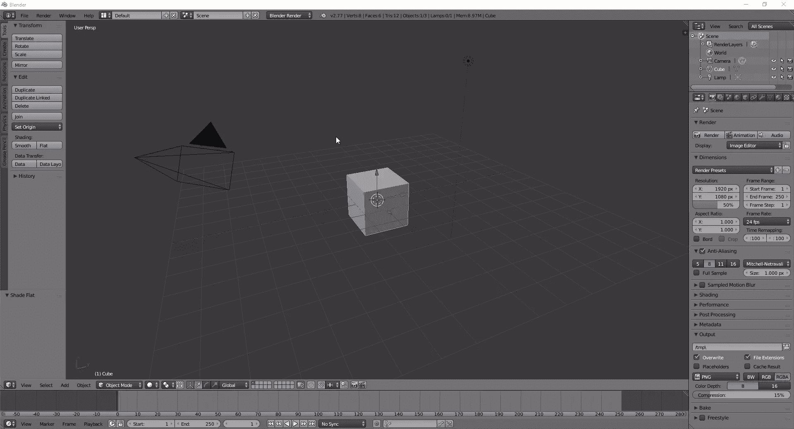

要开始使用 Blender，请从他们的官方网站跟随这些[教程](https://www.blender.org/support/tutorials/)，并从下面的演示卷轴中获得灵感。

[youtube wDRTjzLNK0g]

### 雕刻家

如果您专注于角色建模(例如，创建非常逼真的动物、怪物或人物)，则[sculptor is](http://pixologic.com/sculptris/)功能全面，专门针对 3D 空间的雕刻。

### Maya Autodesk 3D

最古老和最成熟的 3D 工具之一是 Autodesk 的 [Maya](http://www.autodesk.com.au/products/maya/overview) 。它不仅仅是一个 3D 建模工具，还允许用户创建动画和[电影](http://www.autodesk.com.au/products/maya/maya-video)。这是一个昂贵的软件，每年仅 2000 多美元，但如果你是学生，有一个免费的[教育版](http://www.autodesk.com/education/free-software/maya)。虽然 Unity 3D 实际上是创建 HoloLens 项目的工具，但 Maya 也与 HoloLens 开发相关联。

## 与艺术家合作

如果你不热衷于创造自己的资产，不想为此付出时间，或者出于某种原因宁愿别人来做，我会建议你尝试寻找一个对设计和建模有良好眼光的项目合作伙伴。在一个项目中有一个合作伙伴不仅有利于技能多样化，也有利于讨论想法和解决问题。

与设计师合作的一个很好的地方是社区活动，如聚会、黑客日和其他用户组。许多参加这些活动的人都热衷于在业余时间做项目。

## 购买资产

有一大群艺术家创作的各种资产，他们在为 3D 资产而存在的各种在线商店中出售它们。然而，如果你的项目有具体的品牌需求，购买现成的资产是不太可能奏效的。如果你正在等待艺术家完成定制模型，这可能是一个让你开始的好选择——你总是可以在以后交换它们。

### Unity 资产商店

就在 Unity 内部的[资产商店](https://www.assetstore.unity3d.com/en/)提供了大量的资产，从 3D 模型到音频剪辑到脚本，随时供您使用。它们从免费的到相对昂贵的都有，但是很有可能你可以很快找到你需要的资产来启动你的项目。

这些资产都可以直接导入 Unity，过程相对顺利。

## 设置 Unity3D

要开始你的第一个 HoloLens 项目，打开 Unity，创建一个新项目。确保您已经打开了 3D。

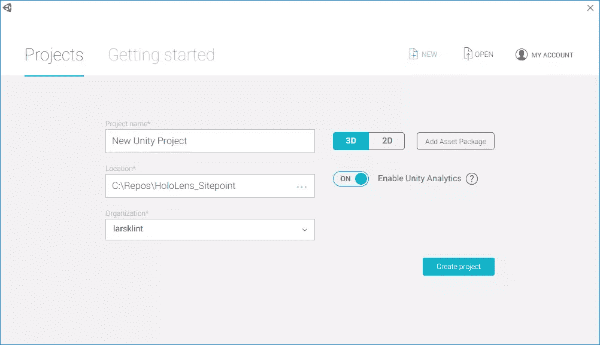

一旦工作空间打开，您将拥有一个标准的 Unity 项目。我们来调整一下，具体到 HoloLens。首先，让我们编辑场景的主摄像机。主摄像头负责头部跟踪和[立体渲染](https://en.wikipedia.org/wiki/Stereoscopy)。主摄像头本质上是用户的头部，因此通过点击*主摄像头*并更改*检查器*面板中的值，将起始位置更改为 *{X:0，Y:0，Z:0}* 。这将使布置全息图更容易一些。

其次，相机的背景需要全黑，因为黑色在 HoloLens 应用程序中变得透明，我们希望真实世界出现在我们的全息图后面，以创建所需的混合现实效果。在*检查器*面板中，将*清除标志*改为*纯色*，然后将背景设置为黑色。

最后，因为我们不希望全息图看起来靠近用户的脸(并使他们斗鸡眼)，改变*靠近裁剪平面*到 *0.85* 。

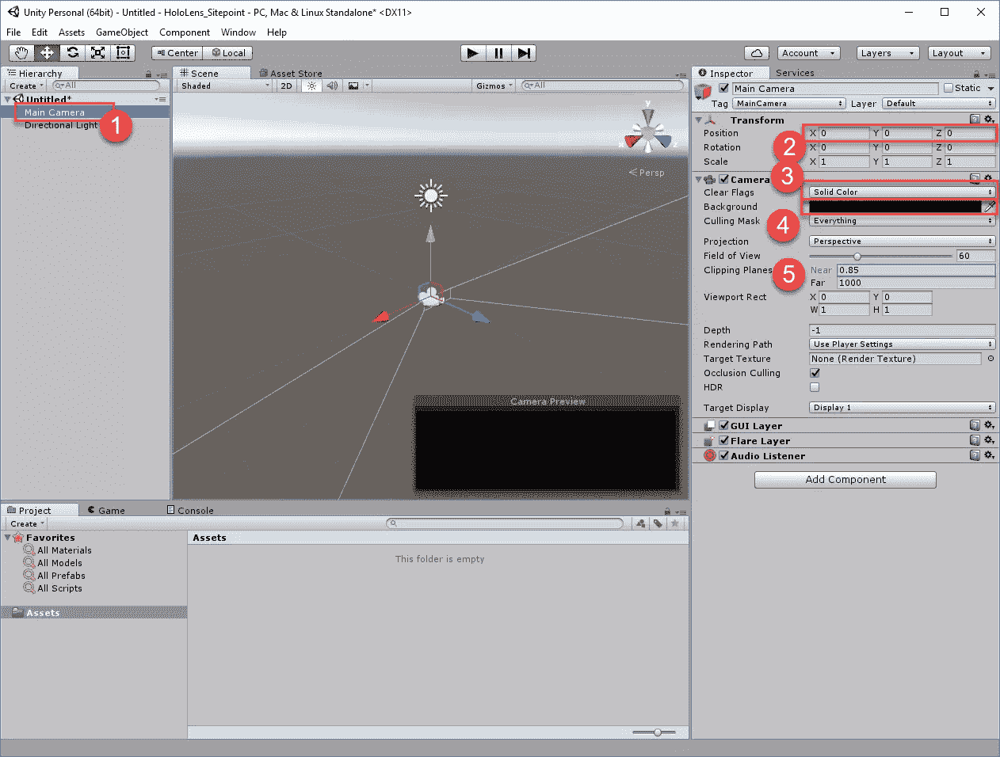

现在全息体验的环境已经设置好了，让我们创建我们的第一个全息图。在左上角的*层次*窗格中，点击*创建> 3D 对象>球体*。在*检查器*中，将球体的位置更改为 *{X:0，Y:0，Z:1}* ，这将在启动时将球体定位在用户前方一米处。如果你想要一个更小或更大的球体，你也可以用*秤*来玩。在 Unity 中，所有单位都是米，这使得 HoloLens 在处理现实世界和数字世界时变得很容易。

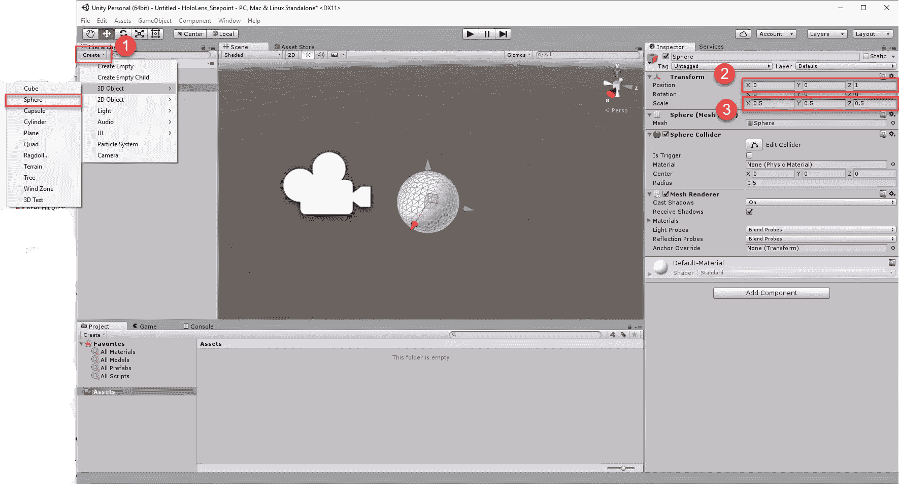

保存场景更改，并给它一个合适的名称。

## 从 Unity 导出到 Visual Studio

在我们可以导出 Unity 解决方案之前，需要配置一些设置。首先，一个 HoloLens app 最重要的一个方面就是它的执行速度非常快。

选择*编辑>项目设置>质量*，使用 Windows Store logo 下的下拉菜单，选择*最快*。

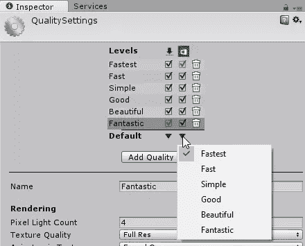

接下来，更改构建设置。因为所有的 HoloLens 应用都是通用的 Windows 平台应用，所以我们需要告诉构建引擎这一点。选择*文件>构建设置*选择 *Windows Store* 为平台， *Universal 10 SDK* 和 *D3D* 为构建类型，勾选 *Unity C#项目*。同样*添加开放场景*到构建中。

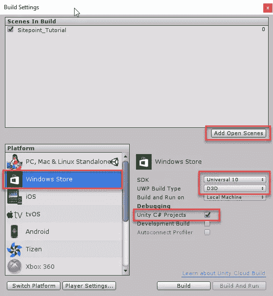

在构建设置窗口中，单击*播放器设置*打开窗格。点击 Windows Store 选项卡，检查支持的*虚拟现实*，并确保显示 *Windows 全息*。

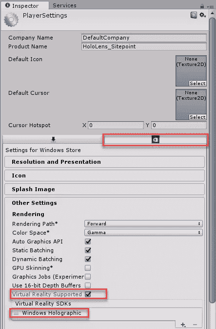

我们现在准备构建项目并将其导出。再次返回*构建设置*，点击*构建*。在默认目录下新建一个文件夹，命名为“App”。选择应用文件夹并继续。

## Visual Studio 2015 和 HDK

从上述步骤中打开 Visual Studio 解决方案。除非你的应用不只是专门针对 HoloLens，否则有几个值得做的更改，以利用 HoloLens 的更多功能。

在 Visual Studio 中，右击解决方案浏览器中的 *Package.appxmanifest* ，选择*查看代码*。找到指定 *TargetDeviceFamily* 的行，并将`Name="Windows.Universal"`更改为`Name="Windows.**Holographic**"`。在同一行，将`MaxVersionTested="10.0.10240.0"`改为`MaxVersionTested="10.0.14393.0"`。然后，保存 *Package.appxmanifest* 。

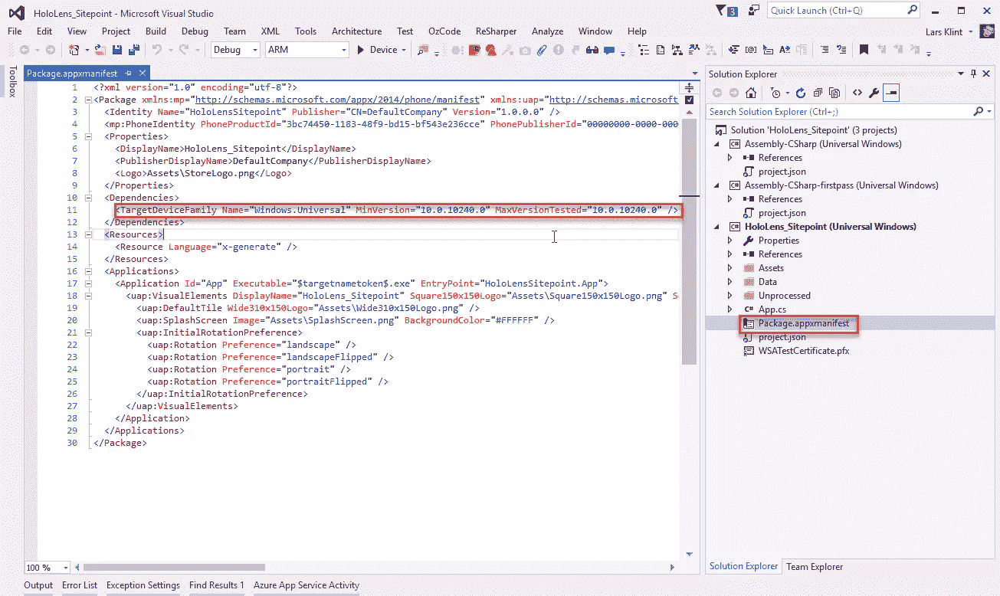

请注意，该项目是一个通用的 Windows 应用程序，这意味着它运行在 Windows 10 操作系统的核心 API 上。本文不打算探索通用的 Windows 平台，但理解这是 HoloLens(以及任何其他运行 Windows 10 的设备)的底层架构是很重要的。

Unity 在解决方案中创建了三个独立的项目。这些都是 HoloLens 应用程序所必需的，我们将在后面的文章中深入讨论。现在，让我们启动我们创建的基本应用程序。

如果使用模拟器，将目标改为 *x86* ，选择 *HoloLens 模拟器*，点击*播放*。如果您使用的是物理设备，请通过 USB 或 Wi-Fi 连接。

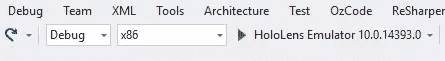

这将在 HoloLens 模拟器中启动应用程序，这就像你在没有实际物理设备的情况下获得 HoloLens 体验一样。

## 全息透镜仿真器和门户

仿真器尽可能在物理计算的虚拟极限内配备。它可以模拟在 x、y 和 z 维度上移动的完整 3D 体验。使用*箭头*和 *AWSD* 键，你可以操纵虚拟的 3D 空间，这个空间是用全息透镜捕捉的空间数据模拟的真实房间。点击*回车*将执行点击手势，点击*窗口*键调出开始菜单。简单。

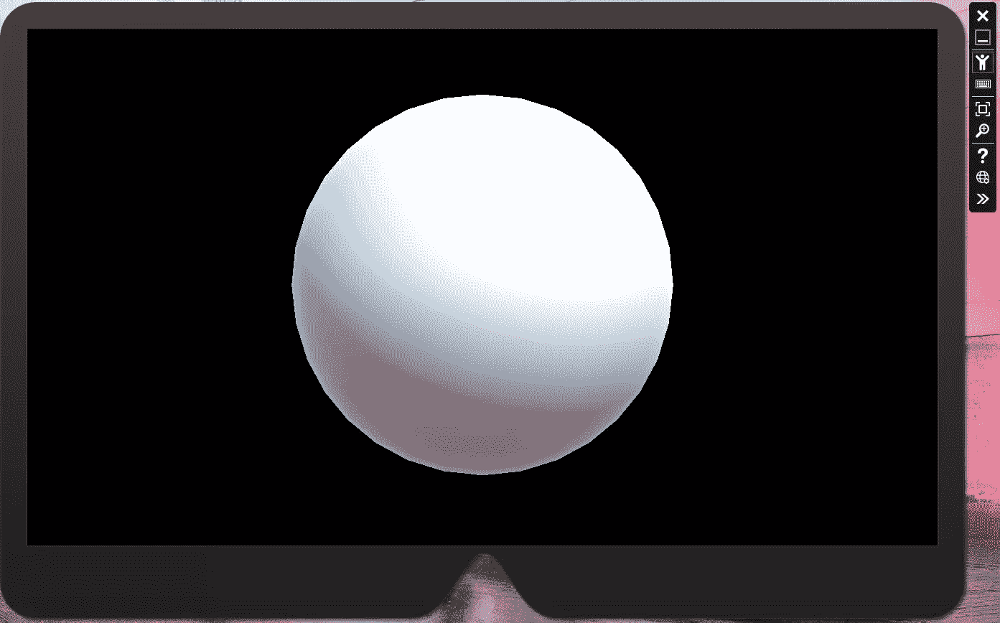

单击模拟器右侧的双箭头将显示模拟器工具。这些给出了当前会话的所有详细信息。你可以准确地看到你的虚拟身体，头和手在做什么，以及加载新的房间，使用你的真实 ms 帐户，并获得网络细节。因为头部运动对 HoloLens 体验至关重要，所以知道你与全息图的确切位置可以节省调试时间。

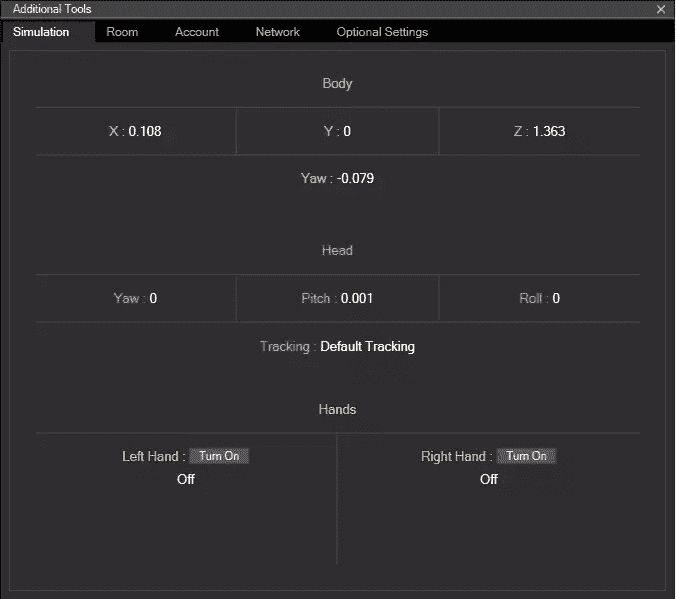

无论您是使用仿真器还是物理设备，您需要了解的工具的最后一部分是设备门户。单击模拟器右侧的小地球仪图标将加载一个网页，其中包含您的设备的所有可能的详细信息(无论是物理设备还是虚拟设备)。除了文件资源管理器和输入模拟之外，还有许多衡量性能和设备健康状况的指标。如果你有一个物理设备来绘制你周围的空间地图，你也可以记录新的房间。

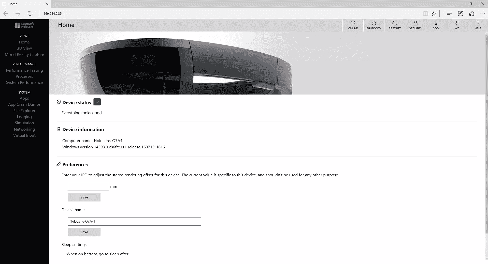

最直接有用的功能是 3D 视图，它与您在模拟器中的移动位置相关。换句话说，当您在模拟器中移动虚拟身体时，3D 视图会实时更新以显示您的位置。超级有用和另一种方式，使模拟更加真实和有用。

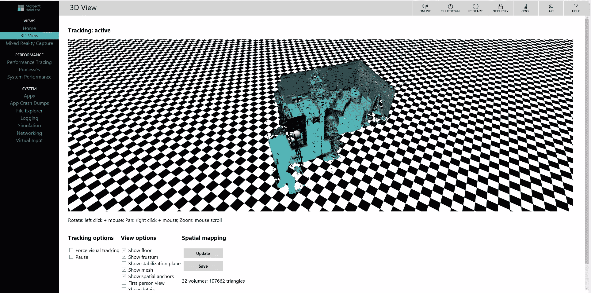

## 总结一下！

您现在已经准备好了所有的工具，并且已经构建了一个非常简单的 HoloLens 应用程序。当然，它还没有做任何事情，但是良好的开端是成功的一半。在下一篇文章中，我将介绍如何使用凝视和手势让你的应用变得栩栩如生。

## 分享这篇文章