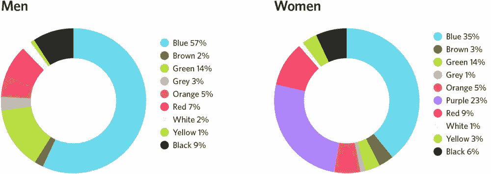
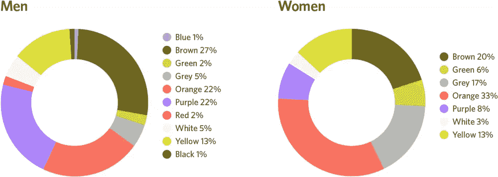

# 做出更好的 UX 决策的 3 个聪明的心理学规则

> 原文：<https://www.sitepoint.com/3-clever-psychology-rules-making-better-ux-decisions/>

上周，我向你介绍了四条广为人知的心理学法则，你可以用它们来真正改善你的网站效果。今天，我又有了三条规则，它们涉及颜色、人类注意力持续时间和对变化的反应，把事情带到了另一个层次。

我们开始吧！

## 规则 1:注意力持续时间每年都在缩短

在 2015 年的一项研究中，微软[调查了](https://advertising.microsoft.com/en/WWDocs/User/display/cl/researchreport/31966/en/microsoft-attention-spans-research-report.pdf)2000 人，并用脑电图(EEG)监测了另外 112 人的大脑活动。研究的一个亮点是我们的注意力持续时间减少了；现在普通人的注意力持续时间是 8 秒，而 2000 年是 12 秒。我们现在的注意力持续时间比金鱼短(金鱼的注意力持续时间为 9 秒)。

阿伯丁的一项研究进一步证实了我们确实变得越来越不耐烦的事实，尤其是在网上，该研究发现网站加载时间[延迟](http://www.digitalcurrent.com/digital-marketing/website-optimization-page-speed/)[一秒](https://hostingfacts.com/internet-facts-stats-2016/)将导致40%的人放弃网站，转化率下降 7%。

我们对即时满足的渴望(由于科技的发展，似乎所有东西都可以即时获得，这种渴望不断得到支持！)有很深的心理学渊源。研究人员对四所不同大学的学生进行了一项研究，用 fMRI 观察了参与者的大脑活动，发现当我们必须在短期奖励和长期目标之间做出选择时，我们大脑的两个区域会竞争对我们行为的控制。

研究发现，当我们面临即时满足的可能性时，大脑中受情绪相关大脑系统严重影响的部分会激活，这让我们几乎没有选择，因为我们不太可能从逻辑上考虑我们的决定。简而言之，我们天生想要即时的满足，而且，由于这主要与我们的情绪有关，我们对此无能为力。

这如何应用到你的网站设计中？

### 原则:使用“金鱼原则”为没有耐心的用户优化你的网站

无论你的网页设计有多漂亮，多吸引人，如果它不能快速加载，那么它就有一半是无用的。删除多余的、不必要的功能。清理你的代码以避免臃肿的设计，并遵循其他设计的最佳实践来使网站运行得更快。

## 规则 2:男人和女人对颜色的感知不同

作为一名设计师，如果你对颜色的使用是基于你最“喜欢”的或者你“认为”更好看的，请三思。有很多关于颜色心理学的研究，你可以使用正确的颜色来影响用户的行为。

根据 2006 年的一项名为“颜色对营销的影响”的研究，人们在与人或产品互动的 90 秒内就做出了决定，他们的评估有 62%到 90%仅受颜色的影响。这项研究回顾了营销背景下的色彩心理学文献，发现利用色彩来增加或减少食欲、减少对等待时间的感知、让顾客更有耐心以及提升人们的情绪是可能的。

事实上，颜色是如此强大，以至于我们吃的食物的颜色，以及周围的颜色，都被观察到会影响食物的味道和食用者的食欲。

2010 年发表的类似研究[发现，颜色可以影响人们对一个品牌的喜爱度和熟悉度——正确使用颜色可以增强购买意愿。该研究分析了 100 个品牌，涉及 450 名非色盲参与者，并比较了品牌个性(基本上是人们对某些品牌的印象:耐克“酷”，苹果“独一无二”，等等。)、受欢迎程度和熟悉程度。](http://link.springer.com/article/10.1007/s11747-010-0245-y)

参与者被随机分成三组；第一组人看到的是一个用 Arial 字体显示的品牌名称，颜色为中灰色，第二组人看到的是品牌标识的中灰色版本，而第三组人看到的是品牌标识的全彩色版本。

研究发现，颜色会影响品牌个性和受欢迎程度。由于研究人员发现红色、蓝色和黑色是被分析品牌最常用的颜色，他们做了进一步的分析，发现这些颜色引发了对这些品牌的某些感觉；红色让用户对某个品牌感到兴奋，蓝色让用户觉得某个品牌更有竞争力，黑色让用户觉得某个品牌更成熟。这与品牌的实际情况无关。

也就是说，不应该简单地决定偏爱哪种颜色。尽管我们天生倾向于对某些颜色做出某种反应，但现有的研究表明，不同性别和文化的人对颜色的偏好很容易发生变化。下图显示了男性和女性最喜欢的颜色:

男性和女性的颜色偏好

以下截图显示了 ***最少*** 的男女最喜欢的颜色:

<small>男女颜色厌恶</small>

一些事情显而易见:

*   你可能需要使用不同的颜色，这取决于你的观众是男性还是女性(例如，与女性相比，男性通常不喜欢紫色)
*   两种性别的颜色都有重叠，所以如果你的设计面向男女混合的观众，也不会失去所有的希望
*   男人通常喜欢大胆的颜色，而女人喜欢柔和的颜色

这如何应用到你的网站设计中？

### 原则:根据你的受众和目标改变你的颜色使用

根据你设计的受众改变你的颜色使用；尤其重要的是，要避免受自己性别和设计师经验影响的偏见。作为一个男性设计师，不要以为女性观众会因为你觉得好看而喜欢你的设计和对色彩的运用。

相反，了解两性以及不同背景的人对颜色的偏好，并让这影响你的设计选择。理解不同颜色引发的情绪并相应地使用颜色也很重要。

然而，如果不解决感官适应的概念，关于颜色的讨论就不完整。

## 规则 3:人类对“变化”比对“颜色”更敏感

我们刚刚讨论了颜色，但是讨论感官适应以保持事物的透视性也是很重要的。这在为转换而设计时尤其重要。

许多人报告说，改变他们的销售按钮或 CTA 的颜色提高了他们的转化率，但这样的说法站得住脚吗？虽然颜色确实有其作用，而且我们刚刚观察了不同颜色在性别和其他因素基础上可以发挥的作用，但考虑感官适应的概念也同样重要。

在心理学中，[感觉适应](http://users.ipfw.edu/abbott/120/adaptation.html)是指随着时间的推移，对恒定刺激的反应能力的变化。从根本上来说，我们倾向于逐渐忽略我们反复接触到的刺激；那种持续不断的噪音，你最初觉得很烦，无法忍受，但渐渐习惯了。

这也是为什么:

*   洗温水澡最初感觉很热，但逐渐感觉正常
*   穿上衣服和鞋子没多久，你就意识不到了
*   横幅盲让用户忽略他们不感兴趣的内容

感官适应解释了所有这些，同样的原则也适用于网页设计。

例如，下面的截图显示了[一个经常被引用的案例研究](http://blog.hubspot.com/blog/tabid/6307/bid/20566/The-Button-Color-A-B-Test-Red-Beats-Green.aspx#sm.000013e9veihzebgvzu297easxe4i)，关于颜色按钮的改变如何将转化率提高了 21 %:

哪个效果最好——红色还是绿色按钮？答案是肯定的。

现在，这听起来像是对红色的很好的宣传，所以红色对于让人们点击按钮来说一定很好，对吗？没那么快。该研究忽略了其他变量，如感官适应在用户决策中的作用。

仔细观察设计可以发现，页面上使用最多的颜色是绿色；它是标志颜色的一部分，是图像中使用的主色，稍后会在文案中使用，销售页面使用白色背景使得绿色很容易融入其中。自然地，由于绿色是页面上最主要的颜色，并且遵循感官适应的原则，绿色按钮不会很突出。

用户会自然地适应绿色，减少他们点击绿色按钮的机会。然而，红色改变了事物，打破了绿色主导的单调。红色基本上是在尖叫“看我！”从而使用户更有可能点击它。

有趣的是，为了支持感官适应的概念，另一篇文章声称[橙色按钮的颜色最适合转换](http://unbounce.com/conversion-rate-optimization/the-future-of-marketing-call-to-action-buttons/)。其他文章声称蓝色，绿色等。

说到底，[与其说是按钮颜色](https://www.sitepoint.com/button-ux-red-green/)不如说是感官适应原理。虽然红色可能确实是吸引注意力和提高转化率的一种更好的颜色，但这一切都归结于你设计的整体配色方案；也许在你的页面上看到很多绿色之后，用户已经习惯于逐渐“适应”绿色，从而降低了它的效果。

这如何应用到你的网站设计中？

### 原理:使用感官适应理论来提高转化率

感官适应的原则不仅适用于按钮颜色，也适用于整体设计。如果你想让人们采取某些行动，确保你使诱导该行动的元素不同于页面上的其他元素。此外，确保任何你想引起用户注意的东西在你的设计中看起来都不一样；单调的设计是一个巨大的转换杀手。

## 分享这篇文章