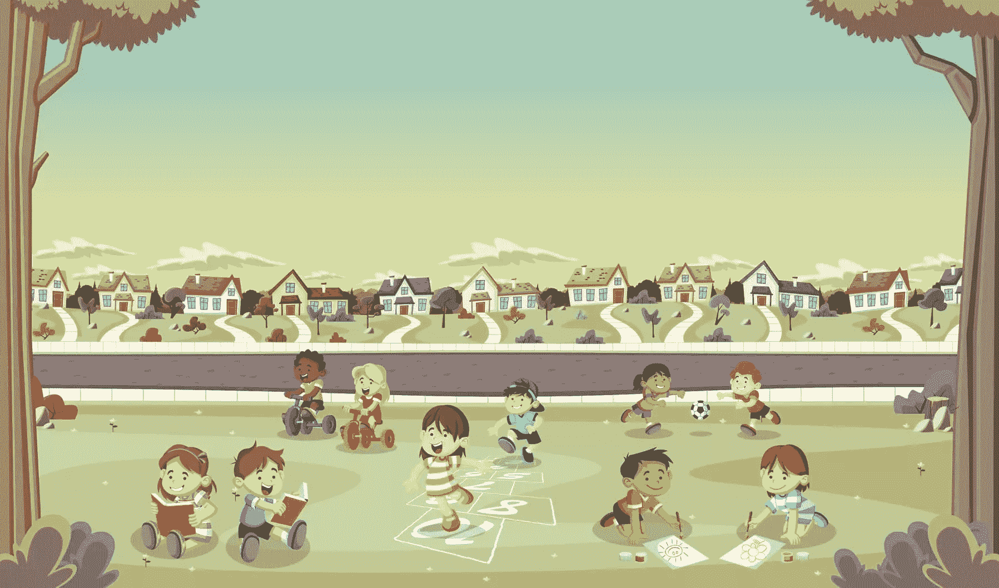

# 快速提示:在 Ruby 中创建散列的许多方法

> 原文：<https://www.sitepoint.com/quick-tip-the-many-ways-to-create-a-hash-in-ruby/>



作为 ruby 爱好者，我们对任何事情都使用哈希。它们是如此的简单和有用。我的意思是，你多久需要一个和其他东西相联系的东西？很多，如果你像我一样。例如，我有四(4)个孩子，这已经很多了。我喜欢随身带着这样的杂凑，这样我就不会忘记他们的名字:

```
$> kids = {1: "Logan", 2: "Emma", 3: "Lily", 4: "Becca"} 
```

我就是这样开始的，但这只不过是一个美化了的数组。另外，我发现自己需要关于他们的各种信息，所以我改变了散列:

```
$> kids = {logan: { gender: :boy, dob: Date.new(2000, 12,24), sports: [:soccer], favorite: false } ... } 
```

你明白了。这个 hash 已经很好地为我服务了一段时间，但是我想我应该研究一些不同的方法来创建这个 Hash，看看我是否能让它更加有用。

## 这是你祖父母的发明

好了，让我们淘汰那些普通的、无聊的创建散列的方法。首先，这是我上面所做的，这是创建散列的“简写”语法:

```
$> kids = {logan: { gender: :boy, dob: Date.new(2000, 12,24), sports: [:soccer], favorite: false } ... } 
```

虽然这并不性感或令人兴奋，但它是用 Ruby 创建 99.99999%的散列的方式。看起来有点像 JSON。事实上，我经常想知道 Hashes 和 JSON 对象是不是都挂在一个叫做 Value Bar 的地方(在 key 里面，懂吗？)和混杂。但是，我跑题了。

创建散列的另一个令人厌烦的方法是调用`.new`方法:

```
$> kids = Hash.new
=> {} 
```

这给了我们一个空散列。你希望我这么做吗？

```
$> hash = Hash.new(logan: {...}) 
```

如果你是，哇，你会大吃一惊的！没有你想的那么无聊。

## 一切又变得有趣了

给杂碎创作增加一些活力，不要夸张，不要夸张。在上面的例子中，我们仍然得到一个空散列:

```
$> kids = Hash.new(logan: {...})
=> {} 
```

但是，现在我们有了一个新的特性，即*默认值*。这意味着，如果你请求 Hash 给你一个键的值，而这个键在 Hash 中是*而不是*，你将得到你传递给`.new`的东西。下面是我如何用这个特性改进我的`kids`散列的:

```
$> kids = Hash.new({yours: false, send_them_home: true})
=> {}
$> kids[:colin]
=> {:yours=>false, :send_them_home=>true} 
```

所以，现在，当 Jill ( `{ wife: true, birthday: [elided], right: true` })说出一个孩子的名字，而那个孩子不是我的，我得到了一些可靠的信息和该怎么做的指示。太棒了。顺便说一下，您可以通过调用`#default`来查看 hash 的默认对象:

```
$> kids.default
=> {:yours=>false, :send_them_home=>true} 
```

或者，您可以通过调用`hash.default = <the object>`来覆盖散列的缺省值:

```
$> kids.default = {yours: false, embarrass: false }
=> {:yours=>false, :embarrass=>false} 
```

但是等等！还有呢！您还可以向`.new`传递一个块，每当您请求一个不在 Hash 中的键时，这个块就会运行:

```
$> kids = Hash.new do |hash, key|
$>   puts "This is not your kid!"
$>   puts "Don't curse in front of them!"
$>   hash[key] = {yours: false, send_them_home: true}
$> end
=> {}
$> kids[:taylor]
This is not your kid!
Don't cuss in front of them!
 => {:yours=>false, :send_them_home=>true} 
```

非常好。我再次利用了一些鲜为人知的散列初始化特性来为自己提供大量信息。顺便注意，当我传递一个块时，我还必须手动将键和值存储在散列中。如果我不这样做，每次我访问同一个丢失的键时，这个块都会运行。同样，就像您可以覆盖散列的`default`对象一样，您也可以覆盖`default_proc`:

```
$> kids.default_proc
  => #<Proc:0x007fc1eb2d7f80@(irb):15>
$> kids.default_proc = -> (hash, key) { puts "Find an adult" } 
```

## 保持哈希创建的怪异

为了完整起见，我将提到创建散列的几种其他方法。我 100%确定这些完全没有用，在 Ruby 编程的历史上从来没有人使用过它们。

**奇怪的散列括号方法#1:**

```
$> other_peoples_kids = Hash[ "colin", {friend_of: :logan, nerdy: true}, "taylor", {friend_of: :lily, annoying: true}]
 => {"colin"=>{:friend_of=>:logan, :nerdy=>true}, "taylor"=>{:friend_of=>:lily, :annoying=>true}} 
```

所以，你传递一个包含偶数个条目的数组，然后这个怪胎`Hash`把它们分成键值对。

**奇怪的散列括号方法#2:**

```
$> kids_interests = Hash[[[:logan, [:soccer, :pokemon]], [:emma, [:cheer, :not_mowing_the_lawn]]]]
 => {:logan=>[:soccer, :pokemon], :emma=>[:cheer, :not_mowing_the_lawn]} 
```

在这里，传入一个由两个元素组成的数组被转换成一个散列。说真的，这是谁想出来的？

**奇怪的散列括号方法#3:**

```
$> kids_favorite_foods = Hash["login"=>"wings", "emma"=>"pizza", "lily"=>"airheads", "becca"=>"unknown"]
  => {"login"=>"wings", "emma"=>"pizza", "lily"=>"airheads", "becca"=>"unknown"} 
```

显然，如果我向`Hash[]`传递一个 Hash，我会得到一个 Hash。这相当于吃玉米。

这些括号方法是如此奇怪，以至于我想象坏的散列挂在值栏“括号”中变高。或者什么的。

## 朋友不让朋友括号和代码

好了，今天的快速提示就到这里。我希望你学到了一些关于创建散列和/或我的孩子的知识。说到这，孩子们都出去了，所以我要去酒吧吃点东西。日安！

## 分享这篇文章