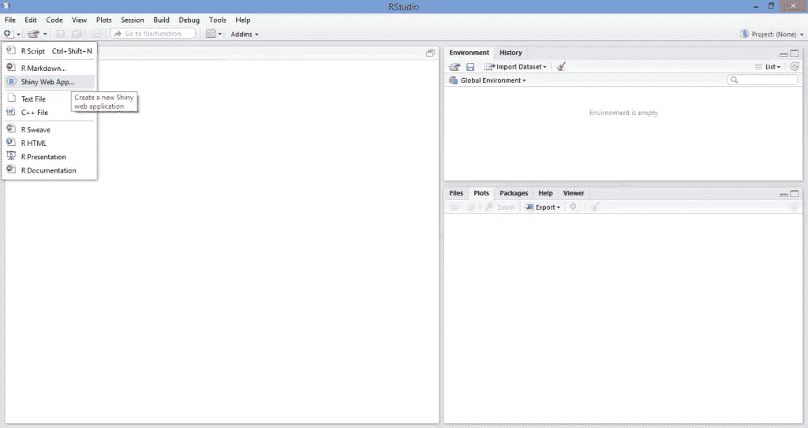
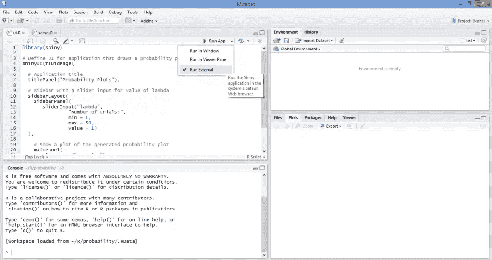
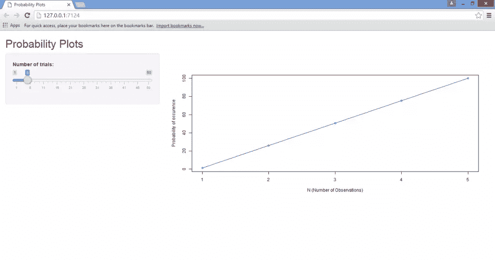
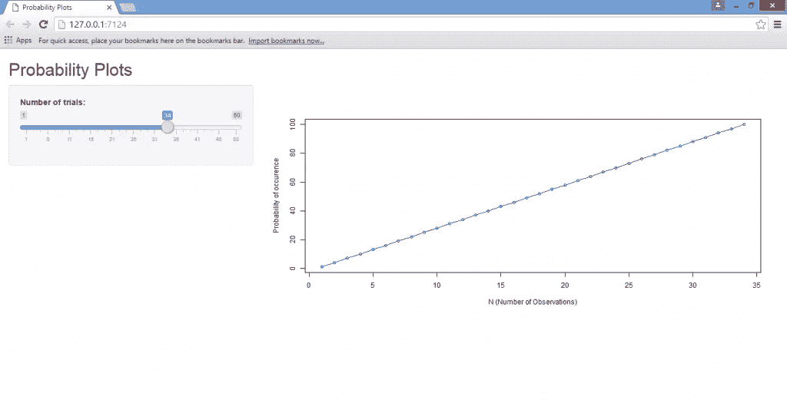
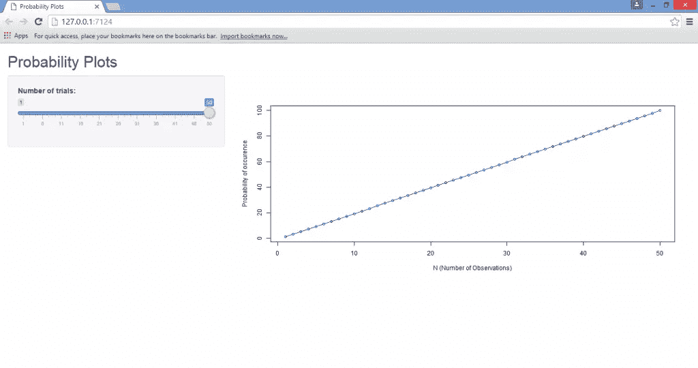
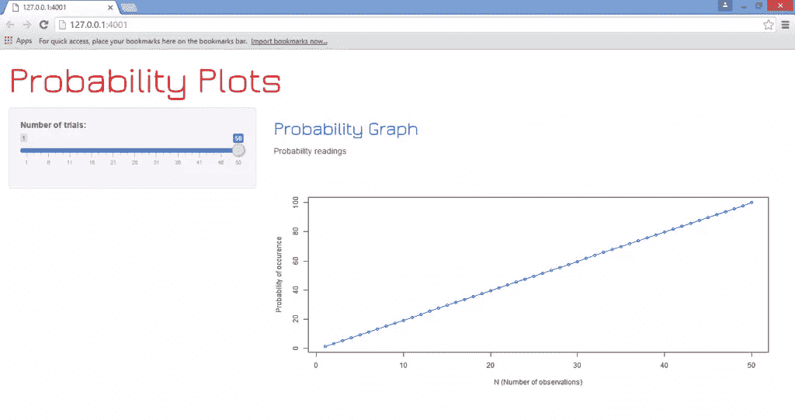

# Shiny、R 和 HTML:融合数据科学和 Web 开发

> 原文：<https://www.sitepoint.com/shiny-r-and-html-merging-data-science-and-web-development/>


随着数据科学的出现，以及分析和解释大量数据的需求增加，R 语言变得越来越流行。然而，考虑到 1)在分析数据时对更具交互性的用户界面的需求，以及 2)云在运行此类应用程序中的作用越来越大，统计计算平台和 web 之间的平稳交互需求日益增长。

因此，统计学家和网络开发人员迄今为止似乎不太可能结合在一起，但毫无疑问，随着数据科学领域对基于网络的平台的需求变得越来越流行，这两个群体之间的互动将继续增加。在这方面， [R](https://www.r-project.org/) 和[闪亮的](http://shiny.rstudio.com/)平台的互动正迅速成为数据世界和网络互动的基石。

在本教程中，我们将主要关注用于在 Shiny 中构建应用程序的命令——包括 UI(用户界面)端和服务器端。虽然熟悉 R 编程语言总是有助于创建一个闪亮的应用程序，但专业知识并不是必需的，这个示例将介绍如何在 Shiny 中构建一个简单的统计图，以及一些说明如何通过 HTML 定制 web 页面的基本命令。

## 安装和加载闪亮的网络应用

首先，我们必须首先安装 RStudio 平台，以便创建和运行一个闪亮的 Web 应用程序。RStudio 可以从 [RStudio 网站](https://www.rstudio.com/)下载。

一旦我们加载了 RStudio 平台，我们就可以通过选择**新文件**选项，然后选择**闪亮 web 应用……**选项来创建新的闪亮 Web 应用。



在这样做的时候，我们看到了一个界面，允许我们命名我们的应用程序(我把它命名为“OurFirstApp”)，但是可以随意想出其他有创意的名字！)，然后我们再选择**多个文件(ui。r/服务器。R)** 作为我们的申请类型:


而我们可以选择**单个文件(app。R)** ，这实际上只是将`ui.R`和`server.R`脚本合并为一个。我个人更倾向于将这两者分开，以保持代码不那么混乱，但这是个人偏好的问题。

顺便提一下，在 [Shinyapps 网站](http://www.shinyapps.io/)上也有一个网络平台，它允许用户在线分享他们闪亮的应用程序，并使用 rsconnect 包从 R 控制台远程控制这些应用程序。虽然实现这一点的方法超出了本文的范围，但是如果有兴趣，我一定会在后续文章中进一步扩展这个主题。

无论如何，一旦我们命名了闪亮的 Web 应用程序并开放了源代码，我们就会看到一个模板应用程序，它使用数据集“Old Faithful Geyser Data”来生成直方图。出于本教程的目的，我们将编写自己的应用程序，并根据我们的需求进行定制。

## 运行应用程序

如前所述，一个闪亮的 Web 应用程序的主要组件是用户界面端(`ui.R`)和服务器端(`server.R`)。

对于这个特定的应用程序，我们将创建一个简单的线图，其中 x 轴表示`N`观察值，y 轴表示发生概率。本质上，这个应用程序创建了一个滑块，允许我们在 1-50 之间选择一个值(N)。`N`可以认为是试验的次数，即如果选择值 2，则 2 次试验等于 100%的概率。另一方面，如果选择值 50，则必须进行 50 次试验，以使发生概率等于 100%。在图中，`N = 50`，然后滑回到`N = 25`将对应于 50%的概率，并且图自动更新以反映这一点。请注意，这在数学上是一个过于简单的例子，但仅仅是用来说明在跨越 Shiny 平台的图形生成环境中，反应性是如何工作的。

虽然下面的代码最终会稍作修改，以允许使用 HTML 进行更大的定制，但它是用于创建`ui.R`和`server.R`文件的代码:

**ui。R**

```
#Call the “shiny” library
library(shiny)

#Define the UI for application that draws a probability plot
shinyUI(fluidPage(

  #Name the Title of the applicationh
  titlePanel("Probability Plots"),

  #Create a sidebar with a slider input for number of trials
  sidebarLayout(
    sidebarPanel(
       sliderInput("lambda",
                "Number of trials:",
                min = 1,
                max = 50,
                value = 1)
  ),

    #Show a plot of the generated probability plot
    mainPanel(
       plotOutput("ProbPlot")
    )
  )
)) 
```

**服务器。R**

```
#Define the “shiny”, “ggplot2” and “scales” libraries
library(shiny)
library(ggplot2)
library(scales)

#Shiny Application
shinyServer(function(input, output) {

#Create a reactive expression
output$ProbPlot <- renderPlot({

  #Generate lambda value based on input$lambda from ui.R
  n=1:100
  lambda <- seq(min(n), max(n), length.out = input$lambda)
  probability=lambda

  #Generate the probability plot
  plot(probability, type = "o", col = 'blue', border = 'white', xlab="N (Number of Observations)", ylab ="Probability of occurrence")

})

}) 
```

然后，我们通过选择下面的**运行外部**选项来运行我们的应用程序，然后选择**运行应用程序**:



一旦我们运行我们的应用程序，我们会观察到图形会自动更新，使我们能够在线图中直观地分析`N`和发生概率之间的关系，这取决于我们选择的试验次数:







正如我们所看到的，通过 Shiny 运行这个应用程序使它变得更加用户友好，因为滑块允许即时操作和观察结果。这被称为**反应表达式**，其中一个变量的值自动更新另一个变量的给定变化。如果我们选择只使用 R 来运行这个程序，那么每次我们希望运行这个程序时，我们都需要在源代码中键入一个新的值`N`,这最终会非常单调和低效——尤其是对于还没有 R 语言知识的用户来说。

以上脚本中需要注意的几点:

*   `sidebarLayout`函数允许我们创建滑动侧边栏，使我们能够输入试验次数的特定值。我们通过`min`(最小值)`max`(最大值)和`value`(序列中每个值之间的值的数量)来定义它。
*   注意，在`server.R`脚本中，代码包括 ggplot2 和 scales 库。当您自己运行程序时，您会注意到这两个库并不是运行这个特定应用程序的严格要求。但是，我将它们包括在内是因为 ggplot2 库在运行更复杂的图形时非常有用，而 scales 库允许对图形数据进行更大程度的定制，这些数据需要跨一系列轴或图例使用不同的缩放方法。
*   此外，我们可以看到，当我们生成一个 lambda 值(对于`server.R`脚本的倒数第二个命令)时，我们是通过使变量成为`n`的最小和最大值的函数来实现的，我们将 T1 定义为 1 到 100。这里我们定义了`n`和我们的概率函数(称为λ)之间的相互作用，这反过来又产生了一个反应表达式:

```
#Generate lambda value based on input$lambda from ui.R
  n=1:100
  lambda <- seq(min(n), max(n), length.out = input$lambda)
  probability=lambda 
```

## HTML 定制

如上所述，我们创建了一个应用程序，它能够使用反应式表达式来即时更新线图及其轴。然而，假设我们毕竟是在用应用程序创建一个 web 页面，假设我们希望用 HTML 更新页面设计？

我们将在这里执行的 HTML 编辑本身是非常基本的。对于本教程，我们将简单地集中在如何编辑字体和颜色方面的网页标题。然而，这背后的目的是具体说明如何在 R 中编辑用户界面代码，以便能够定制 web 页面，这是本教程的主要内容。这涉及到对我们上面生成的`ui.R`文件的轻微修改，以允许 HTML 插入。

需要注意的最重要的一点是，我们只修改了我们的`ui.R`文件——`server.R`文件仍然和上面一样。这显然是因为 HTML 被用于修改用户界面的目的；它不是用来修改应用程序本身的参数。

(在这个实例中，我用来编辑网页标题的模板是基于 Chris Beeley 的第二版 *Web 应用程序开发，R 使用闪亮的*。我个人认为这是一个很好的指南，并强烈推荐给任何希望增加 R/Shiny 编程和 web 平台知识的人。)

我们用来构建更新网页的修改后的`ui.R`程序如下:

**ui。R**

```
#Call the “shiny” library
library(shiny)

# Define UI for application that draws a probability plot
shinyUI(fluidPage(
  tags$head(HTML("<link href='http://fonts.googleapis.com/css?family=Jura' rel='stylesheet' type = 'text/css'>")),

  h2("Probability Plots", style = "font-family: 'Jura'; color: red; font-size: 64px;"),

  # Application title
  #titlePanel("Probability Plots"),

  # Sidebar with a slider input for value of lambda
  sidebarLayout(
    sidebarPanel(
       sliderInput("lambda",
                "Number of trials:",
                min = 1,
                max = 50,
                value = 1)
  ),
    # Show a plot of the generated probability plot
    mainPanel(
      h3("Probability Graph", style = "font-family: 'Jura'; color: blue; font-size: 32px;"),
      HTML("<p>Probability readings</p>"),
       plotOutput("ProbPlot")
    )
  )
)) 
```

在查看这个`ui.R`脚本和前一个脚本的区别时，我们注意到我们通过使用`tags$head`命令将谷歌字体定义为字体家族来添加到`shinyUI(fluidPage)`命令中。此外，我们使用`h2`标题来定义页面本身的“概率图”标题，随后使用`h3`标题来定义我们绘制的图表的“概率图”。

一旦我们结合`server.R`脚本运行上述代码，我们将生成下图(以及与我们之前观察到的相同的滑块选择和反应):



## 结论

在本教程中，我们讲述了:

1.  在 R 中安装 RStudio 和加载一个闪亮的 Web 应用程序的过程
2.  如何在闪亮中创造情节，形成反应式表达
3.  使用 HTML 定制闪亮的网页。

不用说，这个应用程序仅仅触及了 Shiny 在 R 平台上的许多功能的冰山一角。

此外，在定制应用程序加载的相应网页的用户界面时，Shiny 还可以与 JavaScript 等其他语言一起使用。然而，上面的教程可以作为开发和运行 Shiny 应用程序的基础。

我希望这篇教程对你有帮助和兴趣。请在下面的评论中让我们知道你的想法，并告诉我们你是否还有其他想让我们涉及的话题。

## 分享这篇文章