# 使用 Firebase 为您的 Android 应用程序创建云后端

> 原文：<https://www.sitepoint.com/creating-a-cloud-backend-for-your-android-app-using-firebase/>

# 使用 Firebase 为您的 Android 应用程序创建云后端

*本文于 2016 年 9 月更新，以反映 Firebase 平台*的变化。

18 个月前，我写了一篇关于使用 Parse 为你的 Android 应用程序创建云后端的文章。脸书今年早些时候宣布，他们将于 2017 年 1 月 28 日关闭 T2 的 Parse T3，新的服务注册是不可能的。随着这个令人惊讶的声明，这迫使依赖该服务的开发者开始寻找[替代品](https://github.com/relatedcode/ParseAlternatives)，他们可以[将他们的数据迁移到](https://www.sitepoint.com/migrating-your-android-or-ios-app-from-parse/)。

因为这个消息，我想我应该重温一下这个主题，并介绍如何使用不同的后端作为服务平台来管理您的 Android 应用程序的数据。

在本教程中，我将关注 [Firebase](https://firebase.google.com/) ，这是一个流行的后端平台，于 2014 年 10 月被谷歌收购。

您应该始终权衡依赖 BaaS 和构建自己的 BaaS 的利弊。Parse 不是第一个关闭的 BaaS 平台(例如 [StackMob](http://thenextweb.com/insider/2014/02/12/paypal-owned-stackmob-shut-may-11-team-can-focus-mobile-payment-technology/) )，也不会是最后一个。作为依赖这些平台之一的开发人员，您应该随时准备好迁移并有一个备份计划。

使用 Firebase，您可以将数据存储并同步到 NoSQL 云数据库。数据存储为 JSON，实时同步到所有连接的客户端，并且在您的应用程序离线时可用。它提供了 API，使您能够使用电子邮件和密码、脸书、Twitter、GitHub、Google、匿名认证来认证用户，或者与现有的认证系统集成。除了实时数据库和认证，它还提供大量其他服务，包括云消息、存储、托管、远程配置、测试实验室、崩溃报告、通知、应用程序索引、动态链接、邀请、AdWords、AdMob。

在本文中，您将创建一个简单的应用程序，展示如何从 Firebase 中保存和检索数据，如何验证用户，设置数据的读/写权限，以及在服务器上验证数据。

你可以在 [GitHub](https://github.com/sitepoint-editors/Firebase-with-Android) 上找到这个项目的代码。

## 设置项目

首先，创建一个名为*的新项目来做*。在下一个窗口中设置*最小 SDK* 为 *API 15* ，在下一个窗口中选择*基本活动*。点击最后一个窗口上的*完成*，保留默认设置。

在开始 Android 项目之前，去[firebase.google.com](https://firebase.google.com/)创建一个账户。登录你的账户后，前往 [Firebase 控制台](https://console.firebase.google.com/)，创建一个保存你的应用程序数据的项目。

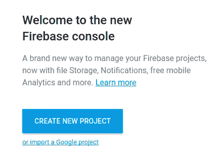

输入项目的名称和国家/地区。

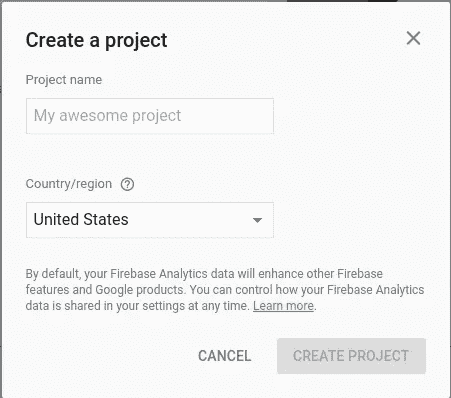

国家/地区代表您的组织/公司所在的国家/地区。您的选择也为您的收入报告设置了适当的货币。在为项目设置了名称(我使用了 *SPToDoApp* )和区域之后，点击 Create Project 按钮。这将创建一个项目，其控制台将打开。从项目的控制台，点击*添加 Firebase 到你的 Android 应用*选项。

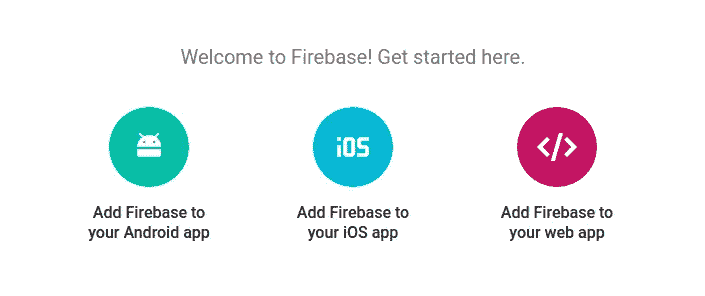

在弹出的窗口中输入你的 Android 项目的包名。如果您的应用程序将使用某些 Google Play 服务，如 Google 登录、应用程序邀请、动态链接等，那么您必须提供您的签名证书的 SHA-1。此应用程序不会使用任何这些服务，因此请将此字段留空。如果您希望将这些服务添加到您的应用程序中，[请前往此页面](https://developers.google.com/android/guides/client-auth)了解有关使用 **keytool** 获取您的签名证书的 SHA-1 哈希的信息。该页面包含获取发布和调试证书指纹的说明。完成后，点击*添加应用*按钮。


点击*添加应用*会将一个 *google-services.json* 文件下载到你的电脑上。对话框的下一页给出了放置下载的 JSON 文件的说明。找到下载的文件，并将其移动到您的 Android 项目的应用程序模块根目录。

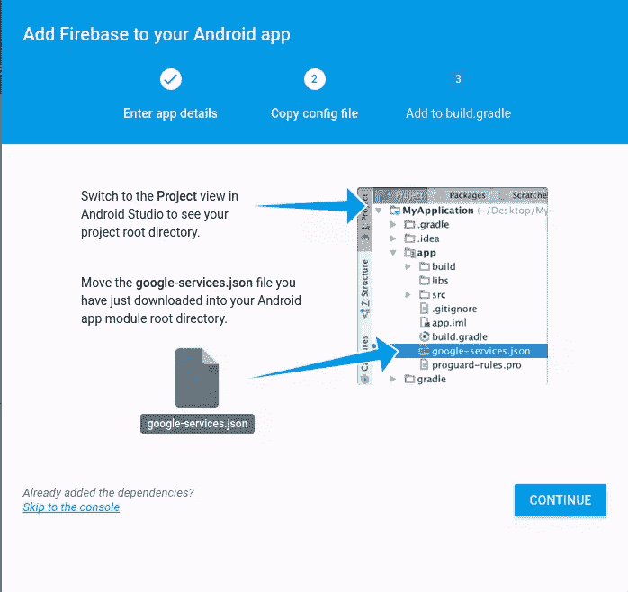

JSON 文件包含 Android 应用程序与 Firebase 服务器通信所需的配置设置。它包含 Firebase 项目的 URL、API 密钥等细节。在 Firebase 的早期版本中，您必须手动将它们存储在应用程序的代码中，但现在这个过程已经被简化，只需使用一个包含所需数据的文件。

如果您使用版本控制并将代码存储在公共存储库中，您应该考虑将 *google-services.json* 文件放在*中。gitignore* 文件，这样这些信息就不会公之于众。

完成后，点击对话窗口上的*继续*，将给出进一步的设置说明。


在您的项目级 *build.gradle* 文件中，向*build script>dependencies*节点添加以下内容。这样做是为了包含 Gradle 的 Google 服务插件，它加载您下载的 *google-services.json* 文件。

```
classpath 'com.google.gms:google-services:3.0.0'
```

确保您编辑的是正确的 gradle 文件。

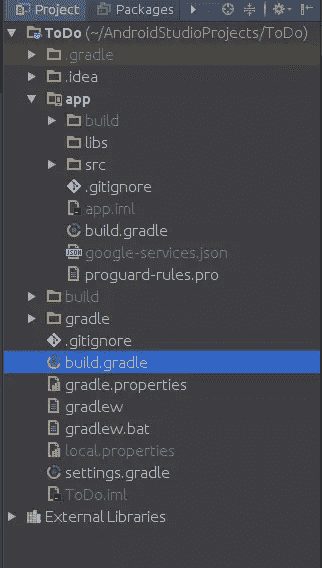

然后在你的 App-level *build.gradle* 文件中，在文件底部添加以下内容来启用 gradle 插件。

```
apply plugin: 'com.google.gms.google-services'
```

同样，确保它是正确的 *build.gradle* 文件。

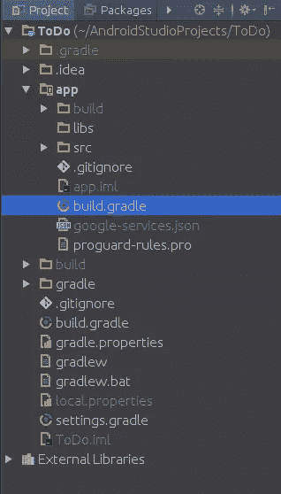

然后将下列依赖项添加到同一个文件中。Firebase 针对其特性有不同的 SDK。在这里，您添加了使用实时数据库和身份验证所需的库。

```
compile 'com.google.firebase:firebase-database:9.4.0'
compile 'com.google.firebase:firebase-auth:9.4.0'
```

选择*文件- >新建- >活动- >空活动*菜单项，创建一个空活动，命名为`LogInActivity`。创建另一个并命名为`SignUpActivity`。

将 *activity_log_in.xml* 布局文件的内容更改为:

```
<?xml version="1.0" encoding="utf-8"?>
<RelativeLayout xmlns:android="http://schemas.android.com/apk/res/android"
            xmlns:tools="http://schemas.android.com/tools"
            android:layout_width="match_parent"
            android:layout_height="match_parent"
            android:paddingBottom="@dimen/activity_vertical_margin"
            android:paddingLeft="@dimen/activity_horizontal_margin"
            android:paddingRight="@dimen/activity_horizontal_margin"
            android:paddingTop="@dimen/activity_vertical_margin"
            tools:context=".LoginActivity" >

    <EditText
        android:id="@+id/emailField"
        android:layout_width="match_parent"
        android:layout_height="wrap_content"
        android:layout_alignParentLeft="true"
        android:layout_alignParentTop="true"
        android:ems="10"
        android:inputType="textEmailAddress"
        android:hint="@string/email_hint" >

        <requestFocus />
    </EditText>

    <EditText
        android:id="@+id/passwordField"
        android:layout_width="match_parent"
        android:layout_height="wrap_content"
        android:layout_alignLeft="@+id/emailField"
        android:layout_below="@+id/emailField"
        android:ems="10"
        android:hint="@string/password_hint"
        android:inputType="textPassword" />

    <Button
        android:id="@+id/loginButton"
        android:layout_width="match_parent"
        android:layout_height="wrap_content"
        android:layout_alignLeft="@+id/passwordField"
        android:layout_below="@+id/passwordField"
        android:text="@string/login_button_label" />

    <TextView
        android:id="@+id/signUpText"
        android:layout_width="wrap_content"
        android:layout_height="wrap_content"
        android:layout_below="@+id/loginButton"
        android:layout_centerHorizontal="true"
        android:layout_marginTop="69dp"
        android:text="@string/sign_up_text" />

</RelativeLayout>
```

将 *activity_sign_up.xml* 布局文件的内容更改为:

```
<?xml version="1.0" encoding="utf-8"?>
<RelativeLayout xmlns:android="http://schemas.android.com/apk/res/android"
            xmlns:tools="http://schemas.android.com/tools"
            android:layout_width="match_parent"
            android:layout_height="match_parent"
            android:paddingBottom="@dimen/activity_vertical_margin"
            android:paddingLeft="@dimen/activity_horizontal_margin"
            android:paddingRight="@dimen/activity_horizontal_margin"
            android:paddingTop="@dimen/activity_vertical_margin"
            tools:context=".SignUpActivity" >

    <EditText
        android:id="@+id/emailField"
        android:layout_width="match_parent"
        android:layout_height="wrap_content"
        android:layout_alignParentLeft="true"
        android:layout_alignParentTop="true"
        android:ems="10"
        android:inputType="textEmailAddress"
        android:hint="@string/email_hint" >

        <requestFocus />
    </EditText>

    <EditText
        android:id="@+id/passwordField"
        android:layout_width="match_parent"
        android:layout_height="wrap_content"
        android:layout_alignLeft="@+id/emailField"
        android:layout_below="@+id/emailField"
        android:ems="10"
        android:inputType="textPassword"
        android:hint="@string/password_hint" />

    <Button
        android:id="@+id/signupButton"
        android:layout_width="match_parent"
        android:layout_height="wrap_content"
        android:layout_alignLeft="@+id/passwordField"
        android:layout_below="@+id/passwordField"
        android:text="@string/sign_up_button_label" />

</RelativeLayout>
```

这些布局用于登录和注册视图。

将以下内容添加到 *values/strings.xml* 中。

```
<string name="password_hint">Password</string>
<string name="email_hint">Email</string>
<string name="sign_up_button_label">Sign Up</string>
<string name="signup_error_message">Please make sure you enter an email address and password!</string>
<string name="signup_error_title">Error!</string>
<string name="signup_success">Account successfully created! You can now Login.</string>
<string name="login_error_message">Please make sure you enter an email address and password!</string>
<string name="login_error_title">Error!</string>
<string name="login_button_label">Login</string>
<string name="sign_up_text">Sign Up!</string>
<string name="title_activity_login">Sign in</string>
<string name="add_item">Add New Item</string>
<string name="action_logout">Logout</string>
```

在 *activity_main.xml* 中，删除`FloatingActionButton`标记。

```
<android.support.design.widget.FloatingActionButton
    android:id="@+id/fab"
    android:layout_width="wrap_content"
    android:layout_height="wrap_content"
    android:layout_gravity="bottom|end"
    android:layout_margin="@dimen/fab_margin"
    android:src="@android:drawable/ic_dialog_email"/>
```

在*MainActivity.java*也删除了 FAB 代码。

```
FloatingActionButton fab = (FloatingActionButton) findViewById(R.id.fab);
fab.setOnClickListener(new View.OnClickListener() {
    @Override
    public void onClick(View view) {
        Snackbar.make(view, "Replace with your own action", Snackbar.LENGTH_LONG)
                .setAction("Action", null).show();
    }
});
```

在 *res/menu/menu_main.xml* 中，将设置项替换为以下注销项。

```
<item
    android:id="@+id/action_logout"
    android:orderInCategory="100"
    android:title="@string/action_logout"
    app:showAsAction="never"/>
```

打开`MainActivity`，将`onOptionsItemSelected(MenuItem)`中的`action_settings` id 替换为`action_logout` id。

```
if (id == R.id.action_logout) {
    return true;
}
```

此菜单项将注销用户。

将 *content_main.xml* 更改为以下内容:

```
<?xml version="1.0" encoding="utf-8"?>
<LinearLayout xmlns:android="http://schemas.android.com/apk/res/android"
          xmlns:tools="http://schemas.android.com/tools"
          xmlns:app="http://schemas.android.com/apk/res-auto"
          android:layout_width="match_parent"
          android:layout_height="match_parent"
          android:paddingLeft="@dimen/activity_horizontal_margin"
          android:paddingRight="@dimen/activity_horizontal_margin"
          android:paddingTop="@dimen/activity_vertical_margin"
          android:paddingBottom="@dimen/activity_vertical_margin"
          app:layout_behavior="@string/appbar_scrolling_view_behavior"
          tools:context=".MainActivity"
          tools:showIn="@layout/activity_main"
          android:orientation="vertical">

    <ListView
        android:id="@+id/listView"
        android:layout_width="match_parent"
        android:layout_height="0dp"
        android:layout_weight="1">
    </ListView>

    <LinearLayout
        android:layout_width="match_parent"
        android:layout_height="wrap_content"
        android:orientation="vertical"
        android:layout_gravity="bottom">
        <EditText
            android:id="@+id/todoText"
            android:layout_width="match_parent"
            android:layout_height="wrap_content"/>
        <Button
            android:id="@+id/addButton"
            android:layout_width="match_parent"
            android:layout_height="wrap_content"
            android:text="@string/add_item"/>
    </LinearLayout>

</LinearLayout>
```

*activity_main.xml* 有一个`include`标签，指向并加载 *content_main.xml* 。该应用程序将在列表视图中显示待办事项，这将占据大部分屏幕。在屏幕的底部，将是一个编辑文本字段和一个按钮来添加项目到列表中。

设置好应用程序的 UI 后，现在您将了解如何在 Firebase 中保存和检索数据。

## 安全性和规则

在从 Firebase 服务器检索和保存数据之前，您需要设置身份验证并添加规则来限制对数据的访问，并在保存之前验证用户输入。

### 证明

Firebase API 内置了电子邮件/密码、脸书、Twitter、GitHub、Google 和匿名认证的方法。本教程将使用电子邮件和密码认证。

前往 [Firebase 控制台](https://console.firebase.google.com/)，点击项目，打开项目仪表板。

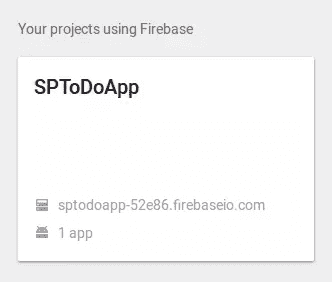

如果您从左侧面板中选择**数据库**，您将能够看到 JSON 格式的项目数据。

Firebase 将所有数据库数据存储为 JSON 对象。没有表格或记录。当您向 JSON 树中添加数据时，它将成为现有 JSON 结构中的一个键。

此时，您只能看到根节点。


如果您将鼠标悬停在一个节点上，您将看到 *+* 和 *x* 控件，您可以分别使用它们向树中添加数据和删除该节点。

在左侧面板中，点击**认证**，然后选择右侧的**登录方法**选项卡。启用来自给定提供商的**电子邮件/密码**认证。

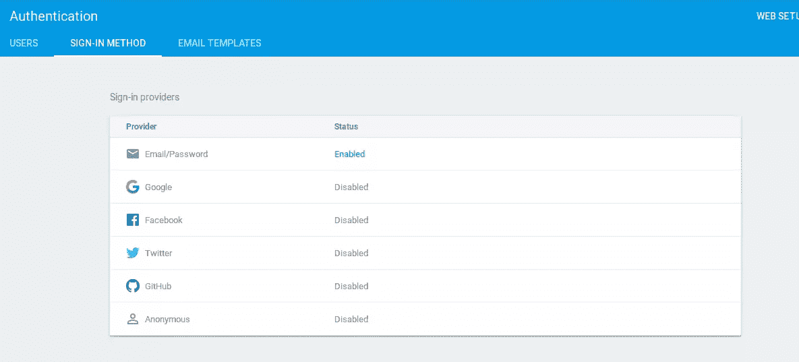

在 Android Studio 中，将以下方法添加到`MainActivity`中。

```
private void loadLogInView() {
    Intent intent = new Intent(this, LogInActivity.class);
    intent.addFlags(Intent.FLAG_ACTIVITY_NEW_TASK);
    intent.addFlags(Intent.FLAG_ACTIVITY_CLEAR_TASK);
    startActivity(intent);
}
```

这将导航到`Login`视图并清除活动堆栈。这可以防止用户在登录视图中按下*返回按钮*时返回到主活动。

将下列变量添加到该类中。

```
private FirebaseAuth mFirebaseAuth;
private FirebaseUser mFirebaseUser;
```

然后在`onCreate()`的底部加上以下内容。

```
// Initialize Firebase Auth
mFirebaseAuth = FirebaseAuth.getInstance();
mFirebaseUser = mFirebaseAuth.getCurrentUser();

if (mFirebaseUser == null) {
    // Not logged in, launch the Log In activity
    loadLogInView();
}
```

在这里，您检查登录的用户。如果用户没有登录，`getCurrentUser()`将返回`null`，否则它将返回一个包含登录用户详细信息的`FirebaseUser`对象。如果用户没有登录，调用`loadLogInView()`，将用户重定向到登录视图。

运行该应用程序，您应该会被重定向到登录页面。

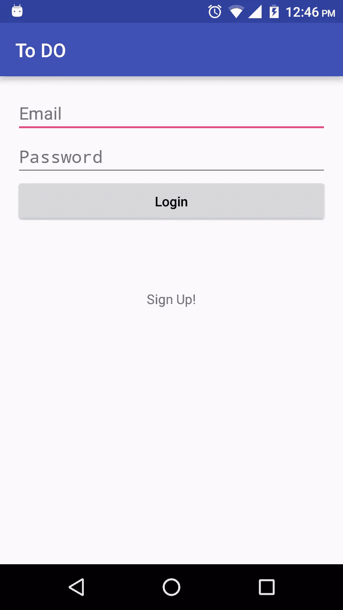

将以下内容添加到`LogInActivity`。

```
protected EditText emailEditText;
protected EditText passwordEditText;
protected Button logInButton;
protected TextView signUpTextView;
private FirebaseAuth mFirebaseAuth;
```

将`LogInActivity`类的`onCreate()`方法改为:

```
@Override
protected void onCreate(Bundle savedInstanceState) {
    super.onCreate(savedInstanceState);
    setContentView(R.layout.activity_log_in);

    // Initialize FirebaseAuth
    mFirebaseAuth = FirebaseAuth.getInstance();

    signUpTextView = (TextView) findViewById(R.id.signUpText);
    emailEditText = (EditText) findViewById(R.id.emailField);
    passwordEditText = (EditText) findViewById(R.id.passwordField);
    logInButton = (Button) findViewById(R.id.loginButton);

    signUpTextView.setOnClickListener(new View.OnClickListener() {
        @Override
        public void onClick(View v) {
            Intent intent = new Intent(LogInActivity.this, SignUpActivity.class);
            startActivity(intent);
        }
    });

    logInButton.setOnClickListener(new View.OnClickListener() {
        @Override
        public void onClick(View v) {
            String email = emailEditText.getText().toString();
            String password = passwordEditText.getText().toString();

            email = email.trim();
            password = password.trim();

            if (email.isEmpty() || password.isEmpty()) {
                AlertDialog.Builder builder = new AlertDialog.Builder(LogInActivity.this);
                builder.setMessage(R.string.login_error_message)
                        .setTitle(R.string.login_error_title)
                        .setPositiveButton(android.R.string.ok, null);
                AlertDialog dialog = builder.create();
                dialog.show();
            } else {
                mFirebaseAuth.signInWithEmailAndPassword(email, password)
                        .addOnCompleteListener(LogInActivity.this, new OnCompleteListener<AuthResult>() {
                            @Override
                            public void onComplete(@NonNull Task<AuthResult> task) {
                                if (task.isSuccessful()) {
                                    Intent intent = new Intent(LogInActivity.this, MainActivity.class);
                                    intent.addFlags(Intent.FLAG_ACTIVITY_NEW_TASK);
                                    intent.addFlags(Intent.FLAG_ACTIVITY_CLEAR_TASK);
                                    startActivity(intent);
                                } else {
                                    AlertDialog.Builder builder = new AlertDialog.Builder(LogInActivity.this);
                                    builder.setMessage(task.getException().getMessage())
                                            .setTitle(R.string.login_error_title)
                                            .setPositiveButton(android.R.string.ok, null);
                                    AlertDialog dialog = builder.create();
                                    dialog.show();
                                }
                            }
                        });
            }
        }
    });
}
```

这将启动视图元素和`FirebaseAuth`对象，这是 Firebase 身份验证 SDK 的入口点。一个事件监听器被添加到注册文本视图中，点击它将打开注册活动。Login 按钮上的另一个事件监听器对用户输入执行验证，确保用户在两个字段中都输入了文本。然后它用`signInWithEmailAndPassword()`调用 Firebase 服务器。该函数获取用户的电子邮件和密码，并返回一个`AuthResult`的`Task`。您检查`Task`是否成功，并将用户重定向到 MainActivity，否则向他们显示一条错误消息。下面是试图登录一个没有注册的用户时得到的错误信息。

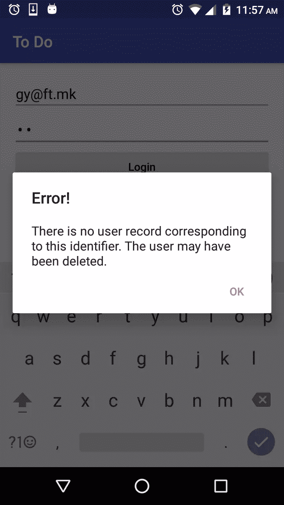

你可能想在你的应用中向用户展示一个比`task.getException().getMessage()`返回的信息更好的信息。您可以检查返回的异常，以确定向用户显示的错误消息。当身份验证失败时，您可能会遇到以下异常之一:

*   如果电子邮件对应的用户帐户不存在或被禁用，则抛出。
*   如果密码错误，抛出异常。

除了`signInWithEmailAndPassword()`之外，您还可以使用以下方式登录用户:

*   **signInWithCredential(auth credential)**–尝试使用给定的 [AuthCredential](https://developers.google.com/android/reference/com/google/firebase/auth/AuthCredential.html) 登录用户。使用此方法将用户登录到 Firebase 身份验证系统。首先，要么直接从用户处获取凭证，比如使用 [EmailAuthCredential](https://developers.google.com/android/reference/com/google/firebase/auth/EmailAuthCredential.html) ，要么从受支持的认证 SDK 处获取凭证，比如 Google Sign-In 或脸书。
*   **signinamonymously()**–匿名登录用户，无需任何凭证。此方法在 Firebase 身份验证系统中创建新帐户，除非已经有匿名用户登录到此应用程序。
*   **signInWithCustomToken(String)**–尝试使用给定的自定义令牌登录用户。从服务器检索 Firebase Auth 自定义令牌后，使用此方法将用户登录到 Firebase 身份验证系统。

登录功能完成后，让我们设置注册。

如图所示修改`SignUpActivity`。

```
package com.echessa.todo;

import android.content.Intent;
import android.os.Bundle;
import android.support.annotation.NonNull;
import android.support.v7.app.AlertDialog;
import android.support.v7.app.AppCompatActivity;
import android.view.View;
import android.widget.Button;
import android.widget.EditText;

import com.google.android.gms.tasks.OnCompleteListener;
import com.google.android.gms.tasks.Task;
import com.google.firebase.auth.AuthResult;
import com.google.firebase.auth.FirebaseAuth;

public class SignUpActivity extends AppCompatActivity {

    protected EditText passwordEditText;
    protected EditText emailEditText;
    protected Button signUpButton;
    private FirebaseAuth mFirebaseAuth;

    @Override
    protected void onCreate(Bundle savedInstanceState) {
        super.onCreate(savedInstanceState);
        setContentView(R.layout.activity_sign_up);

        // Initialize FirebaseAuth
        mFirebaseAuth = FirebaseAuth.getInstance();

        passwordEditText = (EditText)findViewById(R.id.passwordField);
        emailEditText = (EditText)findViewById(R.id.emailField);
        signUpButton = (Button)findViewById(R.id.signupButton);

        signUpButton.setOnClickListener(new View.OnClickListener() {
            @Override
            public void onClick(View v) {
                String password = passwordEditText.getText().toString();
                String email = emailEditText.getText().toString();

                password = password.trim();
                email = email.trim();

                if (password.isEmpty() || email.isEmpty()) {
                    AlertDialog.Builder builder = new AlertDialog.Builder(SignUpActivity.this);
                    builder.setMessage(R.string.signup_error_message)
                            .setTitle(R.string.signup_error_title)
                            .setPositiveButton(android.R.string.ok, null);
                    AlertDialog dialog = builder.create();
                    dialog.show();
                } else {
                    mFirebaseAuth.createUserWithEmailAndPassword(email, password)
                            .addOnCompleteListener(SignUpActivity.this, new OnCompleteListener<AuthResult>() {
                                @Override
                                public void onComplete(@NonNull Task<AuthResult> task) {
                                    if (task.isSuccessful()) {
                                        Intent intent = new Intent(SignUpActivity.this, MainActivity.class);
                                        intent.addFlags(Intent.FLAG_ACTIVITY_NEW_TASK);
                                        intent.addFlags(Intent.FLAG_ACTIVITY_CLEAR_TASK);
                                        startActivity(intent);
                                    } else {
                                        AlertDialog.Builder builder = new AlertDialog.Builder(SignUpActivity.this);
                                        builder.setMessage(task.getException().getMessage())
                                                .setTitle(R.string.login_error_title)
                                                .setPositiveButton(android.R.string.ok, null);
                                        AlertDialog dialog = builder.create();
                                        dialog.show();
                                    }
                                }
                            });
                }
            }
        });
    }

}
```

`createUserWithEmailAndPassword()`方法试图用给定的电子邮件地址和密码创建一个新的用户帐户。如果成功，它还会让用户登录应用程序。返回`AuthResult`的`Task`和操作结果。您检查注册是否成功，并将用户重定向到 MainActivity，否则向他们显示一条错误消息。在您的应用程序中，您可以检查抛出的异常，以决定您将向用户显示的错误消息。以下是在创建帐户时出现错误时可能引发的异常。

*   如果密码不够强，抛出
*   如果电子邮件地址格式不正确，则抛出 firebaseautinvalidcredentialsexception
*   如果给定的电子邮件已经存在帐户，则抛出

运行应用程序。如果您点击登录视图中的注册文本视图，注册视图将会打开。

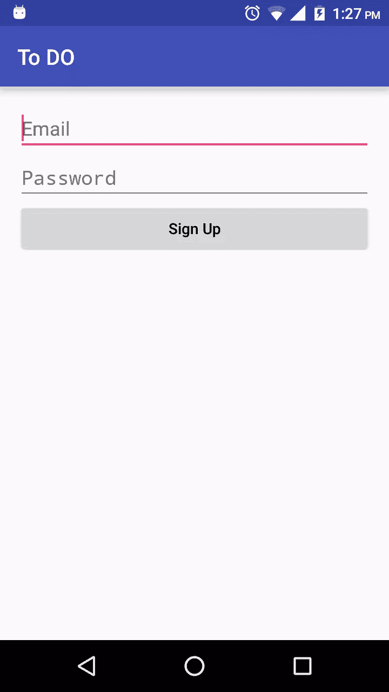

注册一个账户。默认情况下，firebase 会对数据进行一些默认验证。例如，您的密码必须至少有 6 个字符长。

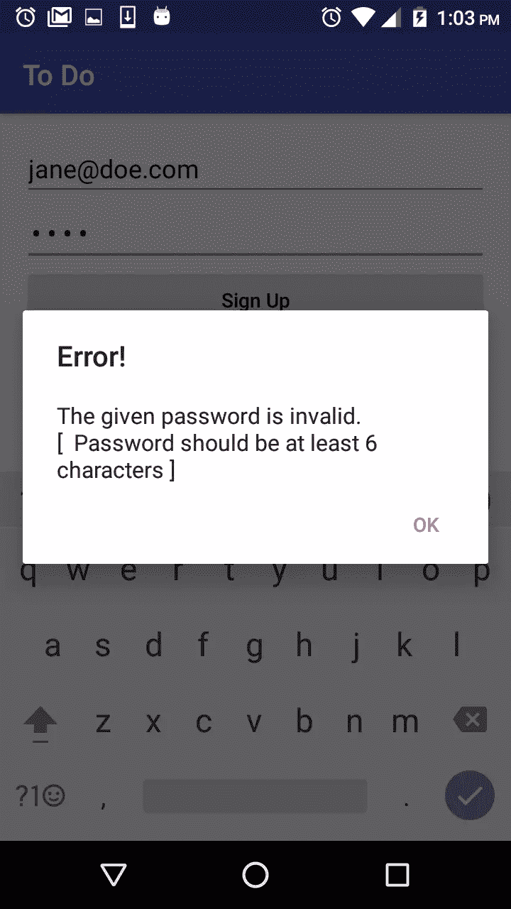

如果你也试图注册一个无效的电子邮件，你会得到以下错误。

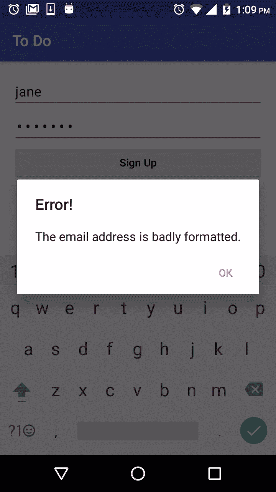

如果注册成功，您将被定向到主活动。如果您查看 Firebase 控制台，您应该能够在 *Auth > Users* 下看到创建的用户。

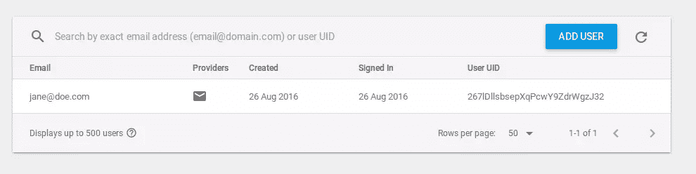

Firebase 团队构建了一个名为 [FirebaseUI](https://github.com/firebase/FirebaseUI-Android) 的开源库，简化了添加身份验证和将通用 UI 元素连接到 Firebase 数据库的过程。阅读文档以了解关于该库的更多信息。

### 授权和数据验证

识别用户只是安全性的一部分。一旦您知道他们是谁，您就需要一种方法来控制他们对您的 Firebase 数据库中的数据的访问。

Firebase 有一种声明性语言，用于指定 Firebase 服务器上的规则，并确定应用程序的安全性。您可以在*数据库>规则*选项卡上编辑它们。

安全规则允许您控制对数据库每个部分的访问。默认情况下，Firebase 的安全规则要求对用户进行身份验证。

```
{
  "rules": {
    ".read": "auth != null",
    ".write": "auth != null"
  }
}
```

Firebase 数据库规则具有类似 JavaScript 的语法，有四种类型:

*   **。read**–描述是否以及何时允许用户读取数据
    。
*   **。写入**–描述是否以及何时允许写入数据。
*   **。validate**–定义格式正确的值的外观，它是否有子属性，以及数据类型。
*   **。indexOn**–指定要索引的子节点，以支持排序和查询。

`.read`和`.write`规则级联，因此下面的规则集授予对路径`/foo/`(也可以将其称为节点`foo`)以及任何更深路径(如`/foo/bar/baz`)的任何数据的读取权限。请注意，数据库中较浅的`.read`和`.write`规则覆盖较深的规则，因此在本例中，即使路径`/foo/bar/baz`处的规则评估为假，对`/foo/bar/baz`的读访问仍将被授予。

```
 {
  "rules": {
    "foo": {
      ".read": true,
      ".write": false
    }
  }
}
```

规则不会级联。

如图所示修改规则并点击*发布*。

```
{
  "rules": {
    "users": {
      "$uid": {
        ".read": "auth != null && auth.uid == $uid",
        ".write": "auth != null && auth.uid == $uid",
        "items": {
          "$item_id": {
            "title": {
              ".validate": "newData.isString() && newData.val().length > 0"
            }
          }
        }
      }
    }
  }
}
```

在上述规则中，`auth != null && auth.uid == $uid`将对`users`节点(及其子节点)上数据的读写权限限制为其`uid`与登录用户的 id(`auth.uid`)相匹配的用户。`$uid`是一个保存该节点值的变量，而不是节点本身的名称。根据这个规则，用户不仅需要通过身份验证才能向节点及其子节点读取或写入任何数据，而且他们只能访问自己的数据。

Firebase 数据库规则包括[内置变量](https://firebase.google.com/docs/database/security/securing-data#predefined_variables)和允许您引用其他路径、服务器端时间戳、认证信息等的函数。您可以使用这些变量和函数来构建表达性规则。这些变量和函数赋予规则权力和灵活性，允许您引用其他路径、服务器端时间戳等

在 apps 规则中，您使用内置变量`auth`。该变量在用户通过身份验证后填充。它包含有关用户的数据，包括`auth.uid`，这是一个唯一的字母数字标识符，适用于所有提供商。

可用的变量有:

*   **现在**–自 Linux 纪元以来的当前时间，以毫秒为单位。这对于验证用 SDK 的`firebase.database.ServerValue.TIMESTAMP`创建的时间戳特别有效。
*   **root**–一个 [RuleDataSnapshot](https://firebase.google.com/docs/reference/security/database/#ruledatasnapshot) ，表示在尝试操作之前 Firebase 数据库中存在的根路径。
*   **new data**–一个 [RuleDataSnapshot](https://firebase.google.com/docs/reference/security/database/#ruledatasnapshot) ，表示尝试操作后将存在的数据。它包括正在写入的新数据和现有数据。
*   **数据**–一个 [RuleDataSnapshot](https://firebase.google.com/docs/reference/security/database/#ruledatasnapshot) ，表示数据在尝试操作之前的状态。
*   **$ variables**–用于表示 id 和动态子键的通配符路径。
*   **auth**–表示经过身份验证的用户的令牌有效负载。

Firebase 以 JSON 格式存储数据。在我们的数据库中，每个用户都有一个名为`items`的待办事项数组。每个`item`都会有一个`title`。在上面的代码中，您添加了一些数据验证，以确保写入到 */users//items* 的数据必须是长度大于 0 个字符的字符串。因此，`title`为空的`item`不会被保存。

确保您点击了*发布*按钮，否则规则不会被保存。您应该会看到一条“规则已发布”的消息。

验证规则很棒，但它们不应该取代应用程序中的数据验证代码。您仍然应该验证应用程序中的输入以提高性能。

## 保存和检索数据

将以下变量添加到`MainActivity`:

```
private DatabaseReference mDatabase;
private String mUserId;
```

然后如图所示更改`onCreate()`。

```
@Override
protected void onCreate(Bundle savedInstanceState) {
    super.onCreate(savedInstanceState);
    setContentView(R.layout.activity_main);
    Toolbar toolbar = (Toolbar) findViewById(R.id.toolbar);
    setSupportActionBar(toolbar);

    // Initialize Firebase Auth and Database Reference
    mFirebaseAuth = FirebaseAuth.getInstance();
    mFirebaseUser = mFirebaseAuth.getCurrentUser();
    mDatabase = FirebaseDatabase.getInstance().getReference();

    if (mFirebaseUser == null) {
        // Not logged in, launch the Log In activity
        loadLogInView();
    } else {
        mUserId = mFirebaseUser.getUid();

        // Set up ListView
        final ListView listView = (ListView) findViewById(R.id.listView);
        final ArrayAdapter<String> adapter = new ArrayAdapter<>(this, android.R.layout.simple_list_item_1, android.R.id.text1);
        listView.setAdapter(adapter);

        // Add items via the Button and EditText at the bottom of the view.
        final EditText text = (EditText) findViewById(R.id.todoText);
        final Button button = (Button) findViewById(R.id.addButton);
        button.setOnClickListener(new View.OnClickListener() {
            public void onClick(View v) {
                mDatabase.child("users").child(mUserId).child("items").push().child("title").setValue(text.getText().toString());
                text.setText("");
            }
        });

        // Use Firebase to populate the list.
        mDatabase.child("users").child(mUserId).child("items").addChildEventListener(new ChildEventListener() {
            @Override
            public void onChildAdded(DataSnapshot dataSnapshot, String s) {
                adapter.add((String) dataSnapshot.child("title").getValue());
            }

            @Override
            public void onChildChanged(DataSnapshot dataSnapshot, String s) {

            }

            @Override
            public void onChildRemoved(DataSnapshot dataSnapshot) {
                adapter.remove((String) dataSnapshot.child("title").getValue());
            }

            @Override
            public void onChildMoved(DataSnapshot dataSnapshot, String s) {

            }

            @Override
            public void onCancelled(DatabaseError databaseError) {

            }
        });
    }
}
```

使用`FirebaseDatabase.getInstance().getReference()`创建对数据库根节点的引用。然后在 *Add New Item* 按钮上设置一个监听器，当点击它时会将数据保存到 Firebase。

有四种方法可以将数据写入 Firebase 实时数据库:

*   **setValue()**–将数据写入或替换到定义的路径，如`users/<user-id>/<username>`。
*   **push()**–添加到数据列表中。每次调用`push()`，Firebase 都会生成一个惟一的键，这个键也可以作为惟一的标识符，比如`user-posts/<user-id>/<unique-post-id>`。
*   **Update children()**–更新已定义路径的一些关键字，而不替换所有数据。
*   **run transaction()**–更新可能被并发更新破坏的复杂数据。

在我们的代码中，数据通过以下方式保存:

```
mDatabase.child("users").child(mUserId).child("items").push().child("title").setValue(text.getText().toString());
```

如果指定的节点存在，则获取对它的引用；如果不存在，则创建它。以上将把输入的文本保存在路径`/users/<user id>/items/<item id>/title`中。`.push()`使用唯一键生成新的子位置。您使用它为每个添加的`item`生成一个唯一的密钥。`.setValue()`将数据写入或替换到定义的路径。

要从 Firebase 检索数据，使用`addChildEventListener()`向数据库引用添加一个监听器。您可以监听以下检索数据的事件类型:

*   **ValueEventListener**:**on datachange()**读取并监听路径的全部内容的变化。
*   **child event listener**:**on child added()**–检索项目列表或监听项目列表的添加内容。建议与`onChildChanged()`和`onChildRemoved()`一起使用，以监控列表的更改。
*   **child event listener**:**onChildChanged()**–监听列表中项目的变化。与`onChildAdded()`和`onChildRemoved()`一起使用，监控列表的更改。
*   **child event listener**:**on child removed()**–监听从列表中删除的项目。与`onChildAdded()`和`onChildChanged()`一起使用，监控列表的更改。
*   **child event listener**:**on child moved()**–监听有序列表中项目顺序的变化。`onChildMoved()`事件总是跟随导致项目顺序改变的`onChildChanged()`事件(基于您当前的排序方式)。

我们的简单应用程序只允许在列表中删除或添加项目，所以分别使用`onChildRemoved()`和`onChildAdded()`。

监听器接收到一个`DataSnapshot`，它是数据的快照。快照是 Firebase 数据库中特定位置的数据在单个时间点的图片。在快照上调用`getValue()`会返回数据的 Java 对象表示。`getValue()`返回的可能类型有`Boolean`、`String`、`Long`、`Double`、`Map<String, Object>`、`List<Object>`。如果该位置不存在数据，快照将返回`null`，在尝试使用数据之前最好检查一下`null`。最后，将检索到的数据添加到列表视图。

如果您运行应用程序并添加一些项目，它们将被添加到列表和数据库中。

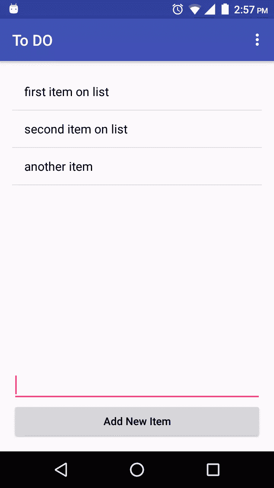

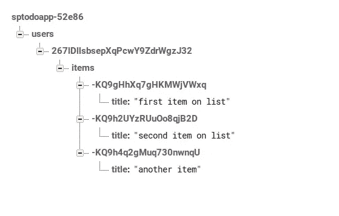

您可以从 Firebase 控制台添加数据，方法是单击节点上的绿色 *+* 控件并输入数据。只要确保你以正确的格式输入数据，否则 Android 应用程序在试图读取数据时会崩溃。在生产应用程序中，您应该添加验证，以确保它在获得错误数据时不会崩溃。

要从控制台添加物品，点击*物品*节点上的 *+* ，将以下内容添加到*名称*字段。你得输入完整路径*//标题*。

```
/123/title
```

将“这是使用控制台添加的”添加到*值*字段，并点击*保存*。

该项目将被添加到数据中，如果您查看您的 Android 应用程序，列表将会自动更新该项目。

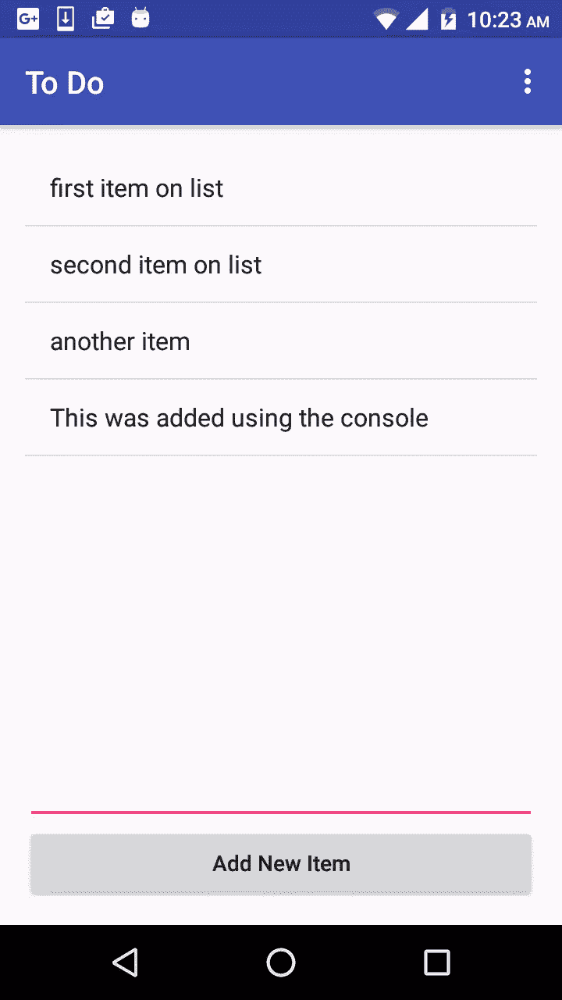

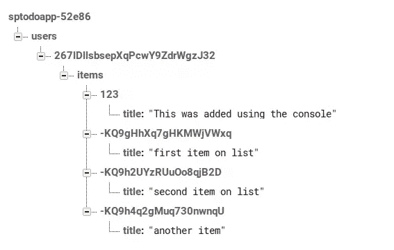

当前应用程序向服务器发送一个`String`。这是可行的，但是对于一个更复杂的应用程序，你的模型对象会更复杂。

Firebase 允许您传递您自己的定制 Java 对象，以便用`DataSnapshot.getValue()`将数据读入到一个对象中，前提是定义它的类有一个默认的构造函数，该构造函数不接受任何参数，也不接受要分配的属性的公共 getters。关于这个[的更多信息，请查看文档](https://firebase.google.com/docs/database/android/save-data#basic_write)。

要查看实际情况，创建一个名为`Item`的类，并将其更改为:

```
package com.echessa.todo;

/**
 * Created by echessa on 8/27/16.
 */
public class Item {

    private String title;

    public Item() {}

    public Item(String title) {
        this.title = title;
    }

    public String getTitle() {
        return title;
    }

    public void setTitle(String title) {
        this.title = title;
    }
}
```

将*添加新项目*按钮的点击监听器更改为:

```
button.setOnClickListener(new View.OnClickListener() {
    public void onClick(View v) {
        Item item = new Item(text.getText().toString());
        mDatabase.child("users").child(mUserId).child("items").push().setValue(item);
        text.setText("");
    }
});
```

它使用一个`Item`对象将数据保存到数据库中。`Item`的内容以嵌套的方式映射到子位置。运行应用程序，您应该仍然能够将数据添加到列表中，并在服务器控制台上查看保存的数据。

## 删除数据

您的应用程序现在可以保存数据并检索数据以填充列表视图。接下来，它需要允许用户从列表和 Firebase 中删除项目。

将以下内容添加到`MainActivity`类的`onCreate()`中的`else`块的底部:

```
// Delete items when clicked
listView.setOnItemClickListener(new AdapterView.OnItemClickListener() {
    public void onItemClick(AdapterView<?> parent, View view, int position, long id) {
        mDatabase.child("users").child(mUserId).child("items")
                .orderByChild("title")
                .equalTo((String) listView.getItemAtPosition(position))
                .addListenerForSingleValueEvent(new ValueEventListener() {
                    @Override
                    public void onDataChange(DataSnapshot dataSnapshot) {
                        if (dataSnapshot.hasChildren()) {
                            DataSnapshot firstChild = dataSnapshot.getChildren().iterator().next();
                            firstChild.getRef().removeValue();
                        }
                    }

                    @Override
                    public void onCancelled(DatabaseError databaseError) {

                    }
                });
    }
});
```

这将在列表视图上设置一个 onclick 监听器，并在点击一个项目时查询数据库。它在 Firebase 数据库中搜索标题与点击位置的字符串相同的项目。对于一个更复杂的应用程序，你可能想搜索对象特有的东西，比如 id。然后，它从数据库中删除该项的第一个匹配项。listview 会自动更新。

运行该应用程序，你就可以在 Android 应用程序中点击某个项目来删除它。

## 注销用户

调用`signout()`会使用户的令牌失效，并将他们从您的应用中注销。更改`onOptionsItemSelected()`中的以下行。这将注销用户并将他们重定向到登录视图。

```
if (id == R.id.action_logout) {
    mFirebaseAuth.signOut();
    loadLogInView();
}
```

## 结论

在本教程中，您学习了如何使用 Firebase 来管理您的 Android 应用程序的用户数据。这是一个介绍性的教程，Firebase 提供了许多未涉及的特性，您可以在[文档](https://firebase.google.com/docs/)中进一步探索。

*我很乐意听到您对在您的应用中使用 Firebase 的评论、想法和体验*。

## 分享这篇文章