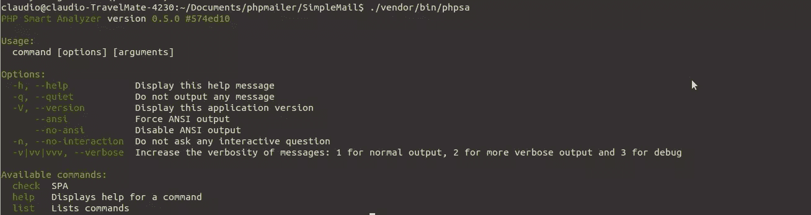
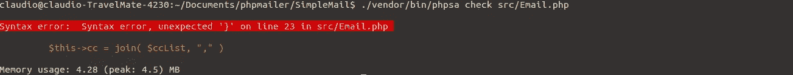

# 用 PHPSA 进行静态分析:PHP 智能分析器

> 原文：<https://www.sitepoint.com/static-analysis-with-phpsa-php-smart-analyzer/>

无论您是独自工作还是在团队中工作，无论是小项目还是大项目，有一个需求永远不会改变，那就是代码质量。项目和团队越大，维护起来就越困难。


减缓难度增加的一个好方法是使用静态分析工具。静态分析是在不实际执行程序的情况下分析软件的过程——一种自动代码审查。静态分析工具将检测常见错误，执行编码标准，甚至清理代码块。`php -l filename`的日子还没有结束，但是我们现在有很多很棒的工具，在帮助我们创建和维护高质量代码方面做得更多。

说到`php -l filename`，一个很好的 PHP lint，它将对目标文件执行语法分析，并输出它发现的任何错误。我曾经有一小段代码，我用它断断续续地用 PHP 发送电子邮件。这是我们分析的良好起点。

```
<?php

class Email{

    //Constructor
    function Email( $subject, $message, $senderName, $senderEmail, $toList, $ccList=0, $bccList=0, $replyTo=0 ){

        $this->sender = $senderName . " <$senderEmail>";
        $this->replyTo = $replyTo;
        $this->subject = $subject;
        $this->message = $message;

        // Set the To recipients
        if( is_array($toList)){
            $this->to = join( $toList, "," );
        }else{
            $this->to = $toList;
        }

        // Set the cc list
        if( is_array($ccList) && sizeof($ccList)){
            $this->cc = join( $ccList, "," );
        }else{
            $this->cc = $ccList;
        }

        // Set the bcc list
        if( is_array($bccList) && sizeof($bccList)){
            $this->bcc = join( $bccList, "," );
        }else{
            $this->bcc = $bccList;
        }
    }

    function sendMail(){

        //create the headers for PHP mail() function
        $this->headers = "From: " . $this->sender . "\n";
        if( $this->replyTo ){
            $this->headers .= "Reply-To: " . $this->replyTo . "\n";
        }
        if( $this->cc ){
            $this->headers .= "Cc: " . $this->cc . "\n";
        }
        if( $this->bcc ){
            $this->headers .= "Bcc: " . $this->bcc . "\n";
        }

        print "To: " . $this->to ."<br>Subject: " . $this->subject . "<br>Message: " . $this->message . "<br>Headers: " . $this->headers;
        return mail( $this->to, $this->subject, $this->message, $this->headers );
    }
} 
```

如你所见，这是一个简单的电子邮件发送类。如果我们在这段代码上运行 PHP lint
,我们会看到一切都很好。

```
php -l Email.php 
```

结果如下:

`No syntax errors detected in Email.php`

在 2016 年，这个结果是不够的，因为我们还需要考虑代码质量和编程标准。

## 输入 PHP 智能分析器


PHPSA 是一个 PHP 的静态分析工具。

`PHPSA`可以安装成`.phar`，或者通过[作曲](https://www.sitepoint.com/php-dependency-management-with-composer/)，像这样:

```
composer require ovr/phpsa 
```

这将创建一个命令行工具，它将被符号链接到我们项目的`vendor/bin`文件夹。

### 使用 PHPSA

安装完成后，我们可以运行`./vendor/bin/phpsa`。



执行上述命令后，我们得到的结果与运行`list`命令的结果相同。`help`命令将列出在 PHPSA 上运行帮助的指令。`check`命令将对指定的文件或文件夹执行静态分析。

因为我们之前运行了 PHP lint，所以预计 PHPSA 不会在我们的代码中发现任何语法错误。但是如果我们故意插入一个错误会发生什么呢？PHPSA 能找到吗？

让我们稍微改变一下我们的邮件类。

```
<?php

class Email{

    //Constructor
    function Email( $subject, $message, $senderName, $senderEmail, $toList, $ccList=0, $bccList=0, $replyTo=0 ){

        $this->sender = $senderName . " <$senderEmail>";
        $this->replyTo = $replyTo;
        $this->subject = $subject;
        $this->message = $message;

        // Set the To recipients
        if( is_array($toList)){
            $this->to = join( $toList, "," );
        }else{
            $this->to = $toList;
        }

        // Set the cc list
        if( is_array($ccList) && sizeof($ccList)){
            $this->cc = join( $ccList, "," )
        }else{
            $this->cc = $ccList;
        }

        // Set the bcc list
        if( is_array($bccList) && sizeof($bccList)){
            $this->bcc = join( $bccList, "," );
        }else{
            $this->bcc = $bccList;
        }
    }

    function sendMail(){
        //create the headers for PHP mail() function
        $this->headers = "From: " . $this->sender . "\n";
        if( $this->replyTo ){
            $this->headers .= "Reply-To: " . $this->replyTo . "\n";
        }
        if( $this->cc ){
            $this->headers .= "Cc: " . $this->cc . "\n";
        }
        if( $this->bcc ){
            $this->headers .= "Bcc: " . $this->bcc . "\n";
        }

        print "To: " . $this->to ."<br>Subject: " . $this->subject . "<br>Message: " . $this->message . "<br>Headers: " . $this->headers;

        return mail( $this->to, $this->subject, $this->message, $this->headers );

    }

} 
```

这一次，我们的代码中有一个明显的语法错误。让我们运行 PHPSA 并检查结果。



正如我们所见，PHPSA 可以快速检测语法错误。但是这些实际上都不是新的，我们简单的 PHP lint 也可以检测到这个错误。所以让我们纠正它，看看 PHPSA 还为我们准备了什么。


现在要看的东西很多！

```
Notice:  Missing docblock for Email() method in src/Email.php on 6 [missing-docblock]

Notice:  join() is an alias of function. Use implode(...). in src/Email.php on 15 [fcall.alias]

Notice:  sizeof() is an alias of function. Use count(...). in src/Email.php on 21 [fcall.alias]

Notice:  Property sender does not exist in Email scope in src/Email.php on 38 [undefined-property] 
```

PHPSA 警告我们许多不同的事情，比上面列出的要多得多。对于只是其他函数的别名、未定义的属性和缺失的文档块的函数，PHPSA 在建议使用更好的编码原则方面做得很好。

让我们修正我们的代码来纠正以上所有问题。

```
<?php

/**
 * Simple email sender class
 *
 */
class Email
{

    /**
     * The email headers
     */
    var $headers;
    /**
     * The email sender
     */
    var $sender;
    /**
     * The email recipients
     */
    var $to;
    /**
     * Reply To
     */
    var $replyTo;
    /**
     * Email cc list
     */
    var $cc;
    /**
     * Email bcc list
     */
    var $bcc;
    /**
     * Email content
     */
    var $message;
    /**
     * The subject of the email
     */
    var $subject;

    /**
     * This is the constructor for the Email class
     */
    function Email(
        $subject,
        $message,
        $senderName,
        $senderEmail,
        $toList,
        $ccList = 0,
        $bccList = 0,
        $replyTo = 0
    ) {

        $this->sender = $senderName . " <$senderEmail>";
        $this->replyTo = $replyTo;
        $this->subject = $subject;
        $this->message = $message;

        // Set the To recipients
        if (is_array($toList)) {
            $this->to = implode($toList, ",");
        } else {
            $this->to = $toList;
        }

        // Set the cc list
        if (is_array($ccList) && count($ccList)) {
            $this->cc = implode($ccList, ",");
        } else {
            $this->cc = $ccList;
        }

        // Set the bcc list
        if (is_array($bccList) && count($bccList)) {
            $this->bcc = implode($bccList, ",");
        } else {
            $this->bcc = $bccList;
        }
    }

    /**
     * The function that actually sends the email
     *
     * @return boolean Returns TRUE if the mail was successfully accepted for delivery, FALSE otherwise.
     */
    function sendMail()
    {

        //create the headers for PHP mail() function
        $this->headers = "From: " . $this->sender . "\n";
        if ($this->replyTo) {
            $this->headers .= "Reply-To: " . $this->replyTo . "\n";
        }
        if ($this->cc) {
            $this->headers .= "Cc: " . $this->cc . "\n";
        }
        if ($this->bcc) {
            $this->headers .= "Bcc: " . $this->bcc . "\n";
        }

        print "To: " . $this->to . "<br>Subject: " . $this->subject . "<br>Message: " . $this->message . "<br>Headers: " . $this->headers;

        return mail($this->to, $this->subject, $this->message, $this->headers);
    }
} 
```

变化不多，但足以让我们理解像`PHPSA`这样的工具有多有用。我们从没有文档记录的、有点马虎的代码，发展到有完整文档记录的、清晰的代码。现在更容易理解代码中每个属性和函数的作用了。现在运行 PHPSA，我们将不会看到任何错误或警告，这意味着我们刚刚给代码增加了另一层质量。

## 结论

PHPSA 是开源的，这意味着我们实际上可以跟踪它的开发，请求功能并为它做出贡献，由于它是一个专注的工具，PHPSA 是快速和轻量级的。此时它仍处于早期 alpha 阶段，这意味着它有时会表现得很奇怪，主要是在不同的操作系统上给出不同的结果。此外，许多功能仍然缺失。

如果我们想要在我们的代码库中执行质量标准，静态分析是一个有价值的工具。当在团队中工作时，它变得更有价值，因为它迫使每个人使用相同的标准。尽管它仍然有点落后于其他一些工具，如[代码嗅探器](http://pear.php.net/package/PHP_CodeSniffer/)或[垃圾检测器](https://phpmd.org/)，PHPSA 是一个非常有用的工具，显示了很多前景。因为覆盖更大范围错误的更好方法之一是结合各种分析工具，所以考虑在 QA 栈中使用 PHPSA。一定要带着它转一圈，也许可以为 github 上的项目[做点贡献，在那里它列出了各种各样的待办事项和计划中的功能。](https://github.com/ovr/phpsa)

你试过 PHPSA 吗？让我们知道你觉得它和其他的相比怎么样！

## 分享这篇文章