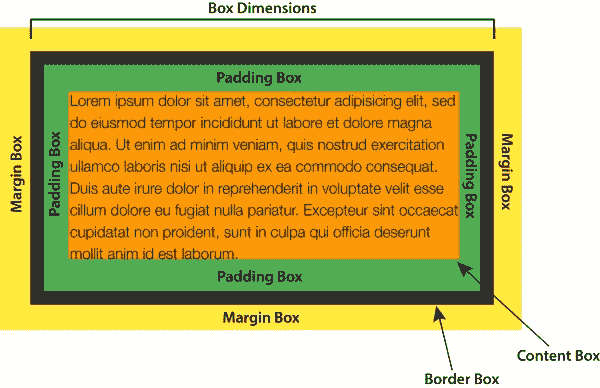
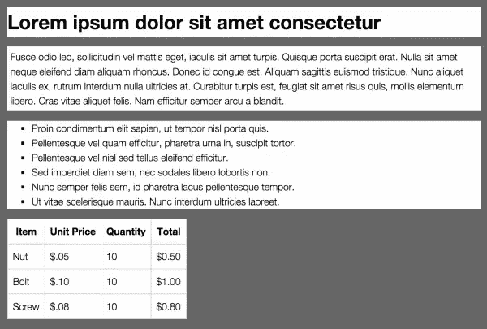
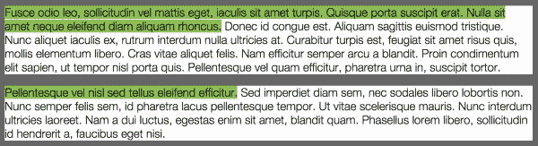
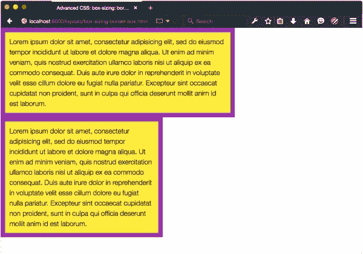
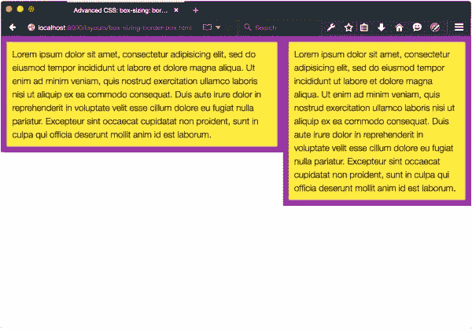

# 管理 CSS 盒子模型

> 原文：<https://www.sitepoint.com/atoz-css-screencast-box-model/>

也许理解 CSS 最重要的一点是:**一切都是一个盒子**。更具体地说，文档中的每个元素都会生成一个框。该框可以是块级框，也可以是行内级框。框类型决定了元素如何影响页面布局。

CSS 盒子模型是一个用来描述 HTML 元素的布局和大小的概念。每个元素都包含一个用于内容、填充、边框和边距的框。 这些框组合起来决定一个元素的内容布局以及相邻元素如何出现在它旁边:



一个元素是否创建一个框以及它创建哪种类型的框取决于标记语言。CSS 是作为一种样式 HTML 文档的方式开发的，因此，CSS 可视化呈现模型的大部分都植根于 HTML 对块级元素和行内元素的区分。默认情况下，`p`和`section`等元素创建块级框，而`a`、`span`和`em`创建内嵌框。另一方面，SVG 不使用盒子模型，所以大多数与布局相关的 CSS 属性都无法与 SVG 一起工作。

**块级**框创建新的内容块，如图 4.1 所示。块级框根据其源顺序垂直呈现，并且(除了表)扩展以填充其包含元素的可用宽度。这就是所谓的**正常流量**。块级框有一个`display value of` `block`、`list-item`、`table`或任意一个`table-*`值(例如`table-cell`)。



图 4.1。包含元素(灰色区域)内具有 h1、p、ul 和表格元素的块级框

**相比之下，内嵌级**盒子不会形成新的内容块。相反，这些盒子组成了块盒中的线。它们水平显示并填满包含框的宽度，如果需要的话可以换行，如图 4.2 所示。内联级框的`display`值为`inline`、`inline-block`、`inline-table`或`ruby`。



图 4.2。应用了边距:1em 和填充:5px 的内嵌框示例

但是盒子的尺寸是怎么算出来的呢？这就是变得更加复杂的地方。如图 4.3 所示，盒子尺寸是盒子内容区域加上填充宽度和边框宽度的总和。边距宽度为该元素创建一个边距框，并影响文档中的其他元素。但是，边距宽度对框本身的尺寸没有影响。


图 4.3。CSS 2.1 盒子模型

例如，带有`width: 300px`、`padding: 20px`和`border: 10px`的`p`元素的计算宽度为 360 像素。这是它的宽度、左右填充和左右`border-width`属性的总和。要创建一个 300 像素宽、20 像素填充、10 像素边框的元素，`width`需要是`240px`。大多数主流浏览器就是这样计算宽度的。

CSS 工作组引入了`box-sizing`属性，部分是为了解决浏览器的竞争模型。它让我们选择我们喜欢的盒子模型实现，并在处理响应式设计时极大地简化了计算。

### 用`box-sizing`选择一个盒子模型

`box-sizing`属性在 [CSS 基本用户界面模块 3 级规范中定义。](https://www.w3.org/TR/css3-ui/#box-sizing)有两个可能的值:`content-box`和`border-box`。

最初，`box-sizing`的值是`content-box`。使用该值，设置元素的`width`和`height`属性会影响其内容区域的大小。这符合 CSS 2.1 规范定义的行为，也是现代浏览器的默认行为(如图 4.4 所示)。

将`box-sizing`的值设置为`border-box`创造了一点魔力。现在，`width`和`height`的值将应用于外部边界边缘，而不是内容区域。边框和填充绘制在元素框内，与旧的 Internet Explorer 5.5 行为相匹配。让我们看一个混合了百分比宽度和`px`单位的填充和边框的例子:

```
<div class="wrapper">
<article>
<h2>This is a headline</h2>
<p>Lorem ipsum dolor sit amet, consectetur adipisicing ... </p>
</article>
<aside>
<h2>This is a secondary headline</h2>
<p>Lorem ipsum dolor sit amet, consectetur adipisicing ... </p>
</aside>
</div>
```

我们的`article`和`aside`元素都应用了以下 CSS，这给出了如图 4.5 所示的布局，其中第一个元素的宽度为 60%，而第二个元素的宽度为 40%:

```
article, aside {
background: #FFEB3B;
border: 10px solid #9C27B0;
float: left;
padding: 10px;
}
article {
width: 60%;
}
aside {
width: 40%;
}
```



图 4.5。具有框大小的元素:内容框

默认情况下，`aside`和`article`的`box-sizing`值都为`content-box`。`border-width`和`padding`值为每个元素的宽度增加了 40 个像素，这大大消除了 60%/40%的分割。现在让我们将`box-sizing: border-box`添加到`article`和`aside`元素中:

```
article, aside {
box-sizing: border-box;
}
```

您可以在图 4.6 中看到变化:元素具有相同的宽度，但是`box-sizing: border-box`意味着宽度包括边框和填充。因为`width`属性应用于边框边缘而不是内容区域，所以我们的元素现在是并排的。



图 4.6。具有框大小的元素:边框-框。

我建议你在项目中使用`box-sizing: border-box`。这让生活变得更容易，因为不需要计算`width`值来说明`padding`和`border`的值，并且盒子的行为更加可预测。

应用`box-sizing: border-box`的最佳方式是使用重置规则。下面的例子来自 Chris Coyier 的 CSS-Tricks 帖子，[继承了`box-sizing`可能稍微好一点的最佳实践](https://css-tricks.com/inheriting-box-sizing-probably-slightly-better-best-practice/):

```
html {
box-sizing: border-box;
}

*, *:before, *:after {
box-sizing: inherit;
}
```

默认情况下，这会将`border-box`大小应用于每个元素，而不会影响项目现有部分的框大小行为。如果你*知道*没有依赖于`content-box`行为的第三方或遗留组件，你可以简化这些规则:

```
*,
*:before,
*:after {
box-sizing: border-box;
}
```

管理盒子模型只是理解如何创建复杂布局的一个要素。

## 分享这篇文章