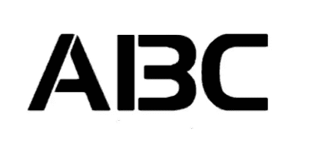
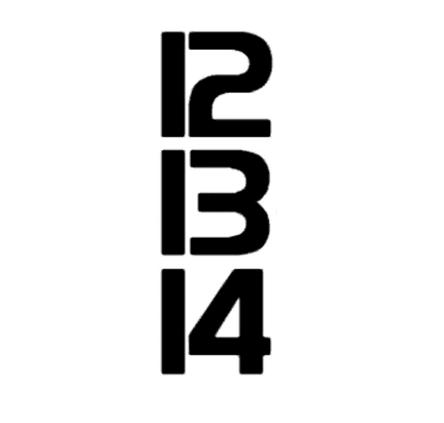
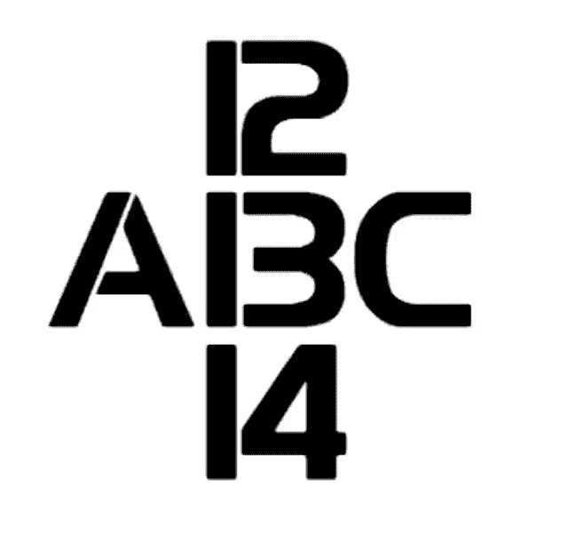
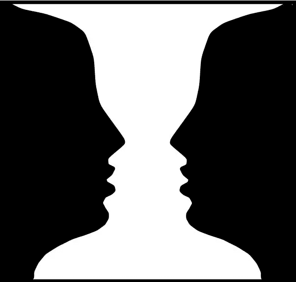
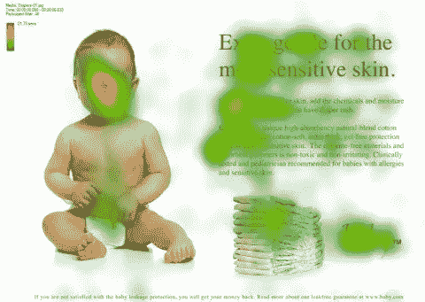
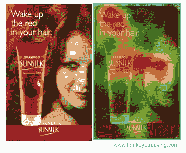

# 做出更好的 UX 决策的 4 个聪明的心理学规则

> 原文：<https://www.sitepoint.com/4-clever-psychology-rules-for-making-better-ux-decisions/>

根据密苏里科技大学的一项研究，超过 94%的用户对网站的第一印象与设计有关。研究还显示[高达 88%的人因为可用性问题而不返回网站。](http://blog.uxeria.com/en/15-statistics-that-will-convince-your-boss-to-invest-in-ux/)

如果你认为设计一个网站所需要的只是良好的技术和美学技巧，请三思。而审美固然重要(这是 2016！)，它不是网站的唯一组成部分——事实上，它甚至不是最重要的。可用性至关重要，在设计网站时牢记以下心理学规则，将会使网站更加强大。

## 规则 1:在 UX
，背景就是一切

你在上面看到了什么？数字还是字母？`13`还是`B`？

仔细看看上面的图像。你看到了什么？`A B C`对吧？好吧，看看下面的图片:

你可能正在看`12, 13, 14`，对吗？

下面是上面两张图片的原始图片:

*[形象功劳](http://brainden.com/word-illusions.htm)*

在第一个例子中，根据你以前的经验或先入为主的观念，你要么看到`13`要么看到`B`。在第二个例子中，你极不可能看到`A 13 C`，因为有争议的`B`之前的`A`和之后的`C`影响了你对它的感知。换句话说，你最确定的是`B`，而不是`13`。

然而，在第三个例子中，你极不可能看到`12 B 14`，因为`12`和`14`已经影响了你对事物的感知——如果`12`排在第一位而`14`排在最后，当然，中间有争议的“事物”一定是`13`而不是`B`，对吗？

虽然上面的例子更直接一点，但这里有一个更微妙的例子:

[图像信用](http://www.nature.com/nature/journal/v408/n6809/fig_tab/408154a0_F1.html)

在上图中，你看到的是两张脸还是一个花瓶？

如果你最近的经历是和人类在一起，你可能会看到两张脸，如果你花了很多时间和花瓶在一起，你可能会看到一个花瓶。

本节中使用的示例解释了[感知集合理论](http://www.simplypsychology.org/perceptual-set.html)。

在心理学中，知觉集合论是我们基于预期和我们可能已经拥有的信息，以某种方式感知信息的倾向。感知集通常受到文化、背景或我们之前接触到的其他信息/情境的影响。

感性集合的好处是它可以被影响；对于本节中显示的第二个图像，如果只显示了 12 和 14，您会自动假定有争议的“数字”是 13。如果你看到 A 和 B，你会自动假设有争议的“字母”是 B。但是，如果你只看到有争议的数字/字母，你会看到一个数字或字母，这取决于你的经验和现有的先入之见。

那么，这如何应用到你的网站设计中呢？

### UX 原则:不要为了新鲜感、酷感或乐趣而打破既定的 UX 模式

对于有创造力的人来说，想要从你所处的环境中创新和改变事物是很常见的。但是这种创新会扼杀你网页设计的转化。当人们访问一个网站时，他们希望某些元素出现在特定的位置或顺序。

例如，当你设计一个要求他们的姓名和电子邮件的表单时，他们希望先询问姓名，然后再发送电子邮件。这些都是由于反复接触这些东西而在他们头脑中形成的先入为主的观念，重要的是不要篡改这些观念(或者肯定不是没有一个非常好的理由)。

当你 ***do*** 决定创新时，一定要包括线索和指南，让人们容易确切地知道新元素代表什么——这就是 UX101。

## 规则 2:图像定位会分散用户的注意力

没有视觉效果的网页设计是不完整的，但是——无论你使用的是普通照片还是真实图像——在网页设计中使用图像并不像大多数人想象的那么简单。

看看下面的例子:

然后看看这个:

两个图像包括相同的副本，并为相同的产品做广告。唯一改变的是宝宝的形象定位；在最初的例子中，婴儿被要求向前看。结果，更多的人把目光集中在了婴儿身上。然而，在第二个例子中，婴儿被要求侧视；作为回报，相当多的人将目光转向侧面——这正是婴儿的目光所指向的方向。

这里还有两个验证同一原理的例子:

下图显示了照片中的女士注视着你:

下图显示了照片中的女士注视着产品:

[图像信用](https://www.quicksprout.com/2013/08/01/7-conversion-optimization-lessons-learned-from-eye-tracking/)

这如何应用到你的网站设计中？

### UX 原则:确保你对图片的使用是战略性的

错误的图像使用会分散人们对你试图让他们注意到的信息的注意力，从而大大降低你在这个过程中的转化率。

当你在网页设计中使用图片时，意识到定位的力量是很重要的；聚焦于页面上的副本的人的图像引导人们聚焦于该副本。登录页面上指向注册表单的箭头告诉人们注意那个注册表单。不要简单地使用图像，要确保你使用的图像能引导人们准确地聚焦在你希望他们聚焦的地方。

## 规则 3:避免激烈的重新设计——使用渐进和微妙的方法

为什么最大、最成功的网站[很少进行重大的重新设计](http://www.pcmag.com/slideshow/story/320360/10-years-later-facebook-s-design-evolution/)？为什么每当主要网站进行重新设计[时，几乎总是会有大规模的抨击](https://www.buzzfeed.com/tommywilhelm/the-facebook-timeline-of-facebook-backlashes?utm_term=.ndrjnWvOkA#.wh9G8Y1456)？

这可以用[韦伯定律](http://apps.usd.edu/coglab/WebersLaw.html)解释。韦伯定律指出“可察觉差异的大小是原始刺激值的恒定比例”，其中*可察觉差异*是“刺激强度必须改变的最小量，以产生感官体验的显著变化。”

更简单地说，韦伯定律指出，你不会总是注意到事物的细微变化；例如，如果你举起一个重 10 公斤的物体，如果你增加 0.1 公斤的重量，你不会很容易注意到有什么不同。然而，如果你额外增加 1 公斤，差别就很明显了。在这种情况下，增加的额外重量(1 公斤)使举起物体的人注意到差异，这被称为差异阈值。

同样的原则也可以用于有效的网页设计；当脸书、推特、谷歌或其他一些主要网站进行大规模重新设计时，通常会遭到强烈反对。

心理学证明，我们不喜欢变化——尤其是剧烈的变化。2010 年发表的一项研究发现，我们往往对已经存在很久的东西有强烈的偏好；研究发现，学生更喜欢已经存在很久的旧课程要求，即使新的课程要求对他们来说意味着更少的课程工作。研究还发现，东西放置的时间越长越好。我们对变化的强烈抵制可以与进化和我们的生存本能联系起来；我们已经进化到在一致性中寻找安全，所以我们抵制任何其他东西。

这如何应用到你的网站设计中？

### UX 原则:让重新设计渐进而微妙。

像谷歌、脸书等各大网站都搞清楚了([一些](http://www.thewrap.com/twitter-removes-background-images-sparks-funny-furious-backlash/)、[硬来](https://techcrunch.com/2009/03/19/facebook-polls-users-on-redesign-94-hate-it/)！)，改变在潜移默化、循序渐进的时候更好。

不要过早推出一个完整的网站重新设计；逐步改变各种元素，在此过程中积极收集反馈。如果你想引入一个过于激进的重新设计，首先对一小部分用户进行分割测试。观察他们的反应，并让这影响你如何向普通用户推出设计。

## 规则 4:使用字体来减轻读者的情绪

心理学对字体大小有什么看法？字体小一点还是大一点好？

2012 年的一项研究发现字体大小很重要，较大的字体会在读者中引发更强烈的情感联系。有趣的是，[专家建议](http://www.sciencebuddies.org/science-fair-projects/project_display_board_fonts.shtml)不要使用小于 16px 的字体来显示内容。

也就是说，研究没有发现字体大小在阅读理解上有任何差异，但是易读和简单的字体(大字体不是更易读吗？)被发现可以让指令看起来更容易执行，同时,[可以改善阅读指令的人的情绪。](http://affect.media.mit.edu/pdfs/05.larson-picard.pdf)

理解“扫描路径”的概念也很重要，它解释了我们大脑阅读和处理信息的自然方式:当我们在网上或其他地方阅读内容时，我们的眼睛会遵循一种称为“扫描路径”的自然模式。本质上，我们的眼睛以微小的跳跃阅读内容——在此期间，一切都变得模糊——然后暂停，以便我们的大脑可以对我们正在阅读的字母进行快照，将它们排列成单词并解释其含义。所有这些都发生在一瞬间，所以不可能注意到。这些跳跃被称为迅速扫视，而停顿被称为注视，[两者构成了一条扫描路径](https://24ways.org/2012/science/)。

理解这种阅读内容的自然过程对于理解如何有效地为读者设计是很重要的。扫描路径遵循 Z 形模式，我们通常不会完全“意识到”，直到出现“模式中断”简而言之，如果你想让读者更多地关注你的网页设计中的某些文本元素，它就不能和其他所有东西的字体大小一样。

这如何应用到你的网站设计中？

### UX 原则:使用字体时，简单大字体总是更好

以下是一些在设计中更好地使用字体的技巧:

*   使用简单的字体；任何过于花哨的东西都会使事情变得过于复杂。
*   使用更大的字体；它们不仅使你的内容更容易阅读，还能改善读者的情绪。
*   引入更大/不同的字体，让重要元素凸显出来；整个页面的字体一致性，尤其是你希望人们注意到的设计中的关键元素，会扼杀转换。

## 分享这篇文章