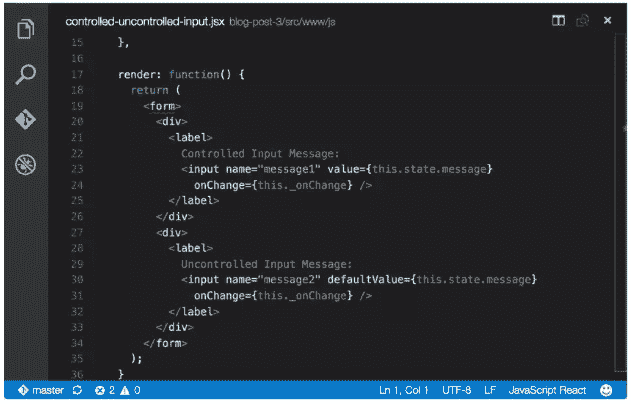

# 探索 React 的状态传播

> 原文：<https://www.sitepoint.com/exploring-reacts-state-propagation/>

本文是微软网站开发系列的一部分。感谢您对使 SitePoint 成为可能的合作伙伴的支持。

一篇早期的文章探讨了 React 组件中的数据。数据由两种结构表示——属性和状态。前者用于表示不可变的数据，而后者表示通过与 UI 的交互或通过其他外部方式改变的数据。

当处理状态数据时，当通过调用`setState`函数改变状态时，UI 被更新。通常，使用事件处理程序调用此函数来响应事件。

在这篇文章中，我们将进一步探讨状态的更新，包括表单输入组件和通过子组件的属性传播状态值。最后，我们将看看由脸书创建的不可变 JavaScript 库，以便理解在组件需要重新呈现时通知 React 的更有效的方法。

## 输入组件

让我们考虑下面的 React 组件，它包含一个带有一个 input 元素的表单，以及一个在 input 元素上注册的 change 事件。

```
 var Message = React.createClass({ 

  getInitialState: function() { 
    return { message: this.props.message }; 
  }, 

  _messageChange: function(e) { 
    this.setState({ message: e.target.value }); 
  }, 

  render: function() { 
    return ( 
      <div> 
        <span>Message: {this.state.message}</span> 
        <br /> 
        Message: <input type="text" value={this.state.message} onChange={this._messageChange} /> 
      </div> 
    ); 
  }, 

}); 
```

当用户在文本输入框中输入文本时，将执行一个 change 事件处理程序，从 textbox 中捕获值，然后更新状态。对于这个例子，变更事件处理程序是`_messageChange`。如果没有注册`onChange`事件处理程序，那么该字段将被读取，但是`state`不会用输入数据更新。在 React 中，输入控件不会自我更新，它们会更新`state`，然后`state`触发重新渲染来更新输入控件。从表面上看，这种方法似乎有点复杂，但它是 React 始终保持组件的`state`与 DOM 同步的关键。

标准的 HTML 表单输入控件如 *input* 、 *select* 和 *textarea* 元素被 React 视为输入组件。因为这些控件可以更改值，所以 React 提供了一种受控的机制，通过这种机制，控件可以被初始化、接收输入并被更新以反映 UI 中的输入。



输入组件可以是*控制的，也可以是*不控制的。React 通过`value`和`onChange`属性管理受控组件。当用户在 input 元素中输入文本时，执行注册的`onChange`事件处理程序，输入的文本通过 events 对象作为参数传递。文本参数用于更新`state`，然后通过`props`传递回受控组件。如前所述，设置了 value 属性但没有`onChange`属性的表单组件将是只读的。

那么为什么输入组件是只读的呢？如前所述，对于受控输入组件，输入控件本身不会通过与其交互而直接更新。change 事件不是被直接更新，而是被触发。若要捕获新值，必须处理此事件，并使用传递的事件对象来访问新值。然后，新值用于更新输入组件的父组件的`state`。在上面的例子中，这个父组件是`Message`。调用父组件的`setState`函数重新呈现输入组件，更新后的状态值通过其`props`传递回输入组件。为什么采用这种方法？视图(在本例中是 DOM)和 React 组件的状态必须始终相同，这在使用传统的不受控制的输入元素时是不可能的。

考虑下面的非 React 代码。

```
 <main> 
  <input name="message" value="Hello World!"> 
  <button>Get Value!</button> 
</main> 
```

当用户在`input`控件中输入文本时，`input`控件将显示输入的文本。用户在`input`控件中输入文本后，点击`button`，你认为输出会是什么？

```
 document.getElementsByTagName("button")[0].addEventListener("click", function() { 

  console.log(document.querySelector("[name='message']").getAttribute("value")); 

}); 
```

有趣的是，输出是**而不是**输入到框中的更新文本，而是`input`控件呈现时属性的原始值。当显示更新的文本时，DOM 现在与`input`控件的`state`不同步。

要查看此操作，请尝试以下代码笔。

参见 [CodePen](http://codepen.io) 上 SitePoint ( [@SitePoint](http://codepen.io/SitePoint) )的笔 [React.js 不受控制的输入演示](http://codepen.io/SitePoint/pen/zBjXrw/)。