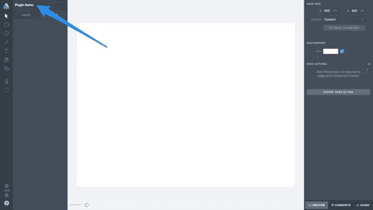
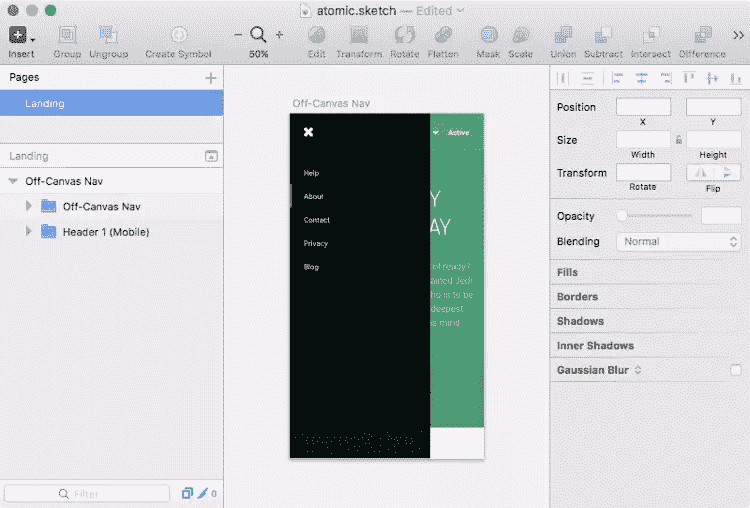
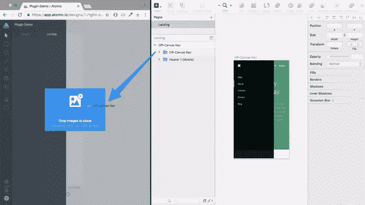
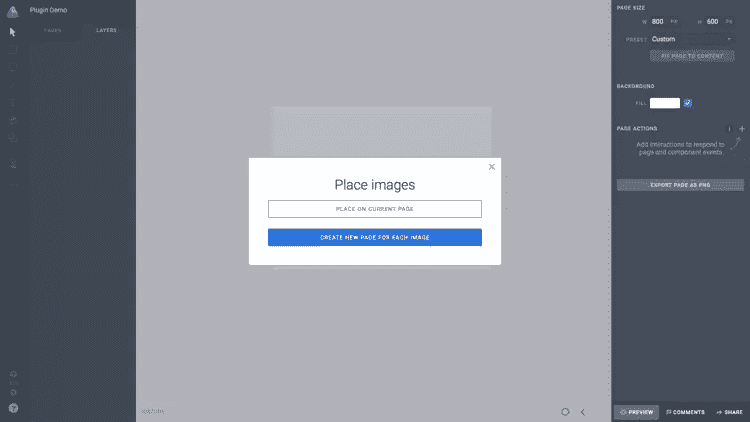
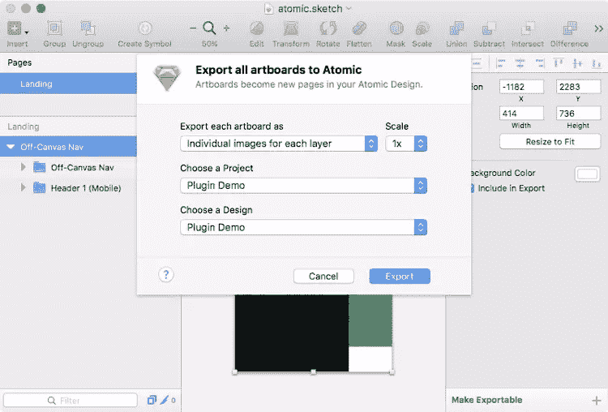
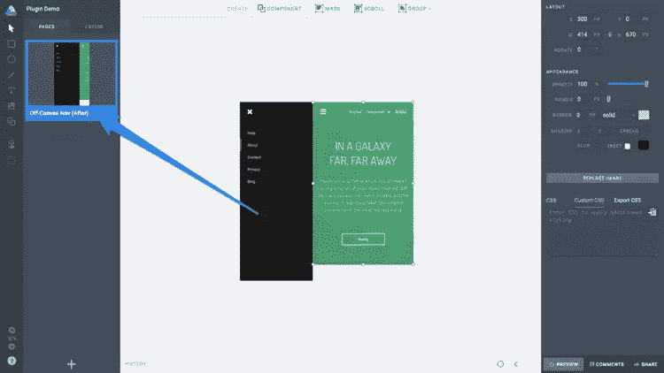
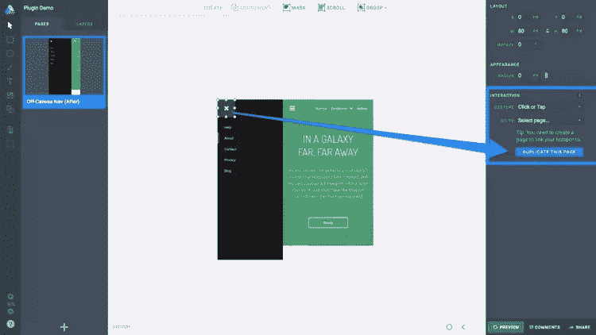
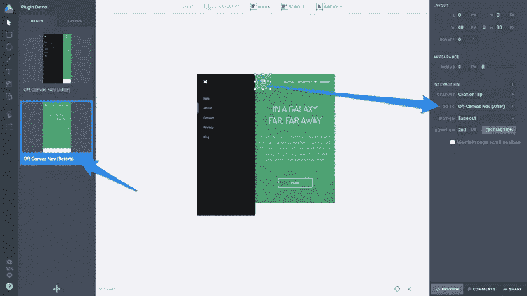

# 搭配 Atomic.io 的 Sketch App 是完美的 UI 设计二人组吗？

> 原文：<https://www.sitepoint.com/is-sketch-app-with-atomic-io-the-perfect-ui-design-duo/>

Atomic 是一个为交互和用户流建立原型的网络应用——它可以做任何事情，从简单的过渡到微调的动画。自从我[上一次写关于 Atomic](https://www.sitepoint.com/handle-complex-animations-with-atomic-io/) 的文章以来，这个应用程序已经变得非常成熟，在用 Sketch 进行设计时可以适应更简化的工作流程；通过直接从层列表中拖动层，或者通过使用新的草图原子插件，增加从草图导入层到原子的能力。

让我们来看看这两种方法。

由于 Atomic 是一款网络应用，因此不存在如今许多应用似乎强制执行的仅限 Mac 的限制。订阅从每月 15 美元开始，但是为了这个教程，我们将滥用免费试用。

## 为协作准备草图和原子图

假设你已经创建了你的免费原子账户，从主屏幕选择“新建项目”，然后选择“新建原型”。我们现在有一个空白的画布，等待一个. sketch 设计导入其中——但这是从 Sketch 内部实现的。现在，使用左上角的输入字段为您的画布命名。

### Atomic 如何影响草图中的工作流程

制作动画和用户流的原型涉及到创建一个之前和之后的状态(即交互之前和之后的样子)。尽管你完全可以在 Atomic 中完成这项工作(因为它也有绘图和设计功能)，但 Sketch 是我的头号设计工具，所以我喜欢把我的大部分工作流程放在那里——我相信许多其他设计师也会同意这一点。

我想演示一下当用户点击汉堡包图标时，一个非画布菜单是如何显示出来的。在“草图”中展平层时，出现在画板边界之外的任何区域都会被裁剪掉，因此您应该确保所有层在画布上都可见。在这种情况下，在导出到 Atomic 之前，离画布菜单需要在 -canvas 上*。*

注意:如果你*想要在 Atomic 中设计和绘制，键盘快捷键与 Sketch 非常相似——这样做的好处是图层会保留它们类似矢量的品质，而不是在导出过程中变平。*

## 将展平的屏幕从草图拖到原子图

关于画板和页面的快速说明:当您将画板从 Sketch 导出到 Atomic 时，Atomic 将它们称为页面；这可能会令人困惑，因为 Sketch 也使用页面。综上所述，**Sketch 中的画板就是 Atomic 中的一页**。

您可以将画板**直接从草图中的层列表**、*拖动到*原子中。如果您只是拖动一个画板，Atomic 会将其视为一个简单的层，因此您需要在编辑器中选择“适合页面内容”选项。

如果您要将多个画板拖到 Atomic 中，请选择“为每个图像创建新页面”选项，让 Atomic 自动将您的屏幕分类到单独的 Atomic 页面中。

> "那似乎很容易，我们不能就这么做吗？"

你 ***可以***——但不幸的是，这种方法展平了你的画板，这意味着你必须按原样使用它们。当然，只要你是将屏幕作为一个整体来制作动画，而不是制作一个单独层的动画，这是没问题的。如果你想要一个更加*粒度*的导出，Sketch 的原子插件绝对是你要找的。

## 使用草图插件导入以获得更高的保真度

为了将高保真设计(其中只有单独的层被展平)导出到 Atomic 中，您需要安装用于草图的 Atomic 插件；这样做的额外好处是，您可以设置特定层的动画，可以选择为每个层选择不同类型的动画。

首先为 Sketch 安装 [Atomic 插件(这相当简单),并删除我们之前导入的页面——这一次，我们希望导入艺术板的所有自然之美。](https://atomic.io/sketch/)

完成后，点击 **command+option+O** 键盘快捷键将所有画板导出到 Atomic。除了可以指定分辨率(@1/@2x/@3x)之外，您还可以选择保真度。您可以按原样导入设计(高保真，无论图层嵌套有多深，您都可以选择图层)，或者您可以仅展平组(高保真，但不完全展平)。

使用“每层单独的图像”选项导入。

## 设置舞台

我们的“after”状态现在已经被导入到 Atomic 中，但是因为我想在汉堡包菜单被交互时整个屏幕都移动，我们需要移动内容的主体。如您所见，我也相应地重命名了页面。

## 定义互动热点

为*热点*按下 **H** ，并在`x`图标上将其拉出，就像你在画一个矩形一样，有效地定义了一个可以交互的矩形区域。之后，从侧边栏观察交互设置。您可以将*手势*保留为默认选项，即“点击或轻敲”。

## 制作动作

我们真正需要指定的是“转到”设置，它描述了当前页面将转换到的内容。如果您选择“复制此页面”，您将能够创建我们已经拥有的内容的副本，包括我们定义的热点。

我们需要做四件事:

1.  将此页面重命名为“画布外导航(之前)”
2.  相应地移动图层，描绘“导航打开”状态
3.  从编辑器中选取一个“运动”设置
4.  确保两个页面中的热点设置一致

*提示:“编辑动作”按钮将允许你使用类似 Flash 或 After Effects 的时间轴来创建更高级的动画—[我在 2015 年 12 月报道过这个](https://www.sitepoint.com/handle-complex-animations-with-atomic-io/)。*

完成后，点击“预览”按钮查看我们的成果。如果你问我，我会觉得很棒！

演示:https://app . atomic . io/d/o 9 FD 2 ofdu 51 I

## 结论

凭借内置的协作工具、共享和反馈选项、在任何设备上预览交互的能力，当然还有可供您使用的设计工具(如果您更愿意坚持使用单个设计应用程序)，Atomic 当然值得一看。

就我个人而言，我喜欢尽可能用草图来记录我的工作流程。然而，Atomic 提供了 Sketch 没有(并且可能永远不会)提供的重要功能——原型制作的魔力。

这是一个引人注目的组合。

## 分享这篇文章