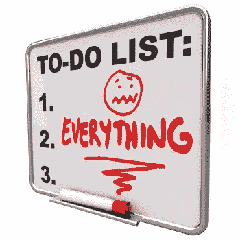
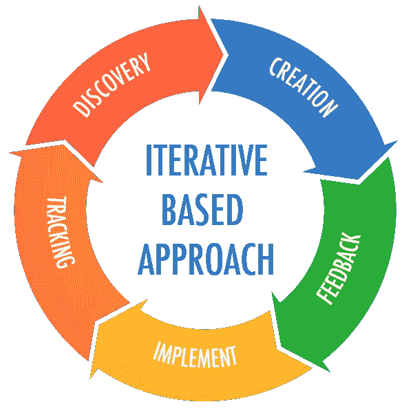
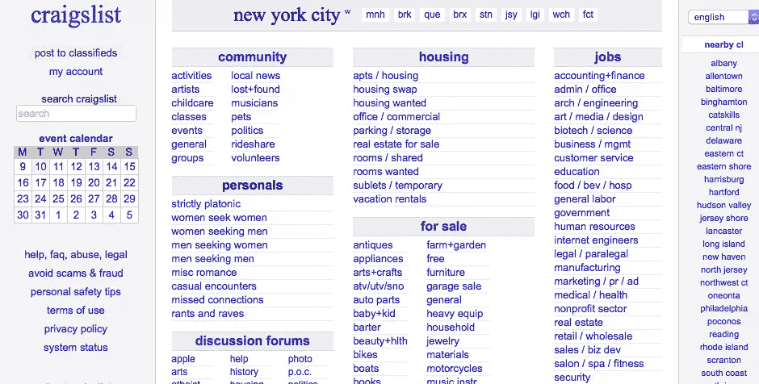
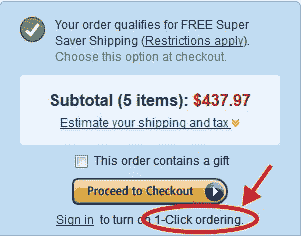
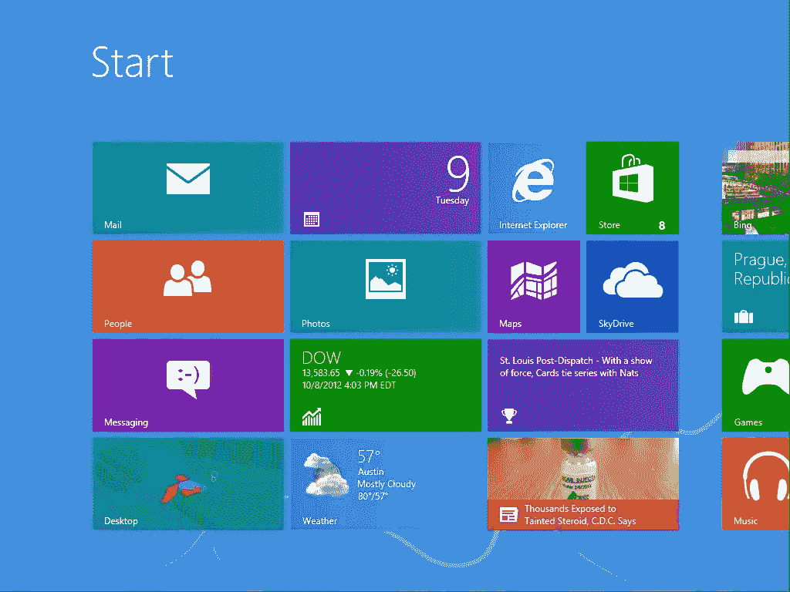

# 压力大的企业家的非传统 UX 智慧

> 原文：<https://www.sitepoint.com/unconventional-ux-wisdom-for-stressed-out-entrepreneurs/>

任何关于用户体验设计(UXD)的快速谷歌搜索都会产生成百上千的文章、博客和书籍。这是有充分理由的:UX 设计是一个复杂且不断发展的领域，需要一定程度的技术和创作严谨性。

看过 UX 博客的你是这样的吗？

最好的用户体验集中于一个长期目标，而设计趋势是千变万化的，所以试图跟上可能会感觉很费力。当你有几十个信誉良好的来源，承诺调整你的下一个项目的提示和技巧时，设计你的数字产品的任务可能会感到更加势不可挡。

你如何避免陷入细节的陷阱，同时仍然感觉自己尽了最大努力？尤其是当你已经掌握了经营企业的所有其他方面时，保持质量和理智是很困难的。

这就是为什么今天我们想提供一些你在其他博客和资源中听不到的 UX 智慧的瑰宝——旨在真正帮助*减少你的选择*并从本应是有趣的追求中释放一些压力的技巧和诀窍。亲自尝试这些，并告诉我们您的想法！

## 1.永远不要忘记:你*可以*以后再修理它。

用户体验设计的一个重要原则是“迭代”的概念。因为你是在为真实世界中的真实人类设计，所以你总是会在过程中出错。

大多数好的产品，不管是数字的还是模拟的，都有一个很长的迭代故事。也就是说，设计师们在找到你最终使用的版本之前，经历了几个版本。迭代可能感觉是一项令人生畏的任务；就像写了一篇论文，然后没完没了地修改。

但从好的方面来看，UX 设计已经有了一个不断变化的哲学，这是一件了不起的事情。没有人期望你的产品永远不变——即使它已经发布了。

即使你的原始设计没有任何严重的缺陷，它最终还是要改变，以跟上设计趋势和受众的变化。想想看:即使像谷歌这样的公司也经历了重大的标识和功能变化。

<small>嘿，如果谷歌做到了…</small>

你不能扔石头而不击中一个新的脸书界面更新。数字观众的好处是，虽然他们很挑剔，但他们的短期记忆很好，因为数字世界发展速度如此之快。

换句话说，不要为小事情担心，要知道你随时都可以回来解决它——不管它是什么。

## 2.丑也能起作用。

关于数字界面的事情是，虽然美丽和优雅肯定是有价值的，但它们不是用户唯一关心的事情。

你知道选美比赛是怎么说的吗？他们不仅仅根据外表来评判参赛者？嗯，UX 场就是这样——除了它实际上是真的！看起来“丑陋”或“朴素”的设计，如果能满足使用者的真正需求，实际上也能发挥作用。

通常，用户会积极响应数字体验，只要:

*   这与他们的需求相关
*   做出决定的途径是明确的
*   这为他们解决了一个问题。

需要一些大规模的证明，丑陋或简单可以工作？查看 Craigslist 、 [Reddit](http://reddit.com/) 和 [Quora](https://www.quora.com/) 。

不是最漂亮的，但我们都习惯了。

<small>亚马逊的结账界面</small>

这些古怪的“简单的简”界面几乎把你带回到“石器时代”的互联网，那时[白宫网站仍然有剪贴画作为其导航图像](https://www.washingtonpost.com/news/the-fix/wp/2014/10/21/the-white-houses-first-website-launched-20-years-ago-this-week-and-it-was-amazing/)。就像白宫网站一样，Craigslist 和 Reddit 拥有相当大的流量，为大量不同的用户提供服务。亚马逊，另一个重量级人物，可以说有一些相当“丑陋”的功能仍然工作得很好。

他们的橙色光泽结帐按钮是一个很好的例子。这不是你用来粉刷房子的橙色，但它肯定会吸引你的眼球，让你的工作圆满完成。你不必总是为了最漂亮的设计而努力！

当你在众多产品开发决策中犹豫不决时，一定要首先了解你的客户最需要的是什么，然后给他们比其他选择更相关、更容易使用的解决方案。漂亮总是可以以后再来的。

## 3.简单≠最小

爱因斯坦曾有一句名言“*一切都应该尽可能简单，但不能更简单。*“他是在暗示，你*可以*把事情做得太简单。

许多设计师和企业家强调的一件事是试图创造终极的“极简主义”设计。事实是，当你去掉人们依赖的信息时，极简设计不再“简单”——它只是变得令人困惑。美学永远不应该取代功能性和可用性的重要性。

<small>还记得……这个吗？？？</small>

那么简单到底是什么呢？嗯，两件事:理解和清晰。设计必须让人们容易理解现在发生了什么，以及他们下一步能做什么。

所以，至少现在，不要花太多时间去尝试做一个干净、简约的产品。专注于创造一些功能性的东西…和 ***可用的*** 。看看人们的反应，并相应地调整！

## 4.也许你需要一点点帮助

有大量的资源致力于帮助你自己做 UX，或者发展一个稳固的内部 UX 团队。当然，在你的团队中确保有人长期指导你的设计和开发工作也是有好处的。

戴太多帽子，肯定会出问题！

除了成本，麻烦在于，对任何一个人来说(即使是那些罕见的全栈 UX 独角兽)，成为一个 UX 团队都是一个真正的挑战。你可能认为你有一个天才，但即使是这个天才也需要一双额外的眼睛和一个共鸣板来激发想法。

幸运的是，在用户体验优化方面有一些令人兴奋的趋势，让您可以快速、经济地了解如何提高您的数字产品的 UX。雇佣一个 UX 顾问来做简单的每周或每月的任务，例如[运行一些用户测试](http://usertesting.com/)，在你的网站上提供关于人们行为的[趋势的简短报告](https://www.cmscritic.com/lucky-orange-an-excellent-alternative-to-google-analytics/)，或者获得[专家的 UX 评论](https://www.gobysavvy.com/what-is-a-ux-review-and-why-might-i-need-one/)。

如果你觉得停滞不前的转化率或高用户流失率“卡住”了，考虑请一位用户体验优化专家。一位 UX 专家指出关键问题，测试替代设计方案，并帮助实施最佳解决方案。至少，一双新鲜的眼睛会给你的项目带来一个外部视角。

此外，UX 的专家们对最新的设计趋势和基本的 UX 原则都非常了解。他们可以帮你从繁忙的工作中多拿走一件东西。

> “专注于高效而非忙碌”——蒂姆·费里斯。

## 分享这篇文章