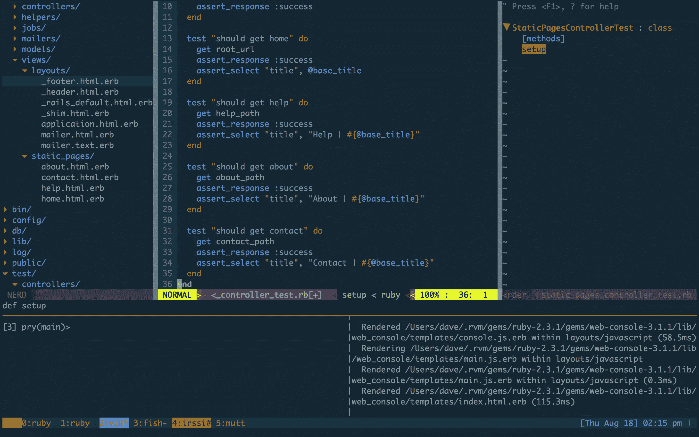

# 现代 Ruby 开发设置的工具

> 原文：<https://www.sitepoint.com/tools-for-a-modern-ruby-development-setup/>

这篇文章的最初发表被认为是错误的作者。这个问题已经解决，相关责任人已经被解雇。抱歉大卫。



在过去的 20 年里，Web 开发有了巨大的发展。例如，对于在 90 年代末开发 cold fusion 的人来说，现代开发环境是不可识别的。对最佳实践和开发人员生产力的更大关注无疑使软件更易于维护，但这是以增加复杂性为代价的。要驾驭这种复杂性，需要一个现代化的开发环境；这篇文章将概述一些我个人最喜欢的工具。

## Tmux

Tmux 是一个终端多路复用器(想想[屏幕](https://www.gnu.org/software/screen/)，这意味着在同一个 shell 会话中可以有几个终端。它允许您拆分和移动窗格，并从不同的机器重新连接到 tmux 会话。当它部署在服务器上时，这一点尤其突出，因为您可以启动一个长时间运行的任务，断开连接，而您的 tmux 会话将继续运行。

Tmux 对于开发的真正优势在于知道每个不同的工具在哪个窗口中运行，因为通过一些快速窗口改变[快捷方式](https://github.com/disavowd/tmux-dotfiles/blob/master/tmux.conf#L30-L33)，你可以移动得如此之快，以至于流变成本能。为了帮助这一点， [tmuxinator](https://github.com/tmuxinator/tmuxinator) 建立了概要文件(protip:将它们绑定到 Tmux 快捷方式，以便于打开不同类型的项目，如 Rails、Sinatra 等)，这很好地补充了 Tmux。

此外，Tmux 可以通过其[插件生态系统](https://github.com/tmux-plugins)进行扩展。看看吧，不过我会推荐 [Tmux 插件管理器](https://github.com/tmux-plugins/tpm)、[Tmux-电池](https://github.com/tmux-plugins/tmux-battery)和 [tmux sensible](https://github.com/tmux-plugins/tmux-sensible) 。

如果您正在寻找 Tmux 的简单入门，请查看本文。

## 鱼

Bash 很好，但是它还没有成熟到可以使用更好的终端替代品。ZSH 是一个很好的选择，但是我个人缺乏动力去花时间学习如何配置另一个软件。为此，我会推荐[鱼](https://fishshell.com/)。它具有出色的命令完成能力，完全可脚本化，并且看起来比 Bash 好得多。最棒的是，它开箱即用(尽管你会遇到一些[的小毛病](https://en.wikipedia.org/wiki/Friendly_interactive_shell#bash.2Ffish_Translation_table)。此外，您的 Bash 别名也不起作用，但是翻译很简单，而且设置成本相对较低)。我特别喜欢以这种方式与 Git 交互，但我最近发现了优秀的 [Gitsome](https://github.com/donnemartin/gitsome) ，它提供了优秀的 Github 集成和无与伦比的自动完成功能，所以我目前在这两者之间摇摆不定。

## 精力

Vim 是我的环境的基石。为了加速开发而进行的大量定制，它更像是一个完全成熟的(尽管是轻量级的！)IDE。让我们先来看看一些普遍有用的插件，然后再来看看一些 Ruby 特有的插件。你可以在这里下载我的 vim 点文件[。](https://github.com/disavowd/vim-dotfiles)

导航项目可能很麻烦。幸运的是，Vim 丰富的生态系统在这里真正发挥了作用。关于浏览项目，我推荐优秀的[书呆子](https://github.com/scrooloose/nerdtree)。这将为您提供一个可浏览的树形结构，为您提供当前目录及其子目录的一个简洁的高级概览。在这个视图中按下`m`将允许您在不离开 vim 的情况下删除、创建和重命名节点。崇高的忠诚者将享受[ctrlp](https://github.com/ctrlpvim/ctrlp.vim)；一个优秀的模糊匹配器，特别是当你有相似名字的文件时，比如在一个 Rails 项目中。最后，我经常想访问我最近用过的文件； [MRU](https://github.com/yegappan/mru) 正是这么做的。

虽然这些是我最喜欢的， 这里有一些其他值得特别提及的 vim 插件:
* [逃犯](https://github.com/tpope/vim-fugitive):直接在 vim 中集成 Git
*[Supertab](https://github.com/ervandew/supertab):代码完成
* [航空公司](https://github.com/vim-airline/vim-airline):好看的状态栏
*[t 注释](https://github.com/tomtom/tcomment_vim):快速注释/取消注释功能
* [包围](https://github.com/tpope/vim-surround):将通常的 Vim 边界选择用括号或引号括起来
* [自动关闭](https://github.com/Townk/vim-autoclose) [Gundo](https://github.com/sjl/gundo.vim):Vim 隐藏良好的树形结构的接口，用于存储文档更改，这经常被证明比线性的“撤销”功能有用得多

### Ruby 特定插件

首先，您需要确保您的 Vim 版本是用 Ruby 编译的:

```
vim --version | grep ruby 
```

上面的命令应该包括一个`+ruby`。如果没有，你需要重新编译支持 ruby 的 Vim([相对简单的](http://zaiste.net/2013/05/compiling_vim_with_ruby_and_python_support_on_ubuntu/))或者安装一个支持 Ruby 的 Vim 版本，比如 MacVim。虽然很多插件没有它也能工作，但是你会错过一些有用的特性，比如自动补全。

vim-ruby 是第一个停靠港。它增加了语法高亮、类似智能感知的自动完成，甚至编译器插件。这将使您获得许多现成的基本 IDE 功能。它甚至有 erb 语法高亮！

Tim Pope 是给了我们几个优秀的 Ruby(和其他)插件的人。你可以做得比检查他的项目并把它们整合到你的工作流程中更糟。如果你想要一个插件来帮助你的 Rails 开发，它应该是 [vim-rails](https://github.com/tpope/vim-rails) 。这个插件将所有的命令行功能直接引入 Vim，当你将它与 Vim 快捷方式结合起来时，这是非常有用的。让我们在这里深入研究一些有用的命令:

这是一个上下文感知开关，可以让你直接进入相关文件。您可以利用适当命名的`:A`(替代)和`:R`(相关)从模型到模式，从模板到助手，从控制器到功能测试。

在命令行上用`:Rails`与`rails`接口(如果你是 Rails 5 的预版本，还可以通过`:Rake`访问 rake)。)

您可以通过视觉选择一个区域并利用`:Rextract <filename>`来提取部分音。这似乎是一个很小的特性，但是在重构一个笨拙的视图时却非常有用。

还有很多其他有用的快捷方式，你的时间将会被很好地投入到学习中。

vim-dispatch 是另一个蒂姆·波普的作品。这允许您利用 Tmux 为 Vim 带来异步功能。在不阻塞输入或打开另一个窗格的情况下开始单元测试是有用的。

[vim-rspec](https://github.com/thoughtbot/vim-rspec) 是一款用于 vim 的轻型 rspec 转轮。如果不使用 Guard，我喜欢映射。

关于这个主题的进一步阅读，请查看这篇更深入的文章。

荣誉奖:

*   [vim-endwise](https://github.com/tpope/vim-endwise) :输入`def <function_name>`时自动追加一个`end`。想一想[狙击](https://github.com/garbas/vim-snipmate)但是不需要调用快捷键。
*   vimbundler :包装 bundler，这使得与它的接口稍微好一些。
*   vim-haml :为 haml、Sass 和 SCSS 提供最先进的 vim 运行时文件——不必要，但是很好。

这并不是一个真正的 Vim 插件，但我还是会把它放在这里: [gem-browse](https://rubygems.org/gems/gem-browse) 是一个 Ruby Gem，它可以在你的编辑器中打开一个库的源文件，当你需要费力地通过一些晦涩的库的源代码来查看为什么你的代码没有按预期执行时，这可以节省时间。

## 码头工人

与其他技术相比，Docker 是相对较新的技术，但同样重要。它通过在单个 Linux 实例中运行“容器”,避免了启动和维护传统虚拟机的开销，从而简化了与平台无关的部署。此外，这种方法提供的隔离提供了一层额外的保护。

Docker 过去有点难上手，需要优秀的[如何在 OS X 上使用 Docker:失踪的指南](https://www.viget.com/articles/how-to-use-docker-on-os-x-the-missing-guide)，但是现在情况好多了。前往 docker.com[的](https://docs.docker.com/)开始吧。

## 防护装置

我是[卫士](https://github.com/guard/guard)的超级粉丝。虽然在包含大量测试的大型项目中，它并不那么耀眼，但任何没有这种约束的快速发展的项目都会从它提供给开发人员的即时反馈中受益匪浅。通过保持 Spring preloader 运行，它可以显著减少测试运行所需的时间，我会全心全意地推荐将它与 [minitest-reporters](https://github.com/kern/minitest-reporters) 配对，以获得更多信息的测试输出。

## 窥探

[撬](http://pryrepl.org/)是一个神奇的除了你的宝石。作为 irb 的强大替代，它允许命令外壳集成(git、vim 等)、语法高亮显示和强大的历史查看和回放功能。与 [pry-doc](https://github.com/pry/pry-doc) gem 配合使用，它包括一些简洁的功能，比如`show-doc`调出文档和`show-source`查看 Ruby 内置的源代码。它可以很好地作为一个调试器，作为一个喜欢 REPL 驱动开发的人，我发现与默认的 irb 相比，它是一股新鲜空气。

## Pgcli

随着 ORM 的出现，我不太经常使用 SQL，这意味着当我不记得具体如何做时，自动完成功能是一个真正的时间节省器。Pgcli (以及它的表亲 [Mycli](http://mycli.net/) ，如果你还在使用 mysql 的话)提供了这一功能，并且语法高亮。强烈推荐。

## 笨蛋

如果你能忍受现代软件中最痛苦的配置过程， [Mutt](http://www.mutt.org/) 是命令行电子邮件访问的绝佳选择。它使用 Vim 绑定，我很高兴不用离开我的 shell 来处理电子邮件。

## 你这下流的家伙

我发现 IRC 是一个无价的资源，但肯定是在 shell 中工作得更好的东西。irssi 是我选择的客户(请务必查看[扩展](https://scripts.irssi.org/))。我也听说了关于 [weechat](https://weechat.org/) 的好事。

## 摘要

我们已经讨论了很多领域，一如既往，还有很多领域没有涉及到。Vim 是我花费时间最多的地方，所以我花了更多的时间来定制它。正确研究 Tmux 和您的 shell 绝对是值得的。当然，这完全是个人喜好，所以你不太可能使用我的设置进行开发，但是你应该希望对那里有什么有更好的想法，甚至可能将这里的一些新东西集成到你的工作流中。

## 分享这篇文章