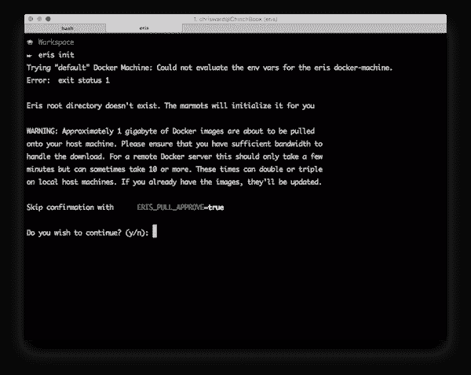
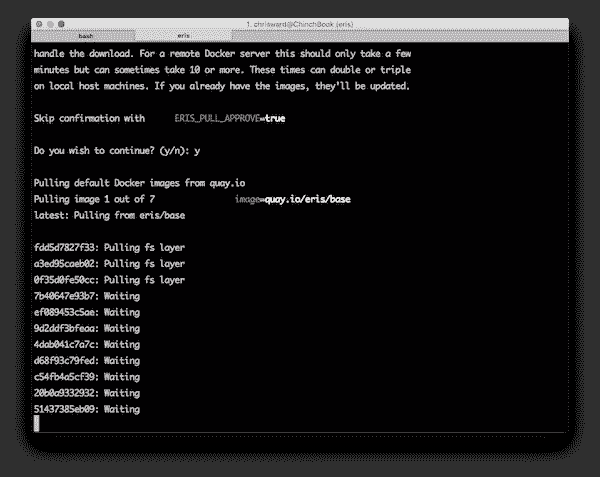
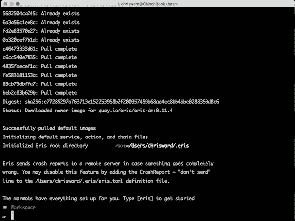
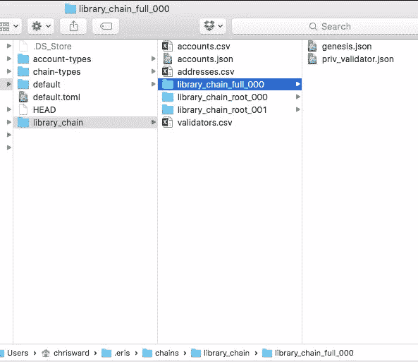
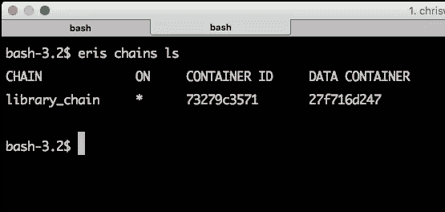
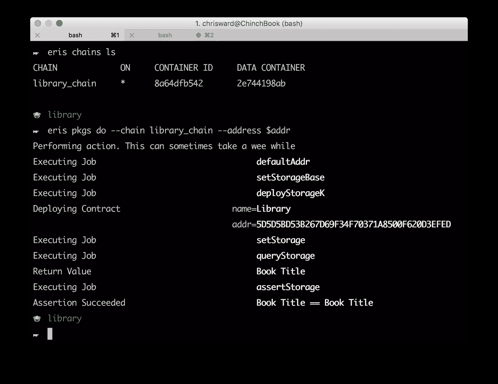

# 与厄里斯一起构建您的第一个区块链应用

> 原文：<https://www.sitepoint.com/getting-into-blockchain-with-eris/>

几个月前，我参加了柏林区块链奖，似乎“区块链”是初创公司和技术人员喜欢扔进一切事物的新流行语，而没有完全理解它背后的概念。

无论你认为区块链只是一个新的行业术语，还是一项真正的革命性技术，开发人员通常不确定如何在他们的应用程序中使用区块链概念。厄里斯工业公司的解决方案可能会让这变得简单一点。

[厄里斯工业公司](https://erisindustries.com/)将区块链和智能合同概念打包，使它们更易于使用，并应用到您的项目中。这类技术的最佳项目是需要某种形式的分散信任和安全的想法。

在本文中，我将创建一个演示应用程序，它是一个针对假设情况的特权用户名称库。在本教程的最后一部分，应用程序将允许您更改列表中的名称并检查值。

## 安装和设置

安装厄里斯令人困惑，他们主页上的说明对我不起作用，我最终按照他们更深入的说明中的步骤安装。对我来说，在我的 Mac 上，我安装了 Docker 工具箱(Docker 是必须的)，然后用[家酿](http://brew.sh/)安装了厄里斯。

安装后，使用以下命令设置厄里斯，该命令将创建配置文件并下载所需的(大)Docker 映像:

```
eris init
```







**注意**:在厄里斯文档中并不清楚，但是最好在 Docker 上下文中运行本教程中的其余命令。这主要适用于 Mac 和 Windows，[在这里找到更多细节](https://docs.docker.com/engine/installation/)。

## 授予访问权限

启动厄里斯密钥服务进行身份验证:

```
eris services start keys
```

该命令启动基于`keys`服务定义的服务，这些定义可以在 *~/中找到。eris/services* 文件夹。默认情况下，厄里斯为预定义的应用类型创建了一些(例如 [Tor](https://www.torproject.org/) 、 [ipfs](https://www.sitepoint.com/http-vs-ipfs-is-peer-to-peer-sharing-the-future-of-the-web/) 和 [bigchaindb](https://www.sitepoint.com/managing-data-storage-with-blockchain-and-bigchaindb/) )，但是[你也可以创建自己的](https://docs.erisindustries.com/documentation/eris-cli/latest/services_specification/)。

现在创建一些密钥来允许特定用户访问服务和应用程序:

```
eris keys gen
```

保存密钥以备后用，用您刚刚生成的密钥替换密钥值:

```
eris keys export E0F4BA1E6D15503074239A663101547074889574
```

并使用以下命令检查您的主机和容器中有哪些键可用:

```
eris keys ls
```

如果你想了解更多关于厄里斯钥匙的知识，那么我推荐[他们的钥匙教程](https://docs.erisindustries.com/tutorials/tool-specific/keyexporting/)。

## 创建区块链

接下来，创建一个具有名称(`library_chain`)和类型(`simplechain`)的区块链:

```
eris chains make library_chain --account-types=Root:2,Full:1 simplechain
```

如果你挖掘里面隐藏的 *~/。eris* 文件夹中，您将看到该命令生成的文件。里面有 *~/。eris/chains/library_chain* 是一系列文件:



*   *genesis.json* :告诉 eris 如何实例化一个特定的区块链，提供区块链的“genesis”状态。
*   *accounts.csv* 和 *validators.csv* :如果丢失了，你可以稍后使用这两个文件创建一个新的 *genesis.json* 。
*   *addresses.csv* :拥有节点的地址和“名称”。

现在你已经准备好实例化区块链了:

```
eris chains new library_chain --dir ~/.eris/chains/library_chain/library_chain_full_000
```

检查链是否存在并且正在运行:

```
eris chains ls
```



## 契约

“智能合约”是一个流行的区块链相关术语，指的是“区块链将分析你发送给它的交易的协议”。作为一个简单的与厄里斯相关的例子，您将创建一个带有值的契约，然后再将其返回。首先为应用程序创建一个文件夹，并移入其中:

```
cd ~/.eris/apps
mkdir library
cd library
```

在该文件夹中创建一个 *library.sol* 文件，并向其中添加以下内容:

```
contract Library {
  string storedData;

  function set(string x) {
    storedData = x;
  }

  function get() constant returns (string retVal) {
    return storedData;
  }
}
```

这个文件应该是不言自明的，它定义了一个字符串变量和相关的`set`和`get`函数。

接下来创建一个由厄里斯包管理器读取的 *epm.yaml* 文件，在其中查找要运行的作业:

```
jobs:

- name: setStorageBase
  job:
    set:
      val: "Book Title"

- name: deployStorageK
  job:
    deploy:
      contract: library.sol
      wait: true

- name: setStorage
  job:
    call:
      destination: $deployStorageK
      data: set $setStorageBase
      wait: true

- name: queryStorage
  job:
    query-contract:
      destination: $deployStorageK
      data: get

- name: assertStorage
  job:
    assert:
      key: $queryStorage
      relation: eq
      val: $setStorageBase
```

其中一些工作声明比其他的更有意义，[阅读工作规范文档了解更多细节](https://docs.erisindustries.com/documentation/eris-pm/latest/jobs_specification/)。

接下来，您需要告诉厄里斯查看这两个文件，生成它需要的其他文件，然后:

1.  部署合同。
2.  向其发送交易。
3.  从合同中查询结果。
4.  断言结果。

首先，获取您想要部署契约的地址:

```
addr=$(cat ~/.eris/chains/library_chain/addresses.csv | grep library_chain_full_000 | cut -d ',' -f 1)

echo $addr
```

和里面的**应用文件夹( *~/)。eris/apps/library* 对您创建的文件调用厄里斯包管理器，并将合同部署到区块链:**

```
eris pkgs do --chain library_chain --address $addr
```

该命令将找到您声明的作业，部署它们，然后返回所做的断言，在本例中，书名是一个字符串。



## 提出申请

现在是时候编写一些与区块链交互并对其执行操作的代码了。这仍然是一个简单的示例，它允许用户为区块链中的图书设置一个新值，然后检查当前值。

该示例将使用 Node.js，因此首先在 *~/中创建一个 *package.json* 文件。包含以下内容的 eris/apps/library* 文件夹:

```
{
  "name": "library_app",
  "version": "0.0.1",
  "dependencies": {
    "eris-contracts": "^0.13.1",
    "prompt": "*"
  }
}
```

接下来，创建一个 *app.js* 文件，并添加以下内容:

```
'use strict';

var contracts = require('eris-contracts');
var fs = require('fs');
var http = require('http');
var address = require('./epm.json').deployStorageK;

var abi = JSON.parse(fs.readFileSync('./abi/' + address, 'utf8'));
var accounts = require('../../chains/library_chain/accounts.json');
var chainUrl = 'http://192.168.59.103:1337/rpc';
var manager = contracts.newContractManagerDev(chainUrl,
  accounts.library_chain_full_000);
var contract = manager.newContractFactory(abi).at(address);
```

第一个代码块创建需求，然后为`abi`(区块链和应用程序之间的“翻译器”)、前面提到的帐户、链的 IP 地址(在我的例子中是 boot2docker ip)创建一些特定于厄里斯的变量，并为链启动一个管理器和合同。

除了几个细节之外，剩下的大部分代码都是更熟悉的 JavaScript 领域，创建一个节点服务器，监听请求，并根据需要向区块链读写数据:

```
var server;
server = http.createServer(function (request, response) {
  var body;
  var value;

  switch (request.method) {
    case 'GET':
      console.log("Received request for details.");
      contract.get(function (error, result) {
        if (error) {
          response.statusCode = 500;
        } else {
          response.statusCode = 200;
          response.setHeader('Content-Type', 'application/json');
          response.write("You have requested details on: " + result);
        }
        response.end('\n');
      })

      break

    case 'PUT':
      body = '';

      request.on('data', function (chunk) {
        body += chunk;
      });

      request.on('end', function () {
        console.log("Received request to set title to " + body + '.');

        contract.set(body, function (error) {
          response.statusCode = error ? 500 : 200;
          response.end();
        });
      });

      break;

    default:
      response.statusCode = 501;
      response.end();
  }
});

server.listen(process.env.NODE_PORT, function () {
  console.log('Listening for HTTP requests on port ' + process.env.NODE_PORT +
    '.');
});
```

**注意**:您可能需要将`NODE_PORT`的值设置为合适的值。

卷曲应用程序并`PUT`一个值:

```
curl --request PUT --data Jane http://localhost:1111
# Or whatever your node IP address is
```

现在，如果您`GET`应用程序，您将看到值已经更改:

```
curl http://localhost:1111
```

查看 curl 命令和 Node.js 应用程序的输出，对幕后发生的事情有一个稍微清晰的了解。

## “结论”

乍一看，使用厄里斯启动一个基本的应用程序似乎很复杂。但是除非您遇到任何问题，否则这些设置步骤实际上不会花费太长时间，然后您就可以开始在您的应用程序中使用区块链了。

实际上，编写一个使用区块链的应用程序是一个大而复杂的话题，我几乎没有触及它的表面。对于接下来的步骤，我建议你确保在你的应用程序中有一个真正的区块链用例，然后阅读厄里斯网站上的教程[。](https://docs.erisindustries.com/tutorials/)

这将是一个崎岖不平，有时令人困惑的旅程，但我很想听听你的经历，想法和问题。

## 分享这篇文章