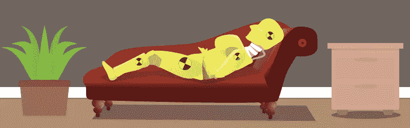
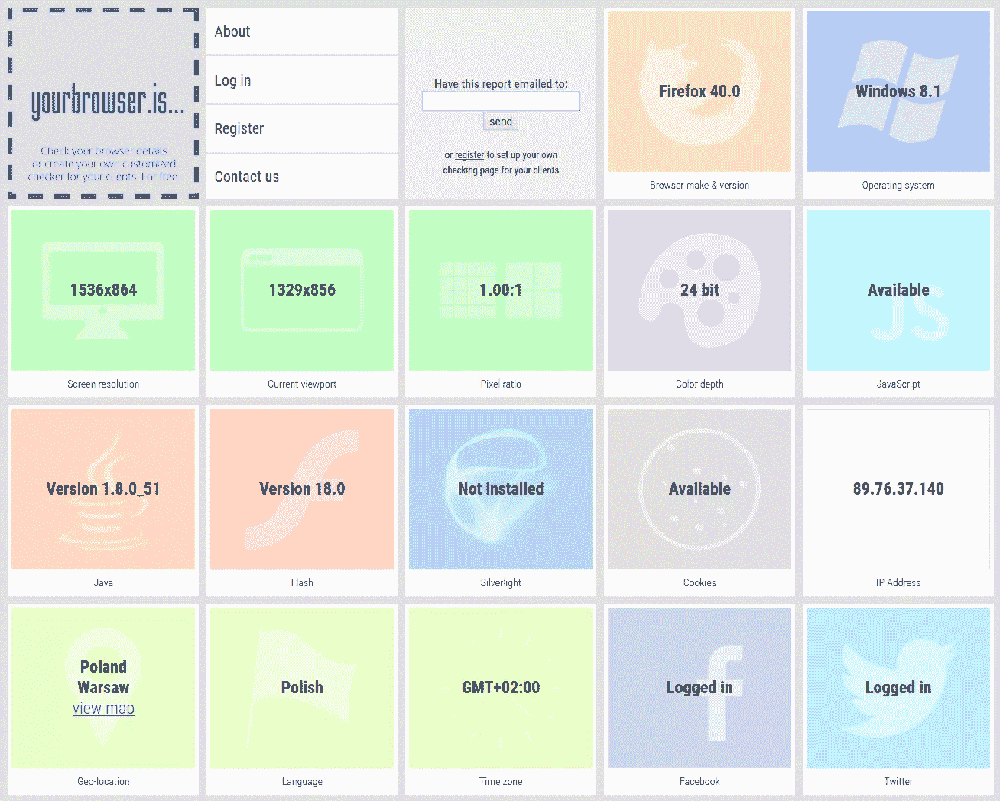
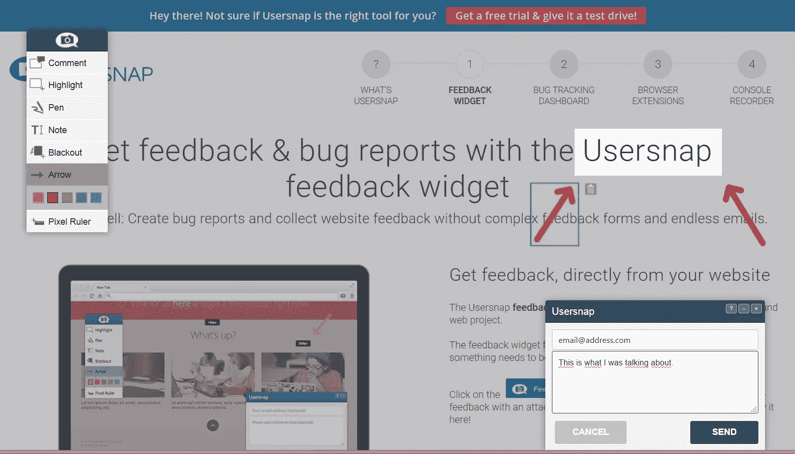
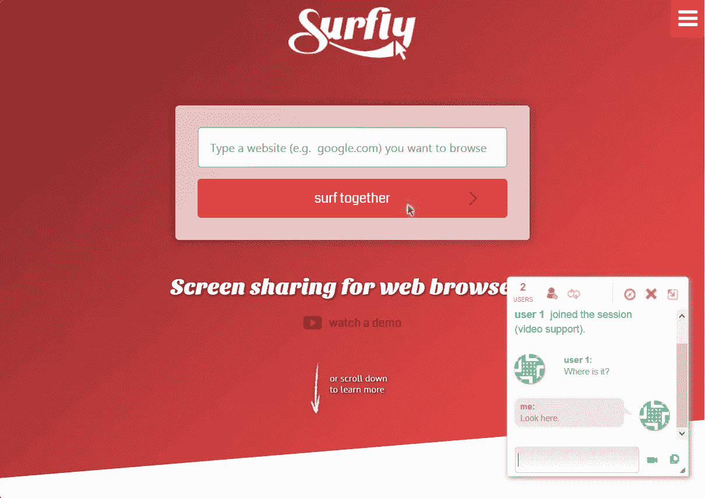
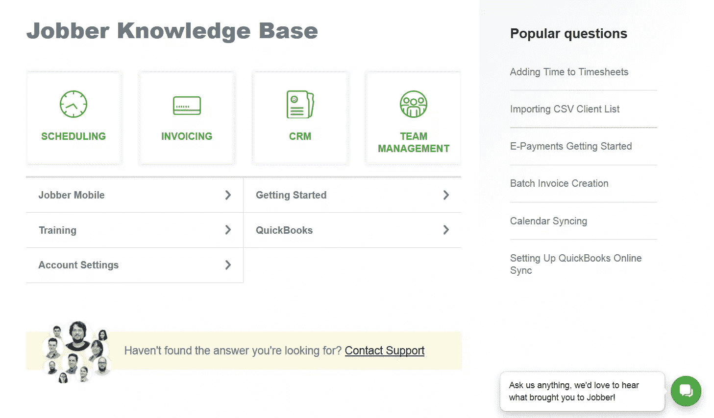

# 如何(几乎)轻松地对您的客户端站点进行故障排除

> 原文：<https://www.sitepoint.com/how-to-painlessly-troubleshoot-your-siteproduct-with-clients/>

标记、分析和修复客户报告的错误是一件微妙的事情，并不总是网页设计过程中最愉快的阶段。今天，我想通过向你展示如何尽可能地简化和缩短这个阶段来给你一点点你的生活。

## 测试阶段

虽然内部测试应该总是能够消除网站或应用程序中的绝大多数 bug 和错误，但是只有一小部分错误能够被客户或他们的目标用户发现。

环境(即设备、操作系统、浏览器、插件、配置等)有数千种组合。)供网络用户使用。事实是，没有软件或方法可以保证在测试阶段 100%的错误检测。

此外，有一些用户行为是如此先进或简单的特点，他们几乎不可能预测。因此，内部测试的目的只是为了显著降低最终用户遇到错误的可能性。

这种可能性永远不会为零，用户报告的错误确实会发生——那么你必须尽可能高效地处理它们。以这种方式，客户不会消极地看待整个情况，也不会不满意。

## 沟通不是可有可无的

适应客户是服务提供商(您)的工作，因此，客户应该能够使用他们选择的沟通渠道。如果他们喜欢打电话，你不能强迫他们使用电子邮件。可用的渠道越多越好——电话、电子邮件、购票系统、聊天或者某个分行流行的即时通讯工具。

由于有大量的用户，因此可能有大量的服务请求，票据请求系统和知识库是必不可少的。前者将让您控制大量的请求、用户和顾问。

客户甚至不需要知道他们正在使用一个票务系统——他们的请求(通过电子邮件、电话或聊天)只是被给了一个号码，这将有助于跟踪问题。

知识库是一个开发的带有智能搜索系统的 FAQ。这使得减轻顾问的一些请求成为可能——通常这些是最经常重复的问题，并且总是以相同的方式得到回答。知识库将由喜欢点击而不是说话的用户使用。

### 沟通错误的关键是时间

首先，对错误报告的响应应该尽快发送，这样客户会觉得他们的问题马上得到了解决。来自票务系统的自动确认是一个坚实的开端，但由人类撰写的答案会好得多。

其次，应该让报告错误的人了解修复错误的进展。如果该过程持续了几天，则应该每天联系客户，并告知其当前状态和预计完成时间。

并且尽可能的减少接触客户的人数。在理想世界中，这应该是一个人。在解决单个问题时，在联系人之间切换是用户感到沮丧的最常见原因之一。

以下是一些流行的票务请求系统: [Zendesk](https://www.zendesk.com/) ，[伽椰子](http://www.kayako.com/)， [Freshdesk](http://freshdesk.com/) 和 [UserVoice](https://www.uservoice.com/) 。

## 了解用户环境

正如我前面提到的，网络用户使用的环境数不胜数——各种设备(电脑、平板电脑或智能手机)、屏幕分辨率、操作系统、浏览器品牌和版本、配置和插件——小事情可以产生巨大的影响。

要解决这个问题，您需要尽可能了解用户系统的所有信息。然而，获取这些信息可能会很困难，并且会给用户带来很大的负担。那么，如何确定他们的系统规格呢？

*典型的 [yourbrowser.is](http://yourbrowser.is) 浏览器报告*

幸运的是，有一个名为 [yourbrowser.is](http://yourbrowser.is/) 的应用程序可以帮上忙。它允许您免费创建自己的 checker 页面。你只需要给你的客户发送一个网址，让他们点击。当客户端打开该页面时，会生成一份关于其环境的报告，并通过电子邮件发送给 checker 页面的所有者(以及参数，例如可以包括客户端的全名)。

## 你的用户看到了什么？

即使是关于用户环境的完整报告也不总是足够的，模糊的配置通常很难复制。这也是为什么截图往往是不可或缺的。但是，同样的，并不是每个用户都能够(或想要)拍摄并发送截图，尤其是在移动设备上。

在这些情况下，Usersnap 是一个很好的帮助——一个便于错误处理的综合套件。它围绕一个独特且非常有用的功能而构建，即无需用户安装任何额外的软件或插件即可生成屏幕截图。小部件安装在有问题的页面上就足够了。

*Usersnap 网站反馈界面*

事实上，Usersnap 并不拍摄真实的屏幕截图，而是通过模拟给定用户的环境来生成一个屏幕截图。用户可以轻松地在 Usersnap 拍摄的屏幕截图上做笔记——标记错误位置，描述错误，甚至绘制一些东西。

更进一步，你可以尝试视频记录用户的行动。像 [Screenr](https://www.screenr.com/) 这样的应用程序确实提供了这种功能，但是用户需要安装一个本地应用程序(至少是 Java ),并同意运行这样的插件。对许多人来说，这可能是一个太多的摩擦点。

## 共同浏览:穿着我的鞋走一英里

另一个观察用户在网站上的行为，同时帮助他们应对挑战的好方法是“共同浏览”。两个(或更多)用户可以同时观看同一个网站，并且每个用户都可以看到对方的光标和动作(如点击)。

网站是为参与这种共同浏览的每个用户单独呈现的，因此该功能不能代替屏幕截图。但是这对于理解用户在应用程序上做了什么以及如何产生错误是一个巨大的帮助。

Surfly 或 [Firefly](http://usefirefly.com/) 都提供这项服务。

*冲浪共同浏览界面*

## 高速缓存难题

缓存(或临时)文件通常是人们识别和修复网站错误的祸根。通常情况下，客户端看到的是一个不同的网站，而不是编辑它的建筑，因为客户端的浏览器是从缓存而不是源加载他们的版本。错误可能早就被修复了，但是客户仍然可以看到它，并且很有理由感到不满。

通常最容易解决的问题是浏览器缓存——让用户清空缓存就足够了，这样他们的浏览器就可以从服务器上加载网站的最新版本。

如果网站由客户公司网络或 ISP 中的代理服务器缓存，事情会变得更加困难。在这些情况下，您通常只需要等待缓存刷新。它们通常按计划刷新。

第三种类型的缓存发生在存储网站的服务器上——但在这里，是修改网站的人必须记住清除这种类型的缓存。那可能是你，一个高级开发人员或你的开发运营人员。

## 当一切结束时

当客户机被告知错误已被修复并确认时，该过程并没有结束。如果我们没有从整体情况中对未来做出任何结论，客户满意又有什么意义呢？

除了错误本身之外，您还需要定义并消除其原因，并防止错误再次发生。

并且如果是 it *可以*再次发生的错误类型，那么整个情况连同解决方案都应该仔细描述并存储在内部知识库(不是用户知识库)中。

管理知识库的工具是大多数帮助台软件包的一部分(见上文)。不过也有专门的解决方案，比如 [Helpjuice](https://helpjuice.com/) 。

*Helpjuice 示例知识库*

## 重述

修复网站错误可能会耗费大量时间和资源，这就是为什么世界各地的专家都在努力缩短和简化这一过程。

许多开发团队认识到专门的错误处理工具是值得的。它们不被视为成本，而是真正节约的来源。更不用说更短、更高效的流程所带来的挫败感。

## 分享这篇文章