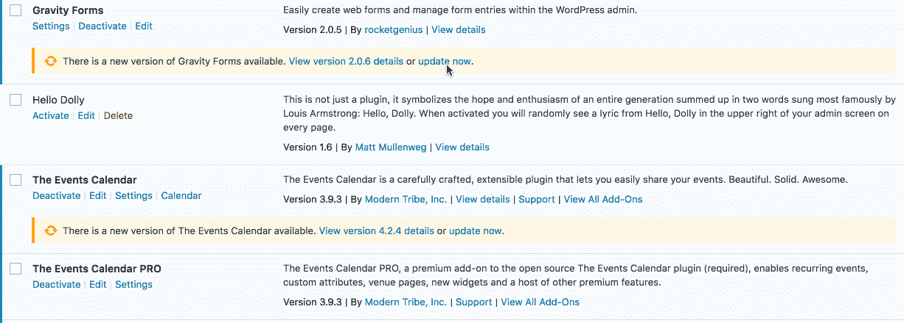
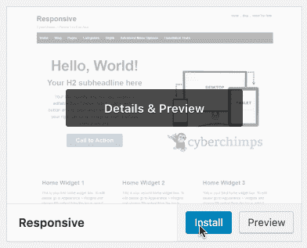

# WordPress 4.6 的新功能

> 原文：<https://www.sitepoint.com/whats-new-in-wordpress-4-6/>

WordPress 4.6 版今天发布，距离[WordPress 4.5 版](https://www.sitepoint.com/whats-new-wordpress-4-5/)发布刚好 4 个多月。最新的版本被命名为“胡椒”,以著名的爵士萨克斯手帕克·弗雷德里克·“胡椒”·亚当斯命名。

4.6 版本由张秀坤·席林领导，由加斯·莫滕森和 272 名投稿人支持。一个翻译社区也帮助 WordPress 4.6 实现了 52 种语言。

在本文中，我将概述这个最新版本中的新特性，以及在更新您的站点时会有哪些特性。

## 更新前-备份你的网站

在升级 WordPress 4.6 之前，不要忘记做一个完整的网站备份(数据库和文件)。Amit Diwan 有一个最好的 WordPress 备份插件的大对比,可能会派上用场。

和往常一样，检查主题或插件提供者是否发布了任何关于 WordPress 4.6 支持的内容也是值得的。

在可能的情况下，最好将更新应用到测试或试运行环境中，这样您就可以在将它们应用到实际站点之前测试这些更改。

如果您遇到问题，请尝试一些基本的故障诊断步骤。查尔斯·科斯塔分享了一些关于 WordPress 常见问题的提示。别忘了你也可以访问官方的 [WordPress 支持论坛](https://wordpress.org/support/)，只要确保你阅读了欢迎帖，以确保快速和有益的回应。

## 简化的更新

当你更新、安装或删除插件和主题时，你停留在同一个屏幕上。这使得应用更新的过程更加简单。这些操作现在都是通过 AJAX 在给定的页面中执行的，这带来了流畅的用户体验。

这不仅适用于插件和插件更新，也适用于主题。

## 原生系统字体

WordPress 仪表盘现在使用你的操作系统的系统字体。虽然这看起来很小，但这意味着轻微的性能提升和与本机操作系统匹配的用户体验。

## 断开的链接高亮显示

断开的链接是一个坏的用户体验，并影响你的网站的搜索引擎优化。WordPress 现在自动检查你的链接的语法，以确保它们没有明显损坏(这是一个相当基本的检查)。

## 内容恢复

WordPress 4.6 已经做了改进，使得恢复你保存的内容更加容易。

虽然 WordPress 有自动保存功能已经有一段时间了，但它现在利用你的浏览器，每 15 秒保存一次。

## 开发人员功能和变化

开发人员可能还希望注意:

*   提高性能的资源提示
*   HTTP API 现在正在使用请求 PHP 库
*   各种 JavaScript 库的更新
*   多站点性能改进
*   改进的翻译加载
*   定制程序验证和通知
*   新的 WP_Term_Query 和 WP_Post_Type
*   新的元注册 API

在接下来的几周内，我们将为开发者深入探讨这些新特性，敬请关注！

## 包扎

你可以在 [Codex 发布说明](https://codex.wordpress.org/Version_4.6)上找到更多关于 WordPress 4.6 的信息。

请让我们知道你对这个最新版本的想法。

*这篇文章的部分内容最初发表在 SitePoint WordPress 时事通讯上，如果你感兴趣，你可以[在这里](https://www.sitepoint.com/newsletter/)订阅。*

## 分享这篇文章