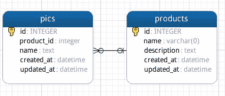
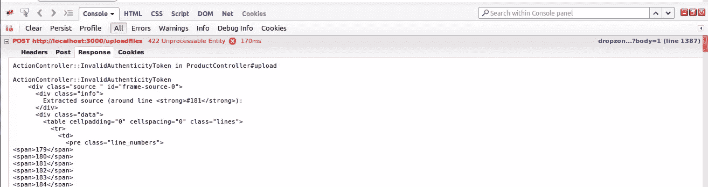
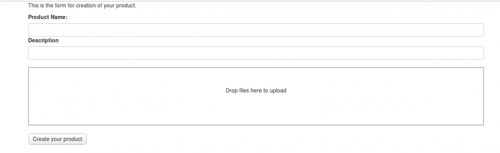
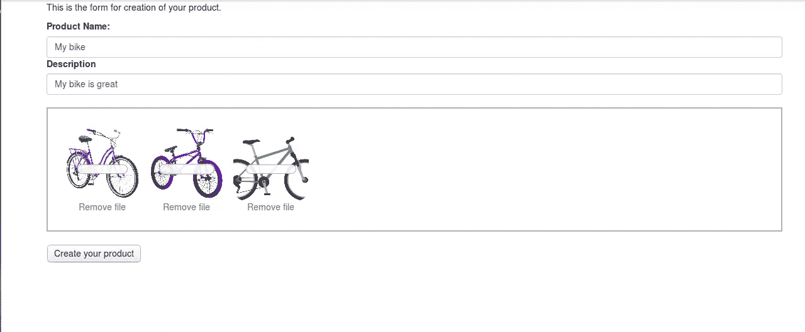
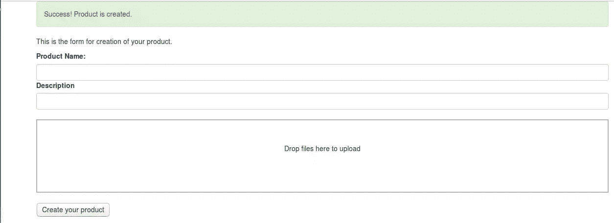

# 使用 Rails 和 Dropzone.js 进行异步多文件上传

> 原文：<https://www.sitepoint.com/asynchronous-multiple-file-upload-with-rails-and-dropzone-js/>


在本教程中，我将向您展示如何使用 Ruby on Rails 4.2 和 Dropzone 通过 AJAX 拖放来上传多个文件。Dropzone 是一个很棒的库，在作者看来，它远远超过了其他提供类似功能的库。

请注意，我将使用普通的 Ruby on Rails，而不使用任何其他库或 gems，如回形针或 Carrierwave。

本教程适合那些来自其他编程语言并希望探索 Rails 的人。

好了，伙计们，我们上路吧。

## 先决条件

我假设:

1.  您对面向对象编程以及 MVC 设计模式的三个组件之间的关系有所了解。
2.  您熟悉 javascript、jQuery 和 AJAX 请求。

## 我们需要的工具

1.  好的浏览器调试和自省工具。我使用 Firefox 作为浏览器，安装了 [Firebug](http://getfirebug.com/) 来调试和控制浏览器中的 javascript 和服务器上的 Rails 之间的交互。
2.  任何 IDE 或编辑器。我喜欢 Rubymine 或 Sublime 都可以，但请随意使用您自己的。
3.  Ruby on Rails 4.2。要安装 Rails，请访问(http://installrails.com/)。我将使用 SQLite 作为数据库。您也可以使用 PostgreSQL、MySQL 或任何其他 RDBMS。
4.  Dropzone 库本身。从[这里](http://www.dropzonejs.com/)去下载。
5.  [推特自举](http://getbootstrap.com/getting-started/#download)。

## 应用程序

我们的应用程序是一个电子商务商店的模块，用于创建产品并在产品上附加图片。它将图片上传到服务器上，返回上传文件的列表，然后提交表单来创建产品记录。图片和产品之间是一对多的关联，也就是说一个产品可能有很多图片。

以下是数据库模式:



让我们跳到我们的代码。首先，通过打开终端并键入以下命令来创建一个新的 Rails 应用程序:

```
rails new myapp 
```

我们需要为 Dropzone 和 Bootstrap 添加 Javascript 和 CSS 文件，所以请从 Dropzone 和 Bootstrap 下载到 **dist** 文件夹，找到以下文件:

```
bootstrap.css
dropzone.css
basic.css
dropzone.js 
```

将 **dropzone.js** 放入**myapp/app/assets/JavaScript**中，将所有 CSS 文件放入**myapp/app/assets/样式表**中。打开 **application.css** 并删除这一行:

```
*= require_tree . 
```

这一行告诉 Rails 需要这个目录和所有子目录中的所有内容。我们不希望这种事情发生，所以把它处理掉。然后添加这一行:

```
*= require bootstrap 
```

这意味着我们的应用程序要包含 **bootstrap** 。关闭并保存文件。
进入**myapp/app/assets/JavaScript s**，打开 **application.js** ，删除以下几行:

```
//= require turbolinks
//= require_tree . 
```

有关`//= require turbolinks`的更多信息，请阅读这篇[文章](http://geekmonkey.org/2012/09/introducing-turbolinks-for-rails-4-0/)。我们今天不打算使用涡轮增压发动机。保存并关闭文件。现在进入**app/views/layouts/application . html . erb**，为你的应用制作一个布局模板。您的最终文件应该是这样的:

```
<!DOCTYPE html>
<html>
<head>
  <title>Myapp</title>
  <%= stylesheet_link_tag    'application', media: 'all', 'data-turbolinks-track' => true %>
  <%= javascript_include_tag 'application', 'data-turbolinks-track' => true %>
  <%= csrf_meta_tags %>
  <%= yield(:css) %> <!-- We use this section for our CSS files -->
</head>
<body>

<%= yield(:content) %><!-- For our main contents -->
<%= yield(:javascript) %><!-- We put our JavaScript tags here -->
</body>
</html> 
```

注意，我们已经生成了三个部分:`css`、`content`和`javascript`。打开终端并输入以下命令:

```
rails g controller Product new create 
```

这将在你的**应用/视图**文件夹中创建两个视图，并在**应用/控制器**中创建一个控制器。在继续之前，转到**myapp/config/initializer/assets . Rb**并将这一行添加到文件中:

```
Rails.application.config.assets.precompile += %w(dropzone.js basic.css dropzone.css) 
```

以确保我们的第三方资产与应用程序的其余部分预编译。

现在，我将在转向服务器端实现之前编写客户端。打开 **app/views/new.html.erb** ，输入以下代码:

这一部分包括 CSS 文件 basic.css 和 dropzone.css，它们将用于我们的拖放区域:

```
<%= content_for(:css) do %>

<%= stylesheet_link_tag 'dropzone' %>
<%= stylesheet_link_tag 'basic' %>

<% end %> 
```

这里，我们包括一个用于创建产品的表单和一个允许用户拖动图像的拖放区:

```
<%=content_for(:content) do %>
  <div class="container">
    <div class="row">
    <p>This is the form for creation of your product.</p>
      <%= form_for :request, :url => request.base_url+'/product/create', html: {id:'myForm'} do %>
      <label for="name">Product Name:</label>
      <input type="text" name="name" id="name" class="form-control">
      <label for description> Description</label>
      <input type="text" name="description" id="description" class="form-control" /><br>
      <input type=hidden name="files_list" id='fileslist'>
      <!-- We use this <div> element to initialize our Dropzone -->
      <div id="mydropzone" class="dropzone"></div> 
      <!-- This <div> elements shows a suitable message after a successful upload. -->
      <div id="msgBoard"></div>
      <br>
      <input type='submit' value="Create your product">
    </div>
  </div>
  <% end %>
<% end %>
<%= content_for(:javascript) do %>
<!-- include the dropzone library itself. -->
<%= javascript_include_tag "dropzone" %> 
```

下面是处理拖放事件和上传表单所需的 Javascript。我将解释代码的每一部分:

```
<script type="text/javascript">
  var AUTH_TOKEN=$('meta[name="csrf-token"]').attr('content'); 
```

通过 jQuery 获取 CSRF 令牌并保存在`AUTH_TOKEN`变量中:

```
 Dropzone.autoDiscover = false;
  var myDropzone = new Dropzone("div#mydropzone",{
    url: "<%= request.base_url %>/uploadfiles",
    autoProcessQueue: false,
    uploadMultiple: true,
    addRemoveLinks:true,
    parallelUploads:10,
    params:{
      'authenticity_token':  AUTH_TOKEN
    },
    successmultiple: function(data,response){
      $('#msgBoard').append(response.message).addClass("alert alert-success");
      $('#msgBoard').delay(2000).fadeOut();
      $('#fileslist').val(response.filesList);
      $('#myForm').off('submit').submit();
    }
  }); 
```

初始化我们的拖放文件上传程序:

*   `url`是处理将图像上传到服务器的任务的路由
*   `autoProcessQueue: false`阻止脚本在拖动图像后自动上传图像
*   `uploadMultiple: true`允许 Dropzone 在一个请求中发送多个文件
*   `addRemoveLinks: true`如果设置为真，将为每个文件预览添加一个移除链接
*   `parallelUploads: 10`将允许的并行上传数量设置为 10
*   `params`允许我们随请求提交附加数据。这里我们需要通过 CSRF 令牌。在继续之前，让我们讨论一些关于在 Rails 应用程序中发送 AJAX 请求的细节。您可能知道，如果在发送给 Rails 的请求中没有包含 CSRF 令牌，您将在 Firebug 控制台中看到以下错误:

    ```
    ActionController::InvalidAuthenticityToken in ProductController#upload 
    ```

事实上，它看起来就像这样:



所以，我们在这里传递 CSRF 令牌。

*   `successmultiple: function(data,response)`:如果上传过程在服务器上成功，那么我们通过这个回调函数处理数据和响应。该函数向我们的`msgBoard` div 添加一条消息，淡出该消息，将上传的文件添加到表单的隐藏输入中，然后提交表单。

表单提交后，该脚本检查 dropzone 区域中的文件列表是否为空。如果有要上传的文件，它向服务器发送 POST 请求并上传它们(`myDropzone.processQueue()`)。

```
$('#myForm').submit(function(e){
  if(myDropzone.getQueuedFiles().length > 0){
    e.preventDefault();
    myDropzone.processQueue();
  }
});
</script>
<% end %> 
```

在这个 Rails 应用程序中，我们首先需要防止表单提交，直到我们确保拖放区中的所有文件都已上传。一旦所有文件上传完毕，我们就可以提交表单了。因此，在针对`successmultiple`的回调函数中，我们让提交事件通过 jQuery 的`off`方法发生。

如果脚本成功上传了我们的图片，并且服务器从服务器发送了成功消息，则下面的行将提交表单:

```
`$('#myForm').off('submit').submit();` 
```

现在，我们需要实现应用程序的服务器端，它会发送一条成功消息以及上传文件的列表。打开 **config/routes.rb** 并添加这一行:

```
post 'uploadfiles'=>'product#upload' 
```

然后转到 **myapp/public** 并使用以下命令创建一个**上传**目录:

```
mkdir uploads 
```

这是保存我们上传文件的目录。

在**app/controller/product _ controller . Rb**中，定义**上传**方法如下:

```
def upload
  uploaded_pics = params[:file] # Take the files which are sent by HTTP POST request.
  time_footprint = Time.now.to_i.to_formatted_s(:number) # Generate a unique number to rename the files to prevent duplication

  uploaded_pics.each do |pic|
    # these two following comments are some useful methods to debug
    # abort pic.class.inspect -> It is similar to var_dump($variable) in PHP. 
    # abort pic.is_a?(Array).inspect -> With "is_a?" method, you can find the type of variable
    # abort pic[1].original_filename.inspect
    # The following snippet saves the uploaded content in '#{Rails.root}/public/uploads' with a name which contains a time footprint + the original file  
    # reference: http://guides.rubyonrails.org/form_helpers.html
    File.open(Rails.root.join('public', 'uploads', pic[1].original_filename), 'wb') do |file|
      file.write(pic[1].read)
      File.rename(file, 'public/uploads/' + time_footprint + pic[1].original_filename)
    end
  end
  files_list = Dir['public/uploads/*'].to_json #get a list of all files in the {public/uploads} directory and make a JSON to pass to the server
  render json: { message: 'You have successfully uploded your images.', files_list: files_list } #return a JSON object amd success message if uploading is successful
end 
```

在服务器端，我们通过 POST 请求发送带有**参数**散列的文件。然后，生成一个唯一的数字字符串，该字符串将用于使文件名唯一。通过这样做，我们可以防止重复。

然后，我们一个一个地上传和重命名文件。最后，获取所有上传文件的列表，并返回一个 JSON，其中包含一条成功消息和所有成功上传文件的列表。

好了，现在运行我们的应用程序，看看我们已经做了什么。转到 **myapp** 文件夹并启动服务器:

```
rails s 
```

在浏览器中，转到[新产品页面](http://localhost:3000/product/new)。您应该会看到以下表单:



如果您现在提交表单，您将把文件上传到 **public/uploads** 目录。我们需要创建一个产品，并将这些图像与该产品相关联。让我们创建我们的模型和它们的迁移文件。

首先，为我们的**产品**创建模型和迁移。产品有名称、描述和 id。打开您的终端并输入:

```
rails generate model Product name:string description:text 
```

其次，通过输入以下命令创建 **pic** 模型及其迁移文件:

```
rails generate model Pic product_id:integer:index name:text 
```

进入 **myapp/db/migrate** 文件夹，找到 **Pic** 模型的迁移文件。打开它，用这段代码添加一个外键:

```
add_foreign_key :pics, :products 
```

迁移文件的`change`函数应该如下所示:

```
def change
  create_table :pics do |t|
      t.integer :product_id, index: true
      t.text :name

      t.timestamps null: false
    end
  add_foreign_key :pics, :products
end 
```

是时候设置`Product`和`Pic`模型之间的关联了。在 Rails 应用程序中，这个任务简单得令人难以置信。在现实世界中，我们会说每个产品都有许多图片，每个图片都属于一个产品。所以，打开你的`Product`模型，添加这段代码:

```
has_many :pics 
```

您的模型现在看起来像是:

```
class Product < ActiveRecord::Base
  has_many :pics
end 
```

因为每张图片都属于一个产品，所以您需要将这一行添加到您的`Pic`模型中:

```
belongs_to :product 
```

就是这样。使用`rake`迁移的时间:

```
rake db:migrate 
```

至于最后一部分，应用程序应该在上传文件后创建一个产品，并将该产品与我们的拖放区已经上传的图像相关联。该任务将由`ProductController`中的`create`方法处理。打开**app/controllers/product _ controller . Rb**。

`create`方法应该为我们创建产品，进行一对多关联，并将上传的文件移动到专门为给定产品创建的文件夹中。文件夹名称是产品的 id。此外，如果操作成功，该方法应创建一条 flash 消息，并将用户重定向到上一页:

```
def create
  files_list = ActiveSupport::JSON.decode(params[:files_list]) 
  product=Product.create(name: params[:name], description: params[:description]) 
  Dir.mkdir("#{Rails.root}/public/"+product.id.to_s)
  files_list.each do |pic|
    File.rename( "#{Rails.root}/"+pic, "#{Rails.root}/public/"+product.id.to_s+'/'+File.basename(pic))
    product.pics.create(name: pic)
  end
  redirect_to product_new_url, notice: "Success! Product is created."
end 
```

flash 消息将显示在创建页面的顶部，因此我们需要制作一个向用户显示创建消息的`div`元素。将以下代码添加到您的**app/views/product/new . html . erb**文件中。

```
<% if flash.notice %>
  <div class="alert alert-success"><P><%= flash.notice %></p></div>
<% end %> 
```

好了，我们已经完成了电子商务应用程序的这个小模块。启动 rails 服务器(`rails s`)并在浏览器中进入[新产品页面](http://localhost:3000/product/new)。如果您填写表单，拖放它的图片，并单击提交按钮，然后应用程序将上传图片，创建我们的产品，并将上传的图像关联到我们的产品。

例如，我将创建一个自行车产品，并上传它的三张图片以及名称和描述。下面是新产品页面的外观:



如果我单击“创建您的产品”按钮，它将创建记录，并将我重定向到同一页面，并显示一条简短消息，如下所示:



## 结论

好了，这就是为我们的网店创建这个小模块的全部内容。Dropzone.js 使我们能够为 Rails 应用程序提供上传图像的良好用户体验，而不必依赖文件上传 gem。

我希望你觉得这很有用。

## 分享这篇文章