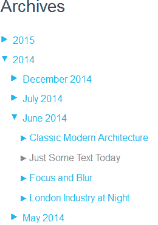
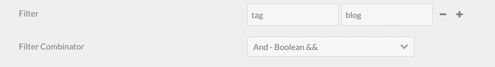
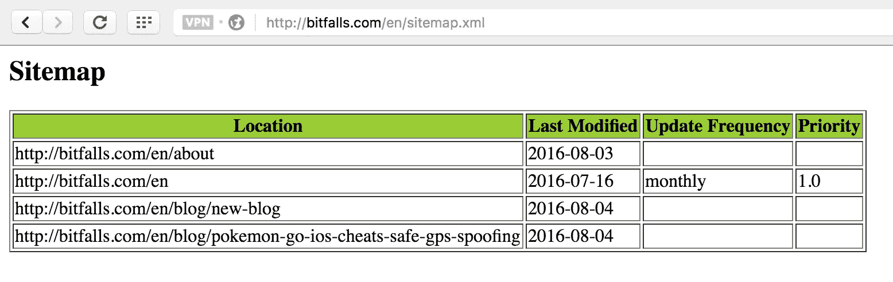
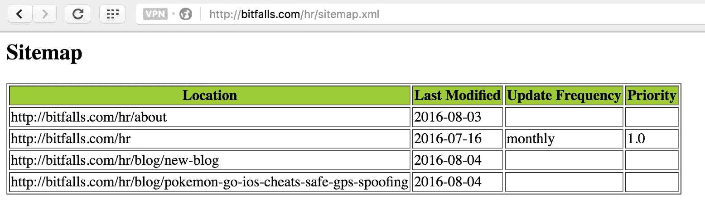
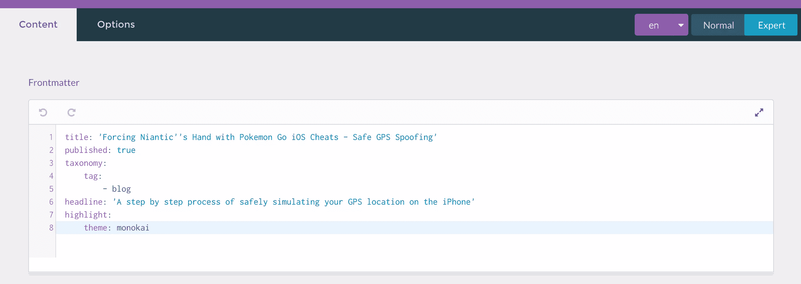
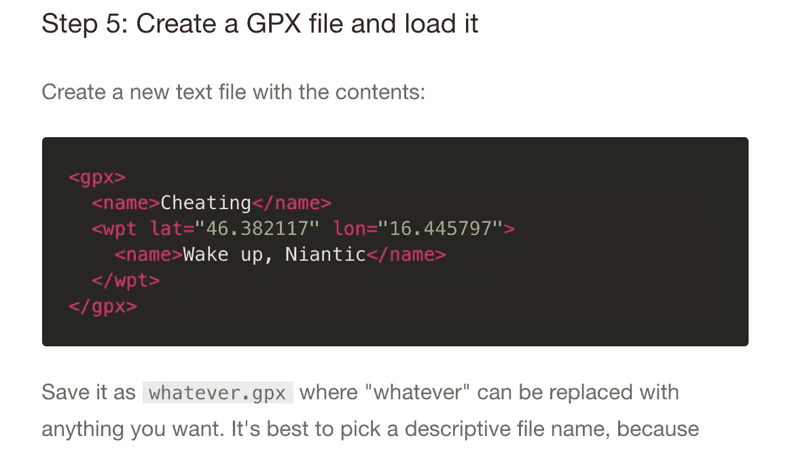
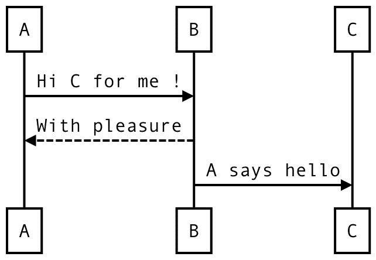
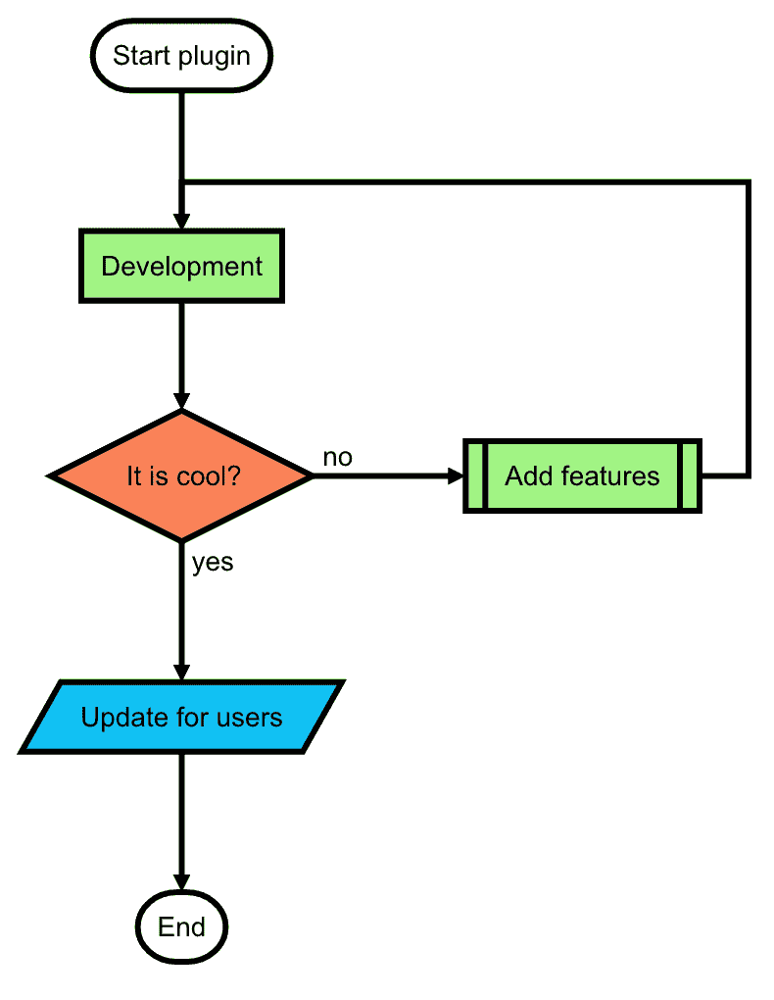

# 8 个必备的 Grav 插件来完善你的博客安装

> 原文：<https://www.sitepoint.com/8-must-have-grav-plugins-to-round-off-your-blogs-installation/>

# 8 个必备的 Grav 插件来完善你的博客安装

我最近将我的博客从 [Blogger 切换到 Grav](http://bitfalls.com/en/blog/new-blog) ，尽管 Grav 本身是一个相当漂亮的平台，但一旦你用一些定制主题和插件支撑它， [Grav](https://www.sitepoint.com/building-faster-websites-with-grav-a-modern-flat-file-cms/) 就真的大放异彩了。

这篇文章将列出我认为对一个开发者的个人博客来说必不可少的插件，以及每个建议背后的原因。


## 0.管理

不言而喻，每个 Grav 安装都应该安装管理面板。这是一个神奇的插件，使软件更加可用，让您可以轻松安装插件，让您处理本地化和翻译，等等。

管理面板的安装说明在[官方文档](https://learn.getgrav.org/admin-panel)中。

## 1.谷歌分析

大多数主题都内置了某种谷歌分析支持，但有些没有，有些只在某些页面上有。如果你对扩展主题不感兴趣，只是想在模板中包含 g a 片段，那么[谷歌分析插件](https://github.com/escopecz/grav-ganalytics)是正确的选择。

安装后，配置选项将出现在插件界面中，并允许插入 UA 密钥，该密钥将被注入到每个页面的*中——无论所选主题是否支持开箱即用。*


## 2.存档增强版

archive plus 插件有助于生成一个按月份和年份分类的文章存档树，很像 Blogger 上的存档链接。



**注意:要使用这个，一个扩展主题**是**所必需的，但这很容易实现。参见列表末尾的**奖励调整**部分。*

安装完成后，从安装的根目录，我们将插件文件夹中的部分存档文件复制到我们的自定义主题中(根据您自己的自定义主题名称修改文件夹名称):

```
mkdir -p user/themes/cacti-swader/templates/partials
cp user/plugins/archive_plus/templates/partials/archive_plus.html.twig user/themes/cacti-swader/templates/partials/archive_plus.html.twig 
```

archive plus partial 现在可以照常在任何其他模板中使用。例如，为了将它包含在我们的自定义 Cacti 主题的主页中，我们将主题中的`post-list`模板复制到自定义主题的`templates`文件夹中，并将部分包含添加到`content`块中，如下所示:

```


         
```

请注意，要显示事物，它们需要应用一些分类法。例如，给他们*标签*“博客”,然后在插件的过滤器下选择`tag -> blog`,否则，什么也不会显示。



*注意:目前，该插件不能很好地处理多语言网站，因为它为整个网站缓存一次存档树，而不是为每种语言缓存[。正在进行修复。](https://github.com/Sommerregen/grav-plugin-archive-plus/issues/10)*

## 3.外部链接

[外部链接插件](https://github.com/sommerregen/grav-plugin-external-links)为所有离开博客域名的链接添加一个小的“外部链接”图标。简单而有效。


*注意:如果你使用一个带有 langswitcher 功能的主题来支持多语言，比如 Cacti，langswitcher partial 会在语言链接中强制使用一个默认的`external`类。最有效的解决方案(除了投票表决[请求可定制类的问题](https://github.com/Sommerregen/grav-plugin-external-links/issues/14))是通过将 langswitcher 的 partial 复制到自定义主题中来扩展它。*

## 4.阅读时间

给定帖子的预计阅读时间的中型指示器由[官方阅读时间插件](https://github.com/getgrav/grav-plugin-readingtime)提供。

安装完成后，插件会添加一个新的 Twig 过滤器，我们可以对一些文本使用它来将它转换成阅读时间标签，就像这样:

```
{{ page.content|readingtime({'minutes_label': 'min', 'minute_label': 'min', 'seconds_label': 's', 'second_label': 's'}) }} 
```

这可以放在帖子的任何地方，向读者展示他们需要留出多少时间来阅读帖子。Protip:最好保持在 10 分钟以内！

另请注意，您可以将标签更改为自己选择的标签，这在本地化时非常有用。


## 5.网站地图

站点地图插件自动构建一个搜索引擎友好的站点地图。这在多语言网站上同样适用，但是需要在 sitemap route 之前加上 lang 前缀来实际呈现该语言的 sitemap:





有了这个插件，你的网站可以立即提交给搜索引擎。

## 6.高光

每个开发人员都需要在他们的博客文章中有代码亮点，而亮点插件就是这个窍门。

安装后，要使用它，你需要手动编辑页面的前端(内容之前的东西)，或者在管理 UI 中使用专家模式编辑它，并包含一个高亮主题声明。下图中的例子使用了 Monokai 主题:



渲染时，它看起来像这样:



应记住以下几点:

*   为了最大限度地降低性能影响，最好只激活每个需要的页面的突出显示。

*   如果没有提供语言提示，插件将尝试自动检测需要渲染的语言，但为了性能和准确性，建议始终提供语言提示:

    ```
     ```php
        <?php echo "Hello";
        ``` 
    ```

## 7.高级页面缓存

当我们谈到性能的话题时，[高级页面缓存插件](https://github.com/getgrav/grav-plugin-advanced-pagecache)基于页面的 URL 完全缓存页面，并在未来的请求中使用这些静态版本。

正如文档所言，这意味着在进行任何更改时都需要手动缓存崩溃，然而，性能改进是相当显著的，值得的。记住以下几点很重要:

这个插件是为生产场景设计的，在这些场景中，最佳的性能比方便更重要。AdvancedPageCache 不适用于开发环境或快速变化的环境。

许多插件事件在找到缓存页面时不会触发，因为 Grav 不会处理这些事件，只返回静态页面。例如，因为缓存页面没有 RenderEvent，所以即使启用了 DebugBar 也不会显示。

还要记住，插件[在多语言网站上并没有发挥出它应有的作用，所以最好只在产品中使用，并且只在多语言网站上使用。对于强大的多语言网站缓存，看看像清漆前层。](https://github.com/getgrav/grav-plugin-advanced-pagecache/issues/9)

## 8.图表

作为一名开发人员，你可能[有时需要在你对所展示的代码的解释中绘制图表](http://old.bitfalls.com/2013/08/autofight-php-job-interview-task-part-1.html)。[图插件](https://github.com/Seao/grav-plugin-diagrams)对此有所帮助。

这个插件允许你在文章的降价内容中定义图表，这样就不需要任何类型的插图软件，并且保持你所有文章的风格一致。这里有两个用插件制作的图表的例子——关于实际使用，请参见插件的自述文件。





## 额外调整和提示

这里有一些额外的调整，您应该应用到您的 Grav 安装中。

### 清除缓存

每当安装新的东西时，记得清除缓存(从仪表板)以应用更改。


### 翻译字符串

例如，在上面的阅读插件的情况下，你可能想在时间前面加上一个“阅读时间:”标签。然而，当使用内置多语言功能的主题时，就像我正在使用的 Cacti 主题一样，这会变得很尴尬。

为了帮助解决这个问题，每个多语言支持主题在其根文件夹中都有一个`languages.yaml`文件。下面是我自己修改的 Cacti 语言文件中的一个例子:

```
en:
  SITE:
    TITLE: Bitfalls.com
    DESCRIPTION: Developer, Complainer, Beagle Owner
    COPYRIGHT: © Copyright %s Bitfalls.com
  SUBSCRIBE: RSS
  TWEET: Tweet
  SHARE: Share
  MONTHS_OF_THE_YEAR: [January, February, March, April, May, June, July, August, September, October, November, December]
  DAYS_OF_THE_WEEK: [Monday, Tuesday, Wednesday, Thursday, Friday, Saturday, Sunday]
  READING_TIME: Reading time

hr:
  SITE:
    TITLE: Bitfalls.com
    DESCRIPTION: Programer, bundžija, vlasnik bigla
    COPYRIGHT: © Prava:  %s Bitfalls.com
    MONTHS_OF_THE_YEAR: [Sijecanj, Veljaca, Ozujak, Travanj, Svibanj, Lipanj, Srpanj, Kolovoz, Rujan, Listopad, Studeni, Prosinac]
    DAYS_OF_THE_WEEK: [Ponedjeljak, Utorak, Srijeda, Cetvrtak, Petak, Subota, Nedjelja]
  READING_TIME: Vrijeme čitanja 
```

没有在第二语言(和其他语言)中定义的值默认回到第一语言中的值。注意标签`READING_TIME`。要在模板中使用它，我们这样做:

```
{{ "READING_TIME"|t }} 
```

我们将字符串传送到的`t`过滤器是一个翻译过滤器，它查看主题的`language.yaml`文件并从中提取值:


对于数组，就像上面的日期一样，`ta`过滤器就派上用场了:

```
'MONTHS_OF_THE_YEAR'|ta(page.date|date('n') - 1) 
```

上面的代码片段意味着“将数组`MONTHS_OF_THE_YEAR`发送到`ta` (translateArray)过滤器，并转换它的 X 元素，其中 X 是`page.date|date('n') - 1`”。

### 扩展主题

扩展一个主题是相对容易的，应该允许在不破坏父主题的情况下包含自定义片段和编辑过的模板。这也允许我们通过官方渠道更新主题。要扩展主题(这个例子使用了[仙人掌主题](https://github.com/getgrav/grav-theme-cacti)):

*   在`user/themes`中新建一个文件夹。如`user/themes/cacti-swader`。

*   创建新的 YAML 文件:`user/themes/cacti-swader/cacti-swader.yaml`:

    ```
    streams:    
    schemes:
    theme:
      type: ReadOnlyStream
      prefixes:
        '':
          - user/themes/cacti-swader
          - user/themes/cacti 
    ```

    记住，要将已经存在于默认`user/themes/cacti/cacti.yaml`中的任何附加值包含到这个文件中，否则，一些主题功能可能会丢失:

    ```
    enabled: true
    author: Bruno Škvorc
    title_header: false
    home_profile: true
    infinite_scroll: true
    analytics: UA-xxxxxxxx-1
    social:
        twitter: @bitfalls 
    ```

*   创建一个`/user/themes/cacti-swader/blueprints.yaml`文件:

    ```
    name: Cacti Swader
    version: 1.0.0
    description: "Extending Cacti"
    icon: crosshairs
    author:
     name: Bruno Skvorc
     email: bruno.skvorc@sitepoint.com
     url: http://bitfalls.com 
    ```

*   将`/user/config/system.yaml`中`pages`下的`theme`值修改为`cacti-swader`。

就是这样。将首先读取扩展主题，任何缺少的内容都将从基本主题中提取出来。对于更高级的主题扩展程序，[这个帖子](https://getgrav.org/blog/theme-development-with-inheritance)会派上用场。

## 结论

Grav 是一个相对较新的、高性能的、非常直观的平面文件 CMS，虽然它在安全性方面不太成熟，但它高度致力于简单性和可用性。

在以后的文章中，我将介绍一些实现注释、图像自动优化、CDNs 等等的高级插件。

我还会在以后的文章中更多地谈论我为什么选择 Grav，但现在我想知道你的个人博客引擎使用的是什么(静态站点生成器？全面成熟的 CMS？)，以及你是否愿意推荐一些我错过的 Grav 插件。

让我们知道！

## 分享这篇文章