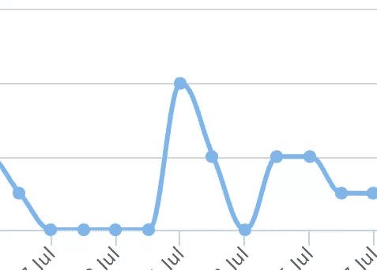
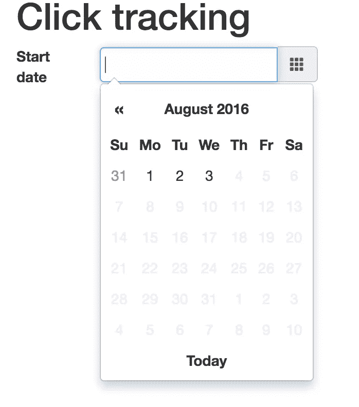
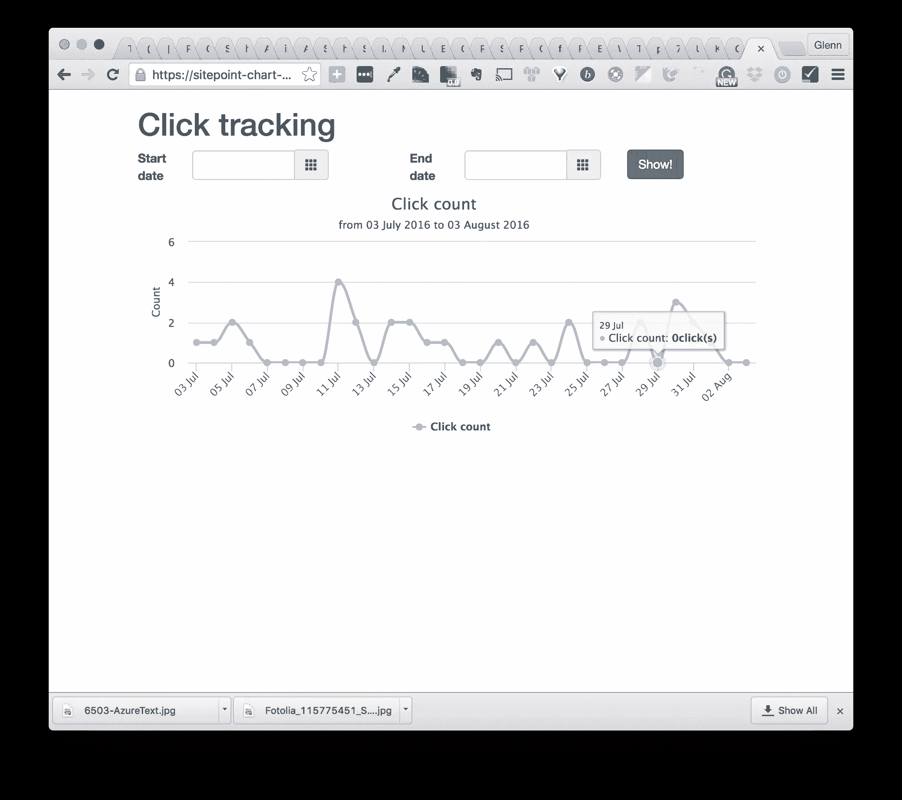

# Rails 上的实用图表:实践中的 Chartkick

> 原文：<https://www.sitepoint.com/graphs-on-rails-chartkick-in-practice/>



在[之前的一篇文章](https://www.sitepoint.com/make-easy-graphs-and-charts-on-rails-with-chartkick/)中，我介绍了 [Chartkick](https://github.com/ankane/chartkick) 的基础知识——这是一个很棒的库，可以很容易地在 Rails 应用中渲染图形。这篇文章引起了一些关注，所以我决定覆盖更多的内容，展示 Chartkick 和 [Groupdate](https://github.com/ankane/groupdate) 如何被用来解决一个现实世界的任务。

提醒您一下，Chartkick 是与 Rails 集成的瑰宝，它提供了基于您的数据快速呈现图形的方法。这个 gem 支持 Chart.js、Google Charts 和 Highchart 适配器。Chartkick 提供了对 Groupdate 的现成支持，这简化了编写一些复杂的分组查询。

在这篇文章中，我将向你展示如何构建一个应用程序来可视化各种项目的日、月或年的点击计数。用户将能够在方便的日期选择器的帮助下选择日期范围，并且生成的图表的比例将相应地改变。

源代码可以在 [GitHub](https://github.com/bodrovis/Sitepoint-source/tree/master/Graphs_Chartkick_Practice) 上找到。

工作演示可以在 [Heroku](https://sitepoint-chart-practice.herokuapp.com/) 上找到。

## 准备

在这个演示中，我将使用 Rails 5，但是 Rails 3 和 Rails 4 的步骤几乎相同。

好的，我们的想法是建立一个应用程序来托管许多“物品”——这些物品是什么并不重要，但假设我们通过在线商店销售水果。我们的客户非常想知道每个水果获得了多少点击，要求我们存储这些信息并以某种方式将其可视化。他们希望看到每个项目每天有多少次点击，并能够将日期范围更改为“过去六个月”或“去年”

好了，任务很清楚了，我们现在开始研究代码。

创建一个没有默认测试套件的名为`Tracker`的新 Rails 应用程序:

```
$ rails new Tracker -T 
```

丢下这些宝石:

*Gemfile*

```
[...]
gem 'chartkick'
gem 'groupdate'
gem 'bootstrap-sass'
gem 'pg'
[...] 
```

当然，Chartkick 是我们今天的主要工具。 [groupdate](https://github.com/ankane/groupdate) 是一个很好的补充，允许轻松使用高级查询。 [bootstrap-sass](https://github.com/twbs/bootstrap-sass) 将用于样式化， [pg](https://bitbucket.org/ged/ruby-pg/wiki/Home) 是 PostgreSQL 适配器。请注意，Groupdate **将不会与 SQLite 3**一起工作！

立即安装您的宝石:

```
$ bundle install 
```

不要忘记创建一个新的 Postgres 数据库，并配置应用程序来使用它。您可以使用此示例配置开始:

*config/database.yml*

```
development:
  adapter: postgresql
  encoding: unicode
  database: tracker
  pool: 5
  username: "PG_USER"
  password: "PG_PASSWORD"
  host: localhost
  port: 5432 
```

除此之外，我们还需要一些额外的资产:

*   [Highcharts JavaScript 文件](https://code.highcharts.com/highcharts.js)
*   [Bootstrap Datepicker](https://github.com/eternicode/bootstrap-datepicker)

Highcharts 是一个很棒的构建交互式图形的库，我将在这个演示中使用它。尽管如此，你仍然可以坚持使用 [Chart.js](https://github.com/ankane/chartkick#chartjs) (从 Chartkick v2 开始默认使用)或者 [Google Charts](https://github.com/ankane/chartkick#google-charts) 。Bootstrap Datepicker 是 Bootstrap 的一个附加组件，我们将使用它来构建表单。

现在连接所有这些资产(注意 Turbolinks 应该放在最后):

*JavaScript s/application . js*

```
//= require jquery
//= require jquery_ujs
//= require datepicker
//= require highcharts
//= require chartkick
//= require turbolinks 
```

*样式表/应用程序. scss*

```
@import 'bootstrap-sprockets';
@import 'bootstrap';
@import 'datepicker'; 
```

太好了！当然，我们需要数据和存储数据的地方，所以让我们继续下一节，创建模型。

### 模特们

生成两个非常简单的模型:`Item`和`ClickTrack`

```
$ rails g model Item title:string
$ rails g model ClickTrack item:belongs_to
$ rake db:migrate 
```

项目是我们的产品，每次点击项目都会创建点击轨迹。我们不打算编码这个逻辑，但是，正如你看到的，它真的很简单。确保您已经在模型之间建立了一对多关系:

*型号/项目. rb*

```
class Item < ApplicationRecord
  has_many :click_tracks
end 
```

*车型/click_track.rb*

```
class ClickTrack < ApplicationRecord
  belongs_to :item
end 
```

当然，我们需要一些样本数据。我不会在这里做任何花哨的事情，只是添加两个带有一堆随机创建日期的点击轨迹的项目:

*db/seeds.rb*

```
%w(apple cherry).each do |item|
  new_item = Item.create({title: item})
  1000.times do
    new_item.click_tracks.create!({created_at: rand(3.years.ago..Time.now) })
  end
end 
```

将样本数据加载到数据库中:

```
$ rails db:seed # use rake for Rails < 5 
```

同样，不要忘记从 Rails 第 5 版开始，所有命令都位于`rails`名称空间下:

```
$ rails db:migrate # use rake for Rails < 5 
```

### 路线和主页

我们也来设置一下基本路线，准备一下我们 app 的首页。只要点击轨迹与项目直接相关，并且它们本身没有多大意义，我希望`click_tracks`资源是嵌套的:

*config/routes.rb*

```
[...]
resources :items, only: [:index] do
  resources :click_tracks, only: [:index]
end

root 'items#index'
[...] 
```

创建两个控制器:

*items_controller.rb*

```
class ItemsController < ApplicationController
  def index
    @items = Item.all
  end
end 
```

*click _ tracks _ controller . Rb*

```
class ClickTracksController < ApplicationController
  def index
    @item = Item.find_by(id: params[:item_id])
  end
end 
```

他们真的很基础，所以这里没什么可评论的。现在根页面的视图:

*views/items/index . html . erb*

```
<h1>Items</h1>

<ul><%= render @items %></ul> 
```

和相应的部分

*views/items/_ item . html . erb*

```
<li>
  <%= item.title %>
  <%= link_to 'View clicks', item_click_tracks_path(item), class: 'btn btn-primary' %>
</li> 
```

只要我们有嵌套的路由，我们就必须使用`item_click_tracks_path`助手，而不是`click_tracks_path`。你可以在这里阅读更多关于嵌套资源的。

最后，让我们将整个页面的内容包装到装有 Bootstrap 类的`div`中:

*视图/布局/应用程序. html.erb*

```
[...]
<body>
<div class="container">
  <%= yield %>
</div>
</body>
[...] 
```

## 构建表单

太好了，第一步已经完成，我们现在准备构建主要功能。说到表单，它必须包含两个输入:一个是开始日期，另一个是结束日期。有了它们，用户可以选择显示点击轨迹的时间段。这些输入将由 Bootstrap 的样式和 Datepicker 插件提供支持:

*views/click _ tracks/index . html . erb*

```
<h1>Click tracking</h1>

<div id="event_period" class="row">
  <%= form_tag api_item_click_tracks_path(@item), remote: true do %>
    <div class="col-sm-1">
      <label for="start_date">Start date</label>
    </div>

    <div class="col-sm-3">
      <div class="input-group">
        <input type="text" class="actual_range form-control datepicker" id="start_date" name="start_date">
        <div class="input-group-addon">
          <span class="glyphicon glyphicon-th"></span>
        </div>
      </div>
    </div>

    <div class="col-sm-1 col-sm-offset-1">
      <label for="end_date">End date</label>
    </div>

    <div class="col-sm-3">
      <div class="input-group">
        <input type="text" class="actual_range form-control datepicker" id="end_date" name="end_date">
        <div class="input-group-addon">
          <span class="glyphicon glyphicon-th"></span>
        </div>
      </div>
    </div>

    <div class="col-sm-2">
      <%= submit_tag 'Show!', class: 'btn btn-primary' %>
    </div>
  <% end %>
</div> 
```

这段代码很长，但是非常简单。我们将应该异步提交的表单添加到`api_item_click_tracks_path`(该路径尚不存在)。在表单内部有两个输入，id 分别为`#start_date`和`#end_date`。

为了让它们看起来更漂亮，我使用了在每个
输入旁边添加一个小图标的`.input-group-addon`类。最后，有一个提交按钮，可以提交表单。

现在我们需要路线:

*config/routes.rb*

```
[...]
namespace :api do
  resources :items, only: [] do
    resources :click_tracks, only: [:create] do
      collection do
        get 'by_day'
      end
    end
  end
end
[...] 
```

我们将这些路由命名为`api`。相应的操作将在接下来的步骤中进行编码。

为了利用 Datepicker 插件，将以下代码放在视图中(当然，您也可以将它放在一个单独的 CoffeeScript 文件中):

*views/click _ tracks/index . html . erb*

```
[...]
<script data-turbolinks-track>
  $(document).ready(function() {
    $('#event_period').datepicker({
      inputs: $('.actual_range'),
      startDate: '-3y',
      endDate: '0d',
      todayBtn: 'linked',
      todayHighlight: 'true',
      format: 'yyyy-mm-dd'
    });
  });
</script>
[...] 
```

我们为整个表单配备了这个新功能，并使用`inputs`选项提供实际输入。另外，`startDate`被设置为 3 年前(因为，正如您所记得的，click tracks 的创建日期被定义为`rand(3.years.ago..Time.now)`),`endDate`到`0d`意味着它应该包含今天的日期。然后，显示“今天”按钮，突出显示今天的日期，并提供日期格式。太好了！



您现在可以启动服务器并观察结果。请注意，当下拉框打开时，您可以单击月份或年份来选择另一个月份或年份。

## 显示图表

好了，今天的明星该出场了。让我们在一个单独的部分中显示图表(这样我们可以在以后重用标记):

*views/click _ tracks/index . html . erb*

```
[...]
<%= render 'graph' %> 
```

*views/click _ tracks/_ graph . html . erb*

```
<div id="graph">
  <%= stat_by(@start_date, @end_date) %>
</div> 
```

`stat_by`是一个助手方法(我们很快就会创建它),它接受开始和结束日期。当页面被加载时，这些日期没有被设置，所以我们必须自己处理这样的场景。

*helpers/click _ tracks _ helper . Rb*

```
module ClickTracksHelper
  def stat_by(start_date, end_date)
    start_date ||= 1.month.ago
    end_date ||= Time.current
  end
end 
```

这里我们使用所谓的“nil guards”(`||=`)来设置默认值。让我们依靠 Chartkick 的[异步加载](https://github.com/ankane/chartkick#say-goodbye-to-timeouts)特性来显示图表:

*helpers/click _ tracks _ helper . Rb*

```
module ClickTracksHelper
  def stat_by(start_date, end_date)
    start_date ||= 1.month.ago
    end_date ||= Time.current
    line_chart by_day_api_item_click_tracks_path(@item, start_date: start_date, end_date: end_date),
               basic_opts('Click count', start_date, end_date)
  end
end 
```

因此，它不是在页面加载期间加载图表，而是在后台完成，从用户体验的角度来看，这当然更好。为了实现这一点，您需要在您的应用程序中设置一个动作来呈现正确格式的数据，并连接 jQuery 或 Zepto.js。在这种情况下，我们使用已经设置好的`by_day_api_item_click_tracks_path`,但该动作没有编码——它将在下一步中进行。

`basic_opts`方法，顾名思义，为图形准备了一些选项(包括特定于库的选项):

*helpers/click _ tracks _ helper . Rb*

```
private

def basic_opts(title, start_date, end_date)
  {
    discrete: true,
    library: {
      title: {text: title, x: -20},
      subtitle: {text: "from #{l(start_date, format: :medium)} to #{l(end_date, format: :medium)}", x: -20},
      yAxis: {
        title: {
          text: 'Count'
        }
      },
      tooltip: {
        valueSuffix: 'click(s)'
      },
      credits: {
        enabled: false
      }
    }
  }
end 
```

`l`方法是格式化时间戳的`localize`的别名。默认情况下没有名为`:medium`的格式，所以让我们添加一个:

*config/locales/en.yml*

```
en:
  time:
    formats:
       medium: '%d %B %Y' 
```

再次注意，当使用其他图形适配器时，选项会有所不同。有关更多详细信息，请参考您的适配器文档。

## 控制器动作

前端已经准备好了，现在是处理后端的时候了。只要我们在`api`下命名了我们的路径，新的控制器文件就必须放在 *api* 文件夹中:

*控制器/API/click _ tracks _ controller . Rb*

```
class Api::ClickTracksController < Api::BaseController
end 
```

然而，请注意，`Api::ClickTracksController`继承自`Api::BaseController`，所有的`Api::*`控制器也是如此。例如，在我的生产应用程序中，我有两个有些相似的控制器，它们共享这些方法。

*控制器/api/base_controller.rb*

```
class Api::BaseController < ApplicationController
end 
```

我们希望在`Api::BaseController`里面发生什么？它将托管两个回调:一个用于加载必要的数据(商品及其点击轨迹),另一个用于格式化收到的日期(因为用户可能手动输入或根本不提供任何日期)。)

数据加载对我们来说不是问题:

*控制器/api/base_controller.rb*

```
[...]
before_action :load_data

private

def load_data
  @item = Item.includes(:click_tracks).find_by(id: params[:item_id])
  @click_tracks = @item.click_tracks
end
[...] 
```

至于格式化日期，方法会稍微复杂一点:

*控制器/api/base_controller.rb*

```
[...]
before_action :load_data
before_action :format_dates

private

def format_dates
  @start_date = params[:start_date].nil? || params[:start_date].empty? ?
      1.month.ago.midnight :
      params[:start_date].to_datetime.midnight
  @end_date = params[:end_date].nil? || params[:end_date].empty? ?
      Time.current.at_end_of_day :
      params[:end_date].to_datetime.at_end_of_day
  @start_date, @end_date = @end_date, @start_date if @end_date < @start_date
end

[...] 
```

如果其中一个日期为空，我们用默认值填充它。请注意简单明了的`midnight`和`at_end_of_day`方法的用法。如果日期不为空，则将其转换为 datetime(因为最初它是一个字符串)。最后，如果结束日期在开始日期之后，我们交换日期。

现在编写提交表单时触发的`create`动作。当然，当表单提交通过 AJAX 完成时，它会用 Javascript 响应:

*控制器/API/click _ tracks _ controller . Rb*

```
[...]
def create
  respond_to do |format|
    format.js
  end
end
[...] 
```

实际的 Javascript 很简单:只需用新图表替换旧图表。这就是前面创建的片段派上用场的地方:

*views/API/click _ tracks/create . js . erb*

```
$('#graph').replaceWith('<%= j render 'click_tracks/graph' %>'); 
```

最后一步是编写一个动作，为我们的图表准备数据。如您所知，我们有以下路线:

*config/routes.rb*

```
[...]
namespace :api do
  resources :items, only: [] do
    resources :click_tracks, only: [:create] do
      collection do
        get 'by_day'
      end
    end
  end
end
[...] 
```

所以动作要叫`by_day`。我们希望它能够呈现包含每天点击次数信息的 JSON。

*控制器/API/click _ tracks _ controller . Rb*

```
[...]
def by_day
  clicks = @click_tracks.group_by_day('created_at', format: '%d %b', range: @start_date..@end_date).count
  render json: [{name: 'Click count', data: clicks}].chart_json
end
[...] 
```

`group_by_day`是由 [groupdate](https://github.com/ankane/groupdate#time-range) gem 引入的一种方法，它根据创建日期对点击曲目进行分组。正如你可能已经猜到的，`count`方法计算每天的点击次数。结果，`click`变量将包含一个类似于`{'07 Jun': 10, '08 Jun': 4}`的对象(键的格式由`:format`选项控制)。`chart_json`是一种特殊的 Chartkick 方法，用于准备要可视化的 JSON。

然而，假设用户选择 2 年作为时间范围:使用当前方法的实现，我们将在一个图表中显示 700 多天，这实际上没有什么帮助。相反，让我们检查范围，并根据它进行动态分组。

首先，给`BaseController`增加两个方法:

*控制器/api/base_controller.rb*

```
[...]
private

def by_year?
  @end_date - (1.year + 2.days) > @start_date
end

def by_month?
  @end_date - (3.month + 2.days) > @start_date
end
[...] 
```

这些方法只是检查所选时间段的长度——我们现在将在`by_day`方法中使用它们:

*控制器/API/click _ tracks _ controller . Rb*

```
[...]
def by_day
  opts = ['created_at', {range: @start_date..@end_date, format: '%d %b'}]
  method_name = :group_by_day
  if by_year?
    opts[1].merge!({format: '%Y'})
    method_name = :group_by_year
  elsif by_month?
    opts[1].merge!({format: '%b %Y'})
    method_name = :group_by_month
  end
  clicks = @click_tracks.send(method_name, *opts).count
  render json: [{name: 'Click count', data: clicks}].chart_json
end
[...] 
```

这里我们准备了一个参数数组，这些参数将被传递给 groupdate 方法之一(`group_by_day`、
、T1 或`group_by_year`)。接下来，将默认方法设置为 call 并进行一些检查。如果范围大于一个月，请更新格式选项，以便只显示一年或一个月和一年，然后动态调用方法。`*opts`将获取一个数组并将其转换为参数列表。有了这些代码，您可以轻松地定义自己的条件和分组规则。

现在工作完成了，你可以观察最终的结果了！



## 结论

在本文中，我们继续讨论 Chartkick 和 Groupdate，并在实践中使用它们。为了让用户体验更加愉快，我们还使用了 Bootstrap 的 Datepicker 插件。这里列出的代码可以进一步扩展。例如，如果您希望可视化每个项目的显示计数，这也很容易做到。

如果您还有任何其他问题，请随时联系我——当您发送反馈时，我非常高兴。一如既往，谢谢你和我在一起，再见！

## 分享这篇文章