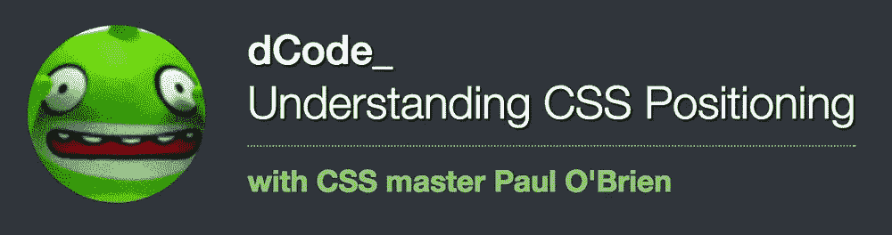

# 解码 CSS 定位:保罗·奥布莱恩的大师课

> 原文：<https://www.sitepoint.com/decoding-css-positioning/>

[](https://www.sitepoint.com/community/t/dcode-understanding-css-positioning/231154)

在网页上定位元素有时看起来非常困难，尤其是在有各种方法可用的情况下。随着 flexbox 和网格布局的引入，以及 CSS3 transforms 之类的酷东西的引入，选项继续扩展，CSS3 transforms 也可以用于惊人的布局技巧。

在这个论坛 dCode 中，CSS 专家 Paul O'Brien 回答了关于 CSS 定位这个棘手主题的所有问题——从浮动和相对、绝对和固定定位到表格显示，甚至是 flexbox。

**如果你对 CSS 定位有任何疑问，[请加入对话](https://www.sitepoint.com/community/t/dcode-understanding-css-positioning/231154)！**

## 关于数据代码

我们的论坛代码是以一个对主题领域进行深入研究的客人为特色的主题。不像我们的 [Q & A 环节](https://www.sitepoint.com/community/tags/qa)只持续一个小时，dCode 主题在很长一段时间内保持开放，因此可以更长时间、更深入地讨论问题。随着时间的推移，当客人回答问题并发布感兴趣的内容时，你可以提问，或者只是坐下来跟着提问。

## 关于保罗

保罗·奥布莱恩是公认的 CSS 专家。他与人合著了里程碑式的巨著[终极 CSS 参考文献](https://www.sitepoint.com/premium/books/the-ultimate-css-reference)，并且多年来一直是许多徘徊在 CSS 黑暗森林中的开发人员的指路明灯。

你听说过用`overflow: hidden`或者类似的包含浮动吗？是保罗在当年发掘了这项技术。

如果可以用 CSS 做一些事情，Paul 会知道如何去做。他甚至经常指出如何去做人们认为不可能的事情。

## 保罗的话题开始

为了开始这个线程，Paul 创建了一个小的演示程序，只需在页面右侧放置一个 50px 的固定宽度和高度的红色小框。html 基本如下:

```
<div class="wrap">
  <div class="box">Box</div>
</div>
```

在你看演示之前，花点时间看看你能想到多少种方法来做这件事？

你可能会立即想到 3 种方法来做到这一点，但当你深入研究细节时，你会发现实际上有很多方法可以做到这一点，在演示中我停在了 15 处，但我不会惊讶地看到很多我没有想到的方法！

这是我的演示，看看你是否能想出其他方法来做到这一点:

请看 [CodePen](http://codepen.io) 上保罗·奥布莱恩([@保罗·布里安](http://codepen.io/paulobrien))右边的钢笔框[。](http://codepen.io/paulobrien/pen/WxdvKa/)