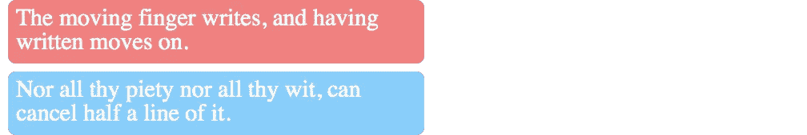
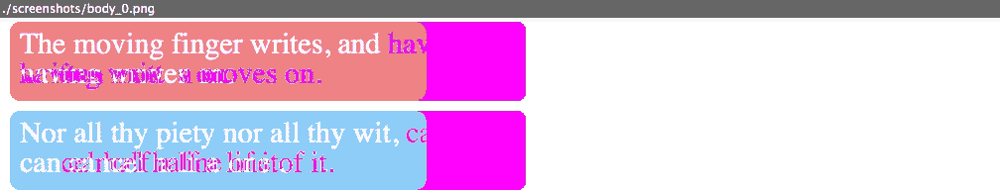

# 用幻想曲进行视觉回归测试

> 原文：<https://www.sitepoint.com/visual-regression-testing-with-phantomcss/>

如果你在职业生涯中做过任何严肃的开发，你可能已经意识到了开发过程中自动化测试的重要性。根据你的经验，这种认识可能会在一次大爆发中击中你，也可能会随着时间的推移慢慢到来，但它最终会成为你的第二天性。自动测试有多种形式，从测试独立代码片段的单元测试，到测试系统不同部分如何一起工作的集成和功能测试。这篇文章不是关于自动测试的概述。它是关于一个特殊的、相对新的领域，被称为视觉回归测试。

视觉回归测试采用另一种方法来测试网页。测试并不只是确保 DOM 中存在某个元素或文本值，而是实际打开页面，检查这个特定的块*看起来是否与您想要的块*一模一样。为了确保你发现了不同之处，让我给你举个例子。想象一下，你希望你的网站用一条友好的信息来问候你的访问者:

```
<div>Hello, %username%!</div>
```

为了确保它能够工作，您可以(也应该)对产生消息的代码段进行单元测试，检查它是否插入了正确的名称。您还可以使用 Selenium 或量角器编写一个功能测试，看看该元素是否真的以正确的文本出现在页面上。但这还不够。我们不仅要测试文本是否正确生成或出现在 DOM 中，还要确保整个元素*看起来是正确的*，也就是说，确保元素没有被`display: none`隐藏，或者有人没有意外覆盖文本的颜色。有很多工具可以做到这一点，但今天我们将特别关注一个选项— [PhantomCSS](https://github.com/Huddle/PhantomCSS) 。

## 什么是幻想曲？

PhantomCSS 是一个 Node.js 工具，用于执行可视化回归测试。它是开源的，由 Huddle 的人开发。PhantomCSS 允许您运行一个无头浏览器，打开一个页面，并对整个页面或页面上的特定元素进行截图。此屏幕截图将被存储为基准图像，以供将来参考。无论何时你在网站上做了任何改变，你都可以再次运行 PhantomCSS。它将拍摄另一张截图，并与原始图像进行比较。如果没有发现差异，测试将通过。但是，如果截图不匹配，测试将失败，并且会创建一个显示差异的新图像供您查看。这种方法使得这个工具非常适合测试 CSS 中的变化。

PhantomCSS 建立在几个关键组件之上:

*   [Casper js](https://github.com/casperjs/casperjs)——一个与 PhantomCSS 或 SlimerJS 浏览器交互的工具。它允许您打开页面并执行用户交互，例如点击按钮或输入值。此外，CasperJS 提供了自己的测试框架和捕捉页面截图的能力。
*   [PhantomJS 2](http://phantomjs.org/) 或[slimmerjs](https://slimerjs.org/)——两种不同的无头浏览器，其中任何一种都可以与 PhantomCSS 一起使用。无头浏览器就像没有用户界面的普通浏览器一样。
*   [like . js](http://huddle.github.io/Resemble.js/)——比较图片的库。

PhantomCSS 可以与 PhantomJS 和 SlimerJS 一起使用，但是在本文中，我们将使用 PhantomJS。

## 让我们兜一圈

让我们建立一个小的测试项目，看看如何在实践中使用这个工具。为此，我们需要一个要测试的 web 页面和一个简单的 Node.js web 服务器，以便 CasperJS 能够打开页面。

## 设置测试项目

用一些示例内容创建一个`index.html`文件:

```
<!doctype html>
<html>
  <head>
    <style> .tag {
        color: #fff;
        font-size: 30px;
        border-radius: 10px;
        padding: 10px;
        margin: 10px;
        width: 500px;
      }

      .tag-first {
        background: lightcoral;
      }

      .tag-second {
        background: lightskyblue;
      } </style>
  </head>

  <body>
    <div class="tag tag-first">The moving finger writes, and having written moves on.</div>
    <div class="tag tag-second">Nor all thy piety nor all thy wit, can cancel half a line of it.</div>
  </body>
</html>
```

要安装 web 服务器，需要初始化一个 npm 项目并安装`http-server`包。

```
npm init
npm install http-server --save-dev
```

要运行服务器，让我们定义一个简单的 npm 脚本。只需将下面的`scripts`部分添加到`package.json`中

```
"scripts": {
  "start": "http-server"
},
```

现在，您可以从项目文件夹中运行`npm start`，并且可以在默认地址`http://127.0.0.1:8080`上访问索引页面。启动服务器并让它暂时运行。我们一会儿会需要它。

## 安装虚拟 CSS

安装 PhantomCSS 很容易，您需要做的只是在项目中添加一些依赖项:

```
npm install phantomcss casperjs phantomjs-prebuilt --save-dev
```

## 创建测试套件

现在我们已经拥有了设置第一个测试套件所需的一切。PhantomCSS 测试套件是以 Node.js 脚本的形式创建的，您可以在其中打开网站的所需页面，截取屏幕截图，并将它们与上次运行的图像进行比较。我们从一个基于 PhantomCSS 本身的演示的简单测试用例开始。

```
var phantomcss = require('phantomcss');

// start a casper test
casper.test.begin('Tags', function(test) {

  phantomcss.init({
    rebase: casper.cli.get('rebase')
  });

  // open page
  casper.start('http://127.0.0.1:8080/');

  // set your preferred view port size
  casper.viewport(1024, 768);

  casper.then(function() {
      // take the screenshot of the whole body element and save it under "body.png". The first parameter is actually a CSS selector
      phantomcss.screenshot('body', 'body');
  });

  casper.then(function now_check_the_screenshots() {
    // compare screenshots
    phantomcss.compareAll();
  });

  // run tests
  casper.run(function() {
    console.log('\nTHE END.');
    casper.test.done();
  });
});
```

测试将打开`http://127.0.0.1:8080/`，截取`body`元素的截图并保存在`screenshots/body.png`下。

一旦测试本身就绪，剩下的工作就是定义一个脚本来运行测试。让我们将以下脚本添加到`start`旁边的`package.json`:

```
"test": "casperjs test test.js"
```

现在，您可以通过执行以下命令来运行它:

```
npm test
```

您将看到的输出应该如下所示:

```
Test file: test.js                                                              
# Tags
PASS Tags (NaN test)

New screenshot at ./screenshots/body_0.png

Must be your first time?
Some screenshots have been generated in the directory ./screenshots
This is your 'baseline', check the images manually. If they're wrong, delete the images.
The next time you run these tests, new screenshots will be taken.  These screenshots will be compared to the original.
If they are different, PhantomCSS will report a failure.

THE END.
WARN Looks like you didn't run any tests.                                       
npm ERR! Test failed.  See above for more details.
```

因为您是第一次运行这个测试，所以它只会创建一个新的基线截图，而不会执行任何比较。继续查看`screenshots`文件夹。您应该会看到这样的图像:



这是你的网站应该是什么样子的黄金标准，未来的测试将会把他们的结果与这张图片进行比较。

## 引入回归

如果您再次运行相同的测试命令，它将报告所有测试都已成功通过:

```
Test file: test.js                                                              
# Tags
PASS Tags (NaN test)

PASS No changes found for screenshot ./screenshots/body_0.png

PhantomCSS found 1 tests, None of them failed. Which is good right?

If you want to make them fail, change some CSS.

THE END.
PASS 1 test executed in 0.827s, 1 passed, 0 failed, 0 dubious, 0 skipped.
```

这是意料之中的，因为我们还没有改变网站上的任何东西。让我们打破一些东西，再次重新运行测试。尝试改变`index.html`中的一些样式，例如，将块的大小减小到 400px。现在让我们再次运行测试，看看会发生什么:

```
Test file: test.js                                                              
# Tags
PASS Tags (NaN test)
Failure! Saved to ./failures/body_0.fail.png

FAIL Visual change found for screenshot ./screenshots/body_0.png (11.41% mismatch)
#    type: fail
#    file: test.js
#    subject: false

PhantomCSS found 1 tests, 1 of them failed.

PhantomCSS has created some images that try to show the difference (in the directory ./failures). Fuchsia colored pixels indicate a difference between the new and old screenshots.

THE END.
FAIL 1 test executed in 1.082s, 0 passed, 1 failed, 0 dubious, 0 skipped.       

Details for the 1 failed test:

In test.js
  Tags
    fail: Visual change found for screenshot ./screenshots/body_0.png (11.41% mismatch)
npm ERR! Test failed.  See above for more details.
```

这里发生了几件重要的事情。首先，PhantomCSS 报告说测试失败是因为截图`body_0.png`不匹配。错配率为 11.41%。第二，当前版本和先前版本之间的差异保存在`failures`文件夹中。如果你打开它，你会看到一个像这样的截图:



该截图方便地突出显示了已更改的区域，因此很容易发现差异。

## 接受改变

现在差异已经凸显出来了，我们该怎么做才能接受改变？我们应该能够以某种方式告诉工具，我们希望坚持减小块的宽度，并接受当前视图作为新标准。为此，您可以使用一个额外的`-- --rebase`参数运行测试命令:

```
npm test -- --rebase
```

注意两个双破折号。这是 npm 向底层命令传递参数的方式。所以下面的命令会导致`casperjs test test.js --rebase`。现在我们已经接受了更改，以前的基线图像将被新的图像替换。

## 更进一步

现在您已经掌握了基本的诀窍，您可以开始考虑将这个工具集成到您自己的工作流中。由于这是一个非常具体的项目，所以我不会详细讨论，但这里有一些问题需要思考:

*   你打算在真实的网站上运行测试吗，或者是某种风格指南，那里只有单独的 UI 元素？
*   你的网站有动态内容吗？如果是，那么内容的变化将导致测试中断。为了避免这种情况，您需要建立一个单独的静态上下文版本的网站来运行测试。
*   你会把截图添加到你的版本控制中吗？是的，你应该。
*   你是要截图整个页面，还是单独的元素？

使用这个工具，你现在可以用自动化测试覆盖你的网站的视觉方面。随着您的单元和功能测试已经就绪，这个新策略将填补您的测试边界中的一个狭窄的缺口。即使您还是测试新手，这也是一个很好的起点！

## 分享这篇文章